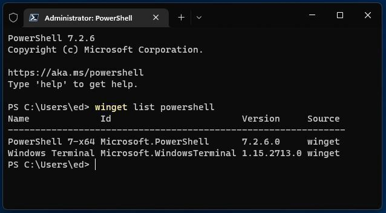
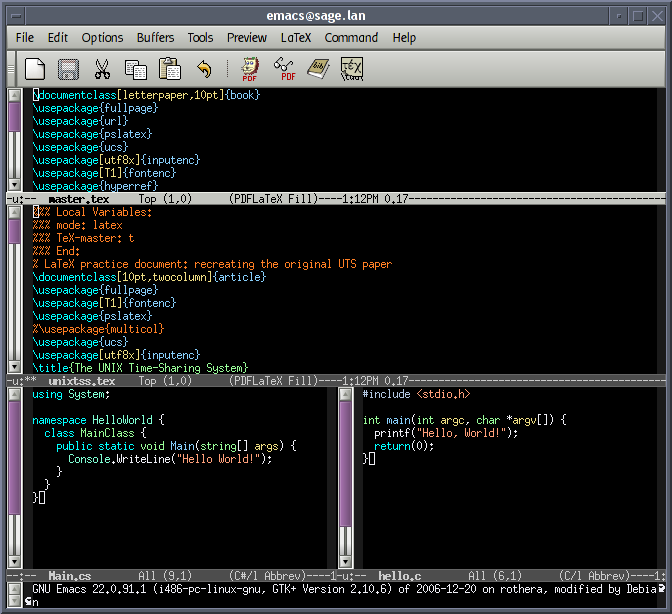
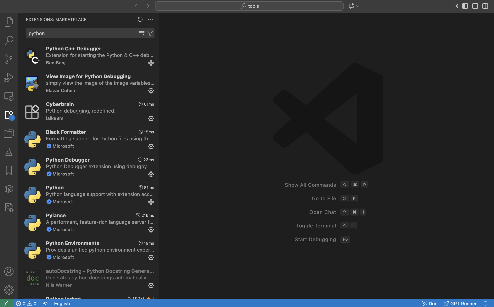
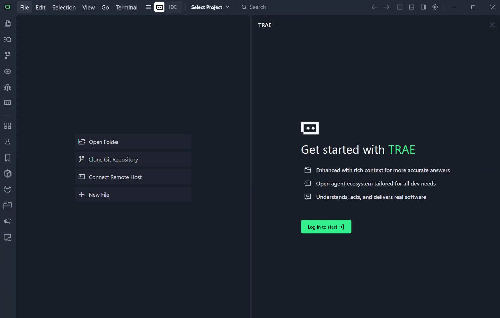
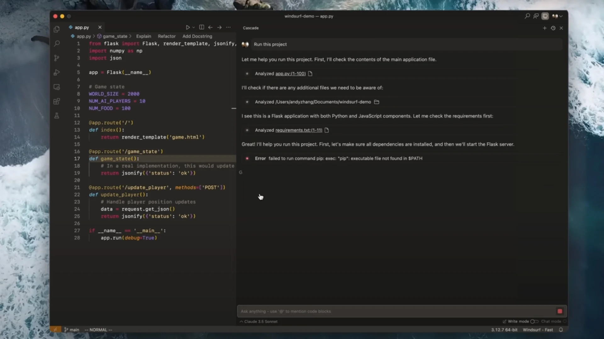
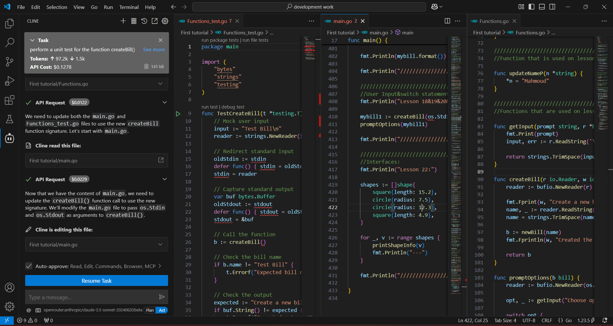
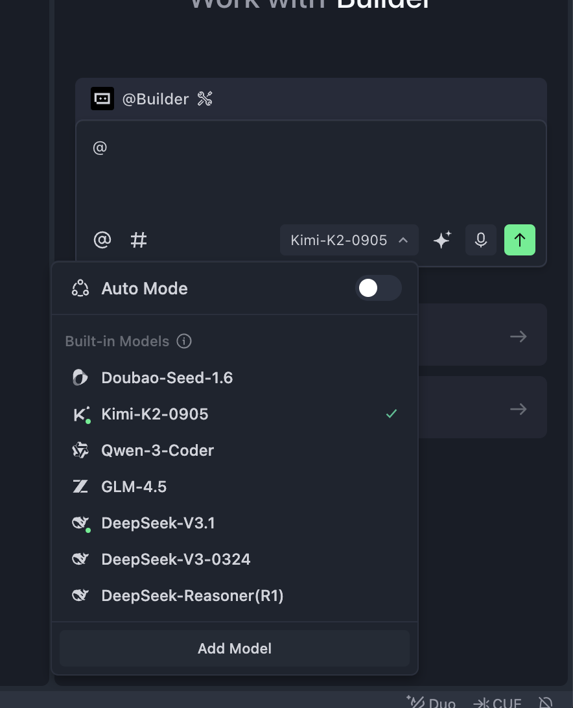

# 扩展知识 4 - 什么是 AI IDE 和 Trae

在之前的学习阶段，我们使用 z.ai 搭建了最简单的 Web 程序和网页小游戏。但如果我们想要构建更复杂的应用——比如功能更完善的网站、桌面程序，甚至是手机应用——就必须在自己的电脑上使用专业的编程软件来编写代码。

最早的时候，只需要在一个简单的文本文件里写好程序，再用专门的语言处理器去读取并打包执行就够了。但随着代码量越来越大、项目结构越来越复杂，人工管理大量文件、手动编辑庞大的项目变得越来越困难。开发者因此迫切需要一种工具，能够高效管理和切换大量代码文件，支持多种编程语言的语法高亮，并可以快速定位和调试问题。于是，集成开发环境（IDE，Integrated Development Environment）就应运而生了。

你可以把 IDE 理解成一种专门用来“编辑、管理、运行和调试”各种应用源代码的程序。在真正打包发布之前，不同语言写出来的程序本质上只是特定格式的代码文件而已，你可以用普通文本编辑器打开它们，也可以用 IDE 打开。早期的计算机几乎完全通过终端来操作（只用键盘就能完成所有操作，几乎不需要鼠标），所以早期的 IDE 外观也非常“原始”——除非你额外安装插件来实现简单的交互式界面。

终端界面（Terminal）

图片来源：https://en.wikipedia.org/wiki/File:Emacs-screenshot.png

一个非常知名、功能成熟的“内置 IDE”叫做 `Vim`。在很多服务器上，你都可以直接用它来编辑文件（服务器通常没有显示屏，只能通过键盘远程操作）。

现代 IDE 通常具有更加美观直观的图形界面，并提供更强大的编辑、运行和调试能力。一个典型的 IDE 通常包含以下核心组件：

* **源代码编辑器（Source Code Editor）**：专门用于编写和编辑代码的文本编辑器，一般具备语法高亮、代码自动补全、实时错误提示等功能。
* **构建与运行工具（编译器 / 解释器）**：IDE 内置编译器或解释器，可以将开发者写好的源代码转换成计算机可以执行的机器代码。
* **调试器（Debugger）**：用于测试和排查代码错误的工具。它支持逐行执行代码、查看变量状态、设置断点等，帮助开发者定位并修复程序中的问题。

除此之外，现代 IDE 往往还内置版本控制工具（如 Git）和项目管理工具等实用功能。当下最流行的 IDE 之一是微软出品的 **[Visual Studio Code (VS Code)](https://code.visualstudio.com/)**。它轻量、可扩展性极强，因此被广泛使用。当然，也有很多开发者推荐 JetBrains 家的专业 IDE，比如用于 Python 的 PyCharm、用于 C/C++ 的 CLion 等，它们对特定语言提供了更深入、更完整的支持。但从入门友好度和通用性角度出发，我们更推荐初学者优先选择 VS Code 作为主要开发工具。

# 现代 IDE：VS Code

Visual Studio Code（简称 VS Code）是由微软开发的一款免费、开源且功能强大的现代代码编辑器。自 2015 年发布以来，凭借优异的性能和灵活性，它迅速成为全球最受欢迎的开发工具之一。

VS Code 的核心理念之一是“一切皆插件”。不同编程语言可以用来编写不同类型的程序，而每种语言都有自己独特的语法高亮规则和导航能力（比如“跳转到定义”“查找引用”等）。要让一个 IDE 原生支持所有语言几乎是不可能的——从逻辑上讲，你会需要为每一种语言单独准备一个 IDE 才行。

VS Code 巧妙地通过“插件机制”解决了这一问题。比如，如果你要写 Python，就安装 Python 插件，它会提供 Python 专属的语法高亮、自动补全和代码导航功能；如果你要写 C/C++，则可以安装对应的 C/C++ 插件来获得相应支持。在不安装任何插件的情况下，VS Code 本质上只是一个“高级的文本文件管理器”；当你为某种语言安装了对应插件之后，它就会“变身”成该语言的理想开发工具。

除了编写代码以外，你甚至可以把 VS Code 当作编辑 Markdown 文档的工具来使用。

总之，你可以在 VS Code 的扩展市场中浏览和下载各类扩展，为不同类型的文件提供更好用的编辑体验，也可以根据需要搜索不同语言和调试工具的插件，尝试它们如何提升你的工作效率。

# 现代 AI IDE

上面介绍的都属于“传统意义上的现代 IDE”。但随着人工智能时代的到来，越来越多的代码开始由大语言模型来自动生成，这自然催生出一种新的开发工具形态——AI IDE，也就是可以利用大语言模型自动写代码的 IDE。

在最新版 VS Code 中，已经内置了一个大语言模型助手。你可以直接针对整个代码仓库、某个文件，甚至某个函数与模型对话。

你也可以像之前在 Web 端使用自动写代码工具一样，将需求以提示词的形式发给内置的编码 Agent，让它自动帮你实现所需功能、创建文件、修改代码、配置环境等。

典型的 AI IDE 一般具备以下核心能力：

* 智能代码生成与补全：在传统 IDE 中，我们通常是输入几个字符来补全变量名或函数名；在现代 AI IDE 中，你可以写几行伪代码或者简单说明需求，让 IDE 自动补全完整的逻辑，甚至根据指令直接生成一大段甚至整块代码。
* 代码理解与问答：IDE 能够理解并回答关于某段代码、某个文件，甚至整个工程目录结构的问题。
* 代码重构与优化：IDE 可以根据你的意图，重写或优化指定代码片段的实现逻辑。
* 自动生成测试：IDE 可以自动生成针对不同函数和模块的测试代码，方便你进行有针对性的测试。
* Agent 式任务执行：智能 Agent 可以自动生成、打包、安装、运行和修改代码，在很多任务上可以部分替代初级软件工程师的工作。

在最新版 VS Code 中，你可以点击右上角的侧边栏入口，打开 AI 功能区域，体验这些能力。

不过，VS Code 并不是 AI 能力最强的 IDE。对于需要大量 AI 辅助编码的场景，我们往往希望使用“更聪明、效率更高”的工具——好的 AI IDE 能显著节省写代码和改 Bug 的时间。下面我们会介绍几款目前比较流行的 AI IDE，重点讲解 Trae IDE。你可以根据个人喜好选择任意一款 AI IDE 使用。

由于 VS Code 是开源的（任何人都可以下载源码并自行编译），目前市面上绝大多数 AI IDE 都是在 VS Code 基础上二次开发而来。所以你不必担心要“学习很多种 IDE”——一旦你熟悉了 VS Code 的基本用法，迁移到这些 AI IDE 基本不需要重新学习。

如果要简单概括这些 AI IDE 之间的差异，主要集中在四个方面：价格；可使用的模型种类（部分高级模型在某些地区可能受限）；Agent 的能力（在协助写代码时的智能程度和执行能力）；以及运行速度与性能。

## Trae

Trae 是字节跳动推出的一款 AI 编程助手，支持 100 多种编程语言，并能集成到主流 IDE 中。它的功能包括：用自然语言生成代码、自动调试、把设计稿转换为 React/Vue 组件等。在 2025 年 8 月的更新之后，Trae 新增了智能依赖导入、重命名建议、任务清单管理等功能；SOLO 模式也开始支持后端代码生成和技术架构文档编辑。

## Cursor

Cursor 是 Anysphere 开发的一款 AI 代码编辑器，基于 VS Code 定制，重点优化了大规模代码仓库和多文件协同的场景。它支持 GPT-4o、Claude 3.7 等模型；2025 年推出的 Claude Max 模式可以处理数百万行代码级别的项目。专业版取消了请求次数限制，非常适合复杂的企业级项目。

目前，Cursor 可以说是“带前端界面的 AI IDE”中综合体验最好的一款之一，用户数量庞大，功能迭代频率也很高。它最大的缺点是价格较高——专业版大约需要每月 20 美元。

## Qoder

Qoder 是阿里巴巴推出的一款强调“透明协作”和“增强上下文工程能力”的 AI IDE。它通过 Action Flow 支持把任务拆解成多个步骤，并实时跟踪 AI 的执行过程；还支持多模型动态路由和任务状态机管理，非常适合在中大型项目中做架构治理和对遗留系统进行“反向工程”分析。

## CodeBuddy

CodeBuddy 是腾讯云推出的一款 AI 编程工具，强调对中文指令的支持以及企业级合规能力。它提供代码补全、批量代码审查和多模型切换等功能；其中的 Craft 智能体可以实现多文件代码生成和 API 集成。企业版支持私有化部署，并通过了三级等保认证，适合金融、医疗等对数据安全要求较高的行业。

## windsurf（已不推荐）

Windsurf 最初因其基于 Agent 的 AI 编程能力而受到关注。但由于 2024 年团队调整以及模型权限问题，它的稳定性大幅下降，目前已经不再推荐使用。尽管在前一年它还可以与 Cursor 分庭抗礼，但现在基本可以视为“被淘汰”的工具。

## VS Code + Cline

Cline 是 VS Code（Visual Studio Code）的一款 AI 编程 Agent 插件，可以通过配置不同的 API 端点来灵活切换所使用的大模型。Cline 支持多模态输入、MCP 工具扩展以及成本监控，所有操作都需要用户确认后才会执行。它非常适合用于快速验证想法，或与现有开发流程集成。基础功能是免费的，企业版则支持在私有环境中部署模型。

# 什么是 Trae

Trae 的全称可以理解为 “The Real AI Engineer”，是一款由字节跳动开发的自适应 AI 集成开发环境（IDE）。它是在流行的 VS Code 基础之上构建的，这意味着，如果你之前已经习惯了 VS Code，那么在使用 Trae 时，无论是界面布局还是基础操作都会感到非常熟悉、舒适。

Trae 的核心目标是成为开发者的“智能编程伙伴”。通过深度集成 AI 能力，它可以自动处理大量重复性工作，为你提供更直观、更高效的开发体验。它并不仅仅是一个“代码补全工具”，而是希望贯穿整个开发工作流，从创建项目、编写代码、调试、测试到部署都提供帮助。

## 安装 Trae

Trae 分为国际版和中国版。国际版需要能够访问海外网络，但可以使用 GPT-5、Claude 4 等最新的海外模型；中国版则主要支持国内最新的大模型，例如 GLM、Qwen、Kimi 等。

国际版下载地址：

https://www.trae.ai/

中国版下载地址：

https://www.trae.cn/

## Trae 界面简介

简单来说，Trae 和 VS Code 看起来几乎一模一样。

右侧的侧边栏就是 Copilot 交互窗口，也可以理解为 Agent 窗口。如果你暂时看不到它，可以点击 Trae 右上角的侧边栏图标将其打开。

打开侧边栏之后，你会看到一个 `Builder` 选项，这就是 Agent 模式。简单理解，它相当于 z.ai 的“本地版”，可以帮你操作本机环境，安装运行环境、打开网页等。

点击 “Builder” 后，你会看到 “Chat” 模式和 “Builder with MCP” 模式：

* **Chat 模式**：主要用于和当前文件夹里的代码对话，或者当作普通聊天模型来使用。（你可以通过左上角的 “File” 菜单打开一个文件夹，在这个文件夹中进行编辑操作。在这种情况下，Builder 创建或修改的文件都只会发生在这个文件夹内部。）
* **Builder with MCP 模式**：为 Agent 提供了更多可用工具（例如把语言模型和其他软件联通起来、查询天气等）。你可以简单理解为：MCP 能让语言模型更方便地调用各种外部工具。

在下面的区域，你还会看到模型选择选项，点击即可修改当前使用的大模型。在中国版中，你可以选择使用 Kimi k2 或 GLM 等国内模型；如果你使用的是国际版 Trae，还可以选择 ChatGPT 或 Claude 等海外模型。不过，由于国内大模型发展非常快，Kimi、Qwen、GLM 等在很多任务上的实际体验已经接近 Claude 3.5 或 3.7，对日常开发来说已经完全够用。

以上就是对 Trae 的一个简单介绍。接下来，我们可以回顾一下之前在 z.ai 中做过的操作，并尝试在 Trae 中做同样的事情。

## 使用 Trae 安装 Python 和前端环境

大多数情况下，我们的 Windows 笔记本电脑默认不会预装前端开发所需的 Node.js 环境，或用于后端 / 通用开发的 Python 环境。我们可以尝试直接在 Trae 的 Agent 模式中跟它对话，让它帮我们安装 Python 环境或 Node.js 环境。

## 📚 作业：用 Trae 写你的第一个程序

接下来，请尝试用 Trae 来完成你的第一个程序！你还记得之前的 AI 贪吃蛇游戏吗？把当时在 z.ai 中使用的那条提示词原封不动地输入到 Trae 的 Agent 模式中，看看会发生什么吧！
