# 附录 A：产品思维补充 - 别急着写代码，先想一个好点子

在前面的课程中，你已经学会了如何在 z.ai 和本地 AI IDE 中，利用大模型 API 搭建各种小工具：从最基础的对话框，到带有简单表单、状态切换、数据存储的应用；你也尝试过用 Trae 这样的 AI IDE 去处理环境配置、依赖安装等“工程向”的问题，让自己真正具备了把一个想法从浏览器搬到本地项目中的能力。

换句话说，到目前为止，你已经跨过了“我不会写代码”和“我不知道怎么让程序跑起来”这两道门槛。你可以独立完成一个 Demo 的搭建，也能用现成的组件和模版快速拼装出一个“功能齐全”的小应用。

接下来，我们要把关注点从“能不能做出来”，进一步推进到“ **到底做什么，才值得被做出来** ”。你会发现，当写代码不再是你最大的障碍之后，新问题很快会出现：同样都是能跑的应用，为什么有的只活在课程作业里，而有的能吸引真实用户愿意反复回来？同样都是用大模型，有的只是一个换皮聊天框，有的却真的解决了某个具体场景下的真实麻烦？

本节课里，我们会系统讨论一个问题： **如何从“会搭 AI 工具”，过渡到“会想、会判断、会打磨一个有 sense 的 AI 应用”** 。我们会一起拆解什么叫“点子（idea）”，怎样才算“好点子”，如何判断一个产品方向值不值得你投入时间精力，以及如何用一套可重复的流程，把模糊灵感变成清晰的应用方案。

在正式展开之前，可以先用几道小问题自检一下你目前的状态：

1. 你能否用一句话，把你正在做或想做的应用解释清楚？
2. 你是否知道，这个应用最核心的目标用户是谁、在什么具体场景下会使用它？
3. 如果同类产品已经有很多，你能不能说出你这一个“明显不一样”的地方是什么？
4. 你能不能指出：在你的应用里，AI 具体替代了哪一步人工、带来了哪些“明显变好”的地方？
5. 当有人第一次打开你的产品时，他在 30 秒内能否完成一次“有成就感”的使用体验？

如果你对这些问题的回答还比较模糊，或者只能含糊其辞地说“就是一个聊天机器人 / 生产力工具 / 学习助手”，那么这一节内容会帮助你把这些想法重新梳理清楚。

本节课的主题是： **从工具到应用——训练你的产品点子和应用 sense** 。帮你从会搭工具升级到能做出真正有人用、能创造实际价值的 AI 应用。
我们希望你在学完这一节后，不只会把 API 拼在一起，更能清楚地知道： **我在为谁做一个什么样的东西，为什么值得做，我该怎么做** 。

## 你将学到以下内容

总的来说，你将学会做一个应用的基本知识：点子从哪儿来 → 点子如何变应用 → 应用怎么从能用变好用 → 应用怎么用 AI → 完成后怎么找到用户。

1. 我要做一个应用，从哪来的点子是靠谱的？
2. 有了点子，怎样拆成可以做出来的应用？
3. 做出来后，怎样判断和打磨成“好应用”？
4. 在哪一步、怎么合理地用 AI 放大价值？
5. 有了应用，怎样从 0 找到第一批真实用户？

# 1. 我要做一个应用，从哪来的点子是靠谱的

很多人一提到做应用，脑子里的第一反应就是：我要先想一个足够有记忆点的创意。于是每天刷榜单、看报道、研究各种热门产品，盯着别人的成功故事，希望哪天自己也能碰到一个特别不一样的点子。

但真实的情况是，很多人其实压根没有什么想法，只是单纯因为没有想法而焦虑；也有一些人一上来就给自己设了个很高的门槛：不够有趣就不开始，觉得普通就等于失败。可当你真的往前走一段路就会发现，能走得久、走得稳的应用，大多不是在某个深夜拍脑袋想出来的，而是在一个个具体的生活场景里，围绕真实的问题，一点一点长出来的。

所以，本章想解决的是一个起点问题：**怎么才能有一个点子？这个点子到底靠不靠谱？它值不值得你接下来投入时间和精力，把它变成一个真实的应用？**

## 1.1 什么是点子

我们先从一个最基础、但又经常被忽略的问题开始: 到底什么才算一个点子。

日常对话里，人们常说的点子，往往是一种非常主观的兴奋感。你可能在路上刷到一条视频，瞬间觉得这个方向好酷，于是心里冒出一句话: 我也可以做一个类似的。或者在聚会聊天时，大家一起吐槽某个产品不好用，你随口补上一句: 要是能有个东西，自动帮我把这些都搞定就好了。这个时候，你确实有了一种朦胧的念头，但它离一个可以做出来的东西，其实还差得很远。

在这里，我们先给自己设一个稍微严谨一点的标准。只有当一个想法至少满足下面几件事时，我们才把它叫作点子:

第一， **它必须面向一类明确的用户** 。不是泛泛地说所有人，而是能说清楚，这主要是给谁用的。是大学生、职场新人、带娃的家长，还是独立开发者、电商商家、小微企业老板。不同的人在同一件事情上的在意点完全不一样，如果你连人群都没定下来，那接下来所有的判断都会飘在空中。

第二， **它要扎在一个具体的场景里** 。这个应用是给用户在什么时候用的，是在早上通勤的地铁上，是工作间隙，是睡前，是周末整理资料的时候。哪怕是看起来很抽象的工具，比如笔记、任务管理，只要你认真去观察，真正被高频使用的那部分，一定是和某些场景绑得非常紧。

第三， **它需要帮助用户完成一个清楚的任务** 。任务不一定很大，但要说得出来。比如整理一天的待办事项，把一篇长文浓缩成几个要点，为一次会议生成一份结构清晰的纪要，或者为一个城市周末出行生成一条可行的路线。越能把任务说具体，你后面设计功能、评估价值就越容易。

第四， **它给出了一种比现状更好的做法或者工具** 。用户原本是怎么完成这件事的，是靠脑子记、纸笔记、Excel、截屏收藏，还是在不同应用之间来回切换。如果你能提供的是一种明显更省事、更稳定、更愉快的方式，那么这个点子才真正开始具备价值。

对于上述的思考，如果你想不清楚也没关系，现在是人工智能的时代，你可以把上面的内容整理成一个完整的提示词，再把你的想法、目标用户和使用场景一并写进去，交给大模型来帮你补全和提炼。把模型当成随时在线的产品合伙人，反复对话、追问、修改，就能把一个模糊的概念变具体。

## 1.2 点子和用户需求: 避免自嗨的第一道防线

很多人第一次做应用，最容易陷进去的坑就是自嗨。所谓自嗨，就是你对自己的创意兴奋得不得了，觉得这是一个颠覆世界的方向，但当你把它讲给普通用户听，对方的反应往往很冷静，甚至有些不知所措，只能礼貌地点点头，说一句听起来挺不错的。然而产品发布之后，他们既不会下载，更不会长期使用。

要避免这种情况，就必须把点子和用户需求这两件事分开来看。

我们先来谈什么是 **用户需求** 。可以用一句相对简单的话来概括: 在一个具体的场景下， **用户为了达成某个目标，希望降低的各种成本，或者增加的各种价值。** 这里的成本，不只是金钱，还包括时间、精力、心智负担、犯错风险，甚至是社交压力。比如一个刚入职场的新人，可能愿意花钱买一套模板，只为了在第一次汇报时不那么紧张；一个带孩子的家长，可能愿意多付一点费，只要能保证每天有半小时属于自己。

理解这一点之后，你会发现， **单纯的炫酷并不能构成需求。** 很多创意确实足够新奇，但如果它没有让用户在某个具体目标上更省力、更安心、更有信心，那它就很难撑起一个真正可持续的应用。

点子和需求之间，有一条经常被忽视的鸿沟。 **点子代表的是你的主观判断而不是数据支撑** ，你觉得什么好玩、什么有趣、什么看起来很前卫。需求代表的是用户实际在经历什么、在为哪些事情发愁。你可能觉得一个自动生成诗歌的功能非常酷，但对于大多数用户来说，能让自己每天少花十分钟做重复整理工作的工具，可能更有吸引力。除非，你像乔布斯或具有非常好的设计审美水平，让大家觉得“自动生成诗歌的功能”都非常酷，自发的想要跟随你，但这具有一定难度。

在判断一个想法的时候，有个简单的区分方法，就是看它更像 **真需求还是假需求** 。真需求的一个明显特征，是哪怕现在没有你的应用，用户也在主动想办法解决这个问题。哪怕现有的做法很笨拙，他们依然愿意花时间、花精力、甚至花钱去填这个坑。比如有人会自己写方案，写脚本，只为给自己减轻一点重复劳动。这类场景里，如果你能提供一个更友好、更普适的解决方案，往往就有机会站得住脚。

假需求的典型情况恰恰相反。如果不是你主动提起，大部分人并不会意识到那是一个问题，甚至不会觉得非解决不可。你描绘的使用场景更多存在于你的想象里，而不是用户的日常生活中。他们听完你的介绍，只会觉得这东西是好的，挺有意思，但不会付费，甚至转身就忘了。这样的点子，用来写故事还可以，用来做产品就非常危险。

所以， **避免自嗨的第一道防线是了解用户需求。** 在一开始你就需要逼自己回答一个看似简单，却非常关键的问题: 除了我自己，还有谁在为这件事认真犯愁。你可以去看论坛、社群、评论区，也可以直接问几个身边可能成为用户的人。如果你很难听到类似于“我每次都被这个事情拖住”或者“现在的做法实在太麻烦”这类带着真实情绪的抱怨，那说明这个点子离真实需求还有一段距离。

## 1.3 好点子为什么是好点子

并不是所有点子都有同样的命运。有些点子，哪怕你只花几天时间，做出一个粗糙但能跑通流程的版本，也会很自然地吸引一小撮真实用户，他们愿意留下来，愿意耐心给你提意见。还有一些点子，即使你拼命堆功能、花钱打广告、在各个平台上做了很多宣传，最终也只能靠外力短暂堆出一波数据，过不了多久就归于沉寂。

这背后最本质的差异，是点子本身有没有踩在某个关键的问题点上。

**一个好的点子，自然而然能迎来增长** ：即便以非常简陋的形态出现，甚至只有简陋的几个按钮，只要能解决用户手头一个具体的小麻烦，就能够获得一定程度的自然增长。比如一个能帮人快速把语音转成文字的小工具，一开始可能只是一个网页加几个简单的按钮，但只要识别质量够好，功能的转化特别自然，很多人就愿意把链接转给身边朋友，因为这简直就是在为他们节省时间。

**一个坏点子，往往从一开始就注定了要靠外力驱动** 。就算你的外观特别好，内核显示的特别高端，你需要不停地推、不停地吆喝、不停地解释，但一旦你的拉人行动放缓，使用数据就会直线下滑。你不断往里面砸资源、拉合作、搞活动，但永远感觉在逆水行舟。问题不在于你执行得不够好，而在于那个点本身并没有打中足够真实的痛点。

当然，以上情况并不绝对，例如在早期市场用户可能并未意识到价值具有一定滞后性，例如在有竞品的情况下我们还要考虑到外观、操作难易度、品牌特性等等，但这都是更深入的内容，目前暂不考虑。

所以，当我们讨论要不要在一个点子上继续投入时，真正该关注的不是创意本身有多炫，而是它能不能自然地生长出一条从问题到解决方案的路径。我们做点子，不只是为了向别人证明自己有多有创意，而是为了找到一个有价值的起点，沿着这条路，我们可以慢慢把一个小工具打磨成一个真正好用的应用。

选择比努力重要。

## 1.4 好点子从哪里来: 四大来源与具体例子

很多人一提到想点子，脑海里浮现的画面是一个人闷在书桌前，盯着天花板，指望有一天灵感突然掉下来砸到自己。现实中的好点子，却大多不是这么来的。它们更多是从生活里的小观察、社群里的反复提问、网络上成堆的抱怨，以及那些已经存在的产品里一点点被筛出来的。

下面这四种来源，如果你愿意认真去做，很容易在其中挖到可以起步的方向。

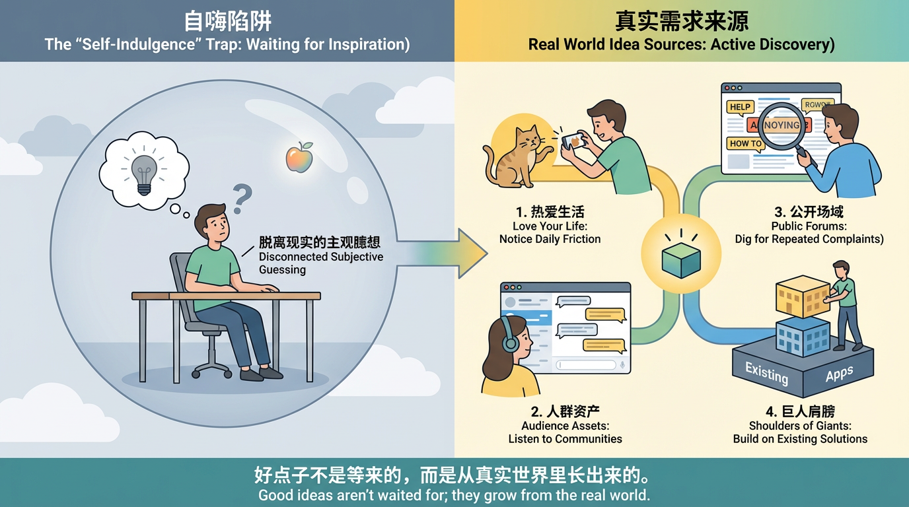

### 热爱你自己的生活

一个非常朴素但有效的原则是: **你在生活里越有参与感，越容易发现问题，也越有能力判断什么是值得解决的问题** 。所谓参与感，就是你不是隔着屏幕看别人过日子，而是自己亲自去体验、尝试、踩坑。你越认真对待自己的兴趣爱好，它就越有可能成为点子生长的沃土。

比如说，如果你特别喜欢养猫，你自己跟猫一起生活的一天，往往比刷一百条“养猫小技巧”更有信息量。你会知道猫最容易在哪些地方打翻东西，会记得每天什么时间它最爱蹦跶、在哪些情况下最容易应激，也会亲身经历清理猫砂、铲毛、剪指甲、看病这些细节。 **每一次略微不顺畅的体验，其实都是一次潜在的产品线索** 。

像你给猫拍照这件事：很多人都遇到过，自己在那儿举着手机，猫却死活不看镜头，要么低头舔爪子，要么盯着别的角落。那能不能有一个小工具，让手机或平板的屏幕上出现一个会自动移动的红点、羽毛或者小虫子的动画，专门吸引猫咪的视线？你按下拍照键时，它自动在前置摄像头附近晃一圈，把猫的目光“骗”到镜头方向，顺手再连拍几张，帮你从中挑出清晰又好看的那一张。再往前想一步，这个应用还能记录每只猫对哪种颜色、哪种移动轨迹最有兴趣，下次自动用它“专属”的逗猫模式，提高成功率。

如果你很享受化妆或者护肤的过程，家里柜子上的每一瓶产品背后，都是大量试错和决策的结果。你可能已经习惯用手机相册拍下每次妆容的照片，但每次回顾时，总要一点点回想那天用了哪一支口红、哪一盘眼影。那是否可以把这些信息系统地记录下来，做成一份属于自己的妆容图鉴？甚至可以让应用帮你统计，某种妆容在什么场合被你用得最多，哪些搭配在照片里表现最好，这样每次选妆的时候就不用从零开始想。

再具体一点，比如很多人都有这样的场景：早上时间很赶，翻开相册想找“上次那次很成功的通勤妆”，结果翻了半天也想不起来当时到底用了哪几样产品。那能不能有一个小功能，让你在拍完妆容照片时，只要对着手机随口说一句：“今天是面试妆，用了01号橘棕眼影盘和豆沙色口红”，应用就自动识别并生成一条“妆容配方”，和照片绑定在一起？下次你只要搜索“面试”“橘棕眼影”“豆沙”，就能一键看到所有相关妆容，甚至还能自动生成一个“今天只看适合通勤的、五分钟能完成的妆”的推荐列表。你每天早上节省下来的那几分钟，其实就是一个非常具体的“被解决的问题”。

如果你喜欢 city walk 或者各类形式的慢旅行，你可能已经用各种工具拼凑自己的体验：地图软件记录路线，备忘录列出要去的咖啡馆，相册里散落着沿途的照片和感悟。那么有没有可能有这样一个应用，能把路线、打卡点、照片、文字，一同结成一个有时间线、有故事性的步行日志？甚至进一步，把你的路线一键分享给朋友，让他们也能在同一个城市，走出不一样的版本。

也可以再往下挖一个更日常的小细节：很多人在 city walk 的时候，会有“当下觉得这个转角好美，但回家之后在地图上完全找不回那个点”的挫败感。那能不能做一个超轻量的功能：你走到一个觉得有感觉的路口，只要按住耳机上的按键，说一句“打个标记，这里是很适合约会散步的路”，应用就瞬间在你当前位置落一个带语音的标记点，自动记录时间、天气和噪音水平。以后你或者你的朋友，只要打开这个城市的地图，就能看到这些“路人实测的氛围点”：哪里适合一个人走神，哪里适合看夜景，哪里适合和朋友边走边聊天。那些原本会被你“走过就忘”的小路口，就这样慢慢长成了一个有质感的城市体验数据库。

这些例子想说明的其实只有一件事: **你需要热爱你的生活，生活就是你最好的点子来源** 。每天遇到的困惑、临时想出的变通办法、那些你觉得有点麻烦但一直习惯忍着的地方，只要你愿意稍微多看一眼，多问一句有没有可能用一个小工具来改一改，它们就都有可能变成未来的产品雏形。

### 从你拥有的人群资产中挖掘

所谓人群资产，简单说就是你已经可以触达的一群人。可能是你的读者，你运营的社群，你所在公司的内部同事群，也可能是你长期参与的某个兴趣社区。只要你有渠道， **能稳定听到一部分人日常在聊什么、烦什么、期待什么** ，那你就比完全从零开始的人，多了一大截优势。

举个很常见的例子。如果你是一个设计师社群的组织者，你每天在群里能看到的内容，其实就是一份极其珍贵的需求池。有人抱怨客户总是反复改稿，有人对某类素材网站收费方式不满，有人觉得在不同尺寸规格之间来回调整太浪费时间。每一个抱怨背后，都藏着一条潜在的产品线索。比如，你可以做一个简单的尺寸适配工具，把一套设计一键生成为各个常见平台的尺寸比例；或者做一个可以保存和复用常用组件的小工具，帮设计师用更少的时间完成重复劳动。

如果你所在的是一个备考类的社群，群里可能长期充斥着类似的话题: 今天状态不好，计划又拖延了，该看什么资料更高效，怎么才能坚持打卡。你不需要凭空想象，只需要观察一段时间，整理出大家反复提到的几个共同难题，就能大致勾勒出一款学习类应用初步的功能方向: 比如更合理的目标拆解，更人性化的打卡反馈，更真实的进度可视化。

在这些场景下，你不必试图一开始就做面向所有人的大而全产品。你只需要承认一点: 你手头这一小圈人，就是你最好的起点。你对他们的理解越深，越知道他们真实生活里那些说得出口和说不出口的小烦恼，你就越有机会做出真正被使用的东西。

### 从公开场域中挖掘需求

即便你暂时没有任何自己的社群或者读者群，也完全不用担心。互联网上每天都有无数人在各种平台大声讲述自己的困难和不满。公开场域里的这些声音，本身就是极大的宝库，只是大多数人从来没有认真去听。

你可以选定几个与你感兴趣行业相关的平台，定期搜索一些带情绪色彩的关键字。例如， **好烦、有没有推荐、怎么解决、真的很麻烦、有没有更好的办法。** 然后耐心翻看那些帖子和评论，重点留意两类信息。

一类是某种问题被长期、反复提到。比如在求职板块里，每隔一段时间就有人来问简历怎么写、自我介绍怎么准备、如何跟进面试结果；在宝妈群体中，总是反复出现辅食搭配、作息调整、亲子沟通之类的困惑；在小微商家的交流社区里，大家可能永远在担心库存管理、现金流、员工排班。这些长期存在的反复问题，就是一个行业反复暴露出来的系统性痛点。

另一类是某些场景下，用户在用非常笨拙的方式硬撑。比如有人把所有待办事项写在纸上，再拍照上传到云端；有人在不同应用之间来回复制粘贴，只是为了把一段内容从一个格式转换成另一个格式；有人会自己手动把不同渠道的数据集中整理成一张表。这些地方，只要你用心观察，就会发现很多可以被流程化、工具化的小切口。

在公开场域里挖需求，其实是在训练一种能力: 让自己从一个旁观者变成一个捕捉者。当你习惯性地去搜这些关键词，习惯性地把案例记下来，你的大脑就会慢慢积累一套对现实问题的敏感度，这种敏感度会在你后面的产品设计过程中，一次又一次帮到你。

### 站在巨人的肩膀上

还有一类经常被忽略的点子来源，是现有的产品和项目。这个世界上已经有太多厉害的人，替我们走过了许多探索的路径。你不必每一次都从一张白纸开始，完全可以站在别人已经做到一半的地方，往前再走一小步。

**黑客松活动、产品创新大赛、创业 Demo Day **之类的场合，往往会涌现大量有趣的小作品。它们大多有两个特点: 时间紧张，资源有限。这恰好和你现在想做的小应用很像。所以，当你去看这些得奖作品时，不妨多问两个问题: 如果这个东西只服务于某个更窄的细分人群，会不会更容易落地。如果把它的功能砍掉一半甚至三分之二，只保留最核心的那一环，会不会反而更清晰。

同样地，**产品榜单、开源项目、工具集合网站**上列出的那些工具，也都可以成为你思考的起点。你可以挑一些自己感兴趣的，逐个拆解: 它是帮什么人解决什么事，它现在的形态还有哪些明显的缺口，如果迁移到另一个场景或者另一个国家，会长出什么区别。你并不是要抄袭，而是通过这种拆解练习，训练自己对问题和解决方案之间关系的理解。

线下的世界也是如此。每当你在医院挂号排队、在餐厅等号、在政务大厅填写同样的信息多次、在纸质表单上反复写相同内容时，都可以刻意停下来，问一下自己: 这里有没有可以被 **系统化、数字化、自动化的空间** 。那些看起来杂乱、重复、低效的场景，本质上就是未来一些工具生长的土壤。

长期坚持从这四条路径里挖素材，你会点子不是某种突然出现在脑海里的奇迹，而是你和生活、和他人、和信息世界长期互动之后自然长出来的一种副产品。

## 1.5 如何用一句话概括好点子: 少即是多的艺术

当你大致知道一个点子从哪里来之后，下一个重要的练习， **是尝试用一句话把它讲清楚。** 这个练习听起来简单，但实际上挺残酷，因为它会逼迫你面对一个事实: **你的点子究竟有没有抓住一个真正清晰的核心。**

人之所以能记住另一个人，很少是因为对方面面俱到，更多时候，是因为某个明显的特征。可能是总戴着某种帽子，可能是说话风格特别稳，也可能是每次讨论时总能抛出关键一句话。产品也一样。**与其让别人勉强记住你十几个功能，不如让他对你形成一个朴素但清楚的印象。**

在写这一句话的时候，一个常见的误区是过度宽泛。比如说: 这是一个帮助用户提高英语水平的应用。乍一看没有错，但再往里追问，你会发现这句话几乎什么都没说: 帮助谁，是零基础的学生，还是已经在职场的人；通过什么方式，是背单词、听力训练、口语纠正，还是写作批改；需要付出多少时间，能够带来多大的改变。所有关键信息都被稀释掉了。

相对好一点的表述会具体很多。比如：“每天利用十分钟通勤时间，一个月记住一百个核心单词的背词应用”。这里至少说明了三件事: 使用成本是可控的，每天只需要十分钟；预期结果是可见的，一个月有一百个新单词；场景是明确的，主要发生在通勤而不是其他碎片时间。用户听到这样的描述，能很快在脑中判断这东西对自己有没有用。

练习写这一句话的过程，其实是在反复逼自己回答三个问题: **你到底在帮谁，你希望他们在什么样的场景下想起你，你打算在多长时间内帮他们达成一个怎样的结果。** 只有当你愿意把这些信息拼到一起，哪怕牺牲掉一些华丽词藻，你的点子才真正变得可以被理解和传播。

你也可以反过来把这个训练用在自己身上。试着给自己的未来三年写一句话描述。比如，我希望三年后，可以用一两句话说明自己主要在为哪一类人，解决哪一类问题，并且已经做出了哪些可见的成果。这样的训练会让你在做选择时更清楚，哪些事情是必须紧紧抓住的，哪些则可以适当放掉，学会舍弃比学会增加要难而正确。

如果不知道从哪里学习这种表达，很简单，去看那些每天都在为争夺用户注意力而打磨文案的内容。你可以参考**应用市场里的一句话简介，游戏和工具类产品在官网首页摆出的主标题，各类 \*\***Landing Page\*\* ** 上的核心文案** 。可以把它们抄下来，拆成结构，尝试基于 AI为自己的点子写一版新的文案。

## 1.6 用 AI 发散思维并找到差异化

过去想点子，大多时候只能靠人自己慢慢琢磨。现在有了 AI，你等于多了一位随时可以召唤的头脑风暴伙伴。只要用得好，它可以大大扩展你的思路空间。

当你卡在某个方向上，觉得脑子里的想法来来回回只有那几个时，不妨把你现有的点子用尽量清晰的方式描述给 AI，然后请它帮你做几件事。比如， **基于同一个核心任务，请它列出二十种不同的用户群体** ，或者让它从学生、自由职业者、带娃家长、小微商家等不同角度，重新描述这个点子可能的使用方式。又或者，请它站在产品经理、运营、市场、技术的角色，分别提出各自关心的点。

你会发现，很多你原本不会主动想到的使用场景，会在这一步骤中被甩给你。你的任务不是简单接受这些建议，而是在这些被扩展出来的空间里， **挑出你最有理解力和资源优势的那一小块** 。比如你发现，虽然 AI 列出了很多行业，但你对教育和内容创作类场景格外有感觉，那你就可以优先沿着这两个方向继续往下拆。

在这个过程中，还有一个重要原则是: **常见点子并不一定等于无效点子** 。很多新人第一反应是要避开所有看起来常见的方向，觉得凡是别人做过的就没机会了。但真实世界远没那么简单。背单词、待办事项、记账、习惯打卡这些看似常见的方向，之所以不断有人做，是因为背后的问题确实普遍存在。这种情况下，比拼的往往不是有没有完全新的大创意，而是 **谁更理解某一小群人，谁能在细节上做得更贴近他们的生活** 。

你可以先列出一批新手最容易想到的点子，如背单词工具、每日打卡应用、读书笔记助手、简历生成器、习惯养成工具等。然后对于每一个，专门和 AI 做一轮拆解，集中问三个问题: 如果我只服务于某个非常具体的人群，比如设计师、律师、新手妈妈、在校研究生，这个点子会长成什么不一样的样子。如果我只针对某个固定场景，比如通勤路上、午休十分钟、晚睡前的半小时，功能和呈现有没有可能做得更聚焦。 **如果我把结果呈现这件事做到极致，比如更易分享、更易打印、更易导入到其他系统，会不会就足以构成差异** 。

AI 在这里的价值，并不在于替你做决定，而是在于帮你把本来很窄的一条路，变成一张更完整的地图。你会更快看到哪些区域已经被别人深耕，哪些角落仍然相对空白。而真正要走哪条路，最后始终要回到一个老问题上: 哪些地方是你真正在意、理解够深、愿意长期投入的。

在这一切的最后，再把那条底线拿出来强调一次。任何关于点子和创意的讨论，最终都要回到用户需求上。你可以用 AI 辅助思考，可以利用它加速生成变体，但不管做了多少轮头脑风暴，最终那个判断标准始终是: 这个想法是否真正回应了某群人的真实痛点，是否在他们已经在反复尝试解决的问题上，向前迈出了一小步。

## 小结

你要学会用几个简单的维度，去检视一个点子是不是已经足够清楚；要分清自己觉得酷，和用户真的需要之间的差别；要知道好点子之所以好，是因为它从一开始就踩在某个痛点上；要学会从自己的生活、人群资产、公开信息和现有产品当中持续挖掘线索；要练习用一句话把点子讲清；也要学会把 AI 当作扩展思路的伙伴，而不是替代判断的工具。

当你手里已经有了一到三个这样的点子，并且**能用一句话说明**它们各自是给谁用、在哪个场景下用、大致会带来什么样的结果时，你就可以停下继续想新点子的冲动，把注意力转移到下一步: 怎样把其中一个，拆解成一个可以真实做出来、可以被真实用户使用的应用。

这个点子有点烂怎么办？没关系，最开始烂才是正确的， **完成永远比完美重要** ，你需要先开始才有结局。

## 📚 Assignments

请你根据上文内容，完成下列作业：

1. 结合自己的兴趣，使用 AI 帮自己生成几个应用的“点子”
2. 让 AI 根据自己的想法，评价这个是真需求还是伪需求，并且给出用户需求洞察和建议
3. 从四大来源处选取一或两个来源得到“点子”，或者让 AI 生成几个应用的“点子”
4. 从上述所有 Idea 中，选取三个最喜欢的点子，尝试用一句富含信息量的话概括这个点子。

# 2. 有了点子，怎样拆成可以做出来的应用

上一章我们解决的是一个起点问题: 到底什么样的点子才是值得认真对待的。

真正的挑战从这里才刚开始，很多人就是倒在这一步: 头脑里有一套看起来很完整的蓝图，一动手就觉得复杂到无从下手。功能太多，页面太多，技术看起来也很吓人，于是不断拖延，最后变成一句 **自我安慰** ：

“ **没关系，这东西将来有机会再做吧。。。** ”

别想了！要就是现在！这一章我们想做的事情，就是帮你学会一套从点子到可做版本的拆解方法。你会看到，从无到有并不依赖天才，而是依赖一系列可以反复练习的具体动作: ** 发散、** **收敛** **、拆解、细化、借鉴、提问。** 按照这个顺序，哪怕没有团队、没有大把时间，也可以把一个点子变成能跑通的应用demo。

## 2.1 从想法到解决方案: 双钻模型发散到收敛

当你学会画页面提想法之后，很快会面临另一个常见的问题: 想法开始越来越多。你在白板上写下了各种可能的场景和功能，纸上画满了不同的页面版本，看上去很有成就感，但真正要做时，反而更难下手了。因为每一个看起来都重要，似乎都值得一试。

这个时候，就需要用到一套非常经典但又很好懂的思考框架: 双钻模型。这个模型的意思其实很朴素，就是在人生的很多阶段，你都需要先发散，再收敛，而不是一开始就想把所有事情一次性做完。

### 什么是双钻模型

双钻模型是英国设计委员会提出的一个创新与设计流程框架，把整个过程比喻成连续的两个菱形（“双钻”）：第一个钻石是从“发现问题”到“定义清晰问题”，强调先广泛发散、充分调研和理解用户，再收敛梳理出真正要解决的核心问题；第二个钻石是从“发展解决方案”到“交付最终方案”，先对可能的解决思路大胆发散、探索和迭代原型，然后再收敛、筛选和打磨出最优可落地的方案。双钻模型强调在问题和方案两个阶段都要经历“发散—收敛”的过程，避免一开始就跳到解决方案，从而提升创新的质量和成功率。

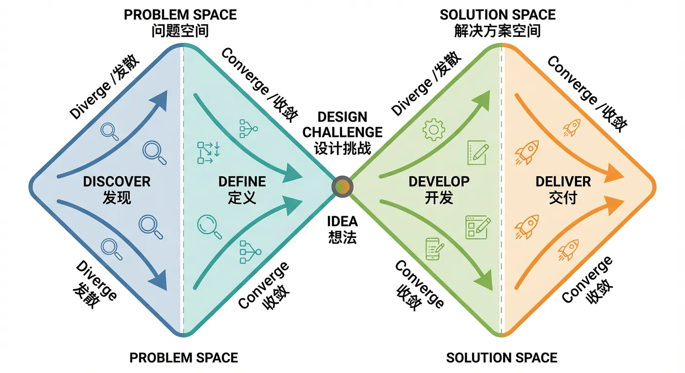

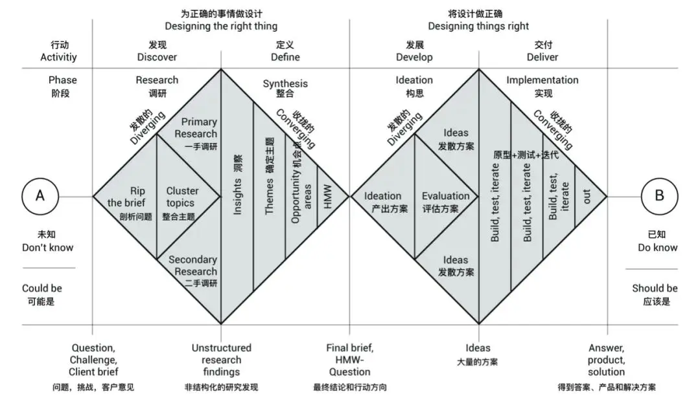

### 第一钻: 理解问题，从单点到全貌的发散和收敛

**在双钻模型里，第一钻是关于问题本身** 。你先从一个模糊认知开始，逐渐发散出更多相关的情况和可能，再做一次收敛，找到真正值得解决的那个问题点。

对应到你的应用，就是这样几件事。

**发散阶段，你尽量多地去列举用户可能的使用场景，** 可能遇到的阻力，可能希望得到的结果。你不急着判断，只是把脑子里所有相关的东西都先摊出来。比如对于文档处理应用，你可以列出用户可能在通勤时用、在会议前用、在写报告前用、在做复盘时用；可以列出他们怕的是总结不准确、怕格式乱、怕错过重点；可以列出他们希望的是更快弄清楚一篇文章要表达什么，更快找到与自己相关的部分。

**收敛** **阶段，你要逼自己只选出那一两种最常见、最痛的情况** 。比如你从一堆场景中发现，最多人提到的，是在接收到很长的工作文档时，希望先搞清楚这篇文档到底想说什么，它的主要结论是什么。那你就可以把第一版的应用目标定为: 帮助用户在五分钟内看懂一篇长文的核心意思，而不是同时解决所有文档处理相关的问题。

第一钻结束时，你应该已经比刚开始时更清楚: **你真正要解决的问题是什么，它和其他周边问题相比，优先级为什么更高。**

### 第二钻: 设计解决方案，从粗糙想法到可执行方案

**双钻的第二部分，是关于解决方案的诞生** 。你已经大致知道要解决哪一个问题，接下来要做的是为这个问题尽可能多地想办法，然后再从中筛选出最适合第一个版本的那一种。

发散阶段在这里意味着不断追加想法。你可以脑暴各种功能、更细的场景、各种可能的玩法。比如针对长文总结，你可以设想不同的摘要粒度、不同的结果呈现形式、是否支持语音播报、是否允许用户标注重点、是否提供多种风格的总结版本等等。这一步不需要立刻做决策，只是尽可能把可能性列出来。

收敛阶段，就要拿出一个简单但非常实用的评估工具: 用户价值 × 可行性 × 时间成本。你可以给每一个想法在这三个维度上打一个粗略的分，比如 1 到 5 分，然后优先选择综合得分高、时间成本可控的想法作为 MVP，也就是最小可行版本的组成部分。

比如语音播报功能可能用户价值不错，但技术和前端整合起来的时间成本偏高；而简单的文本摘要和要点提取，用户价值同样明显，可行性也高，时间成本更低，那它就更适合作为第一版里必做的功能。

在这个过程中，你要不断提醒自己一件事: **第一版的目标不是做出一个完美的应用，而是做出一个真实存在的、有人可以真正使用的版本** 。它不需要包罗万象，只需要在一个具体任务上表现得足够像样。

你可以给第二钻画一个简单的时间边界，比如一个月内要交出一个可用版本，那在发散的所有想法里，所有需要超过一个月甚至几个月才能落地的功能，都可以先暂时放到一个以后再看清单里。这样你不会因为想做的太多，而在一开始就被拖住。

当你习惯了用双钻模型来整理自己的思路，很多原本纠缠不清的状况就会变得清爽许多。你知道什么阶段该尽可能地多想一点，什么阶段该果断地砍掉一部分可能。你不再奢望一次性解决所有问题，而是学会在发散和收敛之间来回切换。

## 2.2 得到可执行步骤：学会从抽象到具体

发散想法后，得到想法十分简单，但得到可执行步骤却非常难。说我要做一个提升效率的工具，我要做一个帮助创作者的应用，听起来都很宏大。真的要动手的时候，抽象几乎帮不上忙。你每天面对的是一个个非常具体的问题: **第一个版本到底要做哪一小块，需要哪些页面** ，要不要支持注册登录，要不要接入支付。

这里需要的一种能力叫 **拆解并细化，能够把抽象变具体** 。就是把一个大而泛的目标，一点点拆解并细化内容到可以立刻动手的最小可行动项。这个能力不仅在做产品的时候重要，在生活里也非常关键。

### 从生活例子开始: 我想吃汉堡到底意味着什么

先不谈应用，回到生活中一个很简单的例子: 我想要吃汉堡。乍一看这句话一点也不复杂，但如果你认真拆下去，会发现里面藏着很多具体的分支。

首先是 **动机和内心的核心需求** 。你是真的想吃汉堡吗？你只是馋味道，是想快速解决一餐，是想和朋友聚一下，还是只是因为刷到了一张好看的图片。这看似无关紧要，但会直接影响后面的选择。如果是为了和朋友聚，很可能对环境和体验有要求；如果只是赶时间，可能快比好吃更重要。

其次是 **动作的范围** 。你想吃什么品类的汉堡？你想在几点吃汉堡？你只想吃汉堡本身，还是希望有一整套搭配，比如饮料、薯条、甜点。如果你晚点还有事，不想吃太撑，那选择可能会不一样。你甚至可以进一步问自己，要不要顺便解决明天的早餐，比如多带一个简单的汉堡回去。

再往下就是 **如何实现这件事** ？。汉堡对你来说是必须要去店里吃，还是外卖送过来也可以，甚至你愿不愿意自己动手在家做。每一种选择背后对应的是完全不同的一套行动路线。选择去店里，意味着要查位置、看时间、安排路程；选择外卖，意味着要看平台、比较价格和时间；选择自己做，则意味着要准备食材、工具、找食谱。

当你把这一切拆清楚后，原本模糊的我想吃汉堡这句话，就会变成一串具体的行动步骤。比如: 打开外卖应用，搜索某家之前吃过觉得不错的店，选择一个套餐，去掉饮料改成只要汉堡和薯条，设置备注不要酱，最后下单。这些动作都非常细小，却都是可立即执行的，并且这能够被 AI 编程一套程序化可执行的 plan，进行操作。

**拆解并细化的意义就在这里: 它帮你从一个听起来很大、很抽象的愿望，走到一个可以具体执行的列表。**

### 应用例子: 提高文档处理效率到底从哪一步开始

我们来看一个更复杂层层递进的例子，假设你有一个看起来挺正当的愿望:“ 我想做一个提高文档处理效率的应用。”这个方向是对的，但如果就停在这半句话上，你几乎无从下手。你既不知道第一步要画什么页面，也不知道第一版需要做到什么程度，更不知道该怎么和别人解释你的想法。

这时候你可以借用刚才的拆解细化内容的方式，一步一步具体化它；由于时间关系，此处只演示两层拆解方法。

#### 第一层拆解细化

**首先，你需要先定义什么是“文档”** 。文档本身是一个很宽的概念，它既可以是表格、 Word 报告、PDF 文件，也可以是记录代码注释的 Markdown 文本、TXT 笔记，甚至是扫描生成的图片式文档、内嵌图表与公式的学术论文。不同类型的文档存在实现差异，但后续设计的 “处理” 功能，必须匹配文档的具体类型，故而不得不细化对文档的定义。如果是图片式文档，可能需要先加入 OCR 文字识别功能；如果是表格类文档，核心需求更可能是数据提取与分析，而非单纯的文字精简。

**其次，你还需要定义什么叫做“处理”。处理成什么，才算处理过？** 处理的方式又是什么？有的人所谓的处理，是把一份 50 页的报告精简成 5 页可读的概要；有的人所谓的处理，是把一堆杂乱格式的 Word、PDF、Markdown，统一变成一套规范模板；还有人关心的是翻译、改写、润色，让一篇勉强能看的草稿，变成可以对外发布的正式版本。这一步你可以直接问自己: 我说的“处理”，到底是要“看得更快”、“改得更好”，还是“传给别人更方便”。不同的答案，直接决定你后面要画的入口页和操作页会完全不一样。

**对于“应用”同样也需要定义。什么叫做应用** ？是一个只给自己用的小工具，还是希望未来有一群用户来使用？是一个网页程序，还是一个手机 App，还是只是嵌在现有系统里的一个小功能？如果你只是想在电脑上自己用，做成一个简陋的网页或者命令行脚本，成本会低很多；如果你打算给团队同事一起用，可能就要考虑账号体系、权限、协作入口。这些听起来像是技术选型的问题，但在拆解阶段，你只需要回答一句很朴素的话: 我打算在什么设备、什么场景下，用到这个东西。

接下来， **回到这句话本身: “提高文档处理效率”。** 你还需要拆清楚几个关键字。比如 **“用什么提高”** ？一定要用 AI 吗？还是不一定？有些效率提升完全可以用规则、模板、快捷键来解决，比如一键生成固定格式的报告封面、一键插入标准免责声明。这类需求可能根本不需要模型参与。相反，如果你面对的是大量非结构化的长文本，需要理解、概括、改写，那么 AI 可能就是非常自然的一环。

“效率”这个词也值得单独拆开。 **效率到底是什么意思？是单纯指速度，还是既包括速度，也包括质量，还包括出错率和理解难度？** 比如，把一份 20 页的文档从 30 分钟看完，变成 5 分钟扫完要点，这是速度；让用户在摘要里快速发现错误逻辑、数据矛盾，这是质量；让一个原本不熟悉专业术语的人，也能通过解释和标注看懂报告，这是认知门槛的降低。你可以很直接地问自己一句: 如果这个应用做得非常成功，对用户来说，最大的变化是什么？是“花在文档上的时间少了一半”，还是“做文档相关的事时，心没那么累了”？回答清楚这句，你的功能优先级就有了依据。

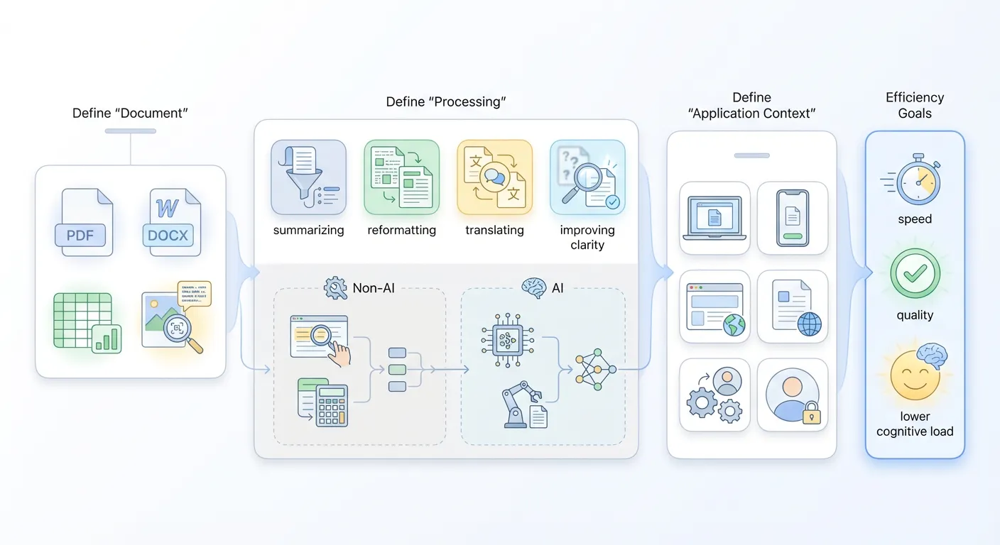

#### 第二层拆解细化

以上是第一层拆解，假设在这个阶段，我们能得到的初步拆解细化结果是：“我想做一个 AI 提高 PDF 文档转成文字速度和质量的网页程序”。这一句相较于最初的“提高文档处理效率”已经具体得多：它明确了文档类型（PDF）、处理方式（转成文字）、优化方向（速度和质量）、技术路径（AI），以及承载形态（网页程序）。从需求表达的角度看，它已经从一个抽象的愿望，收缩成了一个相对清晰的功能构想。

但需要注意的是，这样的描述仍然只是一个“中间目标”，还称不上真正可执行的产品方案。原因在于： **其中很多关键信息依然是笼统的，比如“用什么 AI”“提升到什么程度”“适配哪些使用场景”“面向什么样的用户”等。** 因此，我们还可以、也有必要， **继续向下拆解，把这句话变成一组更细颗粒度的设计决策和技术方案** 。

先来看其中的“AI”。这里的“AI”，究竟是指一个只负责文字识别的轻量级 OCR 模型，还是需要引入大语言模型，甚至多模态模型，来做后续的纠错、版面重整、内容重排和结构理解？不同的选择，会在三个维度带来完全不同的后果：

- 成本消耗：包括算力成本、调用费用、推理时延等，是一次性投入为主，还是持续开销为主。
- 开发难度：是简单集成现有 OCR 接口即可，还是要设计复杂的 Prompt、上下文管理、甚至自训练与评估体系。
- 产品形态与上线策略：是做成一个“快速提取文本的小工具”，还是一个能够还原大纲结构、表格、标题层级，适合深度阅读与内容再利用的“文档智能处理平台”。

然后是 **对“PDF 文档”的进一步拆解。你到底要支持哪一类 PDF？** 如果把范围限定在“以文字为主、可以复制的纯文字 PDF”，那就不必一开始就处理扫描件、复杂图表、公式排版，也不用为极端多栏、花哨排版的文档负责。反过来，如果你希望做到“任何 PDF 都能扔进来”，就意味着一上来就要同时解决图片式 PDF 的 OCR 识别、版面重建、图文混排、表格抽取等一整串高难度问题，项目复杂度会成倍提升。

在这一层，你可以刻意做一次“收窄”，并把取舍明确写下来。例如：当前版本主要服务“结构较清晰、以文字为主的 PDF 报告和说明文档”，不对扫描件、重度图文混排文档的效果做保证。这样一来，后续所有关于“速度”和“质量”的目标，都有了一个相对可控、可解释的前提条件，也方便在产品说明和用户预期管理中说清楚边界。

接下来是“高质量转成文字”。“质量”在这里至少可以拆成三个可讨论、可权衡的维度：

1. **识别是否大致正确** ：错别字、标点、特殊符号的识别准确率如何，是否会出现整段乱码。
2. **段落与标题结构是否保留** ：原文的章节层级、段落分隔、列表结构、引用块等，在转成纯文本后能否被尽可能还原。
3. **是否便于二次编辑与再利用** ：生成的文本是否足够干净、格式是否规整、用户后续复制到 Word、Notion 或代码编辑器中时，是否需要大规模手工清理。

**你可以先选出自己最在意的两三项，作为“质量”的主攻方向** 。比如：优先保证“段落结构清晰”和“标题层级基本保留”，在错别字上只要求达到“用户几分钟内可以快速人工修完”的程度。这样，“高质量”就不再是一个空泛的形容词，而可以被转化为写得出来、量得出来的产品标准：偶尔有识别错误是被允许的，但不可以把文档切得支离破碎、段落混乱，更不能让用户在结构整理上比手动复制还费劲。

再看“速度”。既然你在目标里写了“提高……速度和质量”，那“快”就应该被具体到 **某个可以感知的量级，** 而不是停留在“感觉上比较快”。这里其实隐藏着一个重要取舍：

- 是希望支持超长文档（几十页、上百页），哪怕用户需要等待较长时间？
- 还是只针对中短篇文档，在页数受限的前提下，做到“几秒到十几秒内拿到结果”的体验？

如果你典型的使用场景是：会前把一份十几页的报告、方案或研究摘要，快速转成可编辑文本以便标注、修改和摘录，那么更自然的选择是：

- 对单份文档设定一个合理的页数上限，例如“不超过 20 页的文字型 PDF”；
- 同时给出一个大致的处理时间指标，例如“通常在约 10 秒内完成处理”。

这两项一旦被明确写出来，后面的技术方案（是否需要并行处理、要不要做异步队列）、界面文案（页面上展示的预计时间、超时提示）以及用户预期管理，就都可以围绕“中短文档 + 快速返回”这个核心体验来优化。

**最后是“网页程序”本身。这一项看似只是载体选择，实际上同样需要适度收口，** 避免过早卷入过重的产品形态。你可以先问自己一个关键问题：

- 这更像是“我自己和小范围内部使用的临时工具”？
- 还是一开始就规划成“给一批真实用户长期使用的在线服务”？

如果更偏向前者，你就可以大胆砍掉很多复杂度：不用搭建完整的账号体系和权限管理，不必在第一版就实现任务历史、项目管理、团队协作等功能，而是专注在一个极简流程上：
**打开网页 → 上传 PDF → 等待处理 → 展示可编辑文本 → 一键复制或下载** 。
反之，如果目标是正式对外提供稳定服务，就需要在后续版本中逐步考虑并发能力、队列调度、用户配额、异常恢复、日志与监控、安全与权限管理等。但在当前这一拆解阶段，你完全可以先把它定义为“基于浏览器的小工具，无需登录即可使用”，把所有交互集中在最简单、最核心的那条路径上。

你需要把“AI”“PDF 文档”“高质量转成文字”“速度要求”“网页程序”这些 **关键词背后的取舍，用更具体文字的明确表达** ，最初那句“我想做一个 AI 提高 PDF 文档转成文字速度和质量的网页程序”就可以被进一步收紧为一条更清晰、更可执行的描述。例如：

> 为用户提供一个基于浏览器的小工具，优先支持结构较清晰、以文字为主的 PDF 报告，通过适配的解析流程与轻量级 AI 清洗，在约 10 秒内输出一份段落结构明晰、标题层级基本保留、识别错误率可接受的可编辑文本，无需登录即可使用。

到这个时候，你就已经完成了一次从抽象目标到可落地方案的重要跨越，稍作精简后可得到一句话描述：

> 为用户提供一个网页工具，让他上传一份不超过 20 页的文字型 PDF，在约 10 秒内得到一份段落结构清晰、标题层级保留的可编辑文本，并支持一键复制和下载为 `.txt`。

这类描述不再是空泛的口号，而是可以直接变成提示词，或者直接让 AI 当做 plan 去执行的一组指令。比如，你完全可以把这段话丢给一个具备开发能力的 AI，让它按这句话去生成一个开发方案或直接生成最小可用版本的网页应用；也可以把它交给设计师，让他据此画出具体的界面原型；或者发给一个工程师同事，让他快速评估实现成本和技术方案。

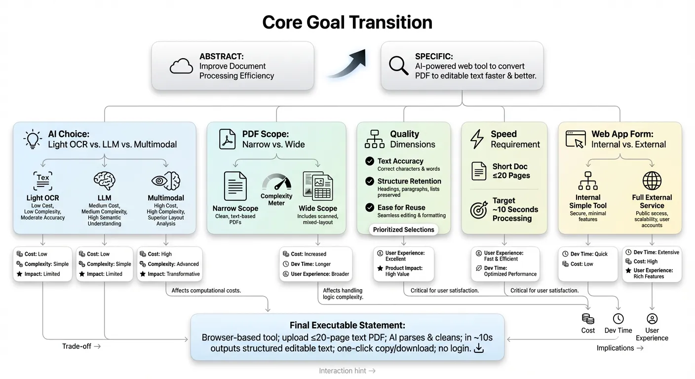

当你做到这里，你会发现两件很现实的变化。第一，你不再被“我要做一个提升效率的应用”这句话压住，而是拥有能够立即动手的步骤。第二，和别人的沟通成本会急剧降低，因为你拿出了一套已经拆到足够具体的初版方案。

从抽象到具体，其实就是把“我想做一个提高文档处理效率的应用”这样的大愿望，拆成一组任何人甚至任何 AI 都可以立刻理解并开始执行的任务清单。通过这个方式不会有难解决的问题，所有的问题分解到原子化后无非就只有两个选项，只要能原子化就能被执行：

1. 我来解决、执行这个子问题。
2. AI 或别的专家，来执行解决这个子问题。

## 2.3 在白板上构思你的应用: 先画出第一个应用

很多人一想到要开始做应用，脑子里第一个跳出来的是代码、后端、数据库、接口、框架。这并不奇怪，因为我们长期被灌输的观念是: 做一个应用，首要是技术问题。但如果你一开始就把注意力全部压到技术上，很容易忽略最关键的东西: **用户到底在你这里究竟要做什么** 。

在这一点上，一个最简单、却经常被忽略的做法，就是先画。你不需要什么专业的软件，一个白板，一张空白纸，一个记事本都可以。重要的是，你先把用户从进来到离开的整条路径，用几张简单的页面草图画出来，而不是直接跑去打开编辑器写代码。

你可以把整个应用，先分成三类页面: 入口页、操作页、结果页。

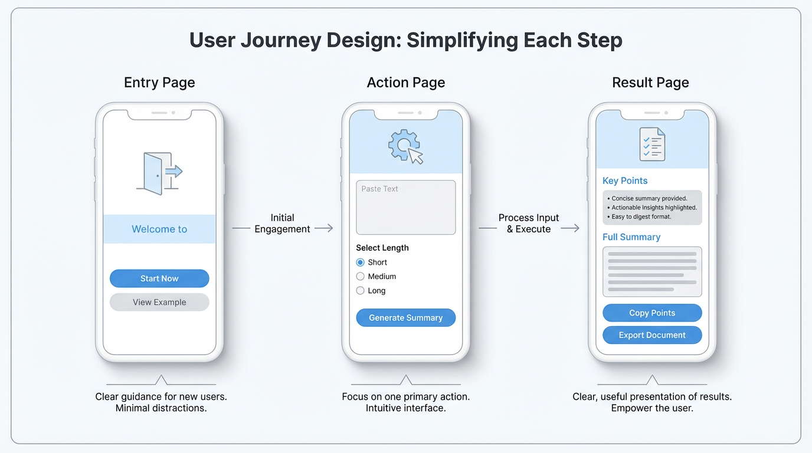

### 入口页: 用户从哪儿进来，第一眼看到什么

入口页就是用户和你的应用第一次打照面的地方。很多人一开始设计入口时，只想到一个通用的首页，上面堆满了功能按钮、模块入口、广告位，似乎只有这样才显得东西够多、够厉害。但如果你把这个页面画在纸上，贴在墙上，再假装自己是一个第一次来的人，你会突然意识到一个很现实的问题:** 我到底该先点哪里。**

画入口页时，可以先把自己当成导游。问几个非常具体的问题: 用户通过什么方式进来，是点击一个分享链接，是在应用市场里搜索，是在一个网页上扫描二维码。不同来源意味着用户对你的预期完全不同。比如一个通过朋友转发链接进来的用户，他已经大致知道你能做什么，这时候入口页可以更直接一点，让他马上试用核心功能；而一个从应用市场搜到你的人，可能对你一无所知，此时 **入口页就需要用一句话先帮他搞清楚你是干嘛的，或者一看会用** 。

画的时候，可以这样简单处理: 在纸上画一个手机屏幕的框，在最上方写上这一页的标题，中间画出主要区域。标注清楚: 这一页我要告诉用户什么，我希望他在这里做出什么选择。比如是让他点击一个大大的开始按钮，还是让他先看一个简短的示例结果，或者是填写一个最简单的基础信息。

开始页越简单而具体，你就越有机会让刚来的用户不迷路，快速上手。

### 操作页: 用户需要输入、点击、选择什么

一旦用户决定继续往前走，下一步就会落到操作页，也就是整个应用的工作区域。这里是用户真正和你发生互动的地方，也是最多人设计过度复杂的地方。

画操作页时，一个很有效的练习是: **只允许用户做一件事** 。你可以在纸上写下这件事的最简单表达，比如 提交一段文字 用语音记录一条想法 选择一个模板 配置一个参数。然后围绕这件事，尽量往少里做，看看最少只需要哪些输入，哪些按钮。

以一个长文自动总结的应用为例，最粗糙但能跑通流程的操作页，可能只需要几样东西: 一个可以粘贴文字的输入框，一个选择总结长度的选项，一个生成摘要的按钮。你完全可以先不考虑字体大小、配色、图标这些视觉上的细腻部分，把重点放在这样几个问题上: **用户是否一进到这一页就知道要做什么，他需要准备哪些东西，他会不会在中途搞不清楚下一步。**

在纸上构思操作页的好处，是你可以非常低成本地尝试不同版本。你可以先画一个所有输入都在同一页的版本，再画一个分成两步的小向导版本，然后在脑海里演练几遍: 哪个版本更不容易让人卡住。相比在已写好的代码里改流程，这种纸上调整几乎没有成本。

### 结果页: 用户得到了什么，怎么展示

很多应用在结果这一步做得很敷衍。开发者往往觉得结果不就是一段文字、一张图、一串数据嘛，展示出来就好了。可对用户来说，往往恰恰相反: 他之所以愿意在前面的步骤里输入、等待、尝试，根本原因是他期待在结果页上看到一个够清楚、够有用的东西。

画结果页时，可以从这样几个角度去想: **用户最关心的核心信息是什么，它应该摆在最显眼的位置** 。有哪些结果是需要导出、保存或者分享的，它们的入口在哪里。有没有必要为结果加上一些简单的解释，让用户知道这代表什么。

还是以长文总结为例，一种比较友好的结果页设计是: 顶部用几条简洁的要点列出核心结论，其下面放一个更详细的摘要，最底部保留原文链接。旁边放上两个醒目的按钮: 一个是复制要点，一个是导出为文档。你可以在纸上试着画出这些区域的布局，并标注一下每个按钮预计承载的动作。

当入口页、操作页、结果页都画完后，你再用箭头把它们连起来，**从用户第一次进来，一步步走到结束。这个过程会暴露出很多原本你没意识到的问题:** 比如用户在结果页想要修改一个细节，他该如何返回操作页；或者在操作页上，他如果暂时不确定要不要继续，是否有清晰的退出或者保存草稿的方式。

整个章节的核心只有一句话: 先把用户操作过程画出来，再考虑技术实现。你可以完全不会写代码，却依然可以 **通过几张简单的草图，把一个点子变成一个看得见的应用雏形** 。这一步做得越清楚，后面无论是自己实现，还是和别人合作实现，都会轻松很多。

## 2.4 参考别人的应用: 聪明地抄作业

很多人在做第一个应用时，会有一种心理负担: 觉得自己好像必须从零开始，页面结构、交互方式、视觉布局都要完全原创，仿佛只有这样才算真正做产品。现实是，如果你坚持这个原则，反而会在无关紧要的地方耗掉大量精力。

在应用设计这件事上，有一种更高效也更成熟的态度叫 **聪明地抄作业** 。不是简单模仿，而是有选择地借用别人已经验证过的好解法，把你的精力留给最应该用在你独特价值上的地方。

互联网上有很多收集应用界面截图的网站，也有大量应用市场里的详情页，这些地方本身就像一本巨大的参考图册。你可以挑出几个和你的方向相近的应用，比如同类工具、相同人群的产品，然后像研究样本一样一页一页地看。

重点观察的不是配色有多漂亮，而是它们在若干关键区域是怎么处理的:

- 导航栏怎么设计，底部还是顶部，是固定几个核心入口还是只有一个主按钮
- 表单怎么组织，是一次性在同一页填完，还是拆成多个小步骤
- 结果展示时，最重要的信息有没有被放在最明显的位置，次要信息又是怎样被收纳的
- 新用户第一次进来时，有没有简短的引导流程，告诉他接下来怎么用

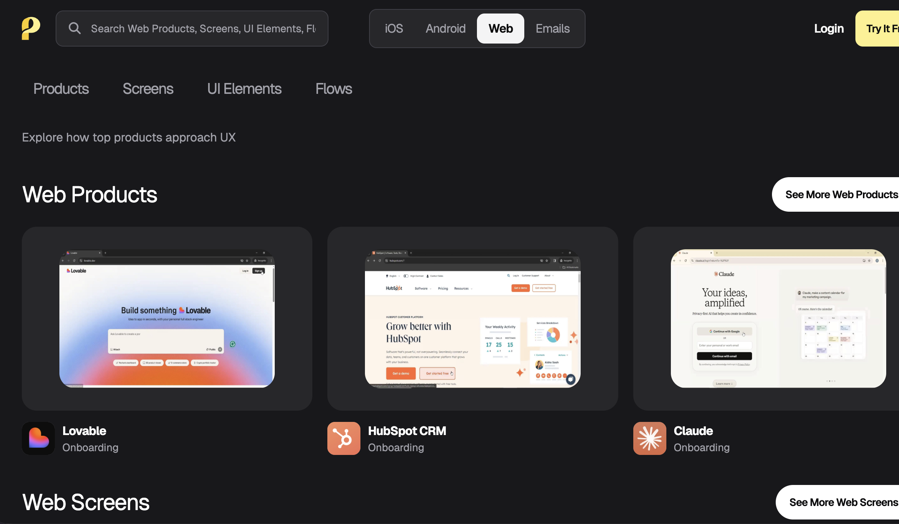

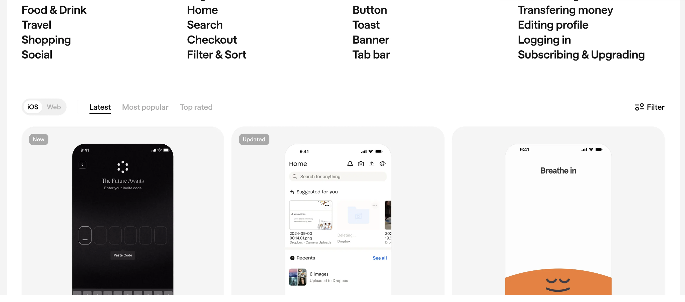

具体可以参考如下几个网页截图收集站：

- [https://www.uisources.com/](https://www.uisources.com/)
- [https://screenlane.com/](https://screenlane.com/)
- [https://pagecollective.com/](https://pagecollective.com/)
- [https://patttterns.net/](https://patttterns.net/)
- [https://mobbin.com/](https://mobbin.com/)
- [https://refero.design/](https://refero.design/)
- [https://scrnshts.club/](https://scrnshts.club/)
- [https://godly.website](https://godly.website/)

除了直接参考别人的应用，我们还能从一些比赛中得到灵感，比如 Hackathon（ 限时、高强度的团队协作开发活动，需短时间内完成产品原型或解决方案）的得奖作品和一些公开的 demo 网站。其本质上是一批实践者在极短时间内交出的解决方案，它们虽然粗糙，但恰好呈现了如何在有限时间内完成从点子到可运行产品的压缩流程，你可以参考他们的作品思考什么叫做最小产品原型；但由于黑客松始终是短时间的比赛，有可能创意大于实用性，其获奖作品并不一定适合作为一个长期的产品进行参考和开发，你需要根据实际情况进行判断。

除此之外，你还能参考一些所谓的工具类网站进行操作，工具类网站你可以理解为类似天气查询网站、多语言翻译网站、神奇宝贝图鉴收集网站、游戏攻略网站、流行车辆排名网站、AI 工具站。这些工具站虽然功能十分简单，但也许就是一个满足某些人需求的非常好的“应用”。想法不在复杂而在有用，通过对不同应用的参考，你能真正知道什么才是市场需求。

## 2.5 不要等一切就绪才调查用户需求

很多人嘴上说要做用户驱动的产品，真正做的时候却习惯先关起门来做一个他们心中完整的版本，然后才鼓起勇气拿给别人看。**这听起来好像更体面，至少不会在别人面前暴露自己的半成品。但从产品的角度看，这是一个非常危险的习惯。**

原因很简单: 你在越后面才接触用户，你前面对细节的投入越多，一旦方向不对，损失就越大。你可能已经为一个不重要的功能写了很多代码，为一个没有太多人关心的细节设计了很多图，最后却发现用户真正卡住的地方，根本不是你花最多时间的那一块。

要避免这种局面，有一个简洁但有效的原则可以时时提醒自己: 边画边问，**边做边问，不要做完再问。**

### 边画边问: 在纸面阶段就开始收集反馈

当你刚刚在白板或纸上画出入口页、操作页、结果页的时候，其实就已经具备了和用户对话的基础。你完全可以在这一阶段，就找两三个可能成为目标用户的人，让他们看一眼，听听他们的第一反应。

你不必做复杂的访谈，只需要观察几个细节: 他们看到入口页时，会不会自发说出你想让他们说的那句话，比如 这好像是做长文总结的；他们在操作页上，会不会自然而然按你预期的顺序进行，比如先粘贴文字，再选择总结长度；他们在结果页上，是否一眼就被你希望他们看到的部分吸引，而不是纠结在一些无关紧要的角落。

这些观察可以帮你在写第一行代码之前，就暴露出那些最明显的设计问题。你可以根据这些反馈修一次纸上的原型，再继续往下做，而不是等到整个应用已经搭好再来大改结构。

### 边做边问: 在半成品阶段就拉人试用

当你有了一个能跑通基本流程的半成品版本时，更没有理由一个人闷着用。哪怕界面很粗糙，哪怕很多功能还没加进去，**只要它能够完成你定义的那个最小任务，就已经具备邀请真实用户试用的条件。**

你可以先从身边人开始，还可以从你在上一章提到的人群资产、公开场域里接触到的用户中，挑一些比较愿意尝试新工具的人。给他们发一个链接，简单说明现在能做的事情，然后请他们在你不做太多解释的情况下，从入口走到结果。

**在这个过程中，你要做的不是辩解，而是观察。** 他们会在什么地方犹豫，会在哪个环节停顿，哪一个按钮看了很久都不敢点。你也可以事后问几个具体问题: 有哪一步是你觉得最费劲的，有哪一个结果你是最满意的，有什么是你以为会有但最终没看到的。

在半成品阶段做这些事，有一个巨大好处: 你还没有对任何一个方案投入过多的情感依赖，你会更容易接受把某些看起来很酷但用户根本不在意的功能砍掉，也更愿意花时间去优化那些虽然不起眼却真正在使用中频繁出现的小细节。

### 不要害怕暴露粗糙

很多人之所以不愿意在早期让别人看到，是因为害怕暴露自己的粗糙，觉得这样会被认为不专业。可恰恰相反，真正成熟的产品人，很少对早期版本有这种羞耻感。因为他们知道，早暴露问题，成本最低。

你可以在心里换一个视角看待这件事: 你不是在展示一个未完成品，而是在邀请对方参与共同打磨。只要你事先说清楚这是一个非常早期的版本，你希望对方给的不是赞美，而是尽可能直接的使用感受，大多数人是愿意提供帮助的，尤其是那些本身就被你要解决的问题困扰的人。

至此，你已经学会用白板和纸，把一个抽象点子变成一条具体的用户链路；你知道如何通过拆解，把大而宽的愿望拆成可以明天就开始动手的最小可行动项；你也知道不该贪心，一口气把所有想法都塞进第一个版本，而是用双钻模型在发散和收敛之间来回切换，最后选出那个最值得先做的 MVP；你学会了聪明地参考现有应用，在导航、表单和结果展示这些基础结构上，站在别人的肩膀上往前走；更重要的是，你知道不要等一切就绪才去找用户，而是从 demo 开始，就让他们走进来，用他们的使用感受来帮你一起修正方向。

通过这些工具和步骤，你已经有能力把一个点子，拆成一个初步可用的应用。但你也会发现，一个能用的应用，和一个真正好用的应用，中间还隔着一层面纱。

接下来我们就专门谈一谈: 什么样的应用，才算是好应用；让你知道在得到第一个可用版本后，下一步如何让应用走的更远。

## 📚 Assignments

请你根据上文内容，完成下列作业：

1. 请你使用任意一款大语言模型，针对之前的点子，让 AI 参考双钻模型给出发散结果，你需要根据发散结果选出一套可行解决方案。
2. 根据之前想出来的点子，使用拆解细化的方法得到更具体的可执行内容。类似：“为用户提供一个网页工具，让他上传一份不超过 20 页的纯文字 PDF，在 10 秒内得到一份段落结构清晰、标题层级保留的可编辑文本，并支持一键复制和下载为 .txt。”
3. 根据细化后的点子，尝试在白板上画出你的应用，应用需要关注两个部分，一个是 UI 应该如何设计，一个是该有什么功能，每个功能是在哪。

# 3. 做出来后，怎样判断和打磨成好应用

当你终于把第一个版本做出来，放到真实世界里给人用时，会进入一个完全不一样的阶段。之前所有的讨论，都还停留在想法和设计层面，而现在，产品会第一次被真实的使用场景检验。你会看到用户点错的地方、犹豫的地方、卡住不动的地方，也会看到他们在哪些步骤出奇地顺畅，甚至会在某个角落意外多停留几秒。这些细节，远比你脑子里对产品的各种想象要诚实得多。

这一章要解决的是一个核心问题: 当应用已经做出来，甚至已经有一批早期用户在使用时，怎样判断它离一个好应用还有多远，以及如何利用这些真实使用过程中的信息，把它一步步打磨好。

## 3.1 什么是好应用: 4 个核心特征

要判断一个应用好不好，不能只看你自己多喜欢它，也不能只看下载量或一两天的使用次数，而是要看它具不具备一些更底层、更稳定的特征。简单而言可参考以下几个特征：

### 好应用能带来具体价值

好应用最直接的特征，是它能让人在某个场景下实打实地得到一点好处。这个好处不一定宏大，也不需要用多高深的语言去包装，但必须具体到你能说得清楚:** 它到底帮用户少做了什么，少花了多少时间，或者让什么事情不那么容易出错。**

比如一个简单的会议纪要工具，如果它能做到只要上传录音或者在会议过程中直接录音，结束后就能自动生成一份结构化的会议纪要，并且把待办事项、责任人、截止时间用列表列清楚，那它帮用户节省的就不仅仅是打字时间，而是从记录、整理、筛选到格式化输出整套过程的心力。你可以很明确地说，这个工具大概每场会为一个人省下二十分钟。而如果整个团队每周有十场这种会议，那么总共节省下来的时间就非常可观。

再比如一个看似不起眼的图片压缩工具，如果它能在保持肉眼几乎看不出差别的前提下，把一批图片的体积压缩到原来的三分之一，同时保证一键导出、文件夹结构不乱、命名规则统一，那它带来的价值并不只是硬盘空间的节省，还有传输更快、上传更顺滑、和其他系统对接时更少出错。这种看似平凡的具体价值，往往比一句模糊的效率提升要可靠得多。

所以，当你说自己的应用有价值时，最好能把价值拆成一两条具体的场景，用普通人听得懂的话解释: 你的应用让用户原本需要花多久、做多少手工、承担多大风险的事情，变得更省力。

### 用户好上手，几乎不用看说明书就能懂

另一个容易被低估但极其重要的特征，是 **好应用通常不太需要解释** 。用户第一次打开时，靠直觉就能知道大概该从哪里开始，点击什么会发生什么，最大按钮通常做的是最核心的事情，最重要的入口会摆在真正重要的位置，而不是藏在菜单的第三层。

你可以想象一个刚刚下载你应用的新用户，他可能是在排队、在车上、在咖啡店里随手点开的。当时网络信号不一定很好，他也没有耐心看任何一篇长说明。他能容忍的迷茫时间，往往只有几秒钟。如果在这几秒钟里他看不到任何明确的引导，不知道下一步该干什么，就很容易直接关掉，然后再也不回来。

所以，当你自己觉得产品逻辑很顺畅时，最好找一个完全没见过你应用的人，让他在你不说话的情况下，从零开始摸索。你只观察他会在哪些地方停顿，在什么位置犹豫，什么时候会露出那种这是什么的表情。用户如果一进来就被各种开屏弹窗、复杂选项、账号绑定挡住，很难认真体验到你真正想提供的价值。

**好上手这件事，本质上是产品对用户成本的一种尊重。** 你是在承认一件事: 没有人有义务花时间研究你的应用。

### 在高频或关键场景中，会自然想到你

好应用往往有一个稳定的使用节奏，要么高频，要么关键。 **高频是指它融入了用户的日常，例如每天都会打开好几次的消息应用** ，每天上下班都用的通勤工具，每天习惯记录的打卡应用。关键是指即便不是每天都用，但是一旦遇到某类场景，用户就会第一时间想到你，比如报税工具、装修预算计算器、面试题管理工具、签证资料清单助手。

你可以问自己几个问题: 用户真正会在什么时间、什么情境下用到你; 如果他错过你，会不会真的感觉到不便; 同类场景下，他现在是靠什么方式过活的。如果有一个备选方案，哪怕很麻烦，但是已经习惯了，那你要做的就不仅仅是功能对齐，还要让他感觉换到你这里来确实更值得。

一个常见的误解，是把使用频次和应用的好坏直接绑定在一起。其实不必。比如做年终报表、办理某种证件、做一次大额转账，这些事情本身频率不高，但一旦发生，对用户来说就是当下最重要的事情之一。**如果你的应用刚好能把这类关键场景处理得稳、快、让人心里有底，那它一样可以称得上好应用。**

**真正需要警惕的，是那种用户既不高频用你，也不会在任何关键时刻主动想到你** ，甚至如果你的应用从他手机里消失，他只会在几个月后清理内存时才模糊想起曾经装过这么一个东西。这种情况往往说明你的应用并没有和任何真实的场景深度绑定，只是在功能层面堆了一些存在感不强的东西。

### 利他心

很多人一开始做产品时，心里同时盘算的是几件事: 做出来后怎么收费，怎么涨价，怎么让用户多用一点就得付费，怎么锁死数据防止用户迁移走。商业上的计算本身没问题，但如果一开始思路就完全绕着这些转，很容易做出那种一眼就充满戒心的应用: 一上来就要各种权限，到处是花样收费点，功能设计明显不是为了让用户顺畅完成任务，而是想办法把用户引导到某个付费的按钮上。

相比之下，真正好的应用都带有一种比较朴素的利他心。它确实会想清楚要怎么活下去，也会设置合理的收费方式，但在设计路径和体验的时候，优先级始终摆在: **怎么让用户更容易顺利完成这件事，而不是怎么多加一步流程来制造额外障碍。** 你会看到它在很多地方都用了对用户更友好的方式，比如在关键步骤给出清晰的提示，在导出和迁移上不过度设置壁垒，在收费前让你至少体验到一部分实在的价值。

这种利他心，经常体现在一些微小的设计细节上。比如表单那一栏不会为了多收信息而乱要一堆和任务无关的数据，教程的顺序是围绕用户要完成的目标设计的，而不是围绕功能模块自己来讲。你能感受到这个应用是在认真帮你做成一件事，而不是把你当成一个被压榨的对象。

还有一点很重要: **好应用不一定是大应用。它可以很小，只服务于一类人、一个场景、一个任务** ，但在那一小块里做得很到位。比如专门帮设计师把稿件导出成打印店要求的格式，或者专门帮自由职业者整理个人项目案例，这些范围都不大，但里面的价值一点不小。

## 3.2 洞察需求：**马斯洛的需求层次理论**

在做应用之前，很多人会直接跳到功能层面思考：这块能不能再做点什么，那块要不要加个按钮。而真正决定一个应用能不能活下去的，是你究竟踩中了人哪一层次的需求，以及踩得有多准。

马斯洛的需求层次理论之所以在这么多领域被反复提起，不是因为它多严谨，而是因为它提供了一个足够好用的观察框架。你不用把它当成严格的心理学结论来看，只要把它当成一个简单的框架：帮你把用户的各种动机，挂在几个相对清晰的层级上，方便你判断你的应用到底在满足哪一类需求，你能满足越多需求，就是越好的应用。

马斯洛的需求层次理论通常会分成五层，自下而上分别是：生理需求、安全需求、归属与爱、尊重需求、自我实现。

### 生理和生存相关的需求

这一层最基础，直接关系到吃饭、睡觉、生存状态本身。听上去好像和互联网产品有点远，但其实不少应用都在这个层上发挥作用。

比如外卖、买菜、跑腿、订房、打车，这些典型的到家和出行服务，本质上都是在帮用户用更低的时间成本去解决吃饭、出门、休息这类最基本的问题。再比如健身记录、睡眠监测、饮食打卡，虽然看起来更偏健康管理，但对很多人来说，是在试图维持一个不至于失控的身体状态，这也可以看作是生理与生存层面的延伸。

如果你的应用是在这一层发力，有一个特点是： **用户对稳定、可靠、可预期会特别敏感** 。点外卖送不到、打车一直叫不到、订房信息出错，带来的情绪反应会非常强烈，因为这些问题直接打断了生活的基本节奏。

### 安全感和确定性的需求

安全需求包括物理层面的安全，也包括经济、信息、心理上的安全感。

很多工具型应用，其实主要都在安全这一层工作。比如记账、资产管理、保险助手、合同模板工具、密码管理器、备份工具、隐私保护工具、网盘同步、数据恢复。这些应用的核心承诺往往是：帮你降低出错概率，帮你在事情出了问题时有备选方案，或者至少让你心里有底。

比较典型的一类，是各种防丢、防忘、防错的小工具：日程提醒、药品服用提醒、重要文件到期提醒、关键节点的备忘。这类应用哪怕每天只提醒你几次，但只要有一两次在关键时刻救了你，它就会迅速被你归类为必须留着的一类工具。

当你在设计这类产品时，可以多问一句： **你到底帮用户降低了哪一类风险，是金钱上的、时间上的、关系上的，** 还是合规和法律上的。如果连你自己都说不清，那用户很难真正信任你。

### 归属感、连接和被看见

再往上一层，是归属与爱的需求。简单说，就是我不想一个人，我想和某些人连在一起。这一层，是社交类、社区类、兴趣小组类应用的大本营。

朋友圈、群聊、兴趣论坛、同好社区、线上读书会、游戏里的公会，甚至一些围绕特定身份的工具，比如新手父母群、留学生互助、行业内部匿名吐槽平台，本质上都是在提供某种归属感：有一群和我类似的人，我们在看类似的话题、吐槽类似的困难、分享类似的经验。

有些工具表面上是功能型应用，但真正留住用户的，往往是这层需求。比如记账应用里大家分享自己的存钱进度，跑步应用里的排名和打卡圈子，学习应用里的互相监督小组。这些看似增值的社交模块，实际上是在让用户把你的应用和自己的某个群体身份绑在一起。

如果你的应用试图站在这一层，光有内容是不够的，你要思考的是： **用户凭什么觉得这里是自己人，他愿不愿意在这里留下痕迹、和别人产生一点轻微但真实的互动** 。否则，你做的就只是一个单向的广播工具。

### 尊重、自我价值和成就感

再往上一层，是尊重和自尊需求。人不只想被接纳，还会在某个阶段开始在意：我在这里算不算一个不错的人，我有没有被看见、被认可，我做成的事情有没有人知道。

大量的打卡、勋章、排行榜、头衔、成就体系，其实都在这个层面发挥作用。学习应用里完成多少课时会给你一个称号，运动应用里达成目标会给你一张证书，创作平台给作者开通不同等级的身份标识，社区里对优质内容作者有明显的高亮标记。

这里容易出现一个误区：以为加一堆勋章、积分、称号就能刺激用户。用户要的不是浮夸的装饰，而是我的真实努力被记录并被认真对待。如果你设计的成就体系，和用户的真实投入完全脱节，比如随便点几下就能拿到资深称号，那这个激励很快就会失效，甚至让人觉得廉价。

所以在这层上，关键不在于你有没有做激励系统，而在于： **你的应用有没有给用户提供一个可以积累的舞台，让他可以清楚看见自己从初学者到熟练者的变化** ，并且在关键节点上，给予他一种这一步值得被记一下的仪式感。

### 自我实现与自我超越

金字塔的最上层，指向的是我想成为怎样的人，以及我想把自己的一部分贡献出去。这听起来很抽象，但落到具体场景里，往往有很实际的表现。

比如创作类工具：写作、绘画、音乐制作、视频剪辑、编程项目管理，它们表面上是在提供技术能力，背后承接的是用户对创造一些属于自己的东西的渴望。再比如一些长期学习平台、职业规划工具、习惯养成工具，它们服务的并不仅仅是单一技能，而是某种更长线的自我成长目标。

还有一种是让别人变好的需求。很多人使用知识分享平台、问答社区、公益类应用、协同创作工具，不只是为了赚点积分或流量，而是因为在帮助别人、推动一个项目向前时，会有一种我正在做一件有意义的事的感觉，这也属于自我实现的一部分。

当你的应用真正触碰到这一层时，往往会拥有一种很强的粘性：即便界面不是最漂亮，功能也不一定最全，用户还是会留在这里，因为 **它和我是怎样的人、我在做什么样的事情建立了更深的连接** 。

把马斯洛金字塔当成产品视角的一个好处，是它能帮你避免两个常见的偏差。

**第一个偏差，是只盯着某一个错误的层次不放。** 比如你做的是帮助用户安全存储文件的工具，本质上站在安全这一层，但你却一味模仿社交产品，在界面上堆各种点赞、评论、排行榜，结果既抢不到社交类产品的用户心智，又让本来只想要一个稳妥存储工具的人觉得你不务正业。

**第二个偏差，是忽略了层级之间的先后关系。** 一个人连最基础的稳定使用体验都得不到保障时，很难认真在你这里追求自我实现。比如应用经常崩溃、数据时不时丢，哪怕你给了再多勋章、再多成长曲线，用户也不会真心投入。反过来，如果你在基础层面做得扎实，再逐步叠加更高层次的价值，用户会更容易跟着你一起走上去。

在实际设计中，你可以这样自查：

- 先问自己：我的应用最主要、最核心的是在满足哪一层需求，只允许选一层
- 再问：在这个核心层之上，我有没有机会自然地延伸到上一层，而不是硬贴一个概念上去
- 最后，看一眼：在比我目标层更低的那些层里，我有没有明显短板，甚至在拖用户后腿

当你能回答清楚这几个问题时，你对用户真正要什么这件事，就不再只是停留在感觉他们可能会喜欢的模糊层面，这有助于你做出更好的应用。

## 3.3 按用户类型分类: C 端应用和 B 端应用的差异

应用做出来之后，你很快会发现另一件重要的事: 面对普通个人用户和面对企业或机构用户，是两种完全不同的游戏规则。它们看起来都叫用户，但关心的重点完全不同。

- C 端（Consumer End）：指 “消费者端”，核心是普通个人用户。
  比如我们日常用的微信、抖音、美团外卖，这些 App 的使用者是一个个独立的个人，这类面向个人提供服务的场景，就是 C 端业务。
- B 端（Business End）：指 “企业端”，核心是企业、机构或组织用户。
  比如公司里用的钉钉（企业协作工具）、财务软件（如用友、金蝶）、零售门店的收银系统，这些产品的使用者是企业员工、团队或整个机构，服务于企业的经营、管理、生产等需求，这类面向组织提供服务的场景，就是 B 端业务。

### C 端应用: 面向普通人的生活、情绪和习惯

C 端应用面向的是个人用户，它们嵌在每个人的日常生活里。常见的类型包括内容类、工具类、娱乐类、社交类、学习类等等。

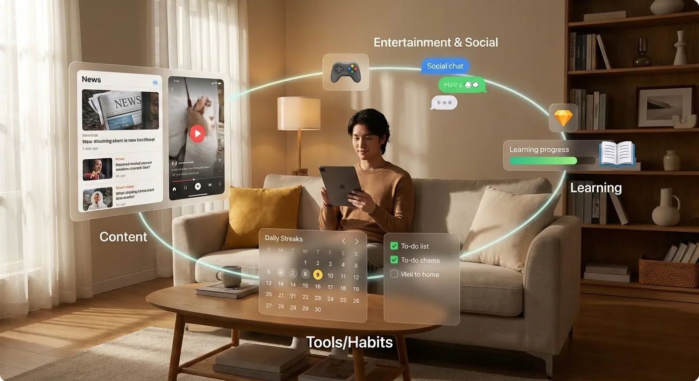

内容类应用，比如资讯类阅读、短视频平台、播客工具。它们的核心任务通常是让用户在有限的时间内，从海量信息中筛出自己感兴趣的内容。同时要保证不断有新东西吸引用户回来。

工具类应用，比如记账、待办事项、文件管理、日历调度。它们往往在某个具体任务上提供一个比原始方式更顺手的解决方案，属于用户日常使用的基础设施之一。

娱乐类应用，包括游戏、轻互动、趣味小工具。它们给用户提供的是情绪上的放松和愉悦，衡量好不好用的标准，更多是用户愿不愿意持续花时间在上面。

社交类应用围绕的是人与人之间的连接和互动，学习类应用则围绕某种能力的提升，比如背词、刷题、读书打卡、课程管理。

这些应用虽然种类不同，但有几个共同的关注点。

**第一，用户增长。** 也就是如何让更多人第一次尝试你的应用。这里涉及到渠道、传播文案、用户激励，但前提始终是: 你要先有一个足够清晰的使用场景。否则，再厉害的增长手段也只能带来一波短期的好奇心。

**第二，留存和复访。** 不是有人来过，而是他愿不愿意留下来、回来。一个内容类应用，如果不能保证持续产出用户感兴趣的内容，很快就会被替代；工具类应用如果在关键几次使用里没有帮助用户真正完成任务，也很难建立长期使用习惯。你可以通过观察第 1 天、第 7 天、第 30 天的留存情况，判断到底有多少人真正把你纳入了生活节奏。

**第三，转化和付费。** 用户为什么愿意付费，通常不是因为你把免费版做得很糟糕，而是因为在他已经从你这里获得一部分价值之后，看到付费功能能带来更高层次的便利。比如更高的使用额度、更强的协作能力、更专业的模板、更稳定的性能。

**第四，分享传播性。** 很多 C 端产品之所以能快速扩散，是因为在使用过程中天然带有分享属性。比如生成一张图、一个视频、一段文本，用户为了完成自己的目标，本身就需要把结果发给别人。在这个过程中，只要你把品牌露出做得自然、不讨厌，就能获得一部分口碑式的传播。

判断 C 端真需求的一个简单方式，是看用户愿不愿意围绕它形成自己的小习惯。比如愿意每天打开看一眼、愿意把它和自己的生活节奏绑定在一起、愿意让它参与到某些重要时刻的记录中。反之，如果用户只是因为一次活动或广告进来，用完就走，而且几乎不会再回来，那基本可以判断，你解决的可能只是他们一时的好奇心，而不是长期需求。

### B 端应用: 面向组织的效率、成本和风险控制

B 端应用面向的是企业、团队、机构或某个部门。常见类型包括 ERP（资源管理系统）、CRM（客户关系管理）、协同办公工具、各类 SaaS 工具、行业内部管理系统等。

这些应用和 C 端的最大不同，是它们要同时满足多个角色的需求。使用者可能是一线员工，决策者却是主管或老板，数据的拥有者可能是组织本身，审批流程可能涉及多个部门。你既要让使用者觉得好用，**又要让决策者看到** **投入产出比** **，还要让整个组织在风险和合规层面有安全感。**

B 端应用有几项特别核心的关注点。

**第一，提高效率。** 这不仅指某一个人的时间缩短了，而是整体流程耗时减少，协作成本降低，沟通环节减少。比如一个订单从创建到发货原来要经过五个系统，现在通过一个统一入口就能整体流转，这类提升对企业来说就是非常具体的。

**第二，** **降低成本** **。** 包括人力成本、培训成本、系统维护成本等等。如果一个系统看起来功能很强大，但需要投入大量培训和维护资源才能勉强跑起来，那它对很多中小企业来说就会显得性价比不高。反而是那些做得看似更轻，但能快速上手、快速看到回报的 SaaS 工具，更容易在现实世界活下来。

**第三，控制风险和保证合规。** 很多 B 端场景里，对合规性和可追溯性有很高要求，比如金融、医疗、制造、政务等行业。一个好的 B 端应用，往往会牺牲一点使用上的自由度，换来更明确的权限管理、更严谨的日志记录、更清晰的审批链路。对用户个人来说，可能少了一些随意发挥的空间，但对组织整体来说，反而是价值所在。

**第四，权限管理和责任边界。** 谁能看见什么、谁能改什么、谁对什么结果负责，这些问题往往是 B 端系统设计中的重点。一旦这里做不好，就会给后续的审计、纠纷、追责带来巨大麻烦。所以，判断一个 B 端应用是不是好应用，不能只看界面看起来顺不顺眼，还要看它的权限模型是否严谨、是否容易理解和维护。

从行业到应用，你可以这样思考: **选一个你有一定了解的行业，比如教培、电商、制造、金融、医疗** ，然后拆开看这个行业的日常运转中，有哪些流程特别倚赖人工，有哪些信息经常散落在多个系统或多个私聊里，有哪些环节出错率特别高但又不容易被立刻发现。围绕这些地方，你往往可以设计出一些很聚焦的小工具。

比如在教培行业，一个很具体的应用切口是做课程排班和教室利用率优化工具。它不需要取代整个教务系统，只要专注于让教务老师更容易安排老师、教室和课程时间，自动避免冲突，给出最佳组合，导出一份所有人都能看懂的课表，这一项就足以节省大量反复沟通和修改的时间。

在电商行业，一个常见需求是多渠道订单管理。商家可能同时在不同平台有店铺，订单信息散落各处。如果你能提供一个把各平台订单抓取到一起、统一处理售后和物流信息的小工具，就已经解决了他们每天重复操作中的一个巨大痛点。

在制造业，很多企业仍然依赖纸质记录或 Excel 来做生产进度追踪。你可以从一个简单的工单跟踪工具入手，帮助现场管理者更直观地看到每个工序的状态，而不是一整天都靠问人和打电话。

在金融或医疗行业，你的切入点未必是前台业务，可以是合规检查辅助工具，可以是文档模板生成，可以是审批材料清单管理。只要你能说清楚在某个流程里，你让哪一类岗位的哪一项任务变得更可控，就已经是一个值得尝试的方向。

以上行业的应用往往都有一些成熟公司的产品正在推广，这其实为你提供了很好的参考路径：你可以在网络上主动搜索 “对应行业 + 核心需求 + 产品” 的关键词（比如 “教培行业 教务排班系统”“电商 多渠道订单管理工具”），不仅能找到具体的产品官网、功能介绍，还能看到用户评价、行业案例甚至产品演示视频。这些信息能帮你直观了解成熟产品如何解决同类问题，避免从零摸索的试错成本。

## 3.4 根据用户数据打磨: 从我觉得好到用户觉得好

应用做出来之后，最容易出现的一种错觉是: 你自己越用越顺手，觉得哪里都挺合理，就以为用户也会这样。实际上，越是自己写的产品，越容易对别人的问题视而不见。要让应用逐渐从一个自我感觉良好的作品，成长为真正的好应用，你必须学会把真实的用户反馈引进解决。

### 设计简单的反馈机制，让用户有出口说话

不需要一上来就搞复杂的客服系统和数据平台，你可以从一些非常简单的方式开始。

**群聊是最直接的一种。** 如果你手里已经有一个小范围的用户群，可以邀请大家把平时使用过程中的问题和想法发在群里。你要做的是认真回复、记录并且定期总结，而不是在群里辩解或防御。你越能在这个小群体里建立一种可以坦诚说话的氛围，后面收集到的反馈就越有价值。

问卷适合在你需要 **一次性收集较多结构化信息的时候使用** ，比如在一个版本迭代之后，想知道大家对某几个具体功能的感受。如果你希望填写率高，问卷最好不要太长，问题要尽量具体，比如这一段时间你最常用的是哪个功能，在哪一步卡壳最多，而不是泛泛问你对这个应用总体感觉如何。

使用后弹窗是另一个常用方式，比如在用户完成一次任务后，用一个非常简短的评分和建议框，问他这次体验是否顺利。有时一个简单的数字评分，就足以帮你判断某个流程是否存在明显问题。

一对一访谈用起来成本较高，但回报经常也更大。你可以 **挑选几位不同类型的用户，约他们花二十到四十分钟** ，详细聊聊他们平时的使用习惯，让他们边操作边讲你看到了什么、感觉到了什么。曾经看到一个创始人为了约用户建议，每天安排了十多次会议和用户进行对谈，花时间理解用户需求永远都不会是坏事。

### 学会从杂乱反馈里提炼出三类信息

用户反馈通常是混杂在一起的，很难一眼看清楚。你可以尝试把它们分成三类:** bug、体验问题、新需求。**

**bug 指的是原本你说会发生某种行为，但在某些情况下完全没有发生，或者发生了错误的行为** 。比如上传失败、闪退、按钮没有响应、结果明显不对。对于这类问题，你要做的是尽快复现、修复，并且在修复后主动告知受影响的那批用户，让他们知道你是认真对待这些问题的。

**体验问题是在流程长度、操作位置、文案表达上没有选到最顺滑的路径。** 比如用户总是在某个按钮上犹豫，不知道点了会不会造成不可逆的结果；某个功能很重要，却被放在一个不显眼的角落；某些默认设置和大多数人的习惯相反，导致他们每次都要多做一步调整。这类反馈需要你结合数据和观察去判断，决定是否做改变，以及改到什么程度比较合适。

**新需求是指用户开始提出一些原本你没想到的功能和场景。** 有些新需求确实值得认真考虑，比如多种导出格式、团队协作能力、和其他常用工具的对接。但也要注意，不是用户提什么你都要照做。真正要做的是辨别，这些新需求背后有没有共性问题，是不是和你原本想服务的那群人、那个核心任务一致。否则，你很容易被一堆分散的需求拉扯到各个方向，最后变成一个什么都想做、却什么都做不精的产品。

你可以养成一个习惯: 为每一条反馈打上标签，标明它属于 bug、体验问题还是新需求。定期把这些标签汇总，看看哪一类问题集中在哪几个功能或流程上。这样一来，你就不再只是被动地修补，而是能有意识地围绕高频问题展开迭代。

### 用三个简单指标，判断要不要继续投入

在资源有限的情况下，你还需要一些简单但有效的指标，来判断这个应用值不值得你继续长期投入。

**第一个是留存。** 留存不是看某一天有多少人打开，而是看在 **一段时间里，有多少用户还在持续使用** 。你可以很粗糙地统计，比如下载后一个星期内还有多少人至少用过一次，一个月内又有多少人回来过。如果大部分用户只用了一两次就再也不回来，说明你的应用在前期并没有让他们看到足够的价值，或者使用门槛太高。

**第二个是复访频率。** 那些没有卸载你的应用的人，到底多久会回来一次。一款每天都可以用得上的工具和一款每季度才会被想起一次的应用，它们的产品定位不同，你要用不同的标尺来衡量。但无论哪种，你都应该能给出一个合理的使用节奏预期，然后对照实际数据，看有没有大的偏差。频率比你期望高，说明价值可能超出预期; 频率远低于预期，则要反思是不是场景抓得不准，或者使用体验某处让用户感觉累。

**第三个是推荐意愿。** 有没有人愿意主动推荐你的应用给别人。这件事可以通过几种方式观察: 比如在用户完成一次特别顺利的任务后，提供一个自然的分享入口，看有多少人真正使用; 在群里看看有没有人自发安利你的产品；或者进行小规模用户访谈时问一句，如果你身边有人遇到类似问题，你会不会推荐我这个工具给他。推荐意愿通常比简单的满意度分数更能说明问题，因为推荐是一种带有个人信用背书的行为，用户只有觉得你真的帮了大忙，才愿意把你的应用介绍给朋友。

当你把这三个指标与前面讲过的用户反馈结合起来看，大致就能判断出你的应用目前处于什么状态。也许功能还不完备，但有一批人已经留下来，并且会在特定场景反复使用你，这样的应用就很值得继续投资和打磨。相反，如果修了很多 bug，堆了不少新功能，留存和复访却一直上不去，几乎没人主动推荐，这时候就要冷静思考，是不是该收缩范围，重新回到那个最初的核心场景，甚至考虑换一个方向。

# 4. 在哪一步、怎么合理地用 AI 放大价值？

一旦你开始认真做一个应用，很快就会遇到一个普遍存在的诱惑: 能不能再加一点 AI 进去。这个诱惑之所以强，是因为你每天都在看到各种宣传: AI 赋能某某行业，AI 彻底重构某某流程，AI 帮你一键搞定一切。久而久之，你很容易把一个原本朴素的问题变成一个充满噱头的口号，然后在技术栈里堆上一些模型调用，看账户的钱逐渐亏光。

虽然本教程教的是如何开发 AI 原生应用，谈论该话题颇有些砸自己的饭碗嫌疑；但对于一个小应用或者刚起步的产品来说， **最危险的不是不用 AI，而是为了 AI 而 AI** 。你明明可以先做一个简单但靠谱的工具，却被各种新能力吸引，不断往里添加看起来很聪明的功能，最后把一个原本可以落地的方向做得又贵又复杂，还没有明显的价值提升。本章要解决的核心问题是解释清楚: 在什么阶段、用在哪些环节、用什么方式 AI 真正能帮你把应用的价值放大。

## 4.1 不要为了 AI 而 AI

要判断自己是不是已经在不知不觉中为了 AI 而 AI，一个很实用的办法，是在每次考虑加入某个 AI 功能之前，先强迫自己认真回答两个问题。

**第一个问题是: 不用 AI，这个应用是否也成立** 。也就是，把所有 AI 能力都暂时抹去，你做的这件事，本身是不是一件有价值的事，用户有没有现实需求，愿不愿意每天、每周、每月在这件事上投入真实时间。

这句话听起来有点逆势，因为现在几乎所有产品介绍都会把 AI 放在非常显眼的位置，好像没有 AI 就不算现代工具。但如果你的应用在没有 AI 的情况下就完全站不住脚，很多时候说明的并不是你技术不够先进，而是一个更深层的问题: 你抓的那个需求，可能本身就不痛不痒，甚至并不真实存在。

想象一下，你要做一个帮助人整理待办事项的工具。如果你主要的差异点是: 在待办列表上加了一些模型生成的提示，比如自动起标题、自动分类、自动补全描述。但用户原本在写待办时，根本不觉得起个标题有什么痛苦，只是想快点把事情写完，那这些聪明能力再花哨，也很难形成持续价值。相反，如果你先退一步，问清楚不用 AI 的时候，这个应用最朴素的价值是什么，也许你会发现更扎实的方向: 帮用户把散落在不同渠道的任务统一收集，帮他看清每天只能做完多少件事，帮他在日程结束之前看到风险，从而做减法和取舍。把这些基础能力做扎实，往往比一上来就给待办加上各种智能标签更重要。

**第二个问题是: 用 AI 之后，具体提升了什么。** 这里不接受那种很宽泛的总结，比如提升效率、重构体验、智能升级，而是要落到一两个连用户本人都能清楚感知到的维度。

你可以这样盘问自己:

- 有没有显著提升完成任务的速度，比如把原本要自己从零写的一页文案，变成只需要花五分钟审阅和改写
- 有没有明显提升结果的质量，比如让用户在相同时间内产出更有条理、更专业、更符合目标受众的内容
- 有没有让使用过程变得更顺畅或更轻松，比如把一段非常枯燥的表单流程，变成更像聊天的问答
- 有没有在真实成本上带来下降，比如减少外包次数、减少人工客服时长、缩短培训周期、缩短决策时间

如果你在脑中给出的答案还停留在**感觉会**更方便一些、看起来更酷一点，那十有八九说明这个 AI 功能还没有找到最关键的着力点。

这两个问题其实有一个很明确的排序。先保证不用 AI 的时候，这个应用也说得通，然后再在这个基础上问，用加了 AI 之后具体好在哪。

## 4.2 思考 AI 扮演了什么角色

当你确定这个应用就算不用 AI 也成立，而且已经找到一个清楚的提升点，下一步需要做的，是更具体地思考: **在你的应用中，AI 到底是做什么的。** 很多产品在这一步出错，是因为它们把 AI 当作一种很抽象的能量，而不是一个有具体分工的角色。结果就是，功能堆得很多，但每一块的作用都模糊不清，用户用起来也只觉得哪里都沾一点智能，却说不出哪个地方真正离不开它。

一个更加清晰的思路，是把 AI 当作几种不同的部件: ** 它可以是大脑，是眼睛，是手** 。你需要根据你的产品目标，决定它在其中负责哪一块，如果可以，最好一开始就只选一两个角色把它做好，而不是一股脑全部塞进去。

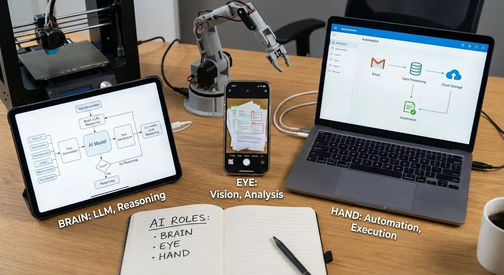

**当它扮演大脑时，主要负责理解和生成文字内容，或者在复杂信息之间做推理。** 比如，你做一个会议纪要助手，它要能从一段长长的录音里，抓出真正核心的讨论点，而不是简单按时间顺序罗列。你做一个学习应用，它要能根据用户的回答，判断他到底是没理解概念，还是只是粗心写错步骤，并给出不同的反馈。这类场景里，AI 的价值在于它能读懂用户说的话，理解用户给出的材料，然后生成一个带结构、带逻辑的输出。你要做的，是帮用户把问题问清楚，把上下文喂得足够准确，让这个大脑有足够信息做判断。

**当它扮演眼睛时，重点在于处理图像、视频等非文本内容，** 把这些东西变成机器可以理解的描述，然后再基于这些描述进一步行动。比如，你做一个整理纸质文档的工具，它可以通过拍照识别，把一堆发票、合同、包装说明书变成可搜索的文字。你做一个学习绘画的应用，它可以看懂用户画的草图，然后指出构图和线条上的一些问题。你做一个家居整理建议工具，它可以通过用户上传的照片，识别出目前房间的布局和物品分布，再给出一些简单可执行的改造方案。这里 AI 的重点是: 它像是一双会分析的眼睛，让你的应用不再只能处理键盘输入的文字，而是开始真正接触用户生活里的实物世界。

**当它扮演手时，意味着它开始去执行一连串具体的动作** ，而不仅仅是给出一个建议或者文字结果。比如一些自动化平台，会让你把多个步骤串成一条工作流: 从邮件里读取附件，把内容总结成要点，发到一个群里，再把原文存入云盘，最后在任务管理工具中自动创建一条跟进任务。这里 AI 的作用，是帮你在复杂的流程里，根据上下文动态决定下一步该怎么干，比如识别一封邮件是不是投诉，判断某个表单是不是填写完整，再据此触发不同的后续操作。

除了上述简单的描述，实际应用中，AI 承担的角色往往会更加具体和多样，例如：

在文本处理方面，它可能是在做翻译、摘要、问答、续写或情感分析：比如客服系统里自动分类用户咨询、法律文档助手里提取合同条款、教育应用里批改作文。

- 技术基础主要是深度学习中的 **大语言模型（** **LLM** **）** ：在海量语料上学习语言规律和世界知识，既能“看懂”长篇、多轮对话中的上下文，又能“写出”连贯、风格一致的内容。
- 在“理解”侧，LLM 可以识别用户意图、提取关键信息、判断情感倾向；在“生成”侧，则用于自动写摘要、回答问题、进行续写改写以及多语言翻译，把大量需要人工阅读、归纳和撰写的工作自动化或半自动化。
- 以**在线客服机器人**为例：系统先根据用户的一句话大致判断属于咨询、投诉还是售后，并从话语中识别出订单号、时间、商品名等关键信息，然后交给 LLM 结合上下文和企业知识库生成自然、完整的答复，既减少人工压力，又能在高峰期保持稳定服务质量。

在图像处理方面，它可能是在做识别、分类、生成、修复或增强：比如医疗影像里标注病灶位置、电商平台里自动抠图换背景、设计工具里根据文字描述生成配图。

- 图像理解通常依托 **卷积神经网络** **（** **CNN** **）** 等视觉深度模型，从海量图像中学习边缘、纹理、结构等特征，用于目标检测、图像分割和细粒度分类（如区分不同病灶、不同商品品类）。
- 图像生成与修复依托 **扩散模型、** **GAN** ** 等生成式模型** ，可以根据文字描述或参考图片生成全新图像，对模糊、缺失或低分辨率图像进行修复和超分辨率增强。
- 很多系统还会结合 LLM：先用自然语言理解用户的文本描述，再自动生成适合视觉模型的“提示词”、风格标签和构图约束，实现从“听懂你想要什么”到“画出你想要什么”。
- 以电商平台的**“智能主图生成”** 为例：系统先用检测和分割模型把商品从原图中精细抠出来，再通过 LLM 解析商家输入的文案（如“简约北欧风客厅场景，柔和自然光”），转成具体的场景、色调和风格参数，最后交给扩散模型生成匹配的背景和光影效果，并自动筛掉构图不佳或风格不符的结果，输出可直接用于上架的商品主图。

在音视频处理方面，它可能是在做音频和视频的生成、转写、降噪、剪辑或字幕制作：比如播客工具里自动生成开场和结尾的旁白、视频平台里根据脚本自动合成讲解视频、会议软件里实时转写和翻译对话并生成多语言字幕与录播回放。

- 在“理解”侧，系统会用**语音识别模型**把语音转换成文字，同时分析说话人、语种、语速和大致情绪；用视觉模型理解视频画面中的场景、人物和关键物体。
- 在“生成”侧，以 LLM 为核心，对脚本、会议内容或用户指令进行理解、拆分和改写，然后驱动 **语音合成** **（** **TTS** **）生成自然语音解说，驱动视频生成与编辑模型**自动合成或剪辑画面、替换背景、插入镜头和字幕；音频侧的生成模型还能自动生成背景音乐和环境音，并配合深度降噪与音质增强提升整体听感。
- 以“ **文字生成短视频** ”类产品为例：用户只需输入一段文案，系统先用 LLM 把文章拆成几个自然的段落和画面，生成适合口播的解说词和简单的分镜描述；然后由 TTS 模型合成配音，再由视频模板和生成模型根据分镜选择或生成画面，在时间轴上自动对齐字幕与语音，最后一键导出一条可以直接发布的短视频。

在语音交互方面，它可能是在做识别、合成、情绪检测或对话管理：比如智能音箱里理解用户指令、语音导航里播报路线、语言学习应用里纠正发音。

- 前端由深度学习的**语音识别模型**将用户语音转成文字，并提取语调、音量、语速等特征，为判断情绪和状态提供线索。
- 后端通过 **语音合成（TTS）** 把这些文字回复变成自然流畅的语音输出，情绪识别模型会根据用户当下的说话方式调整回复的语气和速度，让交互更贴近真实对话。
- 以**智能音箱**为例：当用户说“今天有点累，放点轻松的音乐吧”，系统先用语音识别转成文字，再由 LLM 结合历史播放记录理解用户偏好的“轻松”风格，自动选择更舒缓的歌单；情绪识别判断用户处于疲惫状态后，TTS 在合成回复时会降低语速、柔化语调，让整个交流过程既“听得懂”，又“听起来舒服”。

以上内容只是对 AI 在几个主要方向上的应用和技术做了简单介绍。到了真实业务场景中，你往往需要把多种最新的 AI API 引入进来，在不同任务上做更全面的测试。你还需要逐渐搞清楚当前 AI 的能力到底有多强、能解决哪些问题、在哪些情况下容易出错，它的边界在哪里。只有认识到这些，才能合理设计功能和流程，而不会因为误判能力而埋下风险。

接下来，我们就围绕这一点，在下一节更系统地讨论：如何理解 AI 的能力和边界，在实际做产品时应该考虑什么。

## 4.3 熟悉 AI 能力与边界

当你开始实际把 AI 塞进应用时，很快会发现一个现实: 宣传里说的那套万能，和具体到一个功能上的约束，有时候差距相当大。为了避免过度承诺、结果落空，**你需要对当前 AI 能力的几个主要方向有个基本认知，同时明确它们各自的边界在哪。你需要通过大量测试得到 Bad Case 进行反思，在使用中避开 AI 极有可能犯错的情况。或需要对错误加上警示说明。**

当前的模型在很多场景下依然存在胡编乱造的问题，尤其是在你让它自由发挥、或者不给它足够可靠的参考资料时。它有时候会给出看起来很自信但完全错误的答案，甚至会凭空捏造不存在的文件、数据或经历。因此，凡是结果涉及到严肃后果的场景，比如财务报表、法律文书、医疗建议，你都需要在设计里明确加上一层人工校对或者多重检查，不要把模型的输出直接当作可以自动执行的指令。

同时，隐私和数据安全也是你必须正视的一环。你要非常清楚哪些数据可以直接发给模型，哪些需要做匿名化处理，哪些干脆不能出现在第三方系统里。对于用户上传的合同、病历、个人身份信息等敏感内容，更要在界面和协议中明确说明你的处理方式，甚至在可能的情况下，为这些场景单独选择更加安全、可控的模型部署方式。

更具体的，我们就借一个和智能体 Agent 有关的例子，来说明什么叫真正理解 AI 能力的边界。注意，这里并不是要教你怎么从零实现一个 Agent，也不是要你现在就去追某一种架构，而是想通过这个例子，让你看到一种思考方式：同样是讨论 Agent，有人只是把它当成一个新名词，有人却能借这个话题，把任务拆得很清楚、把边界画得很清楚。

有一位长期在一线做 AI 应用的作者 Barret 李靖，给过一段我非常认同的总结，用来说明如何做好 Agent 和是否要利用 AI。它很好地体现了一种成熟的理解方式：先把问题拆开，再谈 AI 的用武之地。

> Agent 有两个变量，一个是控制任务走向的 workflow 工作流，一个是控制内容生成的 context 上下文。
>
> 1）如果 workflow 和 context 的确定性都很高，这类任务就容易被自动化，类似传统 RPA，比如在处理发票处理、表单填报任务时，AI 更多是粘合剂，发挥空间比较有限。
>
> 2）如果 workflow 确定但 context 不确定，也就是流程固定但输入多变，就需要 Agent 在语义和理解上补全，比如客服问答、合同解析，需要通过外部检索、知识图谱等工具来弥补信息的缺口，让推理结果更符合预期。
>
> 3）如果 workflow 不确定但 context 确定，也就是输入清晰但走法多样，Agent 就要去自主规划路径，例如市场分析报告生成、个性化推荐等，大多数 End-to-End RL Agent 都擅长做这类任务，因为它们在训练阶段就习得了大量的路径规划和解题思路。
>
> 4）而当 workflow 和 context 都不确定时，就是最复杂的场景了，既要推理也要探索，像创新方案设计、跨部门信息收集等，这类更偏向于通用型 Agent，它的执行效果，取决于给它配备的工具丰富度，尤其是编程能力要最大化开放，例如让它学会去 Github 找仓库克隆并修改代码来解决问题，让它像人一样干活儿。
>
> 所以，要把 Agent 做好，首先要明确场景。本质上，自动化解决的是“确定性”问题，而智能化解决的是“不确定性”问题。

这个拆解方式的价值，就是把"做一个 Agent"这种模糊概念，转化成了可以具体判断的问题：你面对的任务，确定性和不确定性分别在哪里？当流程和信息都确定时，传统程序就够了；只有当不确定性出现时，AI 的语义理解、模式识别、推理规划能力才有用武之地。但同时，不确定性越高，AI 引入的新风险也越大。在两头都不确定的场景里，AI 的每一步都可能偏离，你很难提前知道它会做出什么选择。这也是为什么很多团队会从第二象限（workflow 确定，context 不确定）开始做起，既能发挥 AI 的理解能力，又能通过固定的流程把风险框在可控范围内。

让我们回到这一小节最开始想要解决的问题：什么叫真正理解 AI 的能力边界？

首先是理解不同场景对 AI 的需求不同。就像前面 workflow 和 context 那个例子展示的：当流程和信息都确定时，AI 其实没什么发挥空间，传统自动化就够了；当流程确定但信息不确定时，AI 的价值在于理解和补全；当流程不确定时，AI 才需要做规划和探索。这个拆解方式的本质，就是在识别不确定性的来源和程度。AI 的核心能力，就是在不确定性中找到模式和关联。这套思路不只适用于 Agent，在图像识别、内容生成、推荐系统等各个领域都同样重要。比如做一个 AI 抠图工具，输入是确定的（一张图片），但边缘识别的准确性、复杂背景的处理能力，就是不确定性所在。

但是，AI 在解决不确定性的同时，也会引入新的不确定，它的输出是概率性的，可能理解错、推理偏、产生幻觉。而不同场景、不同用户对这种不确定性的容忍度完全不同。所以你还要问：

**AI 引入的新不确定性，用户和系统能不能承受？** 比如客服场景，如果 AI 理解错了用户意图，用户可以立刻纠正，这种不确定性是可控的。但如果是自动执行财务审批，AI 的一次误判可能造成严重后果，这种不确定性就不可接受。再比如图像生成，如果是给用户做头像美化，生成效果不满意用户可以重新生成，试错成本低；但如果是给建筑设计师生成施工图，哪怕一个细节错误都可能导致工程事故。

**AI 的准确率能不能达到这个场景的及格线？而这个及格线，取决于用户用它做什么。** 同样是图像识别，如果是帮用户整理相册、按人脸分类照片，识别准确率 80% 用户也能接受，大不了手动调整几张。但如果是用在安防监控场景，漏掉 20% 的可疑人员就是严重的安全隐患。同样是文本生成，如果是帮用户写社交媒体文案，60 分的创意就够了，用户会自己润色；但如果是生成法律合同条款，95 分都不够，因为一个用词不当可能引发法律纠纷。不同用户、不同用途对错误率的敏感度完全不同，你要清楚你服务的场景，容错空间到底有多大。

**当 AI 出错时，有没有办法补救？** 在 workflow 确定的场景里，你可以在关键节点设置人工审核，把 AI 的不确定性控制在局部。但在 workflow 也不确定的场景里，AI 的每一步都可能偏离，你很难判断它什么时候需要介入，这时成本和风险都会急剧上升。比如在图像修复场景，如果 AI 把老照片修复得不够真实，用户一眼就能看出来，可以选择不采用；但在医学影像辅助诊断场景，如果 AI 把异常标记错了位置，医生可能很难发现，后果就严重得多。

**你有没有办法衡量和优化 AI 的表现？** 如果这个任务本身就没有明确的对错标准，你怎么知道 AI 做得好不好？如果用户的反馈很滞后，你怎么快速迭代？当你连衡量都做不到时，AI 的不确定性就会变成一个黑盒。比如推荐系统，你可以通过点击率、停留时长这些指标快速评估效果；但如果是生成创意广告文案，什么叫"好"本身就很主观，可能要等到投放后才知道转化率，迭代周期就会很长。

真正成熟的判断不是"这里有不确定性，所以可以用 AI"，而是"这里的不确定性 AI 能处理，AI 带来的新不确定性我也能管理"。“在这个功能点上，AI 能帮到什么程度，值不值得投入，怎么投入性价比最高。”，我们需要形成这样的判断力，能够帮助我们在之后每一次设计功能、评估方案时，少走很多弯路。

# 5. 有了应用，怎样从 0 找到第一批真实用户

当你好不容易把一个应用做出来，下一个难题就会变成：如何让第一批真实用户出现。

很多团队在这个阶段会有一种错觉，觉得既然东西已经做出来了，接下来只要想办法把它推广出去就行——做宣传、买投放、找曝光，似乎只要让更多人看到,就能自然跑起来。但如果你一上来就急着追求大规模曝光,很容易陷入一个典型的陷阱：烧掉了宝贵的时间和预算,数据上看起来有人来过,却无法验证这个应用到底有没有人愿意持续使用。

这个阶段最重要的事情,其实只有一件： **用尽可能小的代价证明,确实有人愿意用这个应用,而且用完之后愿意回来** 。在增长和产品的语境里,这一步通常被称为"冷启动"。

冷启动指的是：在几乎一切都是零的情况下,把一个全新的产品推到真正运转起来的那一步。此时你没有用户基础,没有口碑传播,没有搜索量和品牌认知,各项指标几乎都停留在 0。你要在这样一片冷寂的环境里,让第一批真正愿意使用的人出现,并围绕他们搭起一个最初的使用闭环。

这和后来在一个已经有用户、有数据的产品上做优化,是完全不同的一类工作，简单来看，我们能按以下四个步骤进行推进：

1. 首先知道增长可分成 0–1 和 1–N, 知道自己当前只需要搞懂什么
2. 弄清楚你真正要去找的对象有哪些,不要只盯着终端用户
3. 在清楚对象的前提下,选择一两条适合自己的冷启动路径
4. 在资源有限的现实里,学会取舍,把力气收紧到最关键的一小块

## 5.1 先分清两个阶段：0–1 和 1–N

在正式讨论怎么找用户之前,你需要先明确一件事： **增长是分阶段的** 。把所有增长相关的工作混在一起看,只会让你不知道当下该把精力放在哪里。最简单也最实用的划分方式,就是把增长拆成两个阶段：0–1 和 1–N。

### 0–1：在没有人用的情况下,怎样冷启动

所谓 0–1,指的是从完全没有用户,到出现一小撮愿意真正使用的用户这段过程。冷启动的"冷",就在于一开始几乎所有指标都是零：无下载量,无搜索量,无口碑,你的应用在这个世界上可以说是不存在的。

这个时候,你不能指望自然流量和运气,而是要主动出手,为它搭起最初的基础。具体来说,有几件必须完成的事情：

**找到一小批愿意真正使用的种子用户** ,而不是随便从熟人圈里凑数。这些人必须对你要解决的问题有真实的需求,而不是出于人情或好奇点开看一眼就走。

**准备最初的使用体验和供给** ,确保用户进来不会只看到一片空白。即便功能还不完善,至少要让他们能完成一次完整的核心操作,感受到这个应用的价值。

**把产品是做什么的、解决什么问题,用简单的话讲清楚** 。在没有品牌背书的情况下,用户给你的耐心只有几秒钟,你必须让他们在最短时间内明白"这个东西对我有什么用"。

**想办法拿到第一个触达渠道** ,把这些信息递到潜在用户手里。可能是一个小社群、一个论坛、一个朋友圈,关键不在于规模有多大,而在于能不能精准触达那些真正需要的人。

在 0–1 阶段,你真正要考虑的是：把第一批有真实需求的人引进来,并且让他们完成一次从进入到使用再到反馈的闭环。只要这个闭环能跑通,你就证明了这个应用不是空中楼阁,而是真的有人需要、愿意用的东西。

### 1–N：在已经有人愿意用的基础上,怎样规模化

当你慢慢积累了一批愿意反复使用的用户之后,问题才会变成：怎样从几十人、几百人,慢慢扩大到几千人、几万人,甚至更多。这一段是传统意义上大家常说的增长、扩张、规模化。

在 1–N 阶段,你要开始关心的是机制、组织、商业化、品牌、团队等一整套更复杂的问题。比如：

**是否已经找到相对稳定的获客渠道** ,知道每投入多少预算或时间,大致能带来怎样的新增用户。这时候你需要的不再是碰运气,而是可重复、可预测的增长路径。

**有没有开始搭建服务机制** ,比如客服、运营活动、用户教育。用户多了之后,你不可能再像早期那样一对一地手把手教每个人怎么用,必须建立标准化的服务体系。

**打算怎样让这个产品赚到钱** ,是订阅、单次付费、增值服务还是其他。商业模式不是一开始就要想清楚的,但当你进入 1–N 阶段,就必须认真考虑如何让这个产品可持续运转下去。

**想给用户留下怎样的品牌印象** 。早期你可能只是在小圈子里传播,但当用户规模扩大,你需要思考如何让更多人记住你、信任你,并愿意主动推荐给别人。

**团队还缺哪些能力,哪些环节必须有人长期盯着** ,不能完全外包。一个人或小团队能撑起 0–1,但 1–N 往往需要更多角色的配合。

这些问题都很重要,但如果你在 0–1 阶段就急着琢磨它们,往往只会让你陷入空转。因为在你还不知道这个产品是不是真的有人愿意用、愿意留下来的时候,谈商业模型和品牌策略,只会把注意力从真正紧要的事情上引开。

### 为什么要先专注 0–1?

对个人开发者、小团队来说,比起 1–N, **真正最该关注的是 0–1** 。原因很简单：如果你连第一批真实用户都找不到,后面所有关于规模化、商业化、品牌建设的讨论都是空谈。

0–1 阶段是整个产品生命周期里最脆弱、也最关键的时刻。它决定了你能不能证明这个产品的价值,能不能建立起最初的信任,能不能为后续的增长打下地基。只有当你真正跑通了 0–1,才有资格去考虑 1–N 的问题。

接下来,我们要进一步聚焦在 0–1 阶段,把"究竟要去找谁"这个问题说清楚,然后再谈具体的冷启动路径。

## 5.2 冷启动对象: 种子用户、供给方、流量方和渠道方

不同类型的应用，往往都绕不过几种关键对象: 种子用户、供给方、流量方和渠道方。

### 第一类: 种子用户

**种子用户是你最早触达的那批使用者。** 他们的典型特征是人数不多，但与你的目标画像高度吻合。你要从他们身上获得的不只是注册和使用数据，更是一手的方向和体验反馈。

- 面向个人工具类产品，种子用户可能是那一群在某个问题上长期有痛点的人，比如经常写长文需要整理的内容创作者，频繁准备汇报材料的职场人士，或者每天要和大量资料打交道的学生
- 对于教育类应用，种子用户可能是一小撮正在准备同一场考试的考生，或者某个年级段的家长

冷启动时，你可以先给自己设一个明确的种子用户目标，比如先找到二十到五十个愿意配合的用户，用一两周时间边使用边对话。重点不是数量，而是通过高密度的交流把产品逻辑磨清楚。

### 第二类: 供给方

**在一些双边或多边平台型产品里** ，单有用户端是不够的。如果没有足够的供给方存在，用户即便被拉进来，也会因为找不到东西可用而迅速离开。

**供给方可能是内容创作者、课程老师、服务提供者、商家、司机、房东**等，他们决定了平台的丰富度和吸引力。

- 做一个面向设计师的素材平台，你需要先说服一批设计师愿意上传作品，哪怕只是小规模地开放一部分免费素材。否则用户进来看到只是几张示例图，很难形成粘性
- 做一个线上预约工具，如果没有提前对接好一些有意愿使用的商家或机构，普通用户进来后一样找不到可以实际预约的对象

冷启动时，你要非常清楚地知道，自己是在先解决用户端，还是先解决供给端，还是两端同步推进。很多平台在早期都经历过这样的取舍和权衡。只要你意识到这是一个必须正面面对的结构性问题，就已经比那些只想着多拉点终端用户的人走前了一步。

### 第三类: 流量方

流量方是那些可以在**较短时间内，把一定规模用户注意力导向你的人或机构。它们可能是达人博主、垂直账号、媒体、社区运营者，也可能是某个拥有大量用户的工具平台。**

- 一个职场工具类产品，如果能说服几个职业发展博主，在内容中自然地介绍你的应用，就有机会在短时间内获得一批对职场效率工具敏感的人
- 一个针对小红书创作者的选题助手，如果能和几位中腰部博主合作，让他们在实战案例中展示使用过程，那么这批创作者天然就是你的潜在种子用户

在冷启动阶段，你不必急着找最大牌的流量方，甚至不必马上去跟头部谈合作。很多时候，那些规模适中但与目标人群高度重叠的小流量方，反而更愿意和你一起做一些定制化的尝试。你要做的是找到这类人或机构，然后拿出一个清晰的合作提案，让对方看得懂你要做什么，能给他们带来什么好处。

### 第四类: 渠道方

渠道方是那些可以帮助你在 **特定场景下稳定触达目标用户的组织或入口** 。它们和流量方的区别在于: 流量方更偏向一次性的注意力导入，而渠道方更像是长期的、结构化的连接方式。

- 学校、培训机构、企业、行业协会、软件服务商，都是典型的渠道方
  如果你的应用能切实帮助某类机构提高效率、节省成本或提升服务质量，他们有动力把你的产品介绍给自己体系内的大量用户

冷启动阶段，你不必妄想一口气拿下大型渠道，可以从一个小范围试点开始。比如和一两个班级、一家小公司、一个本地社群合作，让他们在内部先使用一段时间，然后根据反馈再决定要不要放大规模。

把冷启动对象拆开来看，有一个直接好处，就是能避免你所有精力都砸在终端用户拉新上，而忽视了产品结构里其他关键一环。你可以根据自己的产品形态，画一张简单的角色图，写清楚每一类对象是谁、现在有多少、短期内你的目标分别是什么。在这张对象图清楚之后，我们再来谈具体冷启动路径。

## 5.3 冷启动方法: 针对不同对象的三条主路径

当你知道了自己要去找的人是谁，下一步才是: 通过什么路径去找到他们、服务他们。

在实际操作时，你不必拘泥于某一种路径，而是根据自己的资源状况和产品特性做选择。大多数时候，你会以其中一条为主线，另外一两条做补充。

### 路径一: 用种子用户破局，优先用好私域

这一条主要是针对种子用户和部分供给方。

对于大部分刚起步的个人开发者、小团队甚至初创公司来说，最现实、成本最低也最容易掌握节奏的办法，通常都是从自己已有的私域出发。

所谓私域，不是某种复杂的运营概念，而是你已经可以主动触达的一批人群，比如你的朋友圈、你参与的行业社群、你有话语权的兴趣群、你维护了一段时间的公众号读者等等。

在这条路径里，大致有三个关键动作:

1. **主动邀请少量精准用户体验**
   关键不在于数量，而在于和目标画像的匹配度。你做的是面向职场新人写简历的工具，就优先找刚毕业一两年的同学、在校准备实习的学弟学妹，而不是已经工作十年的熟人。
   邀请时尽量说清三件事:
   1. 这是一个为哪类人解决什么问题的应用
   2. 希望对方大概花多久时间试用一下
   3. 你会怎样对待他们提供的反馈
2. **有意识地收集反馈并快速优化**
   种子用户的价值不在于帮你凑数，而在于帮你看清楚产品的盲区。可以通过一对一聊天、小问卷等方式，问清楚: 在什么场景会想起用它、用的时候卡在哪里、哪一部分最有用或完全用不上。
3. **让种子用户产出首批内容或案例**
   真实使用痕迹就是内容。评价、对比截图、使用故事，都可以是你后续对外介绍时的素材。

在这个过程中，要特别克制住一上来就追求大规模扩散的冲动。如果你连这几十个人都没有服务好，仅仅依靠更大的曝光把更多人推到同样的坑里，本质上只是在放大问题，而不是在解决问题。

### 路径二: 用内容或福利驱动，给出足够明确的第一理由

这一条更多是针对种子用户加流量方，在竞争激烈的赛道里尤其常见。

当用户有很多替代选择时，光靠一句新人快来试试很难打动他们，你需要给出一个更明确、更有吸引力的理由，让对方愿意花时间迈出第一步。

常见的两种切入方式:

1. 直接用**实打实的福利做引子**
   1. 新上线的课程平台，可以在早期开出几门高质量的免费课程，或者提供限时优惠名额
   2. 电商类应用常用补贴红包、低价拼团、满减券等方式，让新用户觉得先来一趟不会吃亏
2. **用垂直内容持续吸引**
   在抖音、小红书、公众号、播客等平台上，围绕目标用户关心的某个垂直主题，稳定输出有价值的内容，比如职场干货、编程技巧、情绪管理、美食教程、学习方法等等。
   通过内容吸引来的第一波人，不一定马上转化成你的应用用户，但至少已经对你有基础信任，当你适时抛出工具或应用时，他们更有可能认真看一眼。

如果你走的是内容驱动，就要接受这是条比较慢热却回报长线的方式。你需要持续投入精力，把内容做得扎实，避免一开始就被播放量、阅读数牵着走。 **真正能帮你冷启动的是那一小批在内容里找到共鸣的人，而不是短时间涌来又很快消散的流量。** 无论是福利还是内容导入，最后都要落到同一句话上: 一定要把人顺畅地引导到你的应用里，让他们完成一次完整的体验。

### 路径三: 借力大平台，在已有生态里找突破口

这一条主要是针对供给方、流量方和渠道方。

在很多领域，一个新应用如果想完全靠自己建生态，代价非常高。但如果你愿意先把自己当作一个在大平台上的新店、新账号、新插件，冷启动的难度会降低很多。

- 电商领域，新店入驻淘宝、拼多多、京东等平台，至少不用从零搭建支付、物流、评价系统。冷启动时常用的方式包括达人带货、站内推广与活动位、直播等
- 工具类、内容类应用，可以通过为成熟平台开发插件、小工具，把服务上线到开放平台的能力市场，让已经有明确需求的用户更容易找到你

这条路背后的逻辑，是 **承认大平台已经把用户聚集在一些特定场景里，而你要做的是在这些场景中找到与你产品匹配的那个小角落** 。借力并不意味着放弃独立性，而是在冷启动阶段，用一个更现实的方式打开局面。

## 5.4 资源有限时的取舍：在 0–1 阶段只做最关键的一小块

当你已经确认自己还在 0–1 阶段，搞清楚了要服务的对象，也大致选好了冷启动的路径，却发现资源根本不够用。

这里的资源不只是钱，还包括时间、精力、人手、注意力、人脉和渠道。冷启动时，如果你一上来就想“多条路一起试”，结果往往是：每天都很忙，事情做了不少，但没有任何一条路径被走深，最后既没有拿到有说服力的结果，也没真正看懂用户。

在这个阶段，你需要刻意收缩。目标不是“做得多”，而是“把最关键的一小块做扎实”。可以从三个角度来重构自己的行动方式。

### 从目标到具体的任务

很多人在冷启动时给自己设的目标是“先看看市场反应”“先把用户做起来”“先拉一波人试用”。这些说法太泛，你很难判断每天做的事情到底有没有真正靠近这个目标。

更务实的办法，是把目标收紧成一件具体的小事，比如：在接下来的四周，让二十个符合目标画像的真实用户，在自己的真实场景里，多次完整使用你的应用，并且从他们那里拿到足够具体的反馈。

**所谓“细分人群”，不是“任何可能会用到这类工具的人”，而是你可以指着某个标签具体描述出来的一群人。** 比如你做的是一个帮人生成工作汇报的工具，那么目标可以是“互联网运营岗的一到三年从业者”，而不是笼统的“职场人士”。这群人有几个共同点：每个月确实要做汇报，时间有限，又想让内容看起来专业一点，他们的问题是具体而持续的。

**“完整使用任务”同样不能含糊** 。以这个汇报工具为例，一次完整任务可能是：用户把最近一周的运营数据和素材整理好，导入工具，生成一版初稿，然后根据推荐的结构和要点修改两到三轮，最后导出 PPT 或文档，真正拿去在部门会上讲。如果用户只是随便点两下，看看大概长什么样，就关掉不再打开，这不能算完整使用。

具体反馈要问到足够细。比如：

- 在导入数据的时候，有没有哪一步看不懂、找不到入口，或者总是点错地方；
- 生成的结构是不是贴近他所在公司的汇报习惯，比如是不是有他需要的“背景–目标–过程–结果”这套格式；
- 哪些页面是他真正拿去用的，哪些页面每次都会删掉；
- 使用之后，他是不是能明显感觉到自己准备一次汇报的时间从三小时缩短到了一个小时，还是只是觉得“好像方便了一点，但也说不上来”。

### 不要什么都想试一遍

确定了“小目标”之后，下一个问题是：用什么方式去找到这二十个用户，并陪他们把真实场景跑一遍。

冷启动的方法很多：写内容、建社群、做投放、找达人、找机构、上平台。但在资源有限的前提下，你需要的不是知道方法有多少种，而是**以现在的你，哪一种方式最自然，最容易持续做下去。**

如果你平时就习惯写长文，有一批会认真读完你文章的人，那你可以优先从内容出发。比如，写一篇非常具体的实战记录，讲自己是怎么用这个工具准备一次真正的月度汇报的：从拿到原始数据开始，到构思结构，到生成草稿，到修改细节，再到实际在会议室里播放。中间可以插入几张对比截图，展示用工具前后在时间、效果、条理上的差别。文章最后不要只是放一个冷冰冰的下载链接，而是明确说：如果你也是做运营汇报的，愿意和我一起把这个工具打磨好，可以加我或填一个简单表单，我会选二十个人一对一跟进。

如果你掌握着几个稳定的社群，比如一个运营交流群，一个校友职场群，那么你更适合从这些“私域”开始。你可以在群里开诚布公地说：我在做一个帮人生成汇报的工具，刚刚能用，但还很粗糙，现在想找一批确实有汇报需求的人，陪我一起把它用顺。自荐的人当中，你再根据岗位、工作内容去挑出最匹配的那一批，单独拉一个小群，在里面请他们试用、发截图、吐槽、提意见，自己每天花时间去跟进。

如果你在某个垂直行业里有人脉，比如和几位培训机构老师关系不错，或者认识一家中小公司的业务负责人，可以把试点做到一个班级或者一个小团队里。具体做法可以是：提出一个清晰的试用方案，比如接下来一个月，这个团队所有的周报都尝试用你的工具来生成，你提供实时的支持和调整，作为交换，他们每周和你开一次十分钟的小会，告诉你用得最顺的地方和最难受的地方。

### 只打磨最关键的部分

当你有了小目标，也选定了主路径，接下来要做的事是给自己加一个只做这一小块的限制。

很多团队在冷启动阶段的共同特征是：焦虑。一旦焦虑起来，就很容易往外找新动作：是不是也该弄个短视频账号，拍几个使用教程；是不是也该花一点预算做个小投放试试；是不是应该去联系几个媒体，看看能不能写一篇报道。**每一件看上去都无可厚非，但合在一起的结果，是你每天都在换方向，始终没有哪一条路沉下去。**

**可以给自己定一个很具体的阶段约束，比如接下来四周，只集中做两件事** ：一是围绕那二十个用户，反复优化他们在真实场景下的使用体验，让他们从“勉强能用”变成“基本顺手”；二是沿着你选定的主路径，持续找到少量新用户，并把他们的行为和反馈记录下来，看看和前一批人有什么共性和差异。

在这四周里，遇到任何新的想法、新的机会，都先问自己一句：这件事，是否能在这段时间内显著推动那二十个用户用得更好，或者清楚地帮我找到下一批类似的用户？

这种做法的背后，是一个对冷启动本质的承认：你手里掌握的信息很有限，无法同时在很多方向上做出好判断。与其在十个地方各做一点，不如在一个具体的场景、一个具体的群体里，做出可以反复验证的改进。比如，你可以很明确地看到：在这一批运营新人身上，工具确实把准备汇报的时间缩短了，确实让他们更容易说清楚重点。

你需要走通一条“ **找到用户 → 引导使用 → 收集反馈 → 改进体验 → 用户愿意继续用”的闭环。** 之后才知道应该去找什么样的用户，用什么话和他们沟通，在哪个环节最容易出问题，做什么调整可以把他们拉回来。等这条路被你走顺了，再考虑加一个新渠道、试一类新合作，才有意义。

# 总结

回到最开始的问题：我要做一个应用，这件事到底从哪儿开始，才是靠谱的开始。

本篇文章的全部内容，其实就是围绕一个主线在展开：**先搞清楚什么是点子，再看它和用户需求之间的关系，然后一步步把它拆成能做出来、能被用起来、能被打磨好、能被 AI 放大、能找到用户的一整条使用路径。**

先是第一章，我们从点子本身出发，一个点子不再只是你脑子里的那句感觉挺酷，而是必须面向一类清晰的用户， **扎在某个具体场景里，帮他们完成一件具体任务，并且给出比现状更好的做法** 。你学会从**玩法、用户链路、做什么事情、解决什么问题**这四个维度去审视自己的想法，也开始意识到，点子和用户需求之间有一道很容易忽略的鸿沟。你压抑住自嗨的冲动，开始分辨真需求和假需求，承认好点子和坏点子在一开始就有命运上的差别。然后，你不再被动等灵感，而是学会从自己热爱的生活、人群资产、公开场域和现有产品里主动挖掘线索；再往下，你训练自己用一句话概括一个点子的本质，用 AI 做头脑风暴，在常见方向里找到属于自己的人群和场景差异化。

接着在第二章，你不再停留在想，而是 **开始学会动手** 。你学会在**发散和\*\***收敛**之间来回切换，用双钻的方式先把点子铺开，再按用户价值、可行性和时间成本 **收紧到一个真正的可行路线** 。你练习 **从抽象到具体** ，把我想做一个提高效率的应用这类模糊愿望，一层层拆成最小可行动项，直到每一个步骤都变成今天可以动手的任务。你拿起白板或纸笔，先画再做，把一个应用分成入口页、操作页、结果页，画出用户从走进来再到拿到结果的完整链路。你也不会再把参考别人当成抄作业，而是有意识地 **分析别人的导航、表单、结果展示和引导流程，借力现成经验\*\* 。同时，你不再等到产品完全做完才去问用户，而是在原型和半成品阶段，就有意识地边画边问，边做边问，让真实用户尽早介入你的设计。

第三章里，你慢慢建立起一套自己的判断标准，来区分什么只是能用，什么可以算好用。你 **不再模糊地说这个应用还不错，而是具体看它有没有帮用户节省时间、降低错误率、减少沟通成本、减轻心智负担** 。你知道一个 **好应用应该让人几乎不用说明书就能上手** ，在关键场景会自然想到你，也懂得好应用背后真正的利他心。你开始把实际问题和用户痛点拆到边际成本的层面，分辨这背后到底是在消耗时间、金钱、心力还是风险。同时，你对 **C 端和 B 端的差异**有了初步认识，明白了前者更在意情绪价值和传播，后者更关心效率、成本、风险和合规。你不再只相信自己觉得好，而是搭起简单的反馈机制，用留存、复访和推荐这三类指标，判断这东西值不值得继续投入，用一次次用户反馈把应用从我觉得好打磨成用户觉得好。

到了第四章，你把视角从纯产品，扩展到了 AI 能力。你先 **压住那种为了 AI 而 AI 的冲动** ，认真地问自己两件事：不用 AI，这个应用是否也成立；用了 AI，具体提升了什么。你熟悉 AI 在文本、图片、视频和自动化上的基本能力与边界，知道哪些地方可以放手交给模型，哪些地方必须有人类复核。你不会只停留在实现功能层面，而是盯住一些更本质的指标：任务完成时间有没有缩短，结果质量是否更好，使用频率有没有提升，用户愿不愿为 AI 功能单独付费。

最后的第五章，把这一切拉回到一个现实问题上：就算你已经有了一个还不错、甚至用上 AI 的应用，如果没有用户，它的价值依然是零。你先 **学会把 0–1 和 1–N 区分开来，暂时放下所有关于规模化、品牌和组织的宏大问题，把注意力集中在一件事上：先想办法让二十个真实用户用起来** ，并且用完愿意回来。你不再盲目撒网，而是沿着三条主线冷启动：用身边的社群、同行和朋友，慢慢积累种子用户；用内容和有限的福利去吸引第一批愿意尝鲜的人；借力现有平台和渠道，在别人已经有流量的地方为自己搭入口。你也开始按对象去拆冷启动的策略，区分种子用户、供给方、流量方和渠道方，各自用不同方式打通。资源有限时，你不再什么都想做一遍，而是看清自己最擅长和手头最容易启动的一条路，先把这一条路走深走透，而不是一口气铺十个半成品的渠道。

如果把这些内容合在一起，你会发现整套方法并不神秘：**从一个靠谱的点子出发，确保它扎根在真实需求上；用画、写、拆的方式，把它\*\***收敛\*\* **成一个最小可行应用；用真实用户和明确指标，一点点把它打磨成好应用；在关键点上合理引入 AI 放大价值；最后，在有限资源下，用合适的冷启动方式找到第一批愿意为它买单的人** 。

下一步你只需要放弃过多的幻想，踏踏实实选定其中一个做出来并推出去，让它真正进入真实世界里接受检验。**所有关于点子、方法论、AI 和增长的讨论，最后都要落在一个具体的人、一个具体的场景、一个具体的任务上。**

正因为如此，一开始做得很粗糙没关系，功能残缺、流程生硬、界面简陋都没关系；推了半天没人理你、更没人愿意注册和付费，也依然没关系。这些都只是过程状态，不是终局结论；它们只是在告诉你下一步可以如何修改，真正重要的是你得有进步，在过程中你需要不断复盘、总结、提高极限、认识更多愿意给你建议的人。

在这个阶段中，笔者认为，只需要享受过程就好。就像一个有名的电子故事游戏《去月球》说的那样：

**_"The ending isn't any more important than any of the moments leading to it."_**

**_结局永远也不会比过程更重要。_**

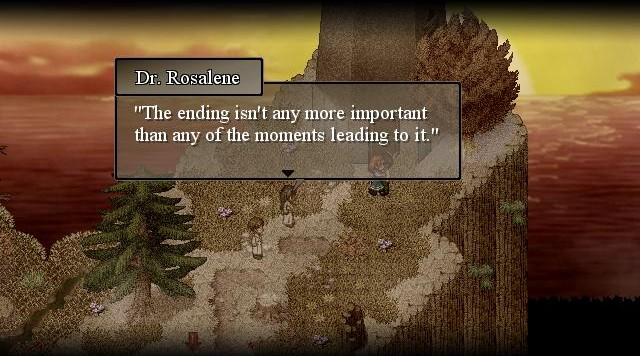
