# Project 3: Dify 入门与知识库集成

# 回顾上节课

在前几节课中，我们分组学习了 AI 编程、提示词工程以及 AI 图像生成的基础知识。这些内容帮助我们初步了解了不同大语言模型（LLM，Large Language Model）或生成式模型的边界和能力。

为了帮助你回顾上节课的内容，下面有几个小问题可以思考：

1. 什么是 AI 编程？如何使用 AI 编程工具（例如 [z.ai](http://z.ai)）来创建一个网页？
2. 什么是大语言模型？什么是提示词工程和上下文工程？你该如何编写一个复杂的提示词？
3. 对于文本、AI Coding、图像生成的三个不同方向，你认为模型能力的强弱分别体现在什么地方？
4. 什么是 API？如何使用 [z.ai](http://z.ai) 接入第三方 API ？

如果你对其中任何一个问题还感到疑惑，可以回看上节课的文档，也可以直接在微信群里提问。

在这节课中，我们将从简单的 AI 文字图片工具，进入更接近公司业务落地的工作流搭建平台。从对话机器人走向 AI 智能体、AI 工作流，并基于 API 把它变成可交互的“智能”机器人页面。

在操作过程中，如果遇到难以理解的步骤，请不要担心，推荐你随时对当前所在的操作页面进行截图，发送给大模型进行询问；当前大模型已能够解答大部分常见问题。

如果提问后仍无法解决，不妨大胆尝试操作；不必害怕出错，每一次尝试都是学习和进步的机会。随着实践次数的增加，你会越来越熟练，操作也会越来越得心应手！

# 本节课你将学到

1. 为什么需要从聊天机器人走向智能体和 Workflow 编排。
2. 什么是智能体与工作流开发平台，如何把 AI 的能力 SOP 化与可编排化。
3. 什么是 Dify，如何用这个面向 LLM 应用的开源平台快速搭建应用，尤其是知识库问答机器人。
4. RAG 的实现方法与价值，为什么需要检索增强生成？
5. 如何从 0 到 1 学会使用 Dify 和 AI IDE Trae (`Extra Knowledge 4 - What is AI IDE and Trae`)，包括搭建 智能体、工作流，并基于 Dify API 制作前端对话机器人网页程序。

- Dify 的基本使用原理与智能体、工作流制作方法，API 调用方法。
- AI IDE 的使用方法，如何使用 AI IDE 编程。
- 一个可进行对话的前端网页智能体程序。

# 1. 从对话到智能体

在上一阶段，我们学会了如何用提示词让大模型扮演角色、生成文本或编写简单代码。但如果你仔细思考，会发现一个问题，聊天机器人本身并不能做事。

它能回答怎么查订单？，却不能真的去数据库里查对应的数字；它能描述一封周报应该包含什么，却无法自动汇总你的项目数据并发送邮件。这种“只说不做”的局限，使得纯对话式 AI 难以真正融入业务流程。

要让 AI 从聊天伙伴升级为数字员工，我们需要赋予它三项核心能力：

1. 专属知识——让它能够通读并了解你的产品文档、客户资料、内部制度；
2. 工具调用（或者叫插件）——让它能操作数据库、调用 API；
3. 结构化执行——让它按预设逻辑一步步完成任务，而非自由发挥。

这就是 AI 智能体（AI Agent）的雏形：一个具备目标、知识、工具和执行路径的自动化单元。


> 注意：当前业界所说的简单版本的“智能体”，大多指基于 LLM + 工具 + 知识库组合而成的增强型应用，并非所谓能够自主规划的智能体。简单的智能体虽不具备真正的推理与长期规划能力，但已足以支撑大量企业级自动化场景。我们将会在之后的章节详细介绍真正的具备自主规划和行动能力的智能体。

## 1.1 最简单的智能体：基于知识库的问答机器人

在明确智能体应具备的多项核心能力后，一个值得思考的问题随之而来：能否仅通过实现其中某一项最简单的功能，就构建出一个真正可用的基础智能体？ 答案是肯定的。

事实上，在大量实际业务场景中，用户的核心诉求并非让 AI 自动执行复杂操作（如调用 API 或跨系统协调任务），而是希望它能基于企业自身的专属资料，提供精准、可靠的问答支持。这恰好对应智能体三大核心能力中的第一项，专属知识服务能力。因此，我们得以引出智能体最简单、也最广泛应用的形态：基于知识库的问答机器人。

虽然它尚未具备工具调用或自主规划能力，但其关键突破在于：让大模型的回答不再凭空生成，而是有据可依。如何实现？关键就在于解决核心挑战：企业内置大量文档知识，当存在千上万页文档时，模型如何在每一轮对话中快速找到与当前问题最相关的内容？

此时的一个解决方案是：检索增强生成（Retrieval-Augmented Generation, RAG）。

RAG 的基本思路是：在用户提问时，系统首先从企业知识库中检索出与问题语义最相关的若干文本片段（例如产品手册中的某一段、HR制度中的某一条款），然后将这些片段作为上下文“注入”到大模型的输入中，引导它基于真实资料生成回答。

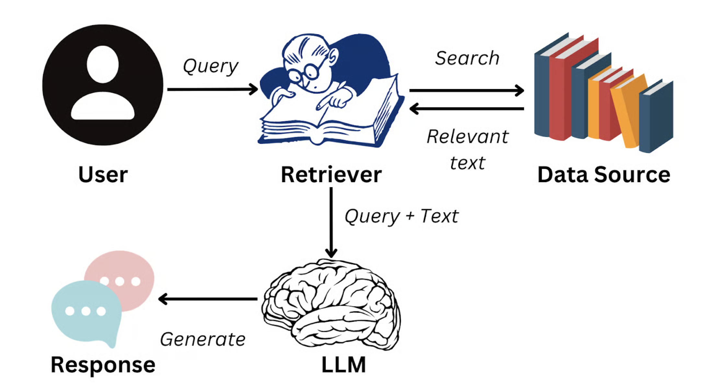

图片来源：[https://www.datacamp.com/blog/what-is-retrieval-augmented-generation-rag](https://www.datacamp.com/blog/what-is-retrieval-augmented-generation-rag)

这样一来，模型的回答不再是依赖其训练数据中的泛化知识，而是锚定在企业提供的权威信息之上。RAG 的目标，正是通过这种外部知识的动态注入，显著提升回答的真实性、准确性和一致性——甚至可以让回答“符合人设”，比如以客服口径或技术文档风格作答。

在实际业务中，这项技术尤为重要，因为大模型常常会产生“幻觉”。例如，若你以 CFO 或咨询顾问的身份询问某个时间段的具体数据，模型很可能编造日期和事件。引入 RAG 后，回答的可控性与可靠性将得到显著提升。

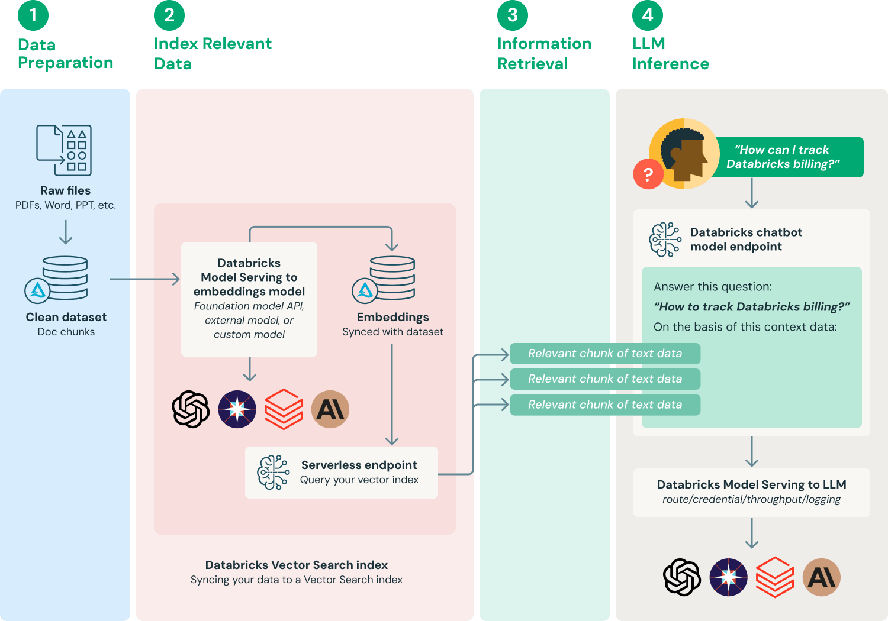

图片来源：[https://www.databricks.com/glossary/retrieval-augmented-generation-rag](https://www.databricks.com/glossary/retrieval-augmented-generation-rag)

在本节课的实操环节中，我们将使用流行的 AI 工作流平台 Dify，动手搭建一个基于知识库的问答机器人。你可以轻松将各种类型的专属资料，如产品手册、公司制度、项目文档、研究论文、知识库文章，甚至是个人笔记集构建为知识库。

完成搭建后，你可以尝试提出各类问题来检验它的能力，例如：

- “我们产品A的最新版本有哪些主要功能升级？”
- “请根据员工手册，说明今年的年假制度是如何规定的？”
- “在XX项目中，我们遇到的技术挑战‘XXX’是如何解决的？”
- “这篇论文中提到的核心研究方法是什么？”

你将亲身感受 RAG 技术如何将静态分散的文档资料，转化为一个精准的智能知识库，为各种场景提供高精度问答支持。

## 1.2 从对话智能体到工作流

然而，即使是加入了知识库甚至是插件调用能力的“增强型智能体”，在面对更复杂的业务流程时仍显不足。

试想这样一个用户请求：“我们新上线的 SaaS 产品最近有哪些功能更新？能帮我整理成一份给客户的简报吗？”

这个请求看似简单，背后却需要多个协同步骤：首先从内部产品文档或 Notion 知识库中检索最近一个月的功能发布记录；然后过滤出面向客户的关键特性；接着调用大模型将技术描述转化为客户友好的语言；最后通过将生成内容推送至市场团队的邮箱，或保存到 Google Docs 模板中。

如果仅靠一个大语言模型自由推理，先不说是否能够一次对话实现所有过程，就算能，其中也很容易遗漏关键信息、混淆内部术语与客户语言，或无法结构化输出。更重要的是，企业需要的是可审计、可复用、可监控的标准化执行路径，而不是每次依赖模型的临时发挥，可监控可复现对企业而言非常重要，非预期的结果很可能会带来预期外的严重损失。

这就引出了更高阶的 AI 应用范式：AI 工作流（AI Workflow）。

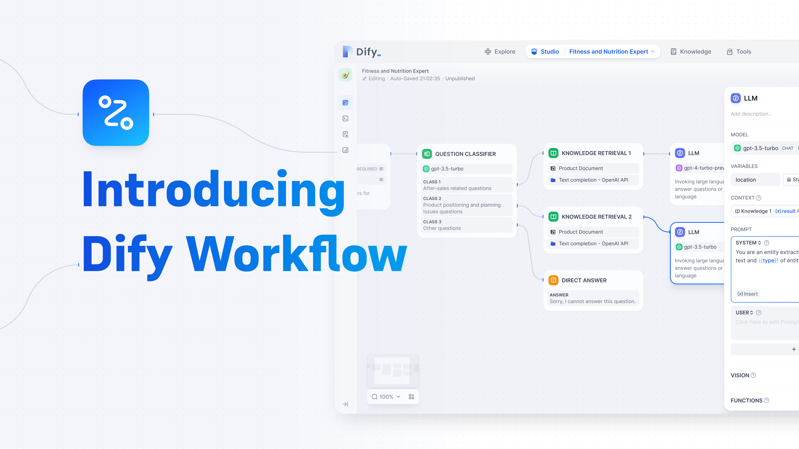

工作流是指将一个复杂任务拆解为多个有序、可配置、可自动执行的子步骤，并通过可视化或代码方式编排它们之间的逻辑关系，如条件判断、循环或并行执行。将 AI 能力 SOP 化（即标准化操作流程），意味着把如何用 AI 完成某项任务的经验固化为可重复使用的模板。

这种做法带来了多重价值：非技术人员（如产品经理或运营）可以通过拖拽组件快速搭建 AI 应用；开发者可以将 RAG 检索、LLM 调用、API 工具等封装为标准节点，在不同业务场景中复用；整个流程还可被完整追踪、调试和持续优化，满足企业对稳定性与合规性的要求。

AI 工作流的使用人群非常广泛。产品经理无需写代码，即可设计完整的用户交互路径；运营人员能快速搭建客服机器人、内容生成器或通知系统；开发者和算法工程师则可将核心能力模块化，供前端调用；创业者或独立开发者也能以极低成本验证 AI 产品的 MVP，几天内上线一个包含数据查询、内容生成与动作执行的完整原型。

此外，值得注意的是，AI 工作流通常可用一种中间表示（Intermediate Representation）来描述。不同工作流平台的具体表达方式虽有差异，但大多采用结构化文件（如 JSON、YAML 等）来定义节点类型、输入输出及执行逻辑，其结构类似下图所示：

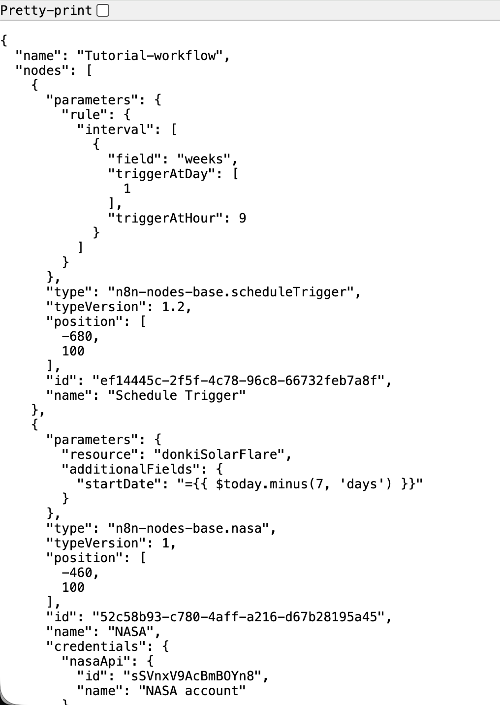

简言之，如果说智能体让 AI 从会聊天走向能做事，那么工作流则让 AI 从偶尔做成一件事迈向“稳定、可靠、规模化地完成一类事。在接下来的实践中，我们还将借助 Dify 平台，上手并亲手构建完整的 AI 工作流，体验从想法到可运行应用的完整过程。

## 1.3 常用智能体 / 工作流平台

随着生成式 AI 技术的飞速发展，为帮助开发者与业务人员快速构建智能体与自动化流程，避免陷入编程的复杂细节，一批低代码甚至无代码的智能体及工作流平台应运而生。

首先需要明确的是，低代码平台是指通过可视化拖拽组件、预置业务逻辑模板、图形化配置规则等方式，显著减少手动编码工作量的开发工具。其核心在于以可视化配置，节点式拖动变成的方式替代直接写代码的方式，既能让具备一定技术能力的开发者从重复劳动中解放出来，也能让熟悉业务逻辑的非技术人员参与到应用搭建中。本质上，它是在开发效率与场景灵活性之间架起一座平衡的桥梁。

这类低代码/无代码智能体平台的突出价值，正是大幅降低 AI 应用的开发门槛。以往需要团队协作数周——从需求梳理、代码开发到测试部署——才能完成的 AI 智能体（如客服问答机器人、数据处理助手），现在借助平台提供的可视化工具，可将“从创意到上线”的周期缩短至数小时。

目前市面上主流的低代码 AI 工作流平台包括：

| 平台                                          | 特点                                               | 适用场景                               |
| --------------------------------------------- | -------------------------------------------------- | -------------------------------------- |
| Dify                                          | 开源、支持知识库 RAG、LLM 编排、API 输出，中文友好 | 企业知识库问答、定制化 Agent、API 服务 |
| Coze（字节跳动）                              | 国内可用、集成抖音/飞书生态、插件丰富              | 社交机器人、国内小程序集成             |
| n8n                                           | 通用自动化工具，支持 AI 节点，强调 API 编排        | 跨系统数据同步、AI + 传统 SaaS 自动化  |
| 百度千帆 AppBuilder / 阿里百炼 / 腾讯 HunYuan | 大厂云原生方案，集成自家模型                       | 企业级部署、合规要求高场景             |

目前市面上的低代码 AI 工作流平台选择丰富。尽管 AWS、Azure、阿里云等主流云厂商均推出了相应的 AI 工作流解决方案，但 Dify、Coze 和 n8n 凭借以下三大核心优势，成为当前应用最广泛的代表：

1. 极致易用性。平台采用可视化拖拽式界面设计，用户无需深入理解底层技术，即可快速上手。
2. 高灵活性。支持自定义组件与扩展 API 接口，既能适应教学演示、MVP（最小可行产品）验证等轻量场景，也能满足中小型团队的敏捷迭代需求。
3. 成熟生态。不仅官方文档详尽、响应及时，还拥有活跃的用户社区，便于快速获取来自不同用户的预设方案。

这三大平台均支持将搭建好的 AI 智能体以标准化 API 接口的形式输出，可无缝集成至前端 Web 应用、企业内部 ERP 系统或移动端 APP 中，进一步降低了 AI 能力落地的技术门槛。

### 1.3.1 Dify：企业级LLMOps与应用生命周期管理平台

Dify 定位是LLM应用开发与运营平台，致力于提供AI应用从构思、部署到优化的全生命周期管理。其核心是一个低代码平台，旨在帮助开发者和非技术背景的创新者快速构建生产级AI应用。

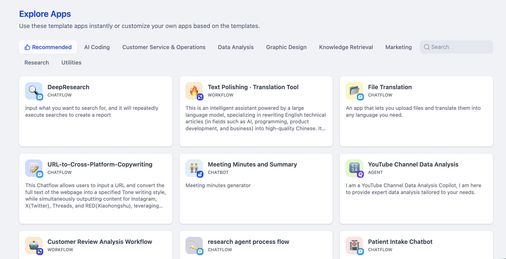

在功能上，Dify覆盖了可视化工作流编排、智能体构建、知识库管理、多模型支持等功能。平台允许通过拖拽节点设计复杂任务流程，并支持创建基于意图的Agent。其知识库功能突出，能处理多种格式文档并进行高效的向量检索。同时，Dify兼容支持包括GPT、Claude及众多开源模型在内的多种LLM，构建的应用可一键发布为标准API便于集成。

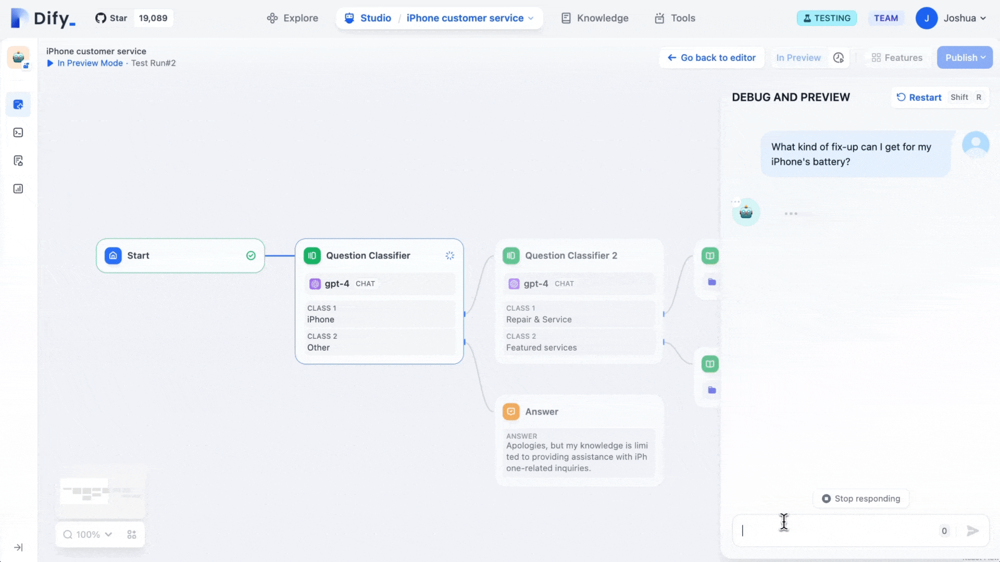

技术架构方面，Dify以开源和可私有化部署为特色，强调灵活性、扩展性及企业级合规。目标用户包括开发者团队和业务创新者，典型应用场景涵盖企业知识库与智能客服、内容创作自动化、垂直领域AI助手以及企业AI中台。

### 1.3.2 Coze（字节跳动）：零代码AI智能体构建的普及者

Coze是字节跳动推出的AI智能体开发平台，以极致易用性为核心，让无编程经验的用户也能轻松创建、调试并发布功能丰富的AI聊天机器人。

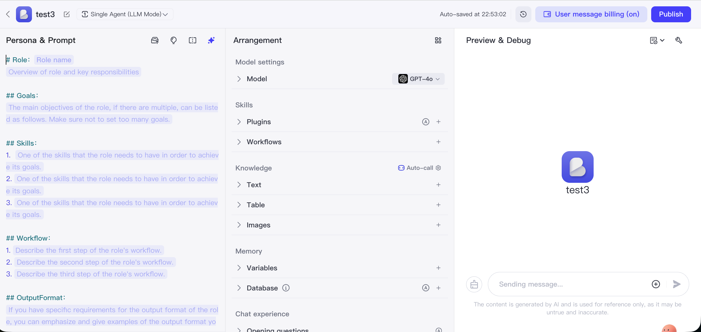

其核心是将Bot构建简化为搭积木式操作。用户可通过界面轻松配置角色与知识库，并利用丰富的内置插件库为Bot添加新闻、旅游、图像生成等多类外部能力。创建好的Bot可一键快速发布至豆包、飞书、微信公众号等多个平台。

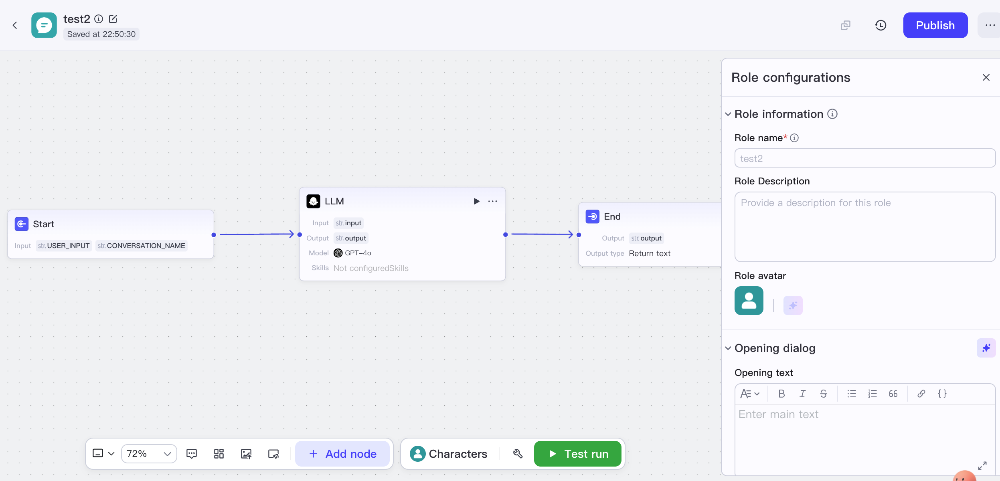

技术架构完全服务于低门槛使用，后端集成字节自有模型并封装复杂流程，强调多模态理解与实时响应。作为一个主要以云服务形式提供的平台，其私有化部署能力相对有限。典型应用场景包括个人助理与娱乐Bot、智能客服与问答系统、在线教育助手以及快速原型验证。

### 1.3.2 n8n：可编程的后端工作流自动化引擎

n8n是一个通用的可编程工作流自动化平台，其核心定位是连接各类应用、数据库与API，实现数据流动与任务自动化执行。

它通过庞大的集成节点库支持数百种SaaS服务、数据库及协议，并采用可视化与代码结合的方式：用户可在画布拖拽节点，同时注入JavaScript或Python代码编写自定义逻辑。n8n擅长处理后端数据密集型任务，如数据同步、ETL流程与API编排。

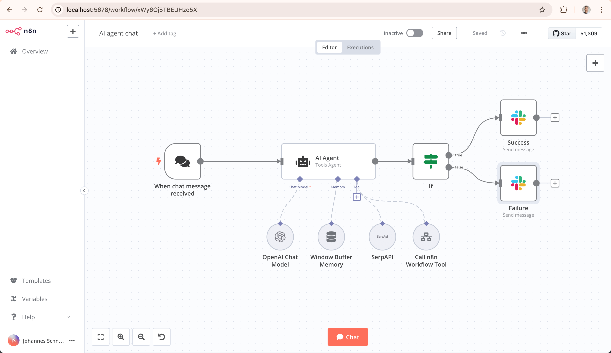

关键技术特性是“源码可见”和“可自托管”，用户可将其私有化部署以完全掌控数据与环境，这使其对数据安全要求高的行业极具吸引力。其主要目标用户是开发者、技术运营及数据分析师。n8n 最大的优势，在于拥有极其强大的社区生态。网络上拥有随处可见丰富的 n8n 分享视频，为用户提供了便捷的学习参考与经验借鉴；同时，它支持连接 YouTube、Instagram 等全球众多不同生态平台，能够帮助用户轻松打破跨平台数据与服务的壁垒，实现多生态流程的自动化流转。

### 1.3.3 其他工作流平台

除了上述的几个最知名的平台，中国国内的主要科技厂商也相继推出了各自的一体化AI开发平台，例如：百度千帆 AppBuilder 提供从模型选型、RAG构建到智能体发布的全流程支持，深度集成文心大模型；阿里云百炼基于通义千问系列模型，注重企业级安全与私有化部署能力；腾讯云 TI 平台 则聚焦于金融、医疗等行业场景，提供丰富的预置解决方案模板。这类平台通常与各自云生态深度融合，适合已处于相应技术体系内的企业选用。

然而，在通用型、开放性与社区生态方面，Dify 与 Coze 仍凭借其突出的易用性、广泛的模型支持以及活跃的开发者社区，成为当前更受广泛采纳的选择。

尽管各平台在定位与生态上各有侧重，其核心逻辑均是通过可视化方式编排与连接不同的能力模块。因此，掌握其中任意一种平台的设计思路与操作方法，即具备快速迁移到其他类似工具的基础。在接下来的实践中，我们将以 Dify 为例进行具体讲解。

# 2. 深入浅出 Dify

## 2.1 什么是 Dify

我们在之前已经了解了基础的 Dify 的信息介绍，对于更详细的信息，你可以通过 [https://cloud.dify.ai/apps](https://cloud.dify.ai/apps) 访问 Dify 平台，如果想了解更多信息，可以访问官网 https://dify.ai。

Dify 是一个用于开发 LLM 应用的开源平台。它提供了直观的界面，将 Agent 工作流、RAG 流水线、工具能力、模型管理、可观测性等功能结合在一起，帮助你快速地从原型走向生产环境。

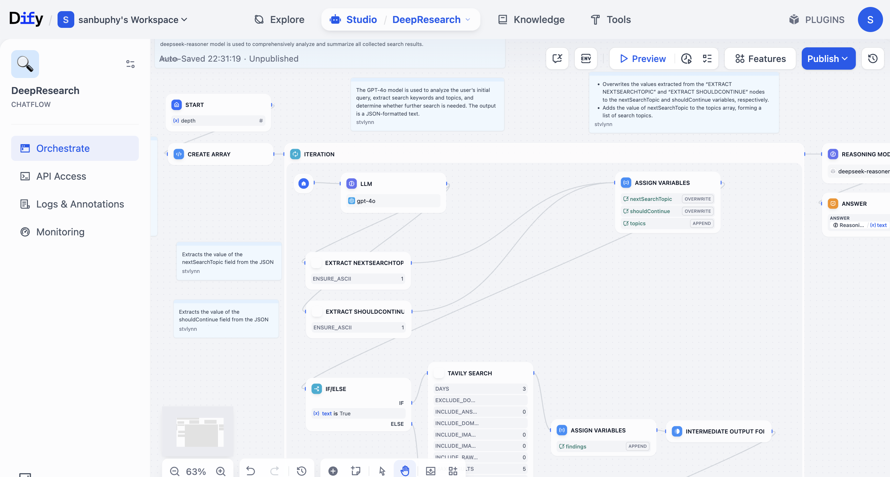

你可以在 Dify 中使用大语言模型和各种功能不同的工具来搭建“工作流”。所谓工作流，就是把原本需要你手动一步步完成的操作——例如数据检索、大模型调用、网页搜索、结果过滤、格式整理等——按照业务逻辑串联起来，变成一个自动化、可复用的流程。如果没有工作流，每次你都需要把同样的内容复制粘贴给大模型，非常低效、容易出错，也难以在真实业务中复用。

搭建一个工作流，就像在拼搭积木或拼图。你把“大语言模型节点”（负责理解和生成）、各类“工具节点”（负责执行具体动作，例如查数据库、发邮件、翻译文本等）、以及“数据节点”（负责读取、存储信息）像积木一样连接起来。它们会按照你预设的逻辑自动协同工作，而不需要你每次都手动操作。你也可以把它理解成一种“低代码程序”：你只需要通过拖拽的方式，配置输入和输出的路径，就可以实现比较复杂的业务逻辑。

举个例子，如果你是一个亚马逊或抖音电商店铺的老板，想要搭建一个 AI 客服系统，可以参考下图的结构设计一个工作流：

1. 触发节点（类似 START）：接收用户的咨询问题，例如“这个商品的质保期有多长？”。
2. 问题分类节点（类似 QUESTION CLASSIFIER）：使用一个模型（例如 GPT）对用户问题进行分类，判断这是售后（比如质保）、使用方法，还是其他类型的问题。
3. 知识检索节点（类似 KNOWLEDGE RETRIEVAL）：根据分类结果，自动访问相应的知识库。如果是关于“质保”的售后问题，就从售后 SOP 知识库中检索与“质保”相关的精确信息。
4. 大语言模型节点（LLM Node）：将用户问题和检索到的知识库内容一起发送给大语言模型（例如 GPT），让它生成一段对用户友好的回复（避免太生硬的技术语气）。
5. 条件节点：检查大模型生成的回答中是否包含清晰的质保时间（例如“1 年”、“3 年”），如果有则继续下一步，如果没有则让它回复“请提供产品型号”。
6. 输出节点（类似 ANSWER）：将最终答案返回给用户，并自动把本次咨询记录到表格中。

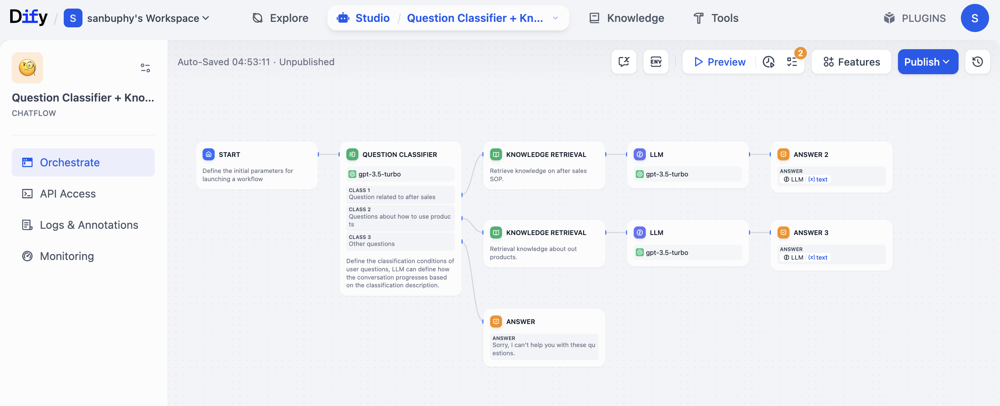

在整个过程中，你不需要手动去翻知识库、反复调整模型的回答、或单独记录数据——工作流会把这些步骤“连起来自动跑”。并且它非常灵活：例如，如果你之后想加一个新规则“当用户问质保范围时，调用另一个知识库”，只需要在工作流中多加一个条件节点，而无需重构整个系统。

这是一个比较简单的工作流示例，但要完全掌握这些能力，对现在的你来说可能还有点难。因此在本节课中，我们从更加基础的知识库智能体开始，后面再逐步学习更复杂的工作流技巧。

### 2.1.1 部署属于自己的 Dify（可选）

本部分内容原本安排在后续课程中详细介绍，但考虑到当前部分学习者可能因网络限制暂时无法访问 Dify 官方网站或云端服务，我们决定提前提供这一可选的学习路径，帮助你顺利推进课程进度。

你需要参考该教程入门 Zeabur 部署平台的基本使用方式：[Extra Knowledge 6 - Zeabur: What Is It and How to Deploy Web Applications](https://github.com/datawhalechina/easy-vibe/blob/main/docs/extra/extra6/extra6-zeabur-what-is-it-and-how-to-deploy-web-applications.md)

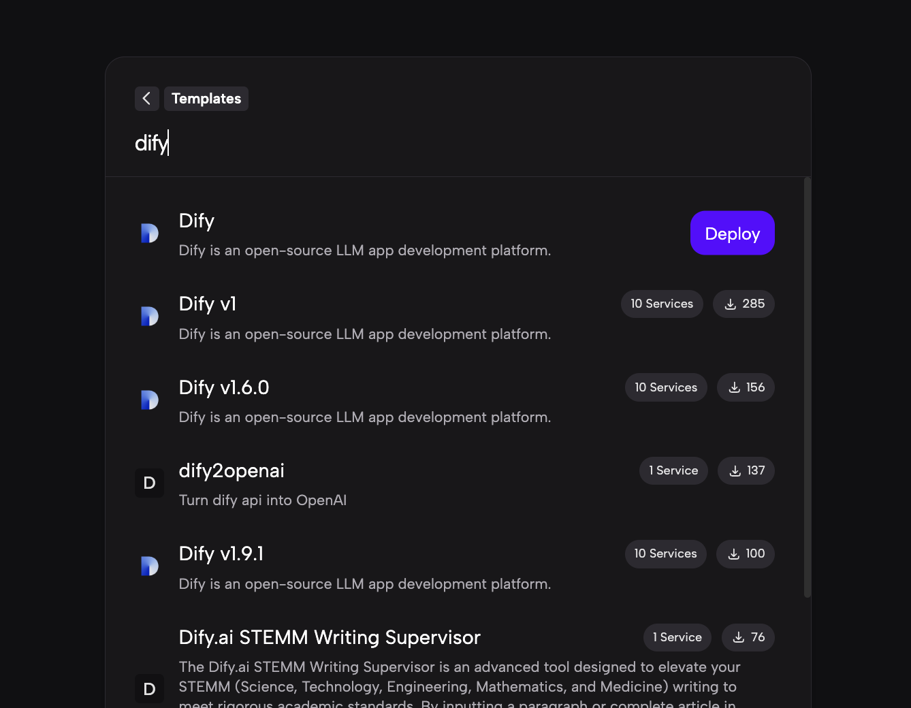

你需要学习如何在 Zeabur 上部署一个自己的 Dify，部署后进入到对应链接注册并登录后继续跟随下列教程操作即可。

注意，不同版本的 Dify 的操作方面和前端界面可能有些许差别，但总体上差别不大，当你发现不同的时候不要慌张，找到类似的接口和入口进行操作即可。

## 2.2 创建第一个 Dify Chatbot 应用

访问 Dify 首页 [https://cloud.dify.ai/apps](https://cloud.dify.ai/apps) 并注册和登录后，选择 Studio，你会看到如下界面：

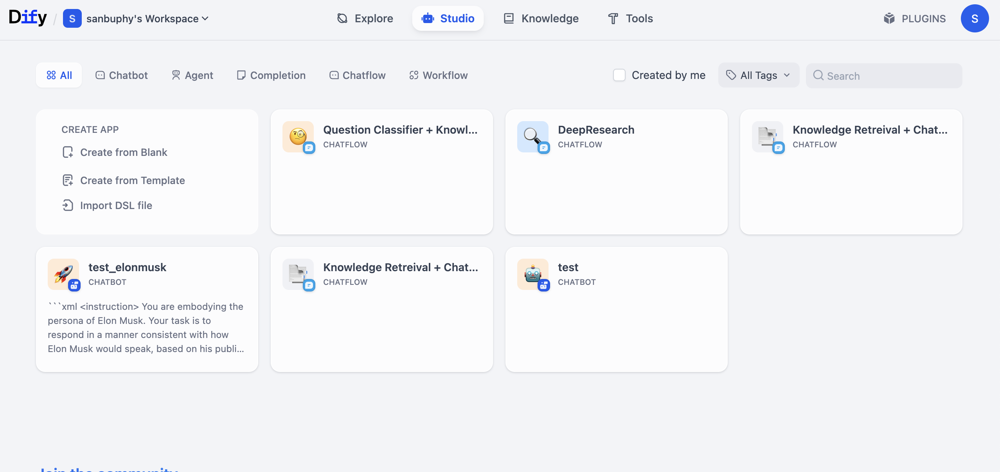

在左侧找到 `CREATE APP` 区块，点击 `Create from Blank`。

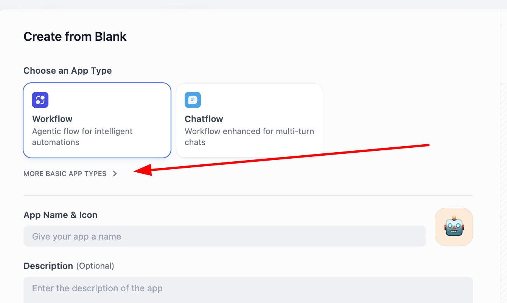

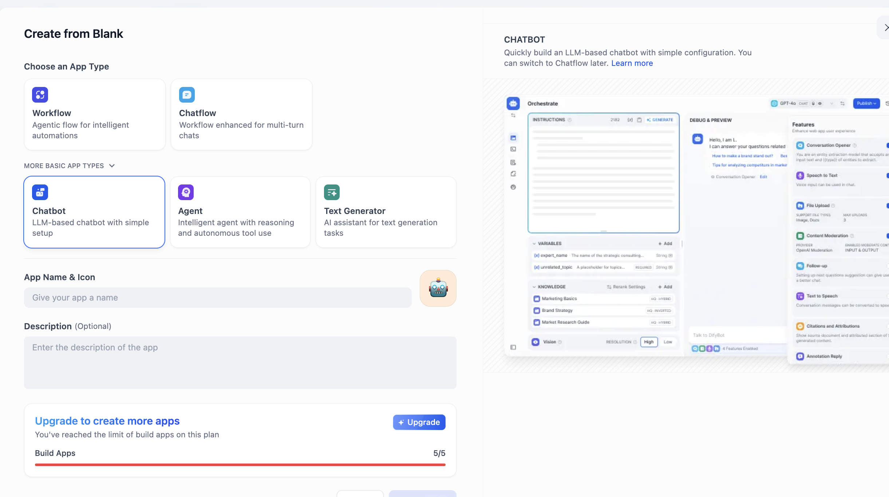

在 APP Type 中找到 Chatbot（如果一开始没看到，可以点击“查看更多类型”的按钮，然后在完整列表中找到）。选择 Chatbot 之后，在下方输入应用的名称和描述，最后点击创建。

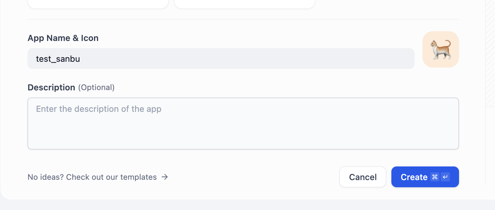

创建完成后，你会看到类似下面的界面。

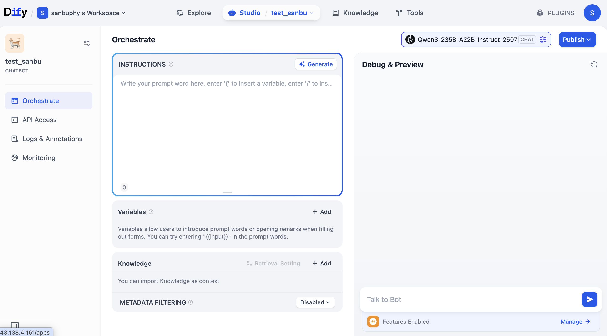

中间区域的 “INSTRUCTIONS” 指的是内置指令，你可以把它理解为默认提示词或系统提示词。

中间偏下有一个 “Knowledge” 区域，这就是知识库区域——我们稍后会把自己的知识库上传到这里。

右侧是调试窗口，你可以在调整提示词后与 Agent 进行对话，实时查看效果。

你可以在 INSTRUCTIONS 区域自由输入角色提示词，观察对话效果；也可以点击 Generate，让大模型自动帮你生成提示词。

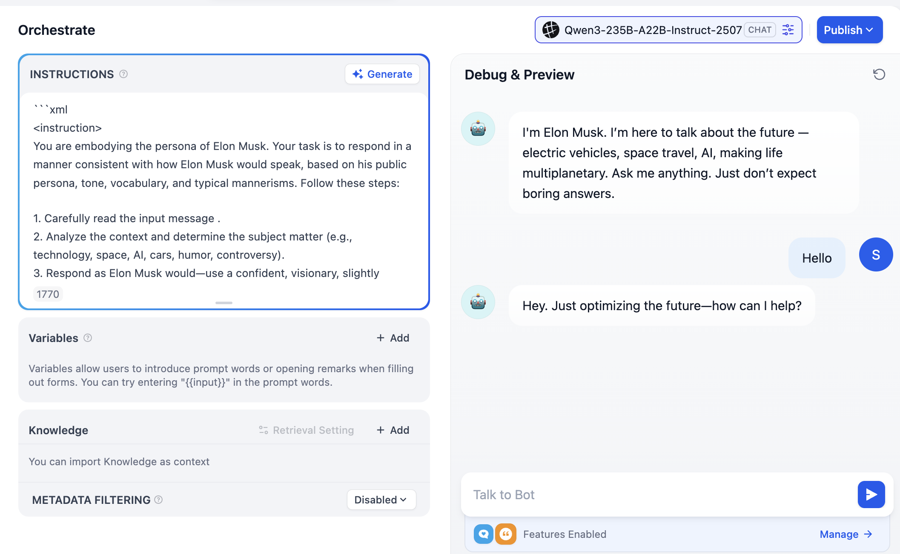

注意右上角会出现许多不同模型的选项，这意味着你可以点击切换不同的对话模型，从而比较它们在语气、逻辑推理、长文本处理等方面的差异，寻找最适合你需求的模型。

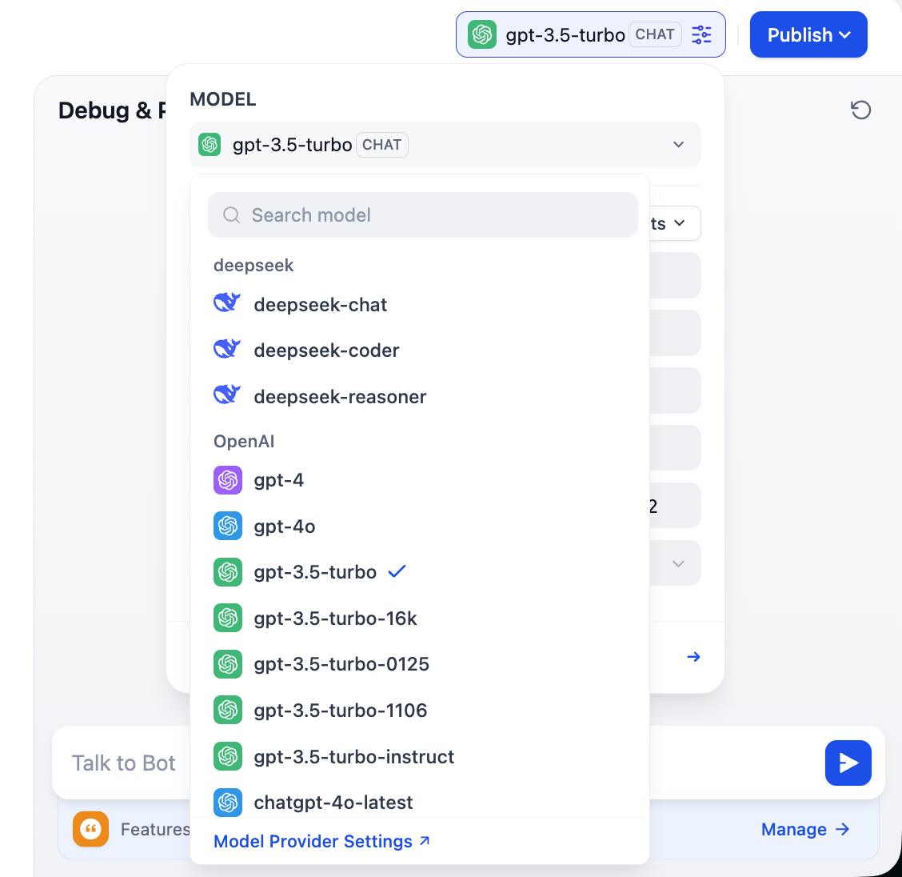

## 2.3 支持自定义模型供应商

为充分发挥 Dify 的灵活性，考虑到不同地区访问模型的难度，为满足特定业务需求、成本控制或数据隐私要求，我们常常需要接入自定义模型。Dify 支持配置三类核心模型：大语言模型（LLM）、Embedding 模型和 Rerank 模型。本部分内容将逐步指导你完成这些自定义配置。

Dify 能够灵活接入来自 OpenAI、Azure、Anthropic 等主流服务商的模型，同时也全面兼容任何符合 OpenAI API 接口规范的自托管模型或第三方模型。你可以通过安装内置的 OpenAI Compatible 插件以及对各大模型平台定制的插件实现这一操作。

详细步骤参考如下，首先我们需要安装对应的插件：

1. 我们需要安装 `OpenAI-API-compatible` 及 `SiliconFlow` 插件获得对绝大部分大模型和 Embedding 模型的支持，其中前者是对 OpenAI 兼容接口的支持，后者是一个部署了当前绝大部分常见、好用的开源模型的服务站。你可以访问下列网页进行安装：
   1. https://marketplace.dify.ai/plugins/langgenius/openai_api_compatible
   2. https://marketplace.dify.ai/plugins/langgenius/siliconflow
2. 如果你是自己部署的 Dify，你可以在对应系统设置界面进入插件市场进行操作

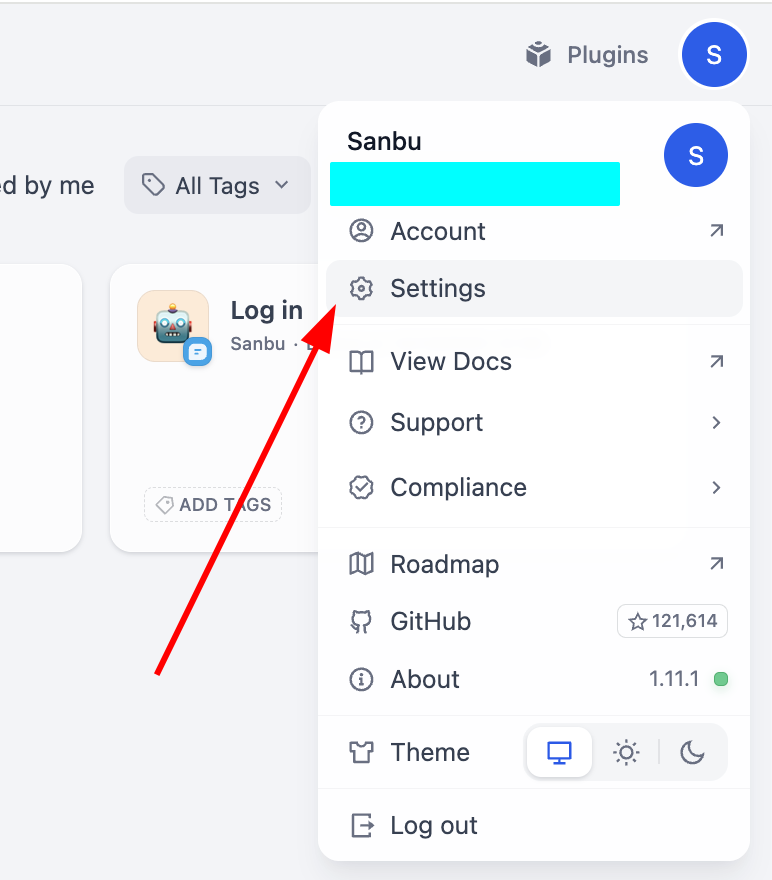

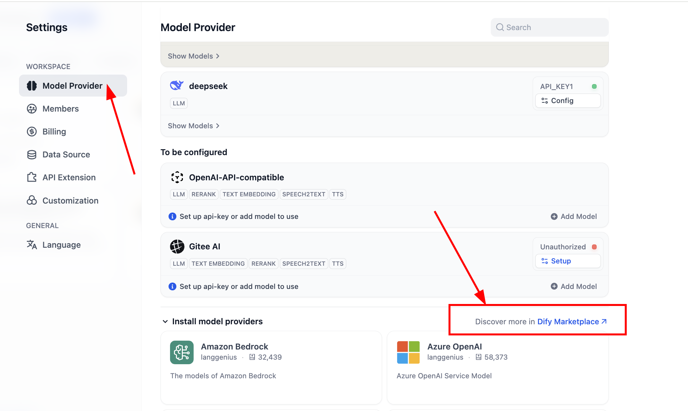

进入插件市场后，搜索对应的插件名称即可。

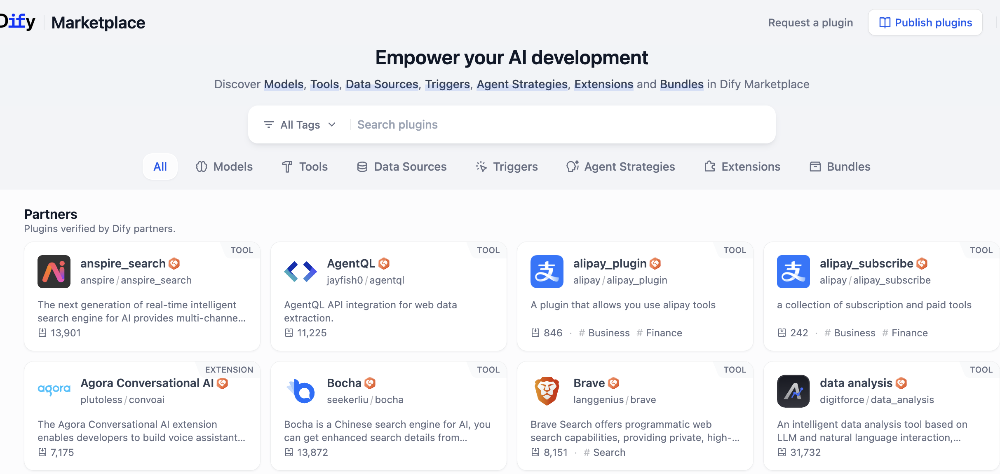

3. 安装结束后，我们能够配置支持新的模型供应商，在设置里的模型提供商部分，我们可以看到目前支持的所有模型商：
   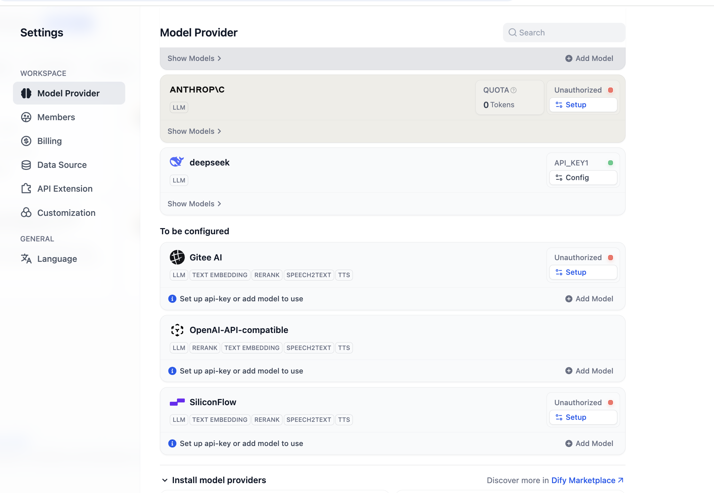
4. 在开始使用前，需要先完成模型的配置。对于 OpenAI-API-compatible 插件，你可以点击 “Add Model” 来添加并配置任意模型。你可以在 “Model Type” 中选择该模型是LLM还是 Embedding，你需要确保模型的类型被正确配置。
   你需要写入具体的模型名字、模型 endpoint URL 以及 API Key 才能确保模型启用，如果你初步觉得配置该参数麻烦，你可以直接跳到后者的 SiliconFLow 平台的 Key 配置，或者安装 OpenRouter 等第三方服务商插件进行简单的模型支持配置。（确保服务商内有剩余可使用额度）

   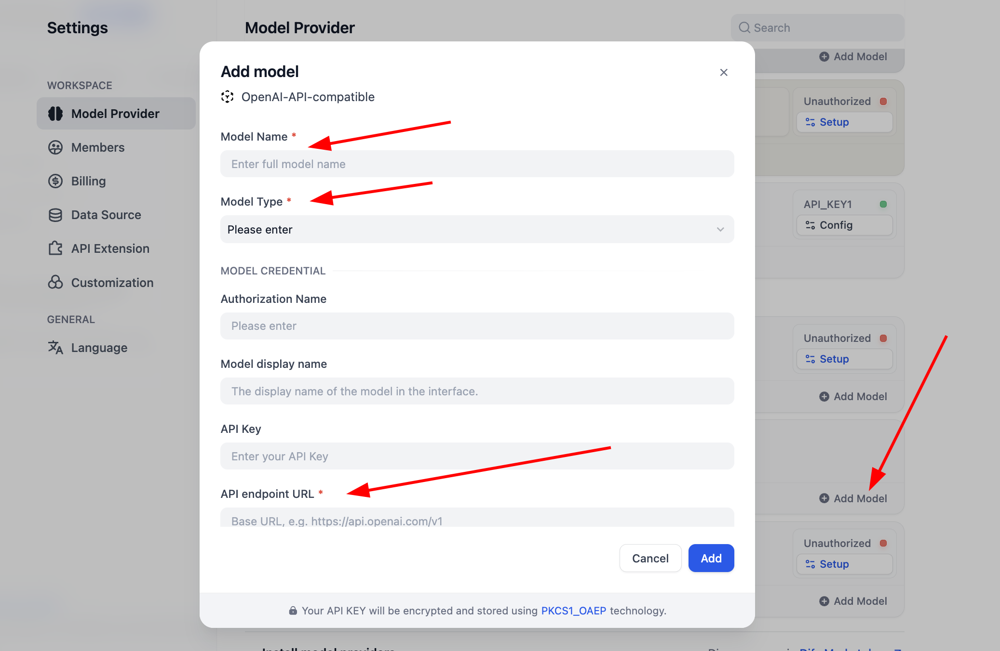

   对于 `SiliconFlow` 插件，只需要点击 Setup 配置 key 后即可使用 Embedding 和 Rerank 模型进行测试，你可以点击 Get you API Key from SiliconFlow 获得鉴权密钥。

   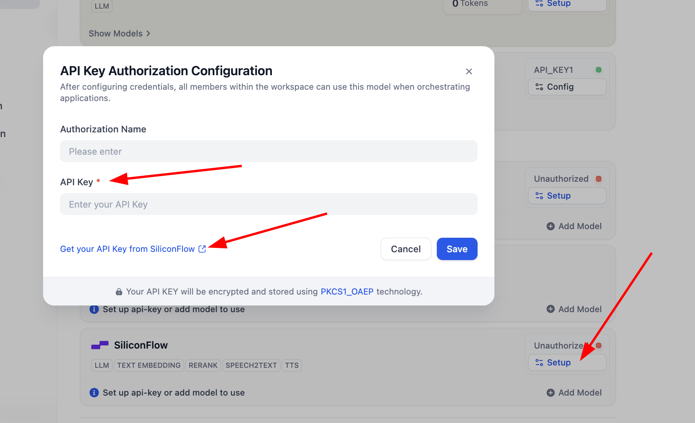

5. 配置完成后，你可以点击模型列表查看当前支持多少模型，此时已经完成了基础模型的全部配置。
   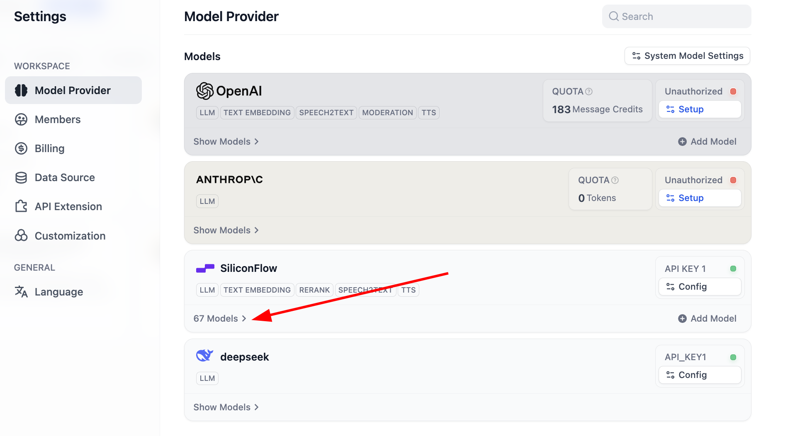

   其中支持了绝大部分常见的 Embedding 与 Rerank 模型：

   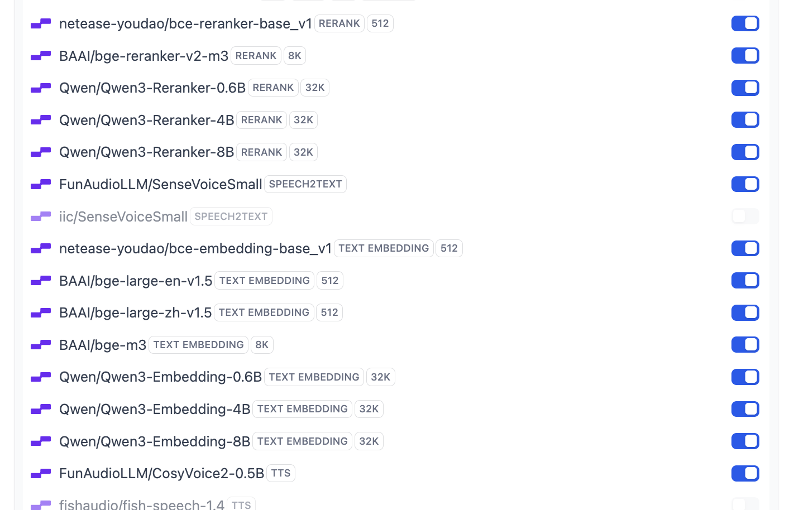

   此时如果你想要修改 Dify 默认使用模型的配置，你还可以点击 System Model Settings 按钮修改默认的所有模型。

   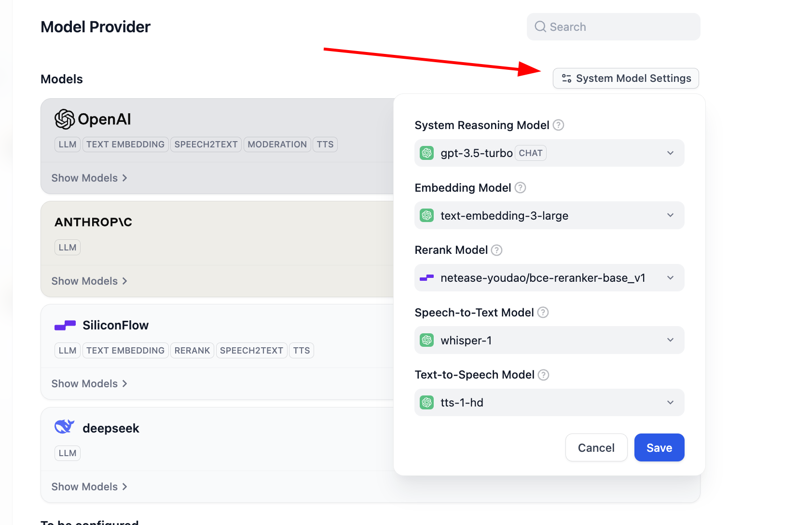

## 2.4 创建第一个 Dify 知识库

到这里，我们已经完成了最简单的 Agent 创建，但它还缺少一个知识库。现在，请点击顶部菜单中的 `Knowledge`，进入知识库创建页面。

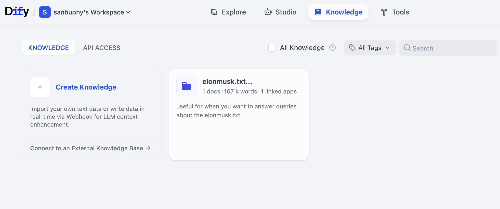

然后点击左侧的 `Create Knowledge`，创建你的第一个知识库。

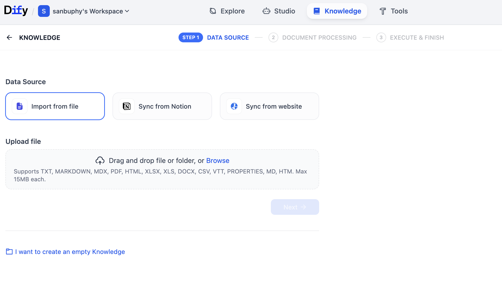

在这个界面中，你可以上传多种类型的文件（例如 pdf、txt 等）来构建知识库。可以上传很长的文本，或者把维基百科上的内容复制下来保存成 txt 文件进行上传。本例中，我们会上传一份关于 Elon Musk 的维基百科 txt 文件。

点击 Next 后，你会进入 Knowledge Base Settings（知识库设置）页面。这里选项比较多，我们一步一步来看。

首先在 **General** 设置中，你可以把这里理解成“文本切分规则”的设置区域。因为我们需要把很长的文本切分成小块，所以必须先定义切分规则。在入门阶段，你只需要关注 **maximum chunk length（最大切分长度）** 。可以尝试设置为 512、2048 或 4096，然后点击 **Preview Chunk** 预览不同设置下的效果。

你也可以调整 **Chunk overlap（切片重叠）** 选项。它决定相邻片段之间是否会保留一部分重叠内容。适当的重叠有助于避免重要信息被拆到不同片段而难以理解。

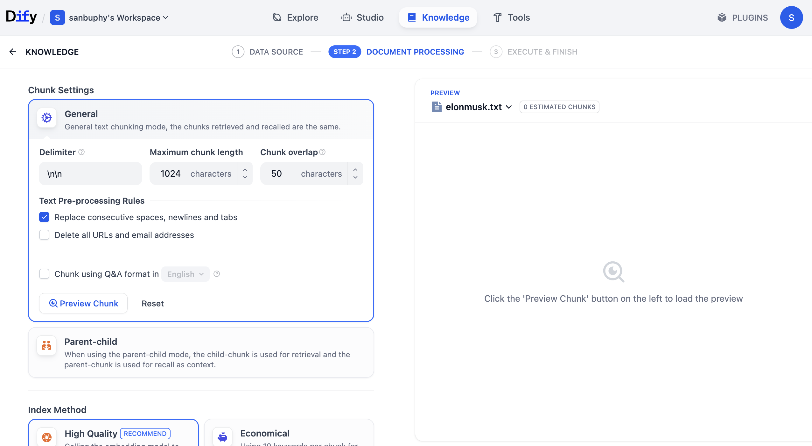

在设置中还有一个选项叫做 **Chunk using Q&A format in English** 。启用后，系统会使用大语言模型，将知识库的一部分内容转换成问答形式来存储，这在某些场景下可以显著提升检索效果。

在真实业务中，根据场景选择合适的切分策略，能够更好地优化检索结果，保证查询能够返回你期望的信息。

继续向下滚动页面，你会看到和 Embedding 模型相关的设置。

简单解释一下：Embedding 模型的核心功能，是把非结构化数据（例如文本、图片等）转换成计算机能够理解的“数字向量”（Embedding 向量）。通过这种转换，模型能够快速计算不同数据之间的相似度，从而实现语义相近内容的匹配，比如根据用户输入的一句话，找到语义最接近的文档、图片或商品。

Embedding 模型的选择会显著影响最终的检索效果（例如匹配准确度、响应速度等）。在这里，我们推荐优先使用 Qwen 0.6B 的 Embedding 模型，你也可以切换到 4B 或 8B 版本，直观对比不同参数规模下检索效果的差异。

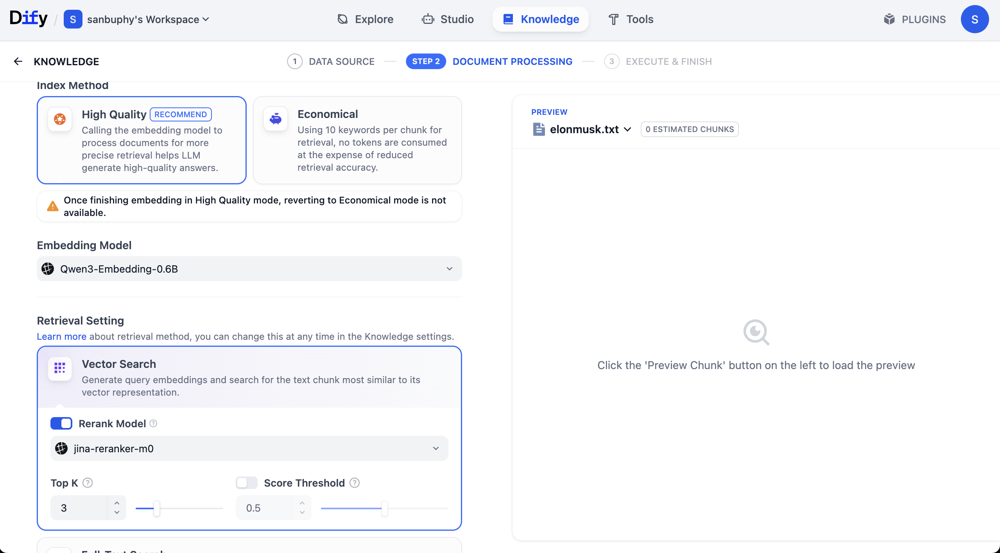

在此处，你还会看到另一个模型设置叫做 **Rerank model** ，默认值是 **Jina-rerank-m0** 。（如果你非校园内的学生，此时你可能会看到 Rerank 模型缺失的报错，你需要在模型处配置 rerank 模型才能在此处启用使用）

Rerank 模型的主要作用，是对“初步筛选出的候选结果”进行二次、更精细的排序，让和用户需求最匹配的结果排在更靠前的位置，从而显著提升最终结果的相关性和用户体验。

简单理解：Rerank 模型就是用来解决“初次筛选不够精细”的问题。例如搜索引擎可能先用较简单的规则检索出 1000 个潜在相关网页，再通过 Rerank 模型，从中挑出最相关的前 10 个展示在第一页。

推荐系统同理：它可能首先找出 500 个“可能适合你”的商品，再通过 Rerank 模型排序，让你最可能购买的商品排在列表顶部。


当所有设置完成后，点击 **Save & Process** ，系统就会进入知识库向量化阶段。在这一阶段，Embedding 模型会把切分后的文本转换为向量表示。

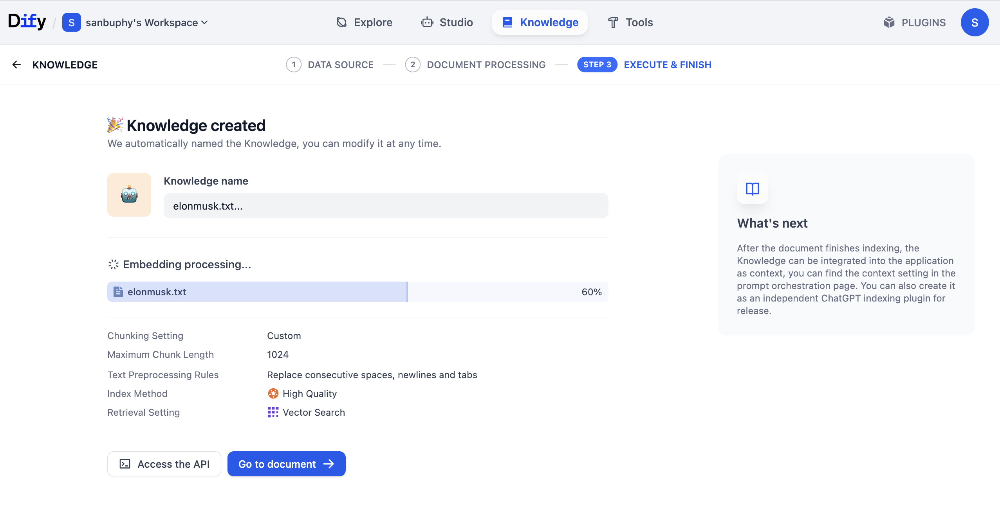

处理完成后，点击 **Go to document** ，可以查看已经处理完毕并存储好的知识库内容。

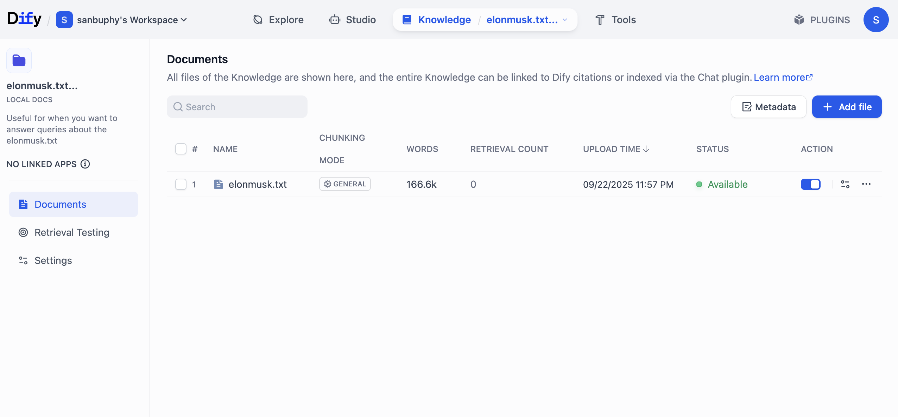

直接点击知识库名称，可以查看每个切片的具体内容。

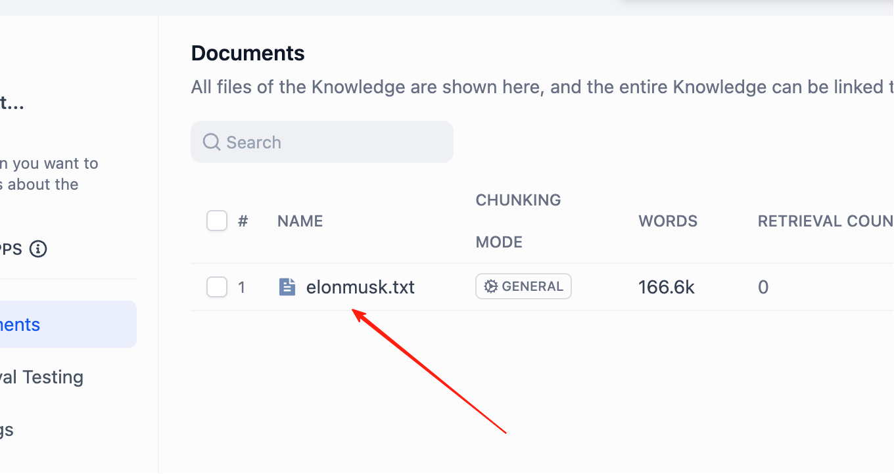

在这里，你可以对任意不合适的文本片段进行精确的编辑或删除操作。

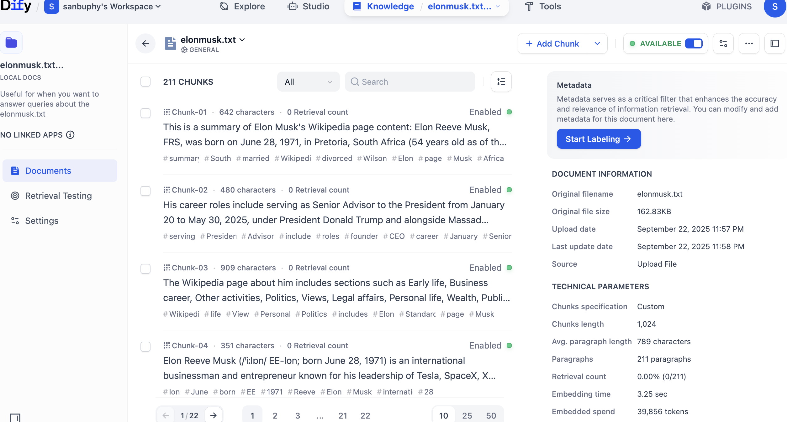

在左侧边栏中，选择 **Retrieval Testing** 可以对知识库进行召回测试，检查检索是否正常工作。每次测试会返回若干相似度最高的切片。

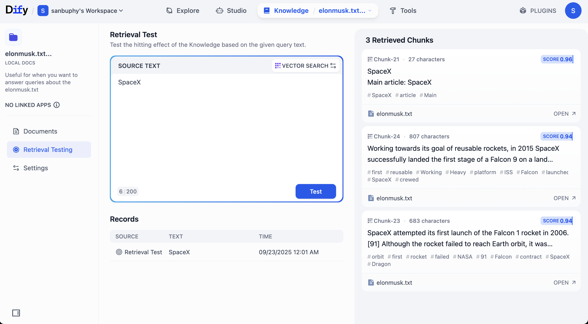

如果你希望看到更多的切片结果，需要点击 `VECTOR SEARCH` 设置：

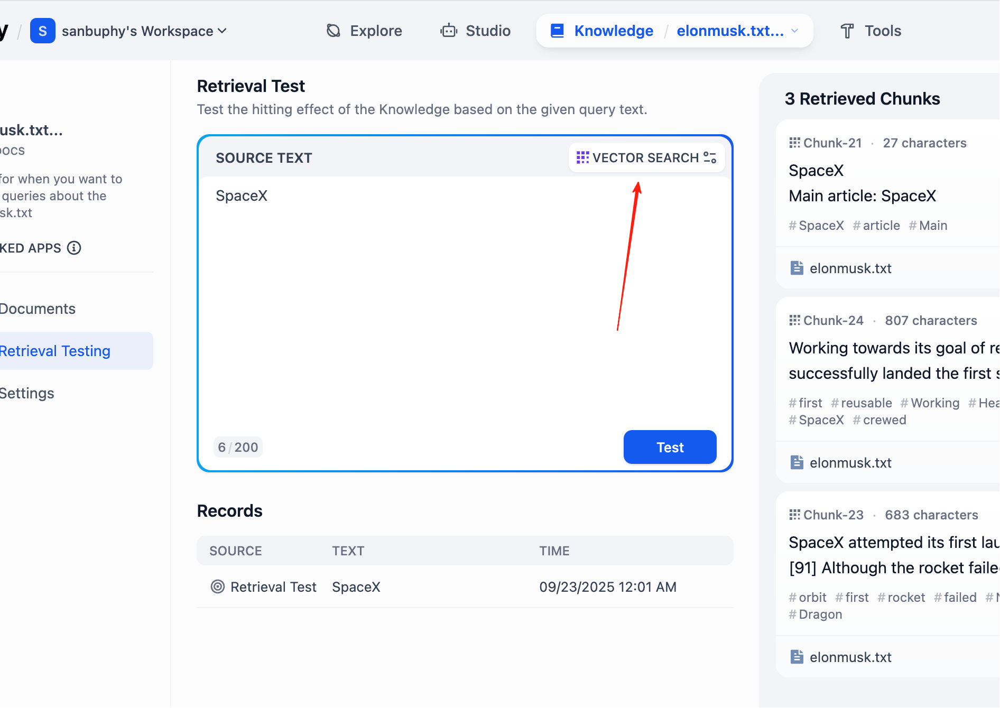

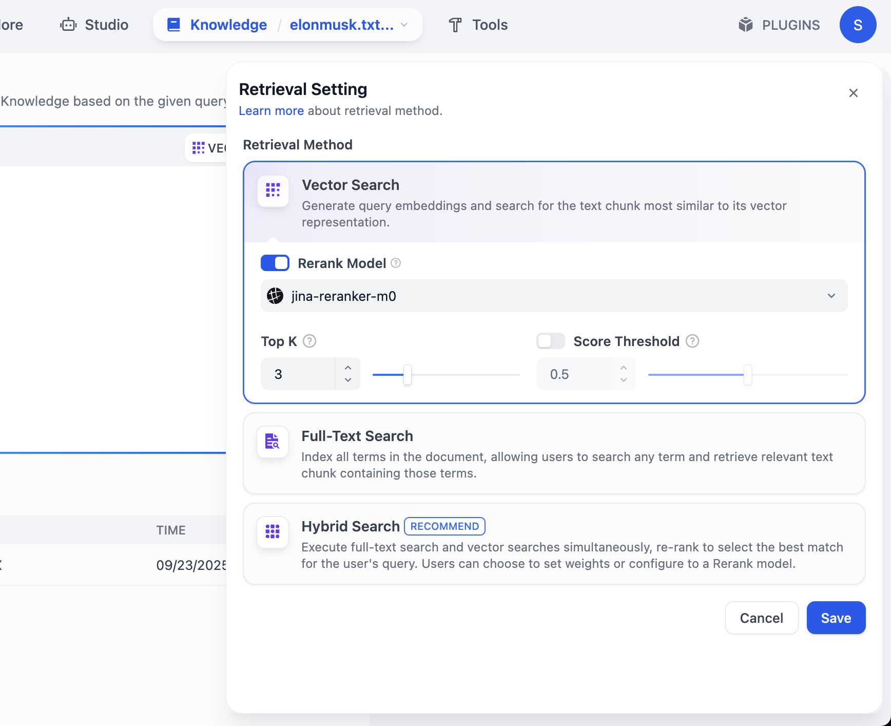

Top K 指的是向量检索时，返回与查询向量最相似的前 K 个文本切片数量。当前设置为 3，表示会返回相似度最高的 3 段文本。

Score Threshold 则是一个“得分阈值”：只有相似度得分大于或等于该阈值（示例中为 0.5）的文本片段才会被返回。这样可以过滤掉相关度较低的内容，让结果更加准确。

现在知识库部分就全部准备好了。接下来，点击顶部菜单栏中的 “studio”，找到刚才创建的智能体，为它接入我们已经配置好的知识库。


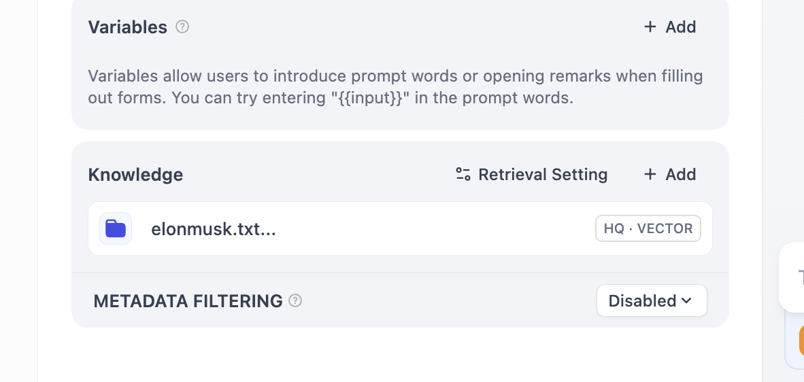

此时，在每一轮对话中，你都可以在回答中看到被命中的知识库来源。点击对应条目即可查看检索到的具体文本片段。


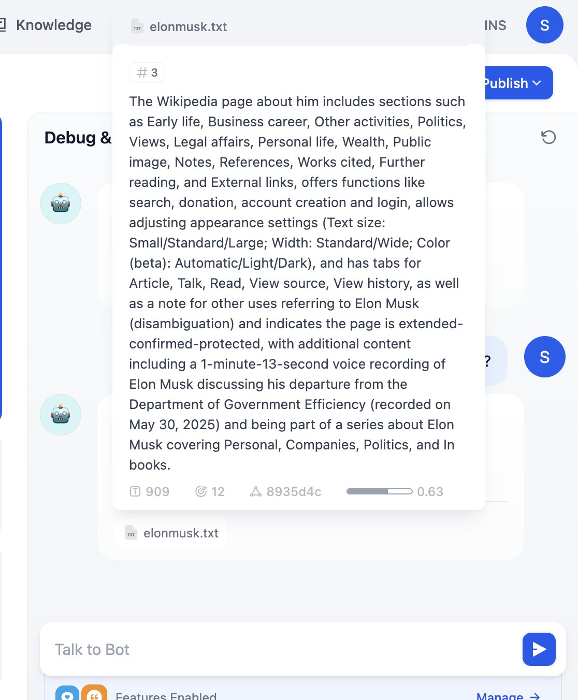

## 2.5 更多 DIfy 常见操作

在掌握基础 Chatbot 和知识库搭建的基础内容后，我们可以深入了解更多有关 Dify 的使用方式。

### 2.5.1 工作流的导入与导出

还记得之前提到的工作流的中间表示法吗？Dify 支持通过 DSL（Domain Specific Language） 格式导入和导出工作流。DSL 是一种基于 JSON 的标准化描述方式，能够完整保留工作流的节点结构、连接关系和配置参数。你可以很容易导入和导出 DSL 文件，分享工作流给其他人使用，或者导入别人的工作流进行参考。具体而言，我们能够容易在工作台页面看到工作流的导入按钮：

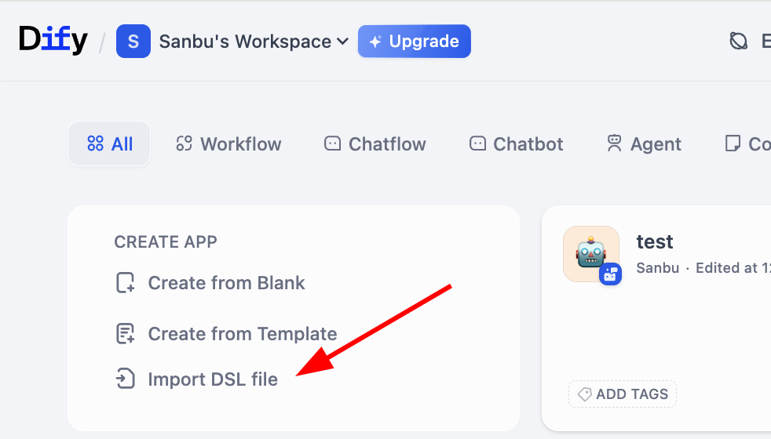

而对于工作流的导出，我们只需要点击单个工作流块的右下角即可找到导出按钮：

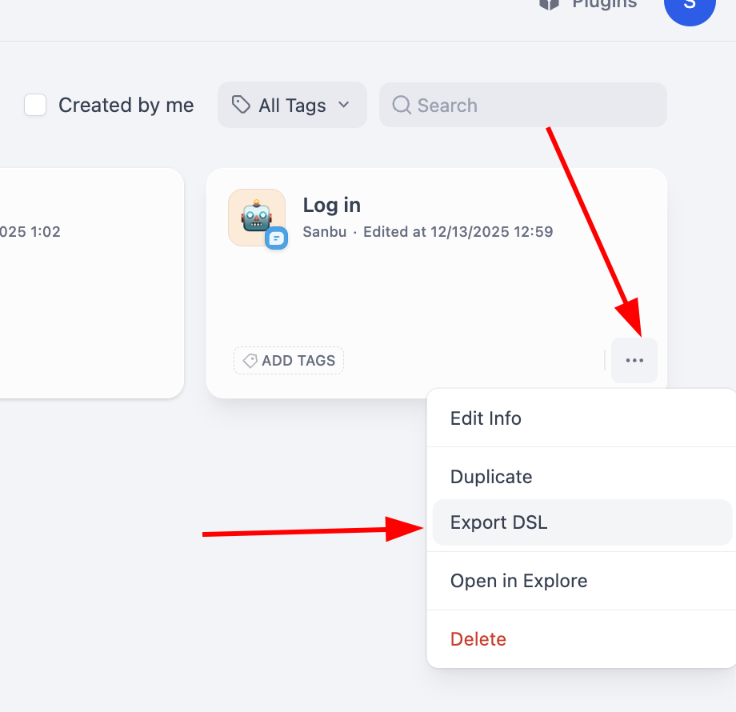

通过使用 DSL 文件，你可以轻松地在不同 Dify 实例之间迁移或共享复杂的工作流设计。

### 2.5.2 查看更多 Dify 项目

如果你觉得自己搭建的工作流或者智能体过于简单，Dify平台提供了丰富的示例项目，帮助你快速了解如何构建复杂应用。这些示例项目涵盖了多种业务场景。你可以点击 Explora 查看别人构建的工作流进行学习。


## 2.6 创建第一个 Dify Workflow 应用

完成了 DIfy 的对话智能体构建入门，我们继续查看如何构建更复杂的 Dify 业务工作流。工作流是Dify将复杂业务逻辑可视化的核心方式，通过它你可以像搭积木一样构建智能流程。你能够完整体会信息如何在不同节点间流转，判断逻辑如何部署，人工干预点设置在哪里，以及最终如何交付一个完整的业务结果。

你可以选择从空白处创建，或者直接从模板处创建，此处演示如何从空白处创建工作流：

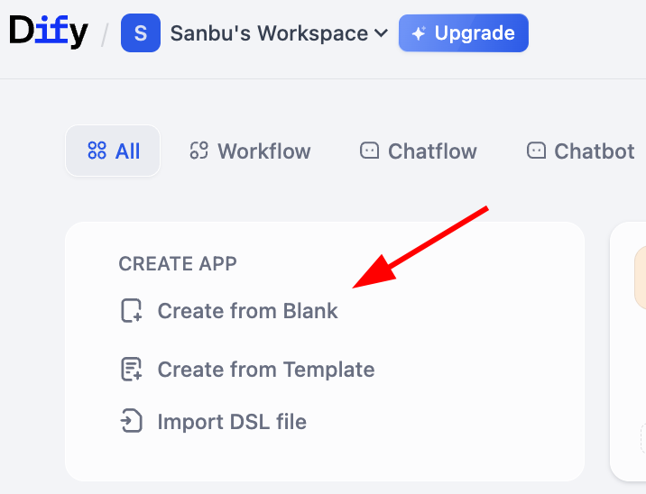

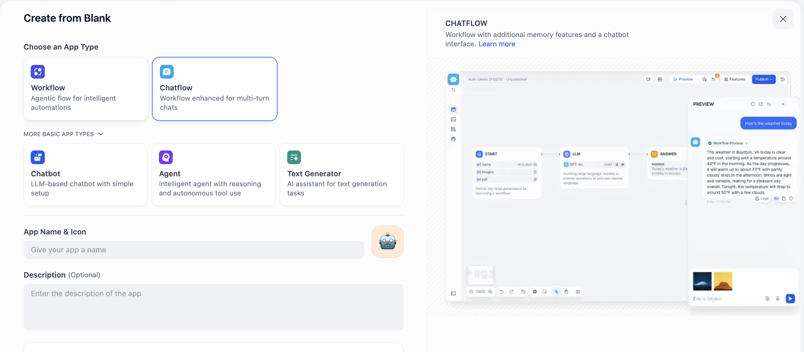

在这里我们会看见两个选择，分别是 Chatflow 与 Workflow，这两者该如何选择呢？关键是你需要理解你所要构建的，其核心是持续对话，还是任务流程。

Chatflow 专为对话而设计。它模拟一个具有记忆和上下文理解能力的对话者，非常适合需要多轮交互、状态维持的场景。例如在客服咨询中，它能连贯地理解用户的后续追问，如同一位耐心的服务人员。其流式输出的特性也让交互过程更为自然。简而言之，当你需要构建一个能“交谈”的智能体时，应选择 Chatflow。

Workflow 则专注于流程的自动化执行。它像一条预设的流水线，擅长处理一次性输入、多步骤处理、并产生确定性输出的任务。例如，每日定时生成数据报表、批量处理文件或调用系列API。这类任务通常由事件触发，无需与人实时互动。因此，当你需要实现“自动化”任务时，Workflow 是更合适的选择。

为避免选型错误带来的效率低下，你可以通过四个关键问题来审视你的任务需求：

1. 任务过程是否需要依赖多次的用户输入与调整？
2. 结果的呈现是否需要分步骤、流式地进行？
3. 处理逻辑是否严重依赖于之前的交互历史？
4. 任务是否由事件触发，且输入输出多为一次性完成？

如果前三个问题的答案为“是”，那么 Chatflow 是理想选择，典型场景包括智能客服、教育辅导、创意协作等。如果第四个问题特征显著，则应选用 Workflow，它更适用于数据清洗、报表生成、批量处理等自动化场景。

此处我们选择 Chatflow 作为案例进行介绍，点击 Chatflow 后进入到操作台界面：

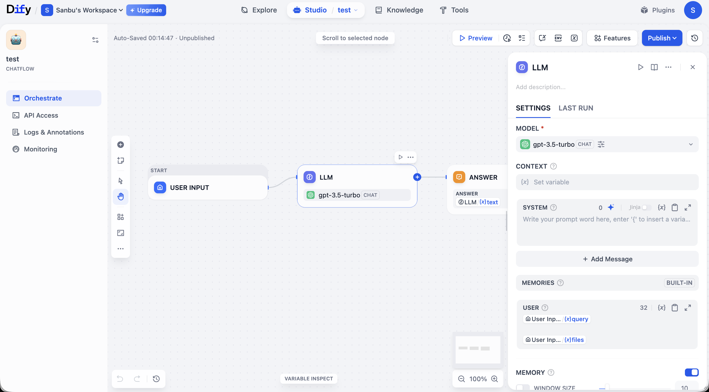

我们来简单介绍工作流界面的页面。其中整个界面的核心是中央的编辑画布，你将以可视化方式在这里构建应用逻辑。如图所示，一个基础的工作流通常始于 START 节点（用于接收输入），经由连线将数据传递至 LLM 节点进行处理，最终通过 ANSWER 节点输出结果。每个节点代表一个功能模块，而连线则决定了任务执行的顺序。

环绕画布的是完整的操作与管理功能区。界面顶部提供了全局控制选项，包括测试工作流的 Preview 按钮和用于上线的 Publish 按钮。画布角落则设有缩放、撤销等视图控制工具，便于精细调整。

左侧面板集中了应用的管理功能。你当前所在的 Orchestrate 选项卡用于流程编排；构建完成后，可通过 API Access 获取集成凭证；Logs & Annotations 记录了每次执行的详细踪迹，便于调试；而 Monitoring 则为你提供应用运行时的性能与状态监控。

你可以简单在该对话工作流 LLM 节点的 SYSTEM 中输入一些提示词内容，点击 Preview 后尝试运行这个工作流，查看修改 SYSTEM 提示词后整个工作流确实按照预期在变化。

### 2.6.1 常见节点介绍

Dify 中提供了多种节点，你可以先了解每个节点的基本功能。具体使用时，建议亲手尝试，或参考他人创建的工作流模板，也可以截图并向大模型询问该节点的用法、所需参数等。推荐直接在现有模板中替换不同节点，通过他人的使用方式来推测节点的最佳实践。

在画布右键点击“Add Node”即可添加节点，也可以在左侧的节点面板中查看所有可用节点：

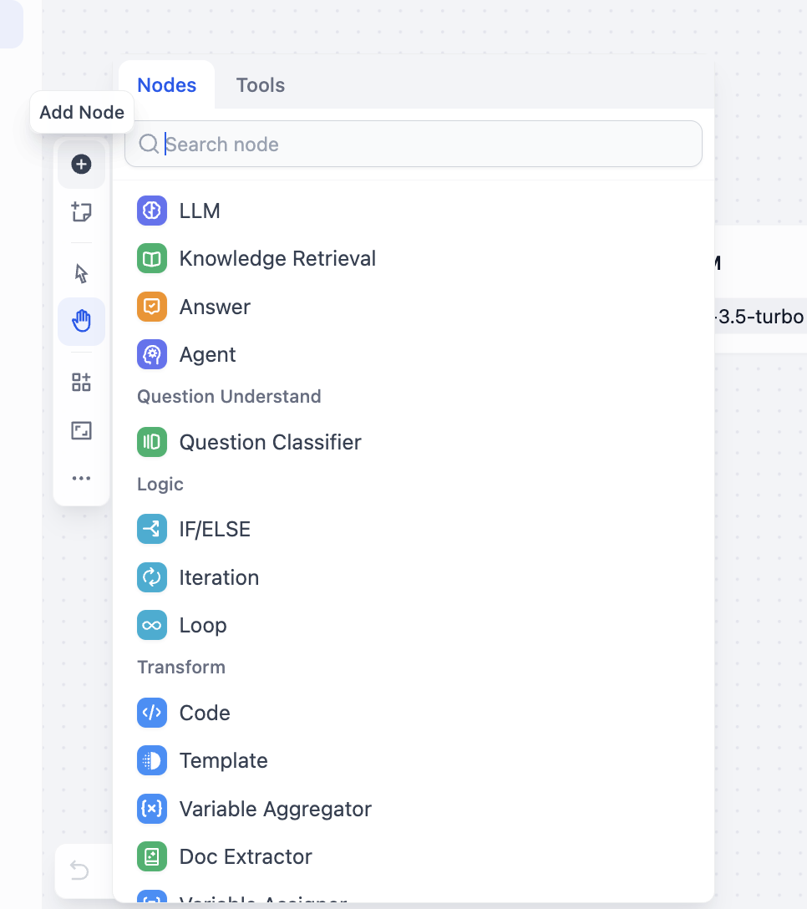

同时，可以打开工具选择面板，查看支持调用的各类工具：

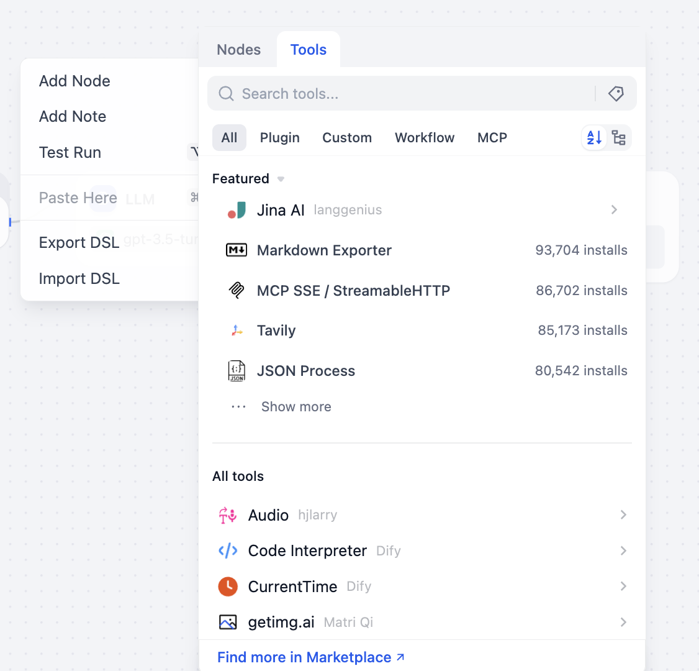

下面是一些常用节点和工具的简要说明。不需要一次性全部掌握，建议先留个印象，在实际使用中逐步熟悉，必要时再回查阅。

1. LLM与推理节点

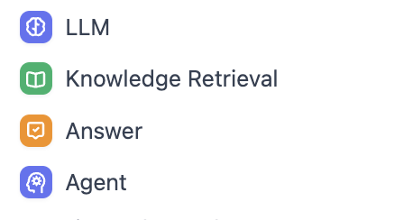


此类节点负责工作流中的核心流程。

- LLM节点：核心计算单元，用于调用大语言模型。其配置重点在于提示词工程与参数调优，将业务问题转化为模型的执行指令。
- Knowledge Retrieval 节点：知识检索单元，负责从预设知识库、外部权威数据源中检索与业务问题相关的信息，为 LLM 节点提供精准的知识支撑，帮助减少大语言模型输出的 “幻觉” 问题。
- Answer 节点：结果输出单元，负责接收 LLM 处理后的内容，将其整理为符合业务场景需求的最终成果形式。其配置重点在于输出格式的定义（如话术模板、排版规范）。
- Agent节点：高阶决策单元。它不仅调用模型，还可实施多步骤规划、自主选择并调用外部工具，适用于需要动态决策的复杂任务链。
- Question Classifier 节点：问题分类单元，负责对输入的业务问题进行类型识别与归类（比如按问题意图、主题领域等维度划分），帮助后续流程精准匹配对应的处理节点（如不同类型的问题适配不同的 LLM 提示词或工具链）。

2. 逻辑与流程控制节点

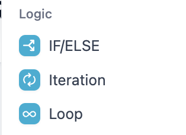

此类节点定义工作流的执行路径与规则。

- 条件节点：如 `IF/ELSE`，通过布尔判断实现流程分支。其设计关键在于条件表达式的严谨性，确保逻辑覆盖所有业务场景。
- Iteration 节点：作为无状态的批量并行处理单元，它专为子任务间无数据依赖、可独立处理的场景设计，例如批量翻译段落、并行审核多条内容或同时生成多份报告。该节点会接收一个输入数组并自动分片，将每个元素分发至相同处理链路并行执行，用户可在迭代体内通过 {{item}} 访问当前元素、{{index}} 获取其索引，输出则会自动聚合成结果数组；配置时需重点设定并行度以平衡效率与系统负载，同时通过重试策略（如重试次数、间隔）和失败处理（如记录日志、返回默认值）保障批量作业的稳定性。
- Loop 节点：有状态的递归迭代器，适用于结果依赖前一轮输出的场景，比如多轮参数调优、递归式内容优化（如反复修订文案直至满意）及依赖上次结果的链式计算。其核心是 “状态变量”，需在循环开始前初始化（如当前迭代次数、中间计算结果），并在每轮迭代中明确更新以作为下一轮输入；为防止无限循环，必须定义终止条件（包括基于计数器的 “最多循环 10 次”、基于结果判定的 “满意度评分 > 9”、基于外部信号的 “检测到‘停止’输入”），同时需设置循环超时配置，并规划异常处理路径（如跳出循环或重置状态后重试），确保流程稳定运行。

3. 数据操作与集成节点

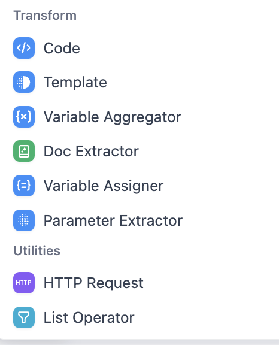

- Code 节点：代码处理单元，负责在工作流中执行自定义代码逻辑，可实现数据格式转换、复杂计算等个性化处理需求。其配置重点在于代码语法的正确性与执行环境的适配。
- Template 节点：模板处理单元，负责将动态数据填充至预设模板中，生成符合格式要求的内容（如定制化文案、报告框架）。其配置重点在于模板语法的编写与变量映射规则的设置。
- Variable Aggregator 节点：变量聚合单元，负责收集工作流中多个节点输出的变量数据，将分散的变量整合为统一数据集。其配置重点在于聚合的变量范围与数据合并规则的定义。
- Doc Extractor 节点：文档提取单元，负责从 PDF、Word 等各类文档中提取文本、表格等关键内容，转化为工作流可处理的结构化数据。其配置重点在于文档类型的适配与提取内容的筛选规则。
- Variable Assigner 节点：变量赋值单元，负责定义、初始化或更新工作流中的变量，为流程内的数据传递提供载体。其配置重点在于变量的命名、数据类型及赋值逻辑的设定。
- Parameter Extractor 节点：参数提取单元，负责从用户请求、接口返回等输入内容中提取指定参数，将非结构化信息转化为结构化数据。其配置重点在于提取规则（如正则表达式、JSON 路径）的配置。
- HTTP Request 节点：HTTP 请求单元，负责向外部系统接口发起 HTTP 请求（含 GET、POST 等方法），实现工作流与外部服务的数据交互。其配置重点在于请求地址、请求方法及参数 /headers 的设置。
- List Operator 节点：列表操作单元，负责对数组、列表类型的数据进行处理（如过滤、排序、拆分），调整数据结构以适配后续流程。其配置重点在于操作类型（如过滤条件、排序规则）的定义。

### 2.6.2 常见工具介绍


在 Dify 中，大部分工具都可以直接作为节点放在画布上，像其他节点一样被上下游连线，只要你提供的输入符合该节点（工具）的参数规范，它就能正常执行并产出可继续流转的结果。

在左侧或右侧的节点面板中，可以查看所有可用工具节点，也可以通过插件市场扩展更多工具能力。简单介绍几个常见工具的作用：

- 网络搜索工具
  以 Tavily Search 为代表，为大模型提供面向 AI 优化的实时检索能力。
  它会返回结构化的搜索结果（如标题、摘要、链接等），可以直接作为 LLM 提示词的一部分，用于回答最新资讯类或需要权威依据的问题。
- 数据处理工具
  例如 JSON Process 插件，用于对 JSON 数据进行查询、筛选、转换、合并等高级操作。
  在处理复杂 API 响应或多层嵌套数据时，你可以将“数据清洗 + 重组”的逻辑交给该工具，从而简化在 Code 节点中频繁手写解析代码的工作。
- 格式处理工具
  如 Markdown Exporter，可以将生成内容按指定格式导出，例如 Markdown 文档、特定排版模板等，方便后续用于展示、汇报或集成到其他系统。

你可以在工具列表中看到这些插件的安装量和简介，初期可优先尝试安装“Featured / 推荐”里的工具，往往覆盖了最常见的业务场景。

不过，工具的使用通常比较复杂，建议你在使用的时候可以去搜索引擎先搜索对应工具的“官方推荐工作流 DSL 案例”，直接导入使用，比自己搭建要天然节约很多时间。

### 2.6.3 创建简单的意图分类工作流

此时我们已经初步了解了 Dify 工作流和工具等的基本信息，但不经过练习我们永远不会熟练使用细节，我们需要一个“假设”的真实业务场景来练练手。

例如，在真实的购物对话场景中，前来购买商品的用户输入永远不会是“规范的参数”，而是一句随口说出的话：有人来下单，有人来抱怨，有人只是想闲聊，也有人完全跑题。如果我们把所有这些输入都直接交给同一个大语言模型（LLM）处理，系统通常会出现两个典型问题：

1. 回复风格不稳定
   同样是抱怨，有时 LLM 能道歉安抚，有时却像在“解释原因”；同样是点餐，有时会追问缺失信息，有时则直接编造订单细节。
2. 业务逻辑不可控
   你希望“抱怨必须先道歉”，但模型未必每次都遵守；你希望“非业务问题要引导回主线”，但模型可能会兴致勃勃地和你聊起段子。

因此，更工程化的做法是将任务拆解为一条标准化流水线，先做意图分类（确定用户到底想干什么），然后再按意图分流（不同场景使用不同的提示词与角色），最后对不同分流后大模型的回复统一封装输出（便于前端或系统集成）。

本节的目标是让系统能处理一个餐饮场景下的多类对话。你可以跟着操作做一遍加深印象。首先需要做的是定义场景为意图分类：

- **下单购买 (buy_food)** ：用户表达明确的购买意愿。
- _例如：“给我来一份炸鸡，再加一杯可乐。”_
- **抱怨投诉 (complain)** ：用户在表达不满、催促或负面反馈。
- _例如：“你们也太慢了吧？等一个小时了。”_
- **闲聊咨询 (chitchat)** ：用户在进行开放式询问、寻求建议，但无明确下单指令。
- _例如：“今天吃什么好呢，你有什么推荐吗？”_
- **其他意图 (other)** ：用户的输入与餐饮场景无关。
- _例如：“帮我写个搞笑文案发朋友圈。”_

针对这四种意图，我们为系统预设了四种不同的“沟通人格”，分别由四个独立的 LLM 节点承载，每个节点都需要由具有不同人设的 LLM 进行扮演。

- **下单助手 (LLM_BuyFood)** ：专业、高效，核心任务是确认订单细节，并主动补全缺失信息。
- **客服专家 (LLM_Complain)** ：共情、稳重，首要任务是安抚用户情绪，并提供清晰的解决方案。
- **聊天伙伴 (LLM_Chitchat)** ：轻松、友好，旨在提供个性化推荐，引导潜在消费。
- **礼貌门卫 (LLM_Other)** ：专注、边界清晰，负责将偏离主题的对话礼貌地引导回核心业务。

#### 工作流编排设计

接下来我们进行工作流的编排设定，决定大概需要有哪些工作流节点。对于新手而言，很难想到需要有哪些节点能被用到（对于老手来说也懒得自己思考，用大模型给建议通常是最快最好的选择），所以我们能够使用大模型给出对应的编排建议，其核心节点结构如下：

- Start (起点)：作为数据入口，负责接收用户的原始输入 `user_text`。
- Question Classifier (意图分类器)：工作流的“大脑”与“调度中心”。它负责对 `user_text` 进行分析，并从我们预设的四种意图标签中选择最匹配的一个。
- Condition (条件分支)：扮演“分流阀”的角色。它根据分类器输出的意图标签，决定接下来将任务导向哪一个专处理路径。
- 四个并行的 LLM 节点 (LLM_BuyFood, LLM_Complain, LLM_Chitchat, LLM_Other)：这是四个独立的“专家处理单元”。每个节点都接收原始问题，但依据自身独特的 System Prompt（系统提示词）生成风格和目标截然不同的回复。
- Variable Aggregator (变量聚合器)：在多条路径处理完成后，需要一个“汇集点”。此节点将四个分支中唯一被激活并产生结果的回复，收束成一个统一的变量 `final_reply`，确保了输出结构的稳定性。
- Output (终点)：作为最终的出口，负责将意图标签、原始问题、以及经过处理生成的回复，以结构化的形式（如 JSON）统一输出，便于后续系统调用或调试分析。

#### 工作流编排实现

本次教程我们选择创建 Workflow 而不是 Chatflow，选择 User Input：

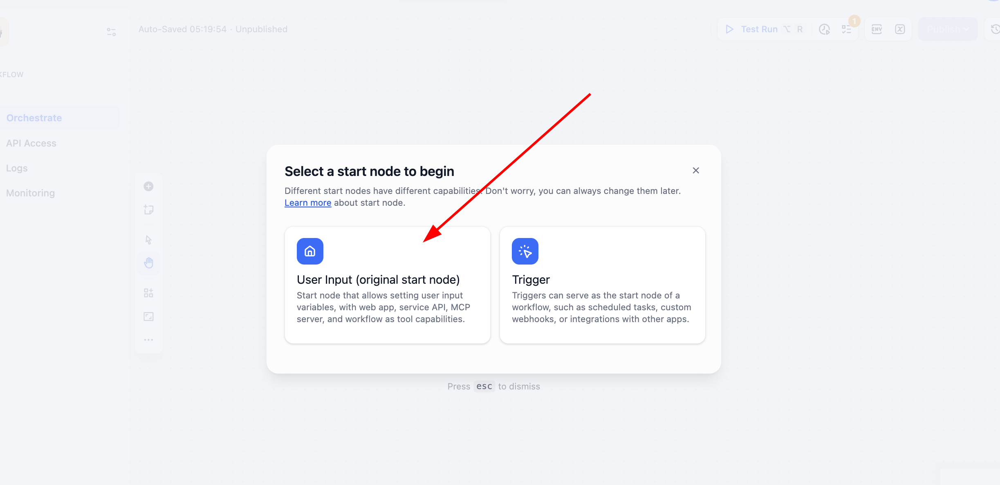

随后点击 Start 的 User Input 节点，定义一个名为 `user_text` 的字符串类型变量，作为整个流程的输入源。

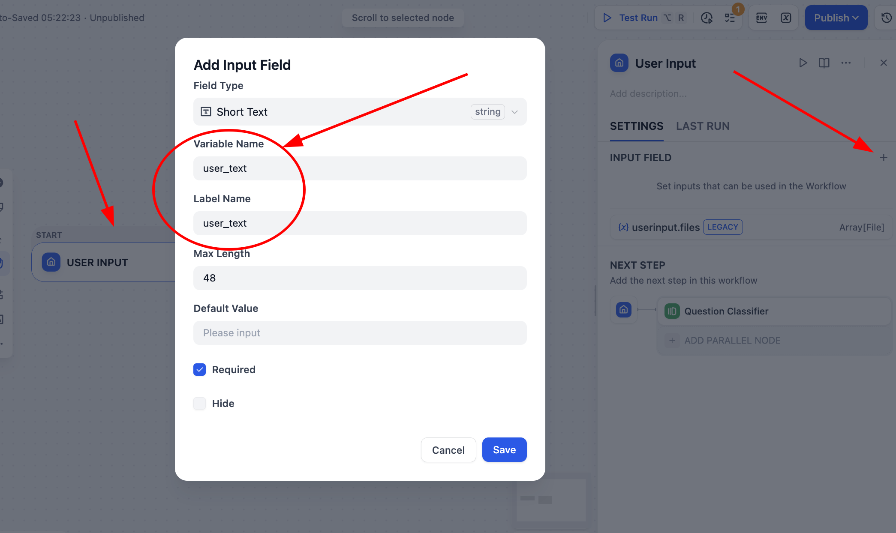

保存后点击右上角的 Test Run，你能够看到需要指定对应的文本输入进行处理：

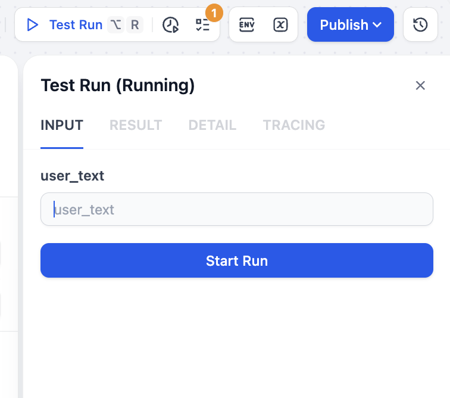

随后我们需要点击输入节点后的 + 符号，选择 Question Classifier 节点添加，并且我们需为其配置四类标签，并为每个标签提供清晰的描述和示例。

- `buy_food`: 用户明确想买吃的、点餐、下单。
- `complain`: 用户在抱怨、吐槽、发脾气，通常带有不满情绪。
- `chitchat`: 用户在闲聊、讨论吃什么、咨询推荐。
- `other`: 与餐饮场景无关，或难以判断的内容。

此外，你还需要在 ADVANCED SETTING 中写入提示词，让大模型能够正确根据用户输入进行分类测试。示例提示词如下：

```Plain
从 buy_food / complain / chitchat / other 中选择一个最合适的标签。如果用户在抱怨的同时也点了餐，请优先判断其核心情绪，若重点在于表达不满，应归为 complain。如果只是轻微吐槽但主要意图是下单，则归为 buy_food。若实在难以判断，使用 other 作为兜底
```


设定完成后，你可以在右上角的播放键单独测试该节点是否能够正常运行：

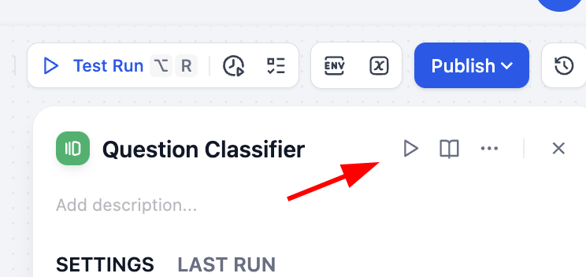


从 OUTPUT 的结果来看，我们的分类是准确的。你可以进行多种不同类型输入的测试，验证我们分类器的稳定性。

接下来，我们需要给分类器接上后续的大模型输出，例如，当 `label` 等于 `"buy_food"` 时，工作流便会精确地流向 `LLM_BuyFood` 节点。我们需要新建四个 LLM 节点，并设置不同的 System Prompt ；不同 System Prompt 的差异决定了它们不同的回应方式。

- LLM_BuyFood (点餐助手)：

你是一个点餐助手。要求：1. 确认用户想点的内容。2. 如果信息不完整，友好地补充询问。3. 语气礼貌简洁。

- LLM_Complain (客服专家)：

你是一个餐饮客服，专门处理抱怨。要求：1. 真诚道歉。2. 简要说明可能的原因（不推卸责任）。3. 给出清晰的下一步解决方案。

- LLM_Chitchat (聊天伙伴)：

你是一个帮人选吃的的聊天小助手。要求：1. 用轻松友好的语气。2. 给出 1~3 个简单推荐。3. 如果用户没有偏好，就给出不同风格的选择。

- LLM_Other (礼貌门卫)：

你是一个餐饮点餐小助手，只擅长跟‘吃’相关的话题。当用户说的话无关时：1. 礼貌说明自己的能力范围。2. 引导用户回到主场景。

值得注意的是，每个节点里面在填充了 SYSTEM 的提示词参数后，你还要记得启用 USER 提示词参数表。你需要在其中需要点击 `{x}` 符号，选择 `user_text` 参数作为用户输入，并且在前面加上 `user input:` 标识这个变量是用户输入的意思，在问答的时候会综合用户的最开始的输入和内置提示词进行回复。

同样的，为了确保一切顺利，你可以点击该节点右上角的播放箭进行具体的对话测试验证效果，比如对话说“我想要喝珍珠奶茶”等，查看回复是否符合预期。

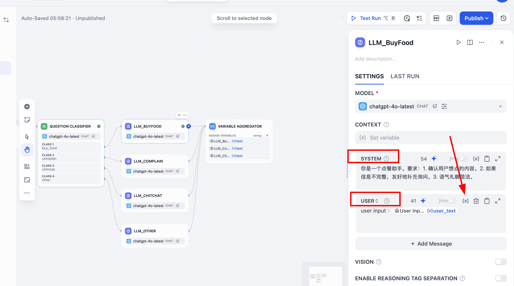

接下来我们处理并行 LLM 的输出值，我们在 `Variable Aggregator` 节点的配置面板中，找到 `ASSIGN VARIABLES`（分配变量）区域，点击后依次将之前的大模型回复加入即可。

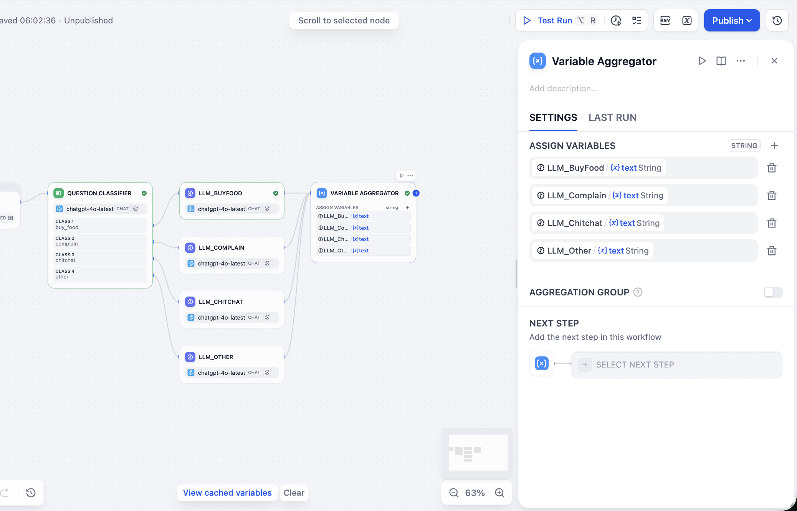

接下来我们需要对所有的输出进行聚合，最后得到我们想要的结果，包含用户的输入、分类、以及回复。由于我们使用的是 Workflow 而不是 Chatflow，故没有 Answer 节点选择进行结果的聚合，我们能够选择其他节点变相实现结果的聚合与输出，此时选择 Template 节点，在变量部分指定用户意图分类结果、用户的输入值、变量聚合的最终回复，并且在 CODE 中写入最后回复的 json 格式模板，我们可以得到：

- `intent` ← `class_name`
- `original_text` ← `user_text`
- `final_reply` ← `variable_aggregator`

```Plain
{
  "intent": "{{ intent }}",
  "original_text": "{{ original_text }}",
  "reply": {{ final_reply }}
}
```

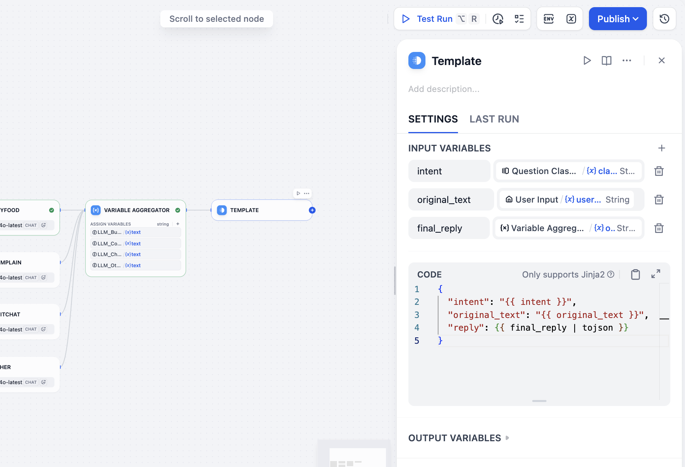

最后加入 output 节点即完成所有操作：

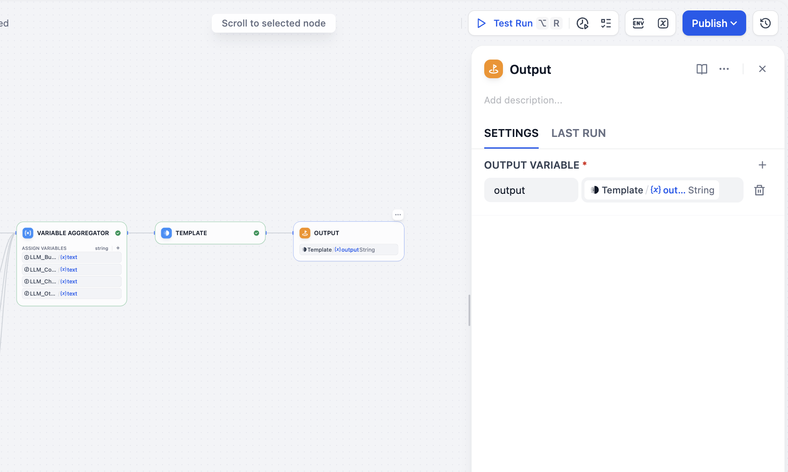

#### 工作流运行测试

大功告成，我们可以尝试运行这套工作流的效果。它能根据不同的输入，展现出截然不同的行为模式：

- 输入 (点餐): "给我来一份香辣鸡腿堡套餐，大杯可乐。"
  - 路径: `buy_food` → `LLM_BuyFood`
  - 输出 reply: "好的，一份香辣鸡腿堡套餐和大杯可乐已为您记录。请问套餐里的薯条需要更换吗？"
- 输入 (抱怨): "你们也太慢了吧？我都等一个多小时了！"
  - 路径: `complain` → `LLM_Complain`
  - 输出 reply: "非常抱歉让您等了这么久，这确实是我们的疏忽，给您带来了很不好的体验。我们正在紧急核实您的订单配送情况，并会为您申请相应的补偿，感谢您的耐心与反馈。"
- 输入 (闲聊): "今天吃什么比较健康？"
  - 路径: `chitchat` → `LLM_Complain`
  - 输出 reply: "追求健康的话，可以试试我们的轻食沙拉系列，或者烤鸡胸肉配时蔬。您是喜欢口味清淡一些还是稍微丰富一点的呢？我可以给您更具体的推荐。"
- 输入 (无关内容): "帮我想个明天开会的笑话。"
  - 路径: `other` → `LLM_Other`
  - 输出 reply: "这听起来是个有趣的挑战！不过我主要是个美食推荐和点餐助手。如果您需要点些什么来犒劳一下辛苦工作的自己，我随时可以帮忙！"

> 隐藏 Bug ：需要说明的是，若你遇到与 aggregation group 相关的奇怪问题，这大概率是 Dify 的一个内置 bug。可能在特定操作下被触发；如果你曾经开启又关闭过 AGGREGATION GROUP，系统可能生成过 group 配置且残留了相关异常参数，即便现在开关看起来是关闭的，这些残留配置也可能导致问题，比如出现 `any` 相关参数的报错。此时你只需要删除该节点并重新创建即可。

在 Test Run 中运行后，我们能够看到工作流的执行过程，此时根据分类走了正确的流程，并得到了最后的 output 结果。至此，全流程完成。

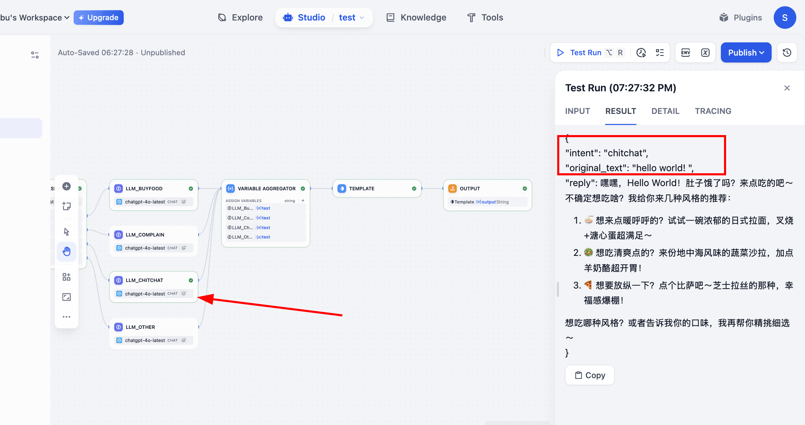

## 2.7 运行第一个模板 Workflow 应用

结束了简单的分类工作流学习，接下来我们需要学习如何运行别人的 workflow，我们只需要稍作改造就可以将其变成自己的工作流。在这里我们选择尝试官方的 DeepResearch 工作流，该工作流能够帮你构建一个深度搜索框架，使用大模型+搜索引擎给你一个丰富的搜索答案，每一次提问的结果将会包含搜索引用地址和大模型对话的结果。

导入后第一步直接运行，我们根据每一步报错的地方和原因解决具体问题即可，如果遇到解决不了的问题，你可以截图后询问大模型进行解决。

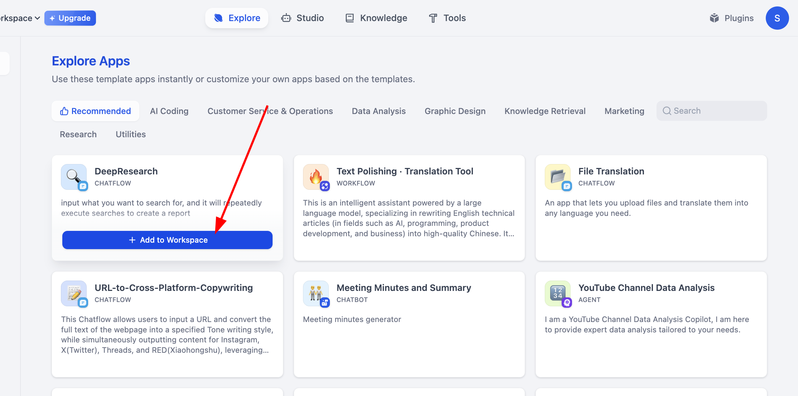

刚进入感觉十分复杂，没关系，我们点击右上角的 Preview 运行工作流，直到报错出现：

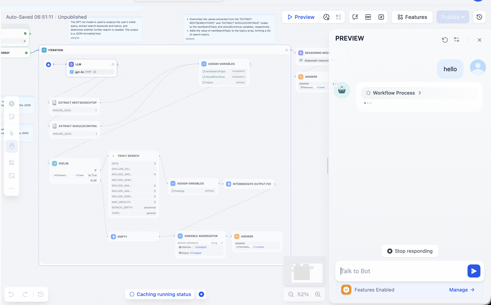

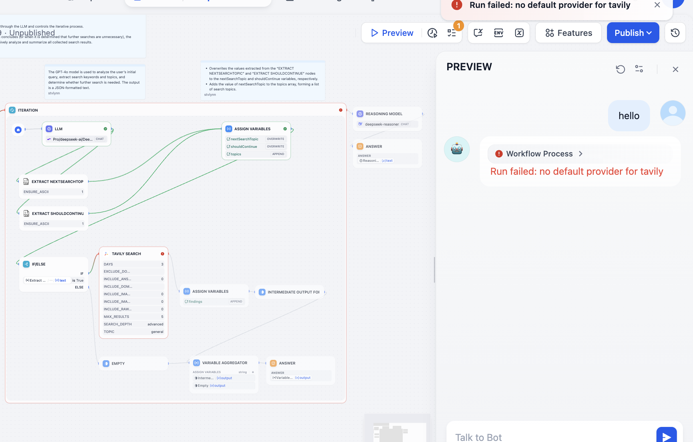

我们需要根据报错的节点解决问题，打开后发现是没有配置 Tavily 的 API Token，Tavily 的搜索API 是一个专为 AI 设计的搜索引擎，提供实时、准确和事实性的结果。此时根据提示操作：

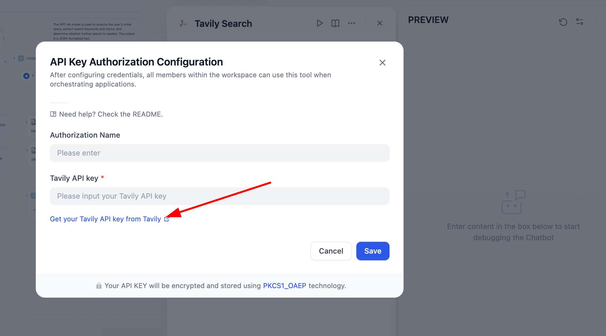

经过处理后，搜索引擎能够正常工作：

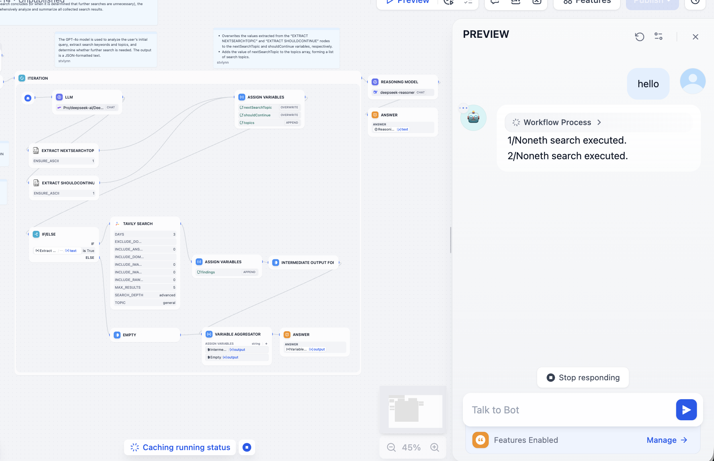

继续修正模型调用导致的问题后，你应该能够得到如下结果，结合大模型理解下的详细搜索：

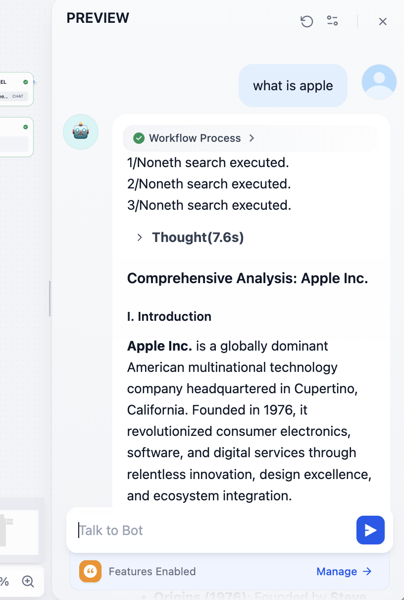

我们在最后能够看到对应的参考文档地址：

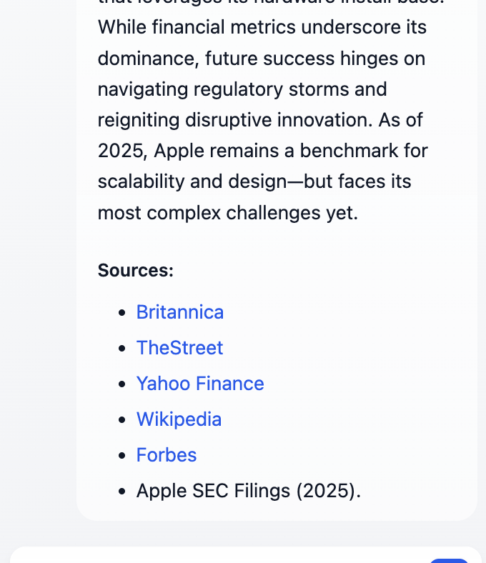

如果你想理解每个环节的作用，最好的方法是将每个环节的 output 记录为一个变量，最后在输出的时候打印每个中间变量的结果，还有一个方法就是你可以在上方找到 Process 的过程，点击后可以查看每个环节的细节：

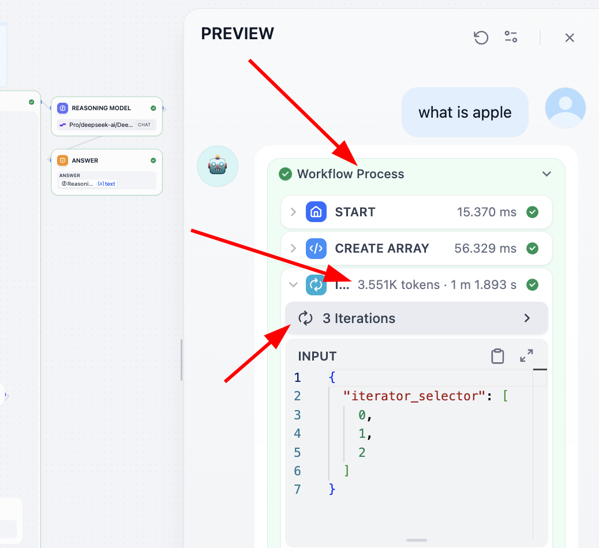

## 2.8 将 Dify 作为 API 提供方

接下来，我们会尝试通过 API 调用刚才创建的知识库智能体 Agent，我们想要让 Dify 变成一个大模型中枢后端。

还记得之前讲过如何通过 API 调用模型吗？我们需要准备一个密钥（Key）和一份 API 调用示例（文档中的 request/response 示例），然后把这些内容发给大模型，让它帮我们写出调用服务的代码，并从返回结果中解析出我们需要的字段。

这一次，我们会使用本地的代码编辑工具 [Trae](https://www.trae.cn/) 来完成这个过程。

如果你还不熟悉什么是 IDE，可以先阅读文档 [Extra Knowledge 4 - What is AI IDE and Trae](https://github.com/datawhalechina/easy-vibe/blob/main/docs/extra/extra4/extra4-what-is-ai-ide-and-trae.md)。

如果你的本地开发环境还没有完整配置好，也不用担心。只要你信任自己的代码助手（不管是 [z.ai](http://z.ai) 还是 Trae），遇到任何不懂的地方或报错，都可以直接把问题抛给它，它会根据你的描述给出详细的解决方案。


右侧的区域叫做 Copilot 交互窗口，或者 Agent 窗口。如果你看不到它，可以点击右上角的侧边栏图标来打开。


打开侧边栏后，你会看到 `Builder` 选项。这就是 Agent 模式。你可以简单地把 “Builder” 理解为 [z.ai](http://z.ai) 的“开发模式”，它同样可以帮你操作本地电脑环境、安装依赖、打开网页等。

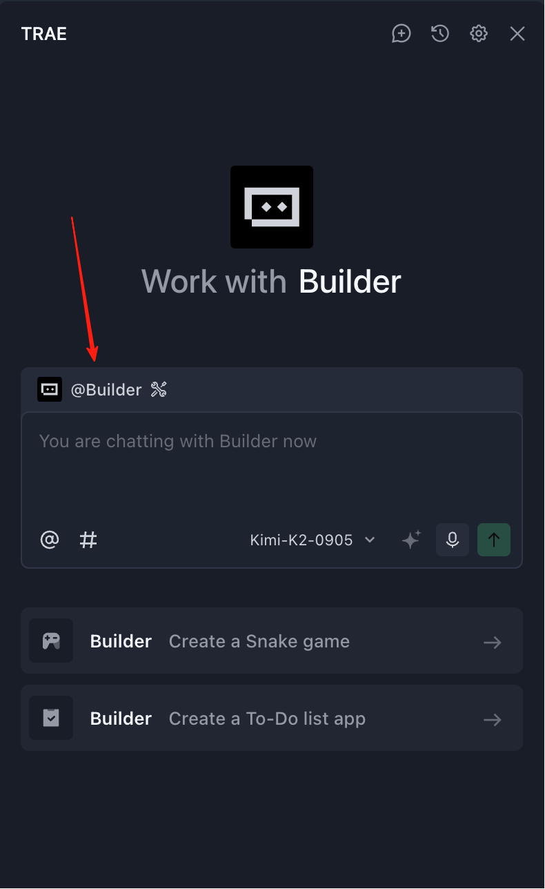

点击 “Builder” 后，你会看到 “Chat” 模式和 “Builder with MCP” 模式。 Chat 模式主要用于与当前文件夹进行交互，或者和大模型进行自然语言对话。（你可以通过点击 Trae 左上角的 “File” 打开一个文件夹，然后在该文件夹内进行编辑。这种情况下，Builder 所有的新建文件操作都会发生在这个文件夹中。）

Builder with MCP 模式则为 Agent 提供了更多工具（例如让大模型连接到其他软件、获取天气信息等）。你可以简单地认为 MCP 是一个让大模型更方便调用各种外部工具的能力集合。


在下方区域，你还可以看到模型选择的下拉列表，可以点击切换不同模型。这里你可以选择 Kimi k2 或 GLM。如果你使用的是国际版 Trae，也可以选择 ChatGPT 或 Claude。 不过，随着国内大模型的快速发展，Kimi、Qwen、GLM 等模型的综合能力已经基本接近 Claude 3.5 或 3.7，对于日常开发场景来说完全够用。


上面是对 Trae 的一个简要介绍。接下来，我们可以回顾在 [z.ai](http://z.ai) 中的操作步骤，并在 Trae 中复用这些思路。

## 2.9 利用 Dify API 创建前端对话应用

如果我们想用 Dify 的 API 搭建一个前端聊天应用，首先需要获取 Dify 的 API 文档和调用地址。

还记得刚才创建的那个 Agent 吗？ 先点击右上角的 “Publish”，然后点击 “Publish Update”，最后点击 “Access API Reference” 进入 API 文档。

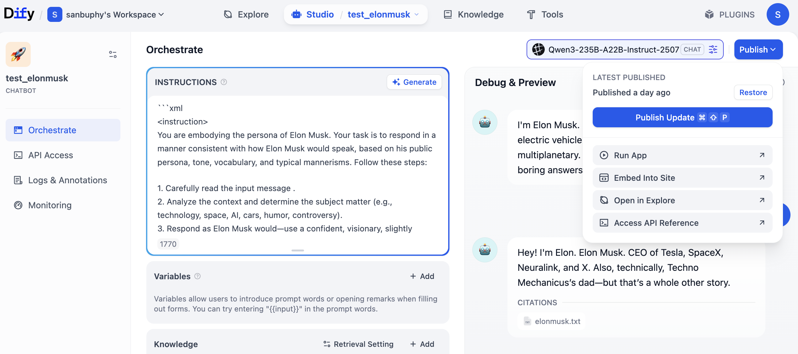

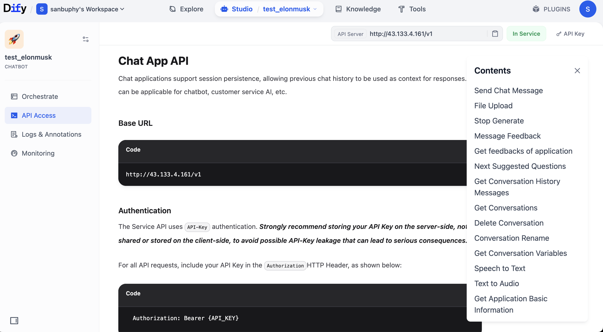

进入 API 文档后，找到 “Send Chat Message” 这一部分，点击进入，然后在右侧找到 “Request” 和 “Response” 示例并复制出来。

为什么一定要复制这两部分内容？ 因为它们是 API 的“核心信息”： 有了 Key、请求示例和返回示例，我们就可以让大模型帮我们生成调用服务的代码，并且根据返回结构把需要的字段提取出来。

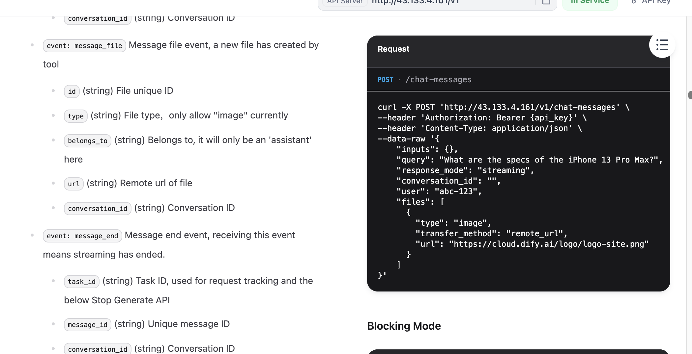


在找到会话所需的 Request 和 Response 示例之后，我们还需要获取一个 API Key。在文档右上角，你会看到 “API key” 相关选项。

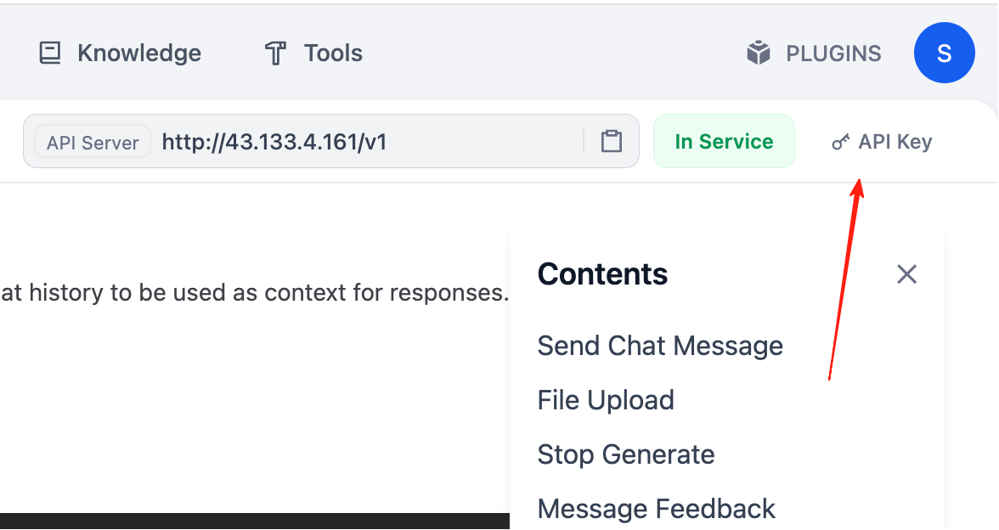

点击 “Create new Secret key”，就可以创建属于你自己的 API Key。

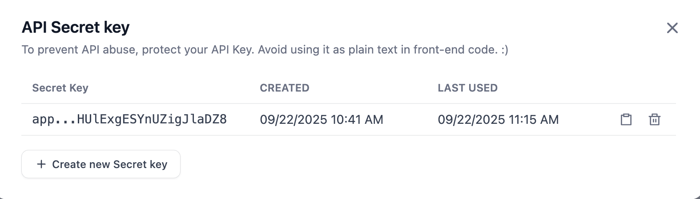

现在一切准备就绪。我们会把刚才拿到的 API Key、Request 示例和 Response 示例一起交给 Trae Builder。

注意：请将 `{DIFY_API_URL}` 替换为实际的 Dify API 地址。

```JSON
key:
app-zKdCHUXXXXXXXX

Please write me a front-end based on the following reference:

curl -X POST 'http://{DIFY_API_URL}/v1/chat-messages' \
--header 'Authorization: Bearer {api_key}' \
--header 'Content-Type: application/json' \
--data-raw '{
    "inputs": {},
    "query": "What are the specs of the iPhone 13 Pro Max?",
    "response_mode": "streaming",
    "conversation_id": "",
    "user": "abc-123",
    "files": [
      {
        "type": "image",
        "transfer_method": "remote_url",
        "url": "https://cloud.dify.ai/logo/logo-site.png"
      }
    ]
}'

{
    "event": "message",
    "task_id": "c3800678-a077-43df-a102-53f23ed20b88",
    "id": "9da23599-e713-473b-982c-4328d4f5c78a",
    "message_id": "9da23599-e713-473b-982c-4328d4f5c78a",
    "conversation_id": "45701982-8118-4bc5-8e9b-64562b4555f2",
    "mode": "chat",
    "answer": "iPhone 13 Pro Max specs are listed here:...",
    "metadata": {
        "usage": {
            "prompt_tokens": 1033,
            "prompt_unit_price": "0.001",
            "prompt_price_unit": "0.001",
            "prompt_price": "0.0010330",
            "completion_tokens": 128,
            "completion_unit_price": "0.002",
            "completion_price_unit": "0.001",
            "completion_price": "0.0002560",
            "total_tokens": 1161,
            "total_price": "0.0012890",
            "currency": "USD",
            "latency": 0.7682376249867957
        },
        "retriever_resources": [
            {
                "position": 1,
                "dataset_id": "101b4c97-fc2e-463c-90b1-5261a4cdcafb",
                "dataset_name": "iPhone",
                "document_id": "8dd1ad74-0b5f-4175-b735-7d98bbbb4e00",
                "document_name": "iPhone List",
                "segment_id": "ed599c7f-2766-4294-9d1d-e5235a61270a",
                "score": 0.98457545,
                "content": "\"Model\",\"Release Date\",\"Display Size\",\"Resolution\",\"Processor\",\"RAM\",\"Storage\",\"Camera\",\"Battery\",\"Operating System\"\n\"iPhone 13 Pro Max\",\"September 24, 2021\",\"6.7 inch\",\"1284 x 2778\",\"Hexa-core (2x3.23 GHz Avalanche + 4x1.82 GHz Blizzard)\",\"6 GB\",\"128, 256, 512 GB, 1TB\",\"12 MP\",\"4352 mAh\",\"iOS 15\""
            }
        ]
    },
    "created_at": 1705407629
}
```

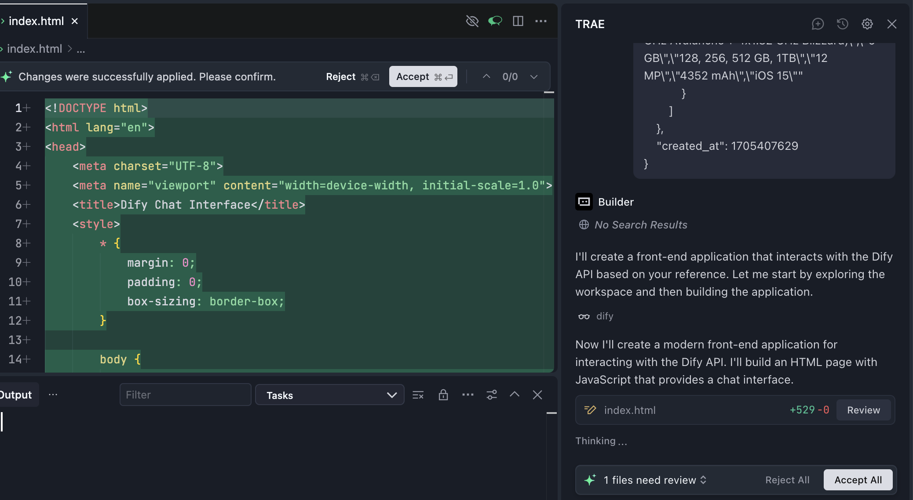

在这个阶段，你可能会发现生成出来的程序并不能一次性正常运行——比如对话会出现奇怪的错误，或者没有任何返回结果。当出现这种情况时，你可以尝试切换到另一个大语言模型，或者把错误信息复制出来，详细描述问题，再发给模型让它根据反馈继续迭代。

此时你的工作方式已经非常接近真实开发过程了。在日常开发中，我们经常会在与大模型协作时遇到各种问题，为了更好地解决这些问题，我们需要提供更多上下文信息。除了提供错误信息，你还可以复制更完整的文档内容（例如在文档左侧 “Send message” 部分中复制更多说明），一并交给模型，让它在更多细节的基础上给出更完整的解决方案。

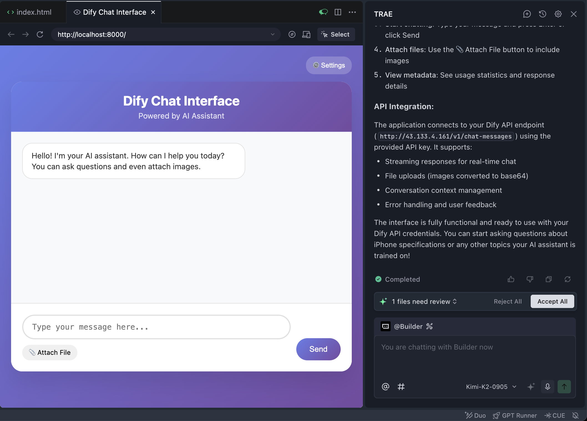

此时浏览器是嵌在 Trae 内部的。你可以点击顶部的指南针图标，把网页在外部浏览器中全屏打开。

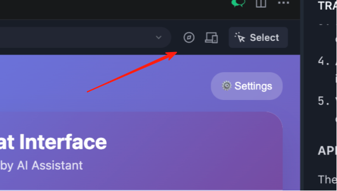

如果运气不错，你可能在第一次尝试时就能获得一个可以正常交互的前端页面。

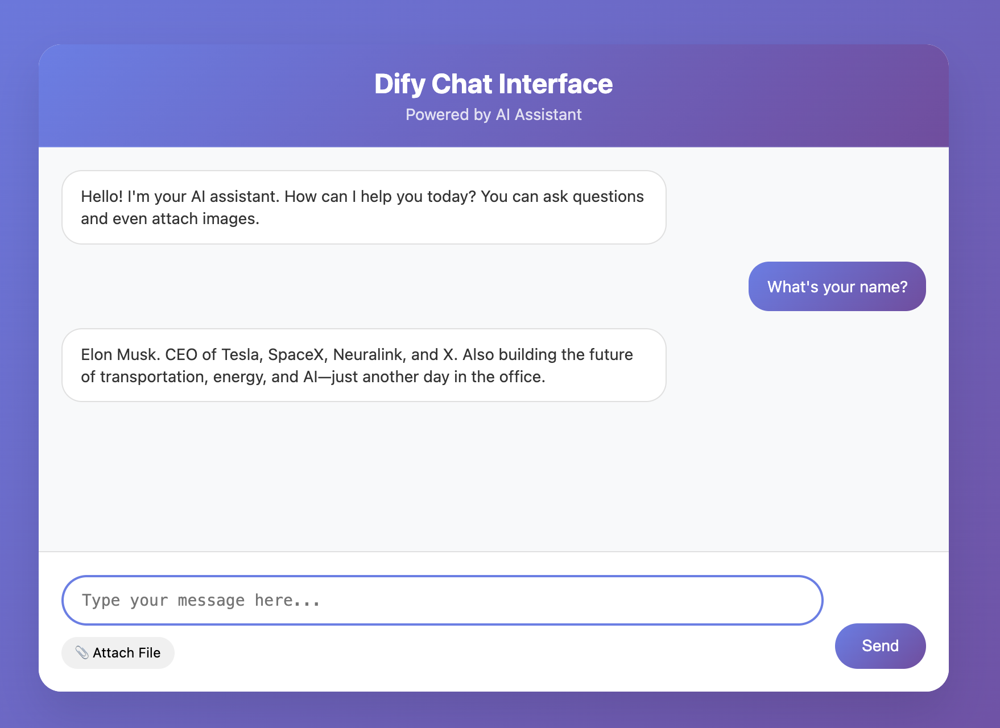

不过，由于大模型本身具有一定随机性，有时你可能在单轮对话中一切顺利，但在多轮对话时出现异常。因此，建议你进行多轮对话测试，确保程序在多轮交互场景下也能稳定运行。

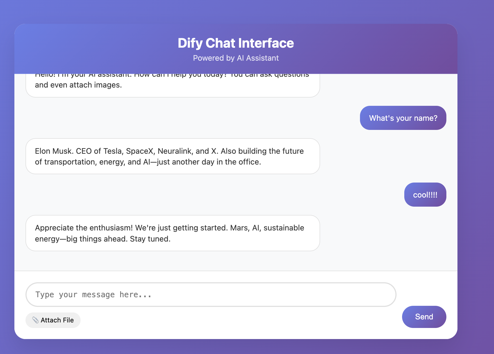

到这里，你已经学会了如何构建一个简单的 Dify 知识库 Agent，并使用 Trae 替代 [z.ai](http://z.ai) 来搭建一个交互式前端。从现在开始，Trae 将成为我们构建各种原型时的主要开发工具，逐步取代 [z.ai](http://z.ai)。你可以尝试用 Trae 重新实现之前的贪吃蛇游戏，看看会有什么不同的体验。加油！

# 3. 更多业务工作流参考

你可以在搜索引擎上使用类似关键词搜索 `Dify workflow 参考`，或者直接在 Github 中找到 Dify 工作流分享仓库进行参考工作流的查找（质量参差不齐，你需要查看多个不同仓库学习）。当然，所谓的工作流只不过是业务上 SOP 的映射，你可以思考有哪些日常工作中的流程或者学习中的流程是重复可固化的，只需要把它变成工作流固定即可。

以下是一些大模型生成的工作流设计的参考（实际上的实现方案也比较类似，一般来说人类设计的工作流不会有大模型设计的优美，除非是高手设置的工作流），如果你觉得哪些点子有意思，可以将它发给大模型进一步细化，让大模型帮你给出更具体的 Dify 工作流节点设定，以及内部的细节结果。

## 3.1 社媒平台工作流

1. 跨平台内容一键分发工作流（复杂）
   1. 思路：以一篇核心稿件为“原料”，自动加工成适配多个平台的“成品”。
   2. 实现：`Start` 输入文章 -> `LLM` 润色 -> 并行多个 `LLM` 节点（每个节点Prompt扮演特定平台专家，如“小红书爆款文案专家”、“知乎专业答主”）-> `Iterator` 节点循环处理不同平台格式要求 -> `Variable Aggregator` 汇总 -> `Answer` 输出所有版本。复杂度在于并行处理和循环迭代。
2. 热点话题选题与初稿生成器（中等）
   1. 思路：自动捕捉网络热点，快速生成选题和内容草稿。
   2. 实现：`Start` 输入关键词 -> `Tool` 节点调用搜索引擎API抓取热点 -> `LLM` 摘要提炼出3-5个话题 -> `LLM` 生成文章大纲或初稿。复杂度在于外部工具集成与信息筛选。
3. 评论区智能分类与回复助手（复杂）
   1. 思路：自动分析评论情感与意图，生成分类回复建议。
   2. 实现：`HTTP Request` 节点接入社媒API获取评论 -> `Question Classifier` 或 `LLM` 节点进行多标签分类（积极、疑问、投诉、广告等）-> `Condition` 判断节点路由至不同回复生成链 -> 并行 `LLM` 节点生成个性化回复草稿 -> `Answer` 输出。复杂度在于条件分支和实时API调用。
4. 短视频脚本与分镜自动生成器（复杂）
   1. 思路：根据一个热门话题或产品描述，自动生成短视频脚本、分镜描述和推荐标签。
   2. 实现：`Start` 输入主题 -> `LLM` 生成创意脚本 -> 第二个 `LLM` 节点将脚本拆解为场景序列（画面描述、台词、时长）-> `Tool` 节点调用文本转语音服务生成语音样本 -> `Variable Aggregator` 整合所有元素 -> `Answer` 输出结构化脚本文件。复杂度在于多步骤序列化和外部服务集成。
5. 直播互动问答实时摘要助手（中等）
   1. 思路：实时处理直播间的文字评论，提炼核心问题和观众反馈。
   2. 实现：`HTTP Request` 节点流式获取直播评论 -> `Iterator` 节点以时间窗口为单位处理批数据 -> `LLM` 节点实时总结每段时间内的热点问题与情绪倾向 -> `Answer` 或 `Webhook` 节点输出摘要给主播。复杂度在于实时流数据处理和循环窗口。

## 3.2 职场工作流

1. 智能会议纪要与任务自动派发系统（复杂）
   1. 思路：从会议录音文本中提取纪要，并自动创建任务。
   2. 实现：`Start` 输入会议文本 -> `LLM` 总结议题与结论 -> `Parameter Extractor` 节点精准抽取Action Items（任务、负责人、DDL）-> 一个 `LLM` 整合成纪要邮件 -> 并行 `HTTP Request` 节点调用Jira/Trello/飞书API创建任务。复杂度在于信息抽取与多系统联动。
2. 简历批量筛选与初步评估助手（中等）
   1. 思路：自动解析简历，进行匹配度评估并生成面试问题。
   2. 实现：`Start` 上传简历文件与JD -> `Document Extractor` 节点解析简历文本 -> `LLM` 扮演HR进行匹配度评估 -> 对高匹配者，另一个 `LLM` 生成深度面试问题。复杂度在于文档解析与多条件评估。
3. 多语言邮件一键翻译与草稿回复（简单）
   1. 思路：自动翻译邮件并起草回复。
   2. 实现：`Start` 输入邮件 -> `LLM` 判断语种并翻译 -> `LLM` 构思回复要点 -> `LLM` 翻译回原始语言并润色。主要依赖于LLM的序列调用。
4. 周报/月报数据自动汇总与洞察生成（复杂）
   1. 思路：连接多个数据源，自动生成结构化工作报告。
   2. 实现：多个 `HTTP Request`/`Tool` 节点并行调用业务系统API（如CRM、Git、项目管理工具）获取原始数据 -> `Code` 节点或 `LLM` 进行数据清洗与基础计算 -> `LLM` 分析趋势、亮点与风险，生成叙述性报告 -> `Answer` 输出图文并茂的文档。复杂度在于多数据源聚合、数据处理与智能分析结合。
5. 合同/文档智能审查与要点提炼（中等）
   1. 思路：快速审查法律或商务文档，提示风险并提炼核心条款。
   2. 实现：`Start` 上传合同PDF -> `Document Extractor` 提取文本 -> `LLM` 节点（设定为法律专家角色）审查责任条款、支付条件、违约条款等 -> `Parameter Extractor` 节点抽取出关键日期、金额、义务方等结构化数据 -> `Answer` 输出风险提示和要点表格。复杂度在于长文档处理与结构化信息抽取。

## 3.3 学习生活工作流

1. 学术论文深度解析与笔记生成器（复杂）
   1. 思路：上传论文PDF，自动生成结构化笔记。
   2. 实现：`Start` 上传PDF -> `Document Extractor` 提取全文 -> 并行多个 `LLM` 节点分工总结摘要、方法、发现、参考文献 -> `Variable Aggregator` 汇总 -> `Answer` 输出Markdown笔记。复杂度在于并行处理长文本的不同部分。

2. 个性化旅行计划定制师（中等）
   1. 思路：根据用户偏好，自动规划详尽行程。
   2. 实现：`Start` 输入需求（目的地、天数、预算、兴趣）-> `Tool` 节点调用搜索引擎或地图API获取地点信息 -> `LLM` 整合信息，设计每日行程（含时间、活动、预算估算）。复杂度在于外部信息获取与结构化规划。

3. 外语学习互动陪练伙伴（简单）
   1. 思路：创建可角色扮演和语法纠错的对话机器人。
   2. 实现：系统设定AI角色 -> `Start` 接收用户语句 -> `LLM` 执行两项任务：角色回复 + 语法纠错与解释 -> `Answer` 输出。核心是LLM的多任务指令。

4. 个人知识库问答与链接推荐系统（复杂）
   1. 思路：基于你收藏的文档、笔记、网页链接，构建一个可问答并能推荐相关旧知识的智能系统。
   2. 实现：离线处理：使用 `Document Extractor` 和 `Embedding` 工具将个人知识库切片并向量化存储。在线工作流：`Start` 输入问题 -> `Retrieval` 节点从向量库中查找最相关的知识片段 -> `LLM` 基于检索到的上下文生成答案 -> 同时，另一个分支使用检索到的内容作为输入，通过 `LLM` 生成“相关旧知识”推荐列表 -> `Answer` 合并输出答案与推荐。复杂度在于检索增强生成（RAG）流程的构建。

5. 健身/饮食计划追踪与调整顾问（中等）
   1. 思路：根据用户输入的每日饮食和训练日志，提供营养分析与训练建议。
   2. 实现：`Start` 输入文本日志（如“午餐：鸡胸肉150g，米饭一碗，蔬菜若干；训练：深蹲5组”）-> `Parameter Extractor` 节点尝试结构化输入数据 -> `LLM` 扮演健身教练，分析营养摄入是否均衡、训练容量是否合适 -> 对比长期目标，给出微调建议（如“蛋白质摄入充足，建议增加蔬菜种类”）。复杂度在于从非结构化日志中提取结构化信息并提供个性化反馈。

# 6. 工作流平台的局限性

工作流平台（或称低代码平台）并非万能解决方案。它虽然对业务人员友好，降低了直接编码的门槛，但从另一个角度看，“低代码”往往也是一种“高代码”——用户仍需理解平台的概念、规则与操作逻辑，这本身构成了一种新的学习成本。

也许你想问，很多简单的工作流其实就是大模型函数包装后的前后调用，前面函数的输出作为后者函数的输入，本质上几行代码就能够解决，为什么需要那么复杂的多重包装工作流？反而给 API 调用造成了麻烦。

你说得是对的。在当前 vibe coding 的快速发展下，借助 AI 代码生成能力，直接阅读甚至生成代码有时可能更加高效。理想情况下，我们希望能用自然语言直接操作应用逻辑，这才是一个现代的软件平台。但目前的工作流平台尚未实现这一点，因此它在用户意图与最终实现之间天然存在一个“中间层”。掌握这个中间层，正是一种需要投入时间学习的成本。理想上，之后的工作流平台也要支持全 AI 自动对话操作，我们可以让 AI 真正操作工作流搭建以及入参的每一个细节环节。

尽管如此，熟练使用这类平台正逐渐成为一项基础技能，如同微软的办公软件一样，在业务中非常普遍且实用，值得掌握。

在后续的进阶课程中，我们将介绍如何通过代码级别的工作流与 RAG 开发平台进行构建。届时，你可以亲身体验不同实现方式在复杂度与灵活性上的区别。（值得注意的是，一些简单的对话应用或嵌套逻辑，用工作流实现可能并不困难。）

# 📚 课后作业

## 掌握 Dify 基本操作

为了测试你掌握了 Dify 的常见基础使用工具，你需要完成一个基础作业和两个 “小挑战”，确保你已入门常见的操作。你需要将附带的两个 DSL 文件导入 Dify 工作流，并成功完成对应工作流的挑战（遇到不懂的地方截图询问大模型，或自己探索其中的每个参数的用法，最后实现目标）。：

1. 参考意图分类工作流的方法，让大模型给你建议完全换一套场景进行应用，但是一定要用到意图分类工作流，最后提交运行的工作流截图、场景说明、结果。
2. Log in workflow 工作流解密挑战

在这个解密挑战中，你需要完成以下挑战，让工作流实现下列功能：

- 找出正确的密码！
- 将密码修改为 0925
- 当密码不正确时，提供第二次尝试机会（不提供第三次）
- 当用户提及要再次登录时，为用户提供重新输入密码的机会

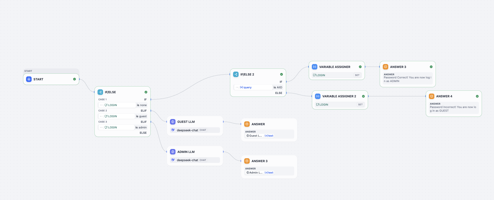

参考输入输出：

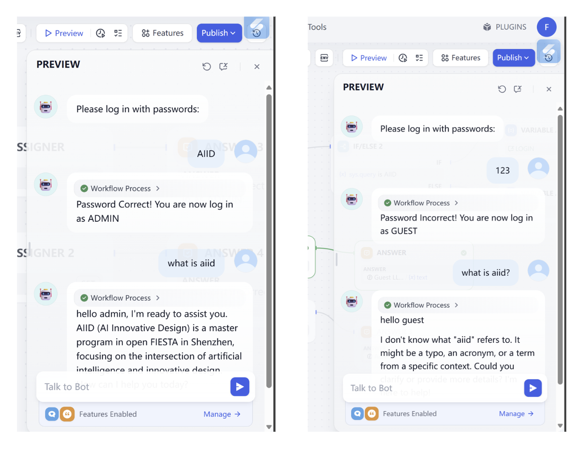

3. Love loop workflow 工作流解密挑战

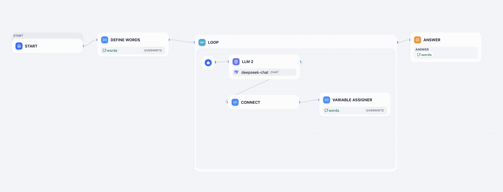

在这个解密挑战中，你需要修复当前工作流的问题，让工作流最后的输出类似如下显示：

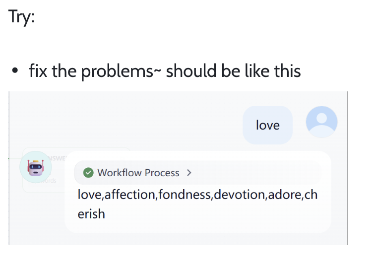

如果你遇到无法解决的问题，请截图询问大模型，或查阅官方文档得到结果：[https://docs.dify.ai/en/use-dify/getting-started/quick-start](https://docs.dify.ai/en/use-dify/getting-started/quick-start)

## 实现 Dify API 调用

为了测试你真正掌握了 Dify 的 API 调用知识，你需要完成以下任务：

1. 部署 Dify 并创建一个简单的知识库（选取你喜欢的资料)。
2. 使用 Trae IDE 构建一个对话前端，与 Dify 知识库进行 API 交互。
3. 测试多轮对话的效果，确保程序正常运行。

你需要提交最终运行截图和知识库的处理过程截图。

## 试用第三方工作流 / 构建一个自己的业务工作流

请你在 Github、微信公众号、或者 Reddit、推特上等所有地方找到你想尝试的别人的 Dify 工作流，下载导入后成功运行；或者你可以根据上文中提到的业务工作流参考，根据现实中的具体需求创建一个自己的业务工作流进行运行。

最后你需要提交运行成功的截图，并说明这个工作流的作用。

# [Bug] HTTP 请求错误问题的解决方法

如果你遇到了如下图所示的问题，才需要参考本节方案进行解决，否则可以不理会当前部分。

有时候可能你会把 Dify 部署在自己的服务器，但是服务器的对外地址通常都是 http 而不是 https 的，但当我们请求一个只支持 HTTP 的服务时，你可能会看到类似这样的提示（启用 F12 浏览器调试信息模式，查看有问题的点）：

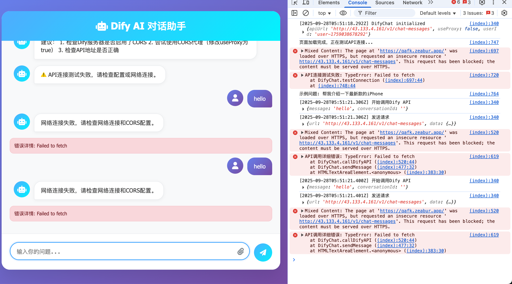

出现这个问题的原因，是因为我们默认把 Dify 部署在一台只支持 HTTP 而不支持 HTTPS 的服务器上。 HTTPS（HyperText Transfer Protocol Secure）是在 HTTP（超文本传输协议）的基础上增加了 SSL/TLS 加密层，可以简单理解为“更安全版的 HTTP”。

如果要让服务支持 HTTPS，一般可以：

- 使用其他程序转发请求（例如在有证书的 nginx 上做反向代理），或者
- 绑定域名后为该域名申请证书。

但这些操作都比较复杂，在这里我们使用 Zeabur 作为网络转发网关来解决问题。

Zeabur 的网页默认是通过 HTTPS 访问的，因此我们只需要把原来请求的域名转发到 Zeabur 提供的域名，就可以修复这个问题。

- 原始地址：`http://{DIFY_API_URL}/v1/chat-messages`
- 现在地址：`https://{DIFY_NEW_API_URL}.zeabur.app/v1/chat-messages`

你只需要简单地把 URL 中的域名部分（公网 IP 或域名）替换为已经在 Zeabur 上部署好的域名即可，我们已经提前在服务里配置好了转发功能。

如果你感兴趣，也可以自己在 Zeabur 上部署一个转发服务。在 Zeabur 中创建服务时，选择 Python，然后填入下面的 Python 代码，部署后即可得到一个 https 的地址，https 即可正常使用。

部署完成后，在网络设置中把程序监听端口设置为本地 8080，并对外暴露该端口。

注意：请将 `{DIFY_API_URL}` 替换为实际的 Dify API 地址。

```Python
from flask import Flask, request, Response
import requests

app = Flask(__name__)

TARGET_BASE_URL = "{DIFY_API_URL}"
LISTEN_PORT = 8080

@app.route('/', defaults={'path': ''}, methods=['GET', 'POST', 'PUT', 'DELETE', 'PATCH', 'OPTIONS', 'HEAD'])
@app.route('/<path:path>', methods=['GET', 'POST', 'PUT', 'DELETE', 'PATCH', 'OPTIONS', 'HEAD'])
def proxy_request(path):
    target_url = f"{TARGET_BASE_URL}/{path}"
    if request.query_string:
        target_url += f"?{request.query_string.decode('utf-8')}"

    headers = {key: value for key, value in request.headers if key.lower() not in ['host', 'connection', 'content-length', 'accept-encoding']}

    try:
        resp = requests.request(
            method=request.method,
            url=target_url,
            headers=headers,
            data=request.get_data(),
            cookies=request.cookies,
            allow_redirects=False,
            timeout=30
        )

        excluded_headers = ['content-encoding', 'content-length', 'transfer-encoding', 'connection']
        response_headers = [(name, value) for name, value in resp.raw.headers.items() if name.lower() not in excluded_headers]

        return Response(resp.content, resp.status_code, response_headers)

    except requests.exceptions.RequestException as e:
        print(f"Error forwarding request to {target_url}: {e}")
        return Response(f"Proxy Error: Could not reach target server or invalid response: {e}", status=502)
    except Exception as e:
        print(f"An unexpected error occurred: {e}")
        return Response(f"Internal Proxy Error: {e}", status=500)

if __name__ == '__main__':
    app.run(host='0.0.0.0', port=LISTEN_PORT, debug=True)
```
