# Project 5: 从数据库到 Supabase

在上节课中，我们学会了 UI 设计程序 Mastergo 和 Figma 的基本用法，能够使用 github 进行代码的获取与版本管理，并通过 Zeabur 部署网站将自己的应用 / 网站传达给更多人使用。

为了帮助大家更好地衔接知识，在开始本节课关于设计工具与部署的新内容前，让我们一起通过几道简单的题目快速回顾一下上节课的核心知识点：

1. 什么是前端设计工具、Figma、MasterGo 的定义和使用方式。
2. 将设计稿转换为代码的基础方法。
3. 什么是 Github，如何配置 SSH，如何构建自己的第一个仓库。
4. 部署是什么意思，如何使用 Zeabur，如何将 Github 或本地代码部署至公共网络给大家访问。

如果对以上任何一个问题还有印象模糊的地方，建议先回顾一下上节课的文档和讲义。欢迎随时在微信学习群中提出疑问。

在本节课中，我们将学习如何让一个 APP / 网站从能跑起来变为更接近真实线上产品：除了用数据库管理程序运行中的各种数据变化外，还要具备完善的用户体系（注册、登录、权限等）以及其他关键后端能力。我们会以 Supabase 这一后端服务平台为主线，先用它实现“数据库 + 用户系统”这两项基础功能，再以 Supabase 提供的组件为参照，进一步理解现代云服务后端服务通常包含的核心模块，以及各模块的具体职能与作用逻辑。

# 你将学到

1. 什么是数据、什么是数据库，常见数据库与使用方法
2. 什么是 supabase，如何使用 supabase 进行基础的数据库操作
3. 如何使用 supabase 为应用添加基础用户管理功能
4. 学会 Supabse 进阶功能：realtime、storage、edge function
5. 学会为Supabase增加 google 与 github 登录支持

- 一款支持用户注册 / 登录，并能将数据存入在线数据库的基础应用
- 一套可复用的 Supabase 后端代码模板（数据库 + 用户管理等），供后续项目直接套用

# 1. What is Database

## 1.1 What is Data

在数字世界里，数据（Data）无处不在。简单来说，数据是信息的载体。你朋友的联系方式、一篇微信文章、一条短视频、游戏里的角色等级，这些都是数据。在我们的应用中，数据就是需要被记录和管理的一切信息，比如用户的个人资料、订单历史、程序设置等。

一般而言，数据在程序中有不同的表现形式，最简单的就是变量，我们可以用不同变量记录简单的数字：

```Plain
# Python variable definition examples

# Integer variable: stores age information
age = 30

# Boolean variable: stores status (whether active)
is_active = True  # True means active, False means inactive

# List variable: stores a set of score data
scores = [85, 92, 78, 90]  # Contains 4 integer elements representing different scores

# Dictionary variable: stores multiple related information of a user
user_info = {
    "age": 30,           # Key "age" corresponds to the value of age
    "height": 1.80,      # Key "height" corresponds to the value of height (unit: meter)
    "login_count": 156   # Key "login_count" corresponds to the value of login times
}
```

而对于上述所说的个人资料、订单历史这类复杂的数据而言，我们可以用更复杂的表格进行数据的表示：

| user_id | name  | email             |
| ------- | ----- | ----------------- |
| 1001    | Alice | alice@example.com |
| 1002    | Bob   | bob@example.com   |

| order_id | user_id | amount | status    |
| -------- | ------- | ------ | --------- |
| 901      | 1001    | 29.99  | completed |
| 902      | 1002    | 15.50  | pending   |

但对于结构复杂、具有层级关系或字段不固定的数据，我们可以用 JSON 格式进行描述 —— 它是互联网通用的数据中间格式，几乎所有程序都能读取解析，跨系统传数据很方便。例如，一个订单可能包含多个商品，每个商品又有自己的名称、数量和价格。用传统的表格来表示会很笨拙：要么得拆成 “订单表”“商品表” 多张表，靠关联字段才能体现 “订单包含商品” 的关系；要么在一张表用 “商品 1 名称、商品 1 价格、商品 2 名称……” 这类冗余字段，遇到商品数量不固定时根本没法适配；而 JSON 能直接用嵌套结构把 “订单 - 商品 - 商品属性” 的层级说清，既直观又灵活。

```JSON
{
  "order_id": 901,
  "user_id": 1001,
  "amount": 29.99,
  "status": "completed",
  "items": [
    { "sku": "BG-001", "name": "牛肉汉堡", "quantity": 1, "price": 18.00 },
    { "sku": "SD-003", "name": "炸薯条", "quantity": 1, "price": 6.99 },
    { "sku": "DK-002", "name": "可乐", "quantity": 1, "price": 5.00 }
  ],
  "shipping_address": {
    "street": "科技园路123号",
    "city": "深圳",
    "zip_code": "518057"
  }
}
```

更进一步的，如果我们考虑一个被编码成向量（Vector）的数据，向量数据通常是文本、图片或音频等非结构化数据经过 AI 模型（如 Embedding 模型）处理后得到的数值表示。它的表示形式可能是：

`[0.123, -0.456, 0.789, ..., -0.234]` (一个由几百甚至上千个浮点数组成的数组)

总的来说，在现实世界中有太多不同形态、用途的数据值得我们详细分析，每种数据可能都需要专门的数据库用于存储，具体可参考下图——是不是感觉非常多？

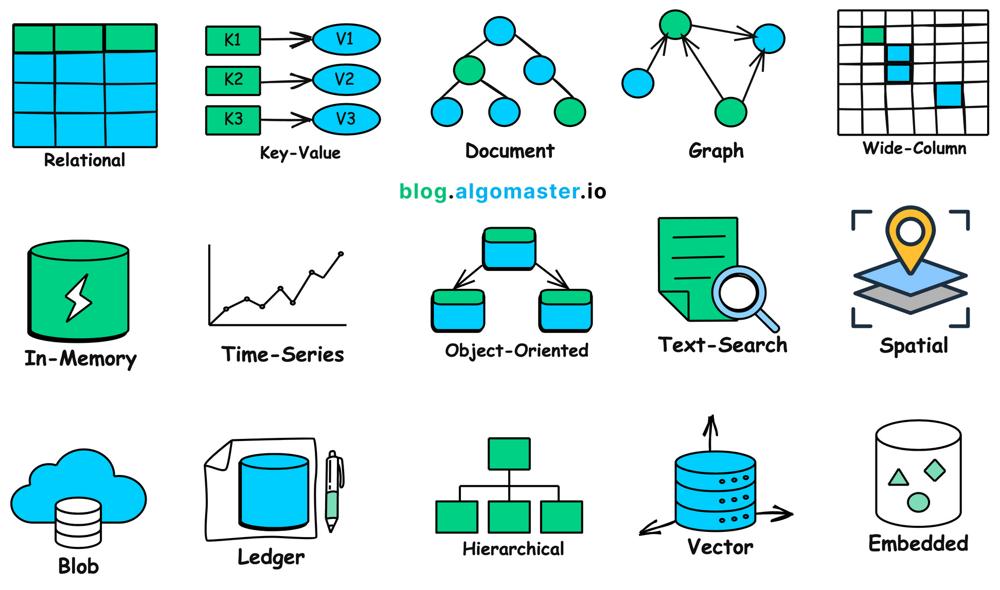

## 1.2 Why We Need Database

我们已经了解到真实世界中的数据往往结构复杂，**为了高效存储与使用这些数据，我们需要一个专门的程序或容器来管理它们** —— 这便是数据库（Database）的诞生初衷。数据库本质上是一款特殊程序，核心作用就是对数据进行规范化组织、安全存储、系统化管理，并支持高效查询调用。

想象一下，若没有数据库，应用数据会陷入怎样的困境？当用户关闭浏览器或退出应用时，所有临时加载的信息都会直接丢失；我们既无法永久保存用户的使用状态（比如登录信息、个性化设置），也没法在不同用户之间共享关键数据（比如商品库存、订单记录）。我们需要有一个装置帮我们存储所有的数据！

更灵活的是，数据库的部署方式可按需选择：既可以部署在本地服务器，满足数据本地化管理的需求；也能部署到云端，云端数据库支持弹性扩容（Scale），可随数据量与访问量增长扩展能力、承载海量数据与高并发，即便用户量大幅提升，也能保障用户的正常使用体验。

归纳而言，数据库凭借高效的持久化存储、精细化管理与快速查询能力，主要解决了以下核心问题：

- **数据的持久化存储** ： 如果没有数据库，数据将仅存在于应用的内存中，一旦应用关闭，数据就会丢失。数据库解决了这个问题，它将数据持久地存储在硬盘等存储介质上，确保了数据的长期保存，降低了丢失风险。
- **便捷的数据查询与分析** ： 数据库提供了强大的查询语言（如 SQL），让用户可以轻松、高效地对海量数据进行复杂的查询、筛选和分析，从而帮助企业做出更明智的决策。 如果没有数据库，从大量无序文件中查找特定信息将是一项极其耗时且困难的任务。
- **支持高性能与高并发访问** ： 数据库通过索引优化、查询缓存、连接池以及分布式架构等技术，能够在毫秒级时间内响应查询请求，并支撑成千上万用户的并发访问。这对于现代互联网应用（如电商平台秒杀活动、社交网络实时动态）至关重要，确保了系统的响应速度和用户体验。如果没有数据库的高性能支撑，面对海量用户请求时系统将会出现严重延迟甚至崩溃。
- **保证数据的完整性和一致性** ： 数据库通过一系列机制（如约束、触发器）来确保数据的准确性和一致性。 这意味着数据库中的数据必须符合预设的规则，例如，用户的年龄必须是数字，订单号必须是唯一的，从而有效防止了非法或无效数据的产生。
- **确保数据的安全性** ： 数据库提供了强大的安全机制，包括用户身份验证、访问控制和数据加密等，以保护数据免受未经授权的访问、修改或破坏。为了应对硬件故障、人为失误或恶意攻击等意外情况，数据库还提供了数据备份和恢复功能。 通过定期备份，可以在数据丢失或损坏时及时恢复，保障了业务的连续性。

## 1.3 Relational Database VS Non-Relational Database (NOSQL)

前面我们已经了解了数据库的核心价值、部署方式与弹性优势，而在实际选择时，首先要面对的就是数据库的两大核心类别：关系型数据库与非关系型数据库（NOSQL），我们可以用简单的两段话简单理解他们的区别：

关系型数据库就像结构严谨的Excel表格，所有数据必须预先定义好格式（定义好 Schema 的内容, 比如要有姓名和年龄，且姓名必须是文字，年龄必须是数字），并通过关联字段（用来连接不同表格的标识，如身份证号）将不同表格连接起来。它的好处是数据精确可靠，特别适合银行转账、库存管理等不能出错的场景，但缺点是调整结构比较麻烦，海量数据下性能会受限。

非关系型数据库则像灵活的文件夹，可以存放格式各异的文档、图片或键值对（类似字典的"词-解释"结构），不需要提前规定好每份数据的结构。它更容易应对快速变化的需求和超大规模数据（比如社交媒体的海量帖子），扩展（增加服务器提升性能）起来也更方便，但牺牲了部分关联查询能力（跨不同数据表整理信息的能力）和一致性保障（确保数据时刻准确不矛盾），适合对容错性要求较高的互联网应用。

那么，实际应用中该如何选择数据库？从场景划分总结来看，关系型数据库常见于金融交易、库存管理、订单处理、账务系统等需要强一致性、复杂事务处理以及频繁读写均衡访问的场景；而非关系型数据库更适配社交媒体内容存储、实时日志分析、物联网海量数据写入、推荐系统特征读多写多等高并发、读写模式不均衡且结构灵活的需求。

但对于企业而言，在初级阶段并不需要花大量时间思考什么需要使用什么数据库。当前的数据库已是非常成熟的产品服务，最直接的方式是咨询不同云服务厂商（指提供服务器、存储、数据库、软件、算力等 IT 资源与技术服务的服务商）。我们可直接对接云服务官方销售，根据自身产品业务需求匹配适配的数据库方案；而构建企业级应用的便捷路径，便是优先与专业厂商合作。（需注意：企业级服务价格通常较高，建议先多方调研对比，也可选择购买服务器自行部署开源数据库程序作为替代方案。）

我们也可参考某家云厂商的[数据库选型推荐](https://help.aliyun.com/zh/govcloud/getting-started/select-database-services)，根据场景可进行不同数据库类型的选择，你可以对比不同云厂商的数据库规格选出最合适的进行使用。

| 数据库类型       | 数据库名称  | 价格                                                                                                                                                                                                                                                                                                                             | 适用场景                                                                                                                         |
| ---------------- | ----------- | -------------------------------------------------------------------------------------------------------------------------------------------------------------------------------------------------------------------------------------------------------------------------------------------------------------------------------- | -------------------------------------------------------------------------------------------------------------------------------- |
| 关系型数据库     | RDS MySQL版 | 低                                                                                                                                                                                                                                                                                                                               | 基础版：学习以及小型网站高可用版：一定业务压力的中型数据库场景集群版：业务不允许中断，访问压力较大                               |
| RDS SQL server版 | 高          | 基础版：测试以及小型商业化网站高可用版：企业级商业化网站集群版：企业业务不允许中断，访问压力较大                                                                                                                                                                                                                                 |                                                                                                                                  |
| RDS PostgreSQL版 | 最低        | 基础版：学习以及小型网站高可用版：一定业务压力的中型数据库场景集群版：业务不允许中断，访问压力较大的场景，其性能较一般MySQL高                                                                                                                                                                                                    |                                                                                                                                  |
| RDS PPAS版       | 高          | 通用型：兼容Oracle业务，但业务压力Udacity，虚拟化可以满足其需求独享型：面对需要独享物理机的业务，一般为高并发Oracle类业务                                                                                                                                                                                                        |                                                                                                                                  |
| DRDS             | 中          | 入门版本：4 Core 8 G，价格亲民，适合中小型在线业务企业版：16 Core 32 G，复杂 SQL 响应好，适合超高并发在线业务至尊版：32 Core 64 G，复杂 SQL 执行响应最好，提供超大规格选择                                                                                                                                                       |                                                                                                                                  |
| NoSQL数据库      | Redis       | 中                                                                                                                                                                                                                                                                                                                               | 双机热备Redis：一般作为持久化数据库提高业务可用性集群版本的Redis：一般作为缓存层，加速应用访问，解决一般数据库无法负载的读取压力 |
| MongoDB版        | 中          | 单节点实例单节点：适用于开发、测试及其他非企业核心数据存储的场景副本集实例：适用于某些业务场景下对数据库有更高读取性能需求，如阅读类网站、订单查询系统等读多写少场景或有临时活动等突发业务需求分片集群实例：基于多个副本集（每个副本集沿用三副本模式）组成的分片集群实例，提供更高的读取性能需求，为实时在线业务提供高速读取性能 |                                                                                                                                  |

光说不易理解，我们通过一个具体的“博客文章”场景，来看看同样的数据在关系数据库 (SQL) 和不同类型的非关系数据库 (NoSQL) 中是如何存储的。

假设我们有一个博客平台，需要存储以下信息：

- 用户（Users）：用户 ID、用户名、邮箱
- 文章（Posts）：文章 ID、标题、内容、作者 ID
- 评论（Comments）：评论 ID、评论内容、评论者 ID、所属文章 ID
- 标签（Tags）：标签 ID、标签名
- 文章与标签的关系：单篇文章关联的多个标签、单个标签对应的多篇文章

### 关系数据库 (SQL) 示例

在SQL数据库中，我们会将不同类型的数据分别存储在不同的表中，并通过“外键”将它们关联起来。这种结构清晰、规范，减少了数据冗余。

以 “内容平台的文章管理” 为例，我们不会把 “用户、文章、评论、标签” 混存，而是拆成 5 张功能单一的表，每张表都有明确的 “职责边界” 和严格的结构定义（Schema）：

- `users` 表 (存储用户信息)

| user_id (主键) | username | email             |
| -------------- | -------- | ----------------- |
| 101            | Alice    | alice@example.com |
| 102            | Bob      | bob@example.com   |

- `posts` 表 (存储文章信息)

| post_id (主键) | title     | content                        | author_id (外键) |
| -------------- | --------- | ------------------------------ | ---------------- |
| 1              | 初识SQL   | 这是关于SQL数据库的一篇文章... | 101              |
| 2              | NoSQL入门 | NoSQL提供了灵活的数据模型...   | 102              |

- `comments` 表 (存储评论信息)

| comment_id (主键) | body             | commenter_id (外键) | post_id (外键) |
| ----------------- | ---------------- | ------------------- | -------------- |
| 1001              | 写得很棒！       | 102                 | 1              |
| 1002              | 学习了。         | 101                 | 2              |
| 1003              | 有没有更多例子？ | 101                 | 1              |

- `tags` 表 (存储标签)

| tag_id (主键) | tag_name |
| ------------- | -------- |
| 51            | 数据库   |
| 52            | 技术     |
| 53            | 入门     |

- `post_tags` 表 (存储文章与标签的多对多关系，体现联表特点)

| post_id (外键) | tag_id (外键) |
| -------------- | ------------- |
| 1              | 51            |
| 1              | 52            |
| 2              | 51            |
| 2              | 52            |
| 2              | 53            |

若需查询 “Alice 发表的《初识 SQL》（post_id=1）的完整信息（含文章内容、作者、评论、标签）”，需执行多表连接（JOIN）查询，通过外键关联 5 张表并聚合数据，SQL 语句如下：

```SQL
SELECT
    p.title,
    p.content,
    u.username AS author,
    c.body AS comment,
    t.tag_name AS tag
FROM
    posts p
JOIN
    users u ON p.author_id = u.user_id
LEFT JOIN
    comments c ON p.post_id = c.post_id
LEFT JOIN
    post_tags pt ON p.post_id = pt.post_id
LEFT JOIN
    tags t ON pt.tag_id = t.tag_id
WHERE
    p.post_id = 1;
```

这个查询会跨越5个表，将所有相关数据聚合在一起返回。这是关系数据库的核心优势：通过规范化和连接操作，可以灵活地进行各种复杂的查询，同时保证了数据的一致性和最小冗余。

### 非关系数据库 (NoSQL) 示例

NoSQL 数据库（如 MongoDB、Redis）的设计思路与 SQL 相反，它不强调数据的拆分与规范，通常会将业务上相关联的所有数据打包聚合在一起，以减少查询时的连接操作，从而提高读取性能。

在 NoSQL 数据库中，文档数据库（Document Database） 是最常用的类型之一，MongoDB 就是典型代表。它以 “文档” 作为基本存储单元，这里的 “文档” 并非我们日常理解的 “文章”，而是一种类似 JSON 的数据结构（MongoDB 中实际使用 BSON 格式，支持更多数据类型）：无需预先定义统一的 Schema（数据结构），每个文档的字段可以灵活增减，字段类型也能自由调整，完美适配数据格式多变的场景。

在文档数据库中，通常会将一篇文章及其所有相关信息（如评论、标签）存储在一个文档中（文档格式类似 JSON，可灵活定义字段，无需预先制定 Schema），核心逻辑是 “将‘一个业务场景下的完整信息’存放在一个文档中”，避免查询时的多数据源拼接。

`posts` 集合中的一个文档示例：

```JSON
{
  "_id": 1,
  "title": "初识SQL",
  "content": "这是关于SQL数据库的一篇文章...",
  "author": {
    "user_id": 101,
    "username": "Alice",
    "email": "alice@example.com"
  },
  "tags": [
    "数据库",
    "技术"
  ],
  "comments": [
    {
      "comment_id": 1001,
      "body": "写得很棒！",
      "commenter": {
        "user_id": 102,
        "username": "Bob"
      }
    },
    {
      "comment_id": 1003,
      "body": "有没有更多例子？",
      "commenter": {
        "user_id": 101,
        "username": "Alice"
      }
    }
  ]
}
```

这种设计的优势非常直观：当你需要获取 “第一篇文章的完整信息（含作者、评论、标签）” 时，只需通过 `_id:1` 查询这一个文档，数据库一次读取就能返回所有数据，无需像 SQL 那样执行 3-4 次表连接操作，读取效率大幅提升。

但它也存在明显的 trade-off（取舍）：由于数据是 “聚合存储”，会不可避免地产生数据冗余—— 比如作者 “Alice” 的 `username` 被嵌入到她写的每一篇文章文档中，如果某天 “Alice” 将用户名改为 “Alice_New”，理论上需要遍历所有包含她信息的文章文档，逐一更新 `author.username` 字段，不仅操作繁琐，还可能因网络或服务器问题导致部分文档更新失败，出现 “同一用户在不同文章中用户名不一致” 的情况。

不过在实际业务中，这种冗余往往是 “可接受的”：对于博客、资讯、电商商品详情等 “ **读多写少** ” 的场景（用户查看内容的次数远多于作者修改用户名的次数），用少量的冗余换取 “极致的读取性能” 是更优的选择；而如果是 “写多读少”（如频繁修改用户信息）的场景，则需要结合业务需求权衡是否使用文档数据库。

以上是对不同数据库的简单介绍，如果你对更多具体的数据库类型感兴趣，你可以参考如下资料尝试不同类型的数据库。

Examples of SQL databases：
[Db2](https://www.ibm.com/products/db2-database)、[MySQL](https://cloud.ibm.com/catalog#highlights)、[PostgreSQL](https://www.ibm.com/think/topics/postgresql)、[YugabyteDB](https://www.yugabyte.com/)、[CockroachDB](https://www.cockroachlabs.com/)、[Oracle Database](https://www.ibm.com/products/postgres-enterprise)、[Azure SQL Database](https://www.ibm.com/consulting/microsoft)

Examples of NoSQL databases：
[Redis](https://www.ibm.com/think/topics/redis)、[CouchDB](https://www.ibm.com/think/topics/couchdb)、[MongoDB](https://www.ibm.com/think/topics/mongodb)、[Cassandra](https://cloud.ibm.com/catalog#highlights)、[Elasticsearch](https://www.ibm.com/think/topics/elasticsearch)、[BigTable](https://www.techtarget.com/searchdatamanagement/news/252512583/Google-scales-up-Cloud-Bigtable-NoSQL-database)、[Neo4j](https://neo4j.com/users/ibm/)、[HBase](https://www.ibm.com/think/topics/hbase)

# 2. Supabase

在前面我们已经介绍了几类常见的数据库，以及它们各自适合的使用场景。不过在真实项目里，数据库通常只是后端体系中的一个基础模块：除了存储和查询数据，你还需要解决**用户注册登录、权限校验、文件上传与存储、对外 \*\***API\***\* 接口、甚至定时任务、实时通知**等一整套问题。仅仅选好数据库，并不能让你的应用“立刻就能上线运行”，中间还隔着一大圈繁琐的后端工程工作。

所以，我们需要考虑一个更大的背景： **后端服务** 。一个完整的应用，通常都由“前端 + 后端”组成：前端负责页面展示和用户交互，后端则负责数据存储、用户登录、业务逻辑处理等。过去，开发者往往需要自己搭建服务器、配置数据库、设计并实现 API，还要手动处理权限管理、安全策略、扩展性和监控运维等事务，整个过程既重复又耗时。为了解决这些重复劳动，业界出现了 **BaaS（Backend as a Service，后端即服务）** ：把数据库、用户认证、文件存储、实时能力等常见后端功能打包成一个云端平台，开发者通过 SDK / API 就能直接调用这些能力，而无需从零搭建和运维基础设施。

在这个背景下，[Supabase](https://supabase.com/) 就可以看作是新一代的 BaaS 代表：它以 PostgreSQL 作为核心数据库，在其之上集成了 Auth、Storage、Realtime、Edge Functions、Vector 等一整套后端能力，为开发者提供一个“以 Postgres 为中心的一站式后端平台”。接下来，我们就从这个角度出发，从“只选数据库”升级到“选择完整的后端开发平台”，具体看看 Supabase 能帮我们省掉哪些工作，又是如何让一个项目从原型到可用产品的距离大幅缩短的。

## 2.1 Step by Step Guide

在清晰把握 Supabase 的整体定位后，接下来我们将沿着 Supabase 控制台的操作路径，逐项拆解它具体提供哪些核心能力，以及每项能力对应的核心职责。我们会详细介绍 supabase 涉及的每个选项，帮助你快速入门 supabase 的基本操作。

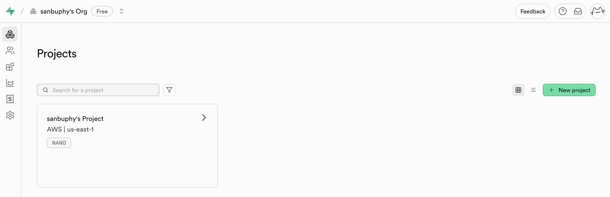

访问 Supabase 官网并登录后，在控制台首页点击 New project 进入创建流程；

输入需要配置的主要内容 Project Name、数据库密码，地址只需要选择为与程序目标用户最接近的区域即可。


创建成功后，控制台左侧侧边栏将显示所有核心功能模块（Table Editor、SQL Editor、Database、Authentication 等），后续操作将围绕这些模块展开。

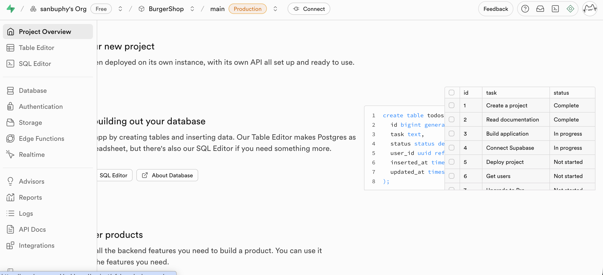

### Table Editor

Table Editor 可以当成是 Supabase 的可视化数据表编辑器，它能让你像操作 Excel 一样直接查看和修改数据库里的数据，无需编写 SQL 语句，只需要用鼠标交互即可修改数据内容。

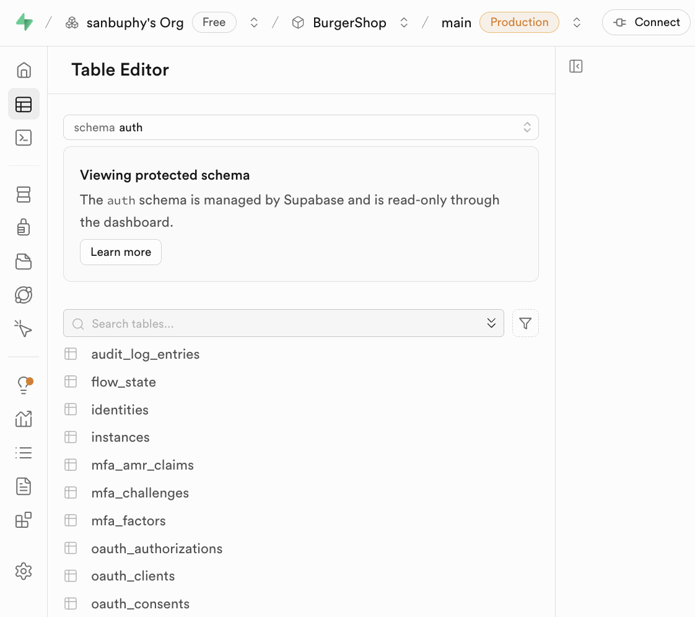

其中值得关注的是 Schema，Schema 可理解为数据库内的 “资源容器”，用于对表、视图、函数、索引等资源进行分组管理，主要作用有二：一是避免命名冲突（不同 Schema 下可存在同名table），二是实现权限隔离（如仅允许特定用户访问某 Schema 下的表）；

点击编辑器顶部的 Schema 下拉框可切换不同容器，日常开发中一般只需关注两类：

- `public`：默认的公共资源容器，开发者新建的业务表（如 “文章表”“评论表”）均存储于此；
- `auth`：用户认证专属容器，其中的 `users` 表自动存储所有注册用户信息（如用户 ID、邮箱、登录时间），不建议手动修改此 Schema 下的默认表，避免影响认证功能；

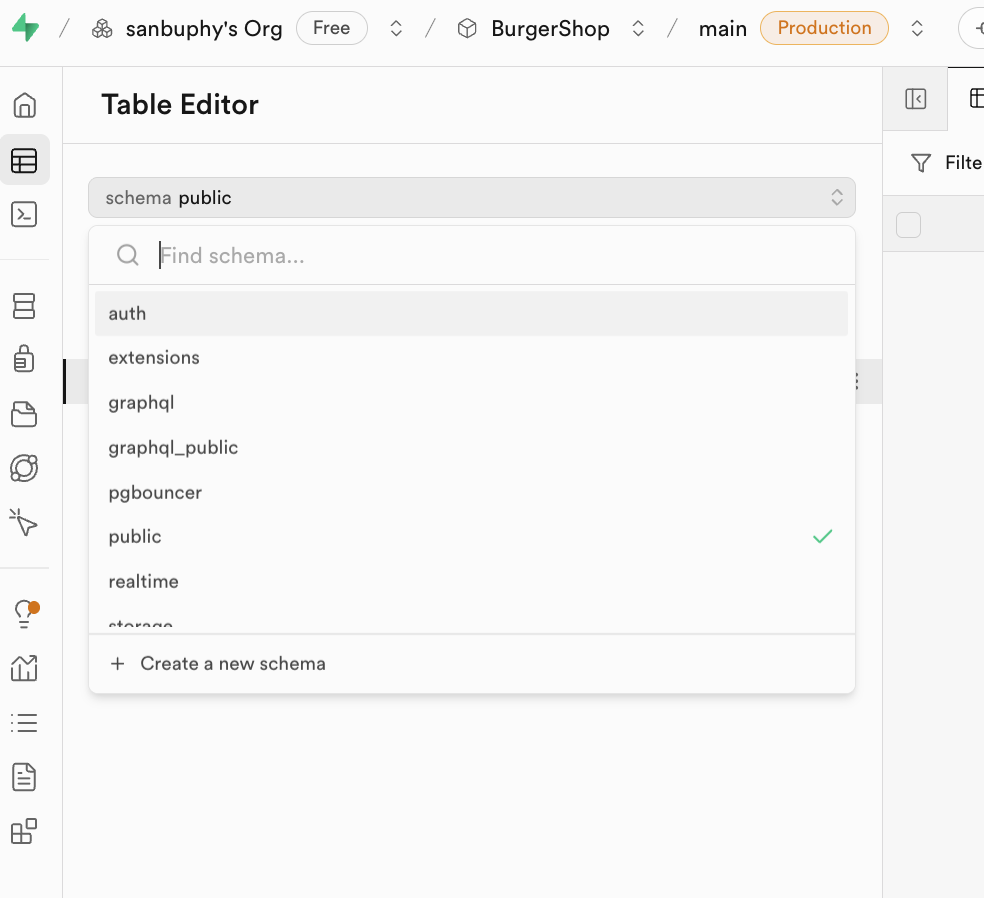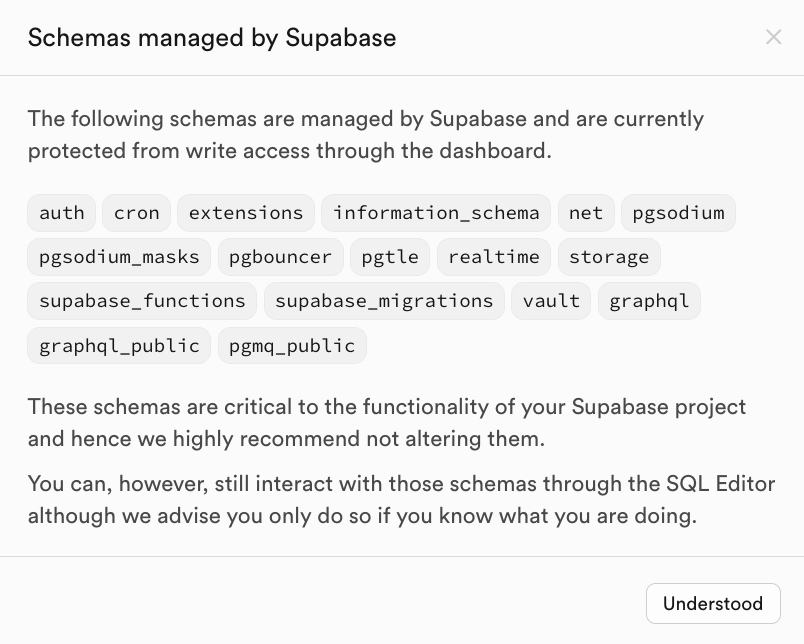

### SQL Editor

SQL Editor 作为 Supabase 的 SQL 语句执行器，可让你用代码的方式直接操作数据库。你可以让大模型直接生成 SQL 语句，在右侧输入后点击 RUN 即可用语句创建或修改 table，也可以直接在 Results 中直接看到筛选出的 table 数据。

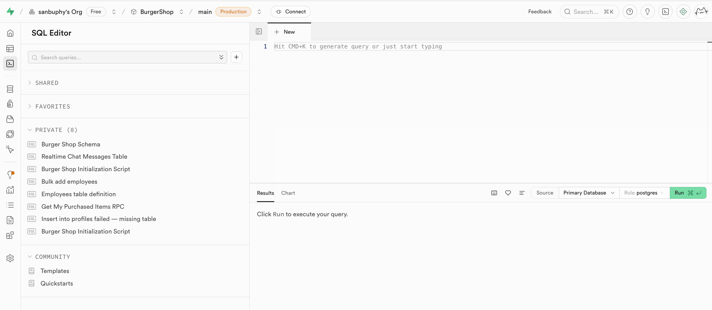

你可以在运行 RUN 之后，在 Table Editor 的 public schema 里找到新建后的数据表；并且运行后的语句会保存在左侧的 PRIVATE 栏中，甚至可以点击下方的爱心标志对这一条查询或创建语句进行收藏。

### Database

Database 是 Supabase 的数据库管理中心，支持可视化地查看和管理所有数据表，并通过表的相互连线理解不同表间的关联关系（即外键约束，表示数据间的引用关系）。

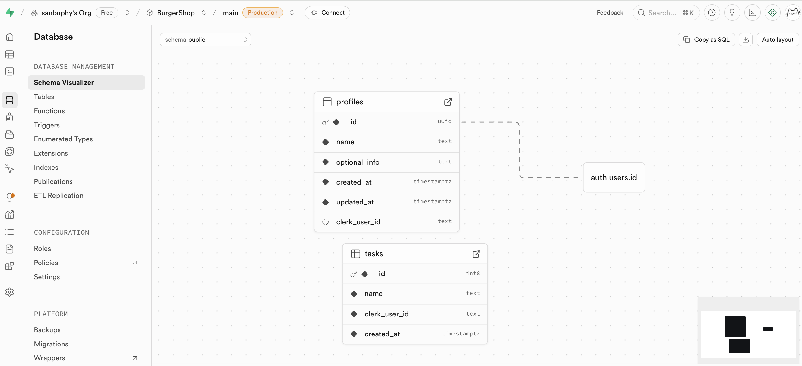

如果你想要手动新建 table，可以在 tables 中直接新建表格，我们会在之后的教程中详细讲解。

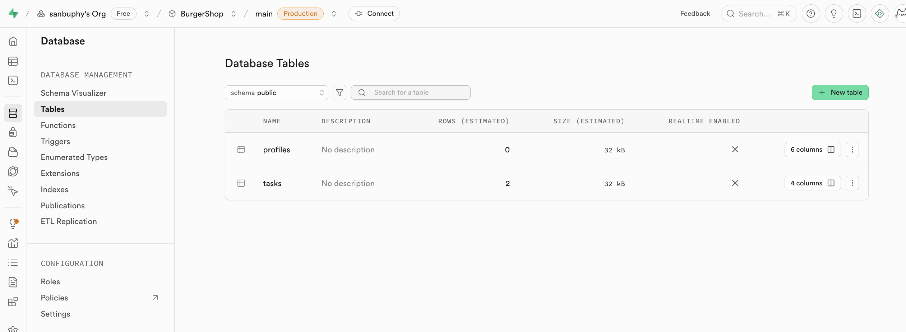

### Authentication

Authentication 负责管理用户的注册、登录和权限。默认的用户管理系统数据都在此处存储，它提供了开箱即用的用户注册、登录、密码重置、邮箱验证等功能，并支持第三方 OAuth 登录（如微信、GitHub、Google 等）。所有用户数据会自动同步到数据库的 `auth.users` 表中。

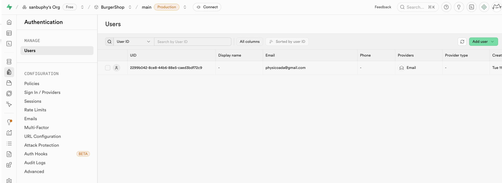

你可以在 Provider 选项中找到不同 supabase 支持的用户信息登录入口，默认使用 Email；如果你想使用 Github 或者 Google 账户进行登录，还需要更多属性配置，我们会在下面的课程中进行详细讲解。

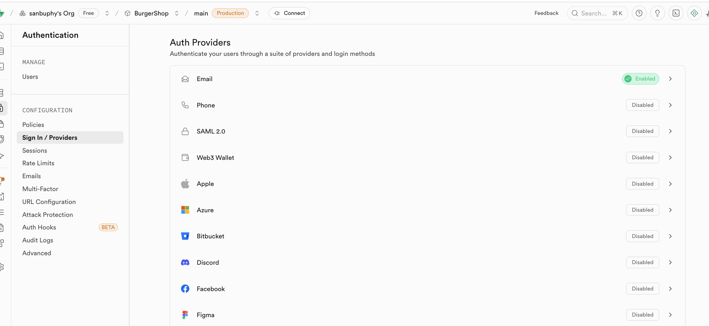

在 Sign In / Providers 里还包含了对注册邮箱行为的控制，如果你不想每次邮箱注册都必须让用户接受邀请后才能成为用户，你可以取消 Confirm email 的强制要求。

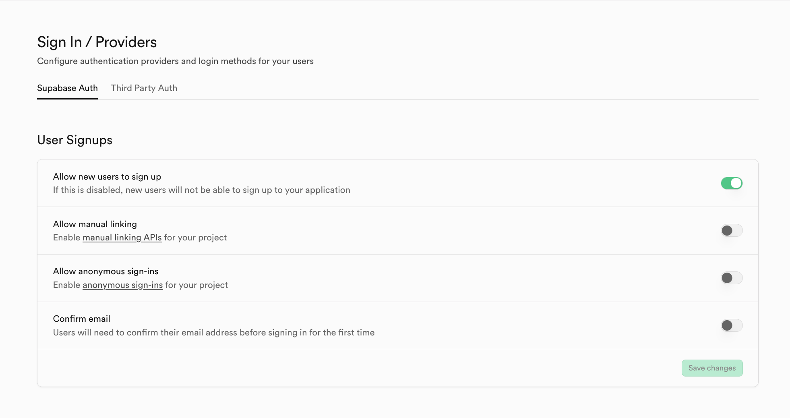

如果你想切换非 Supabase 的其他 auth 系统服务商，你可以点击 Third Party Auth，比如此处就使用 Clerk 作为第三方的系统服务商。

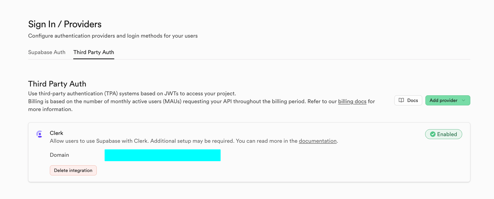

如果你担心注册用户在短期内访问量过大，你可以在 Rate Limits 中启用对应的流量限制策略：

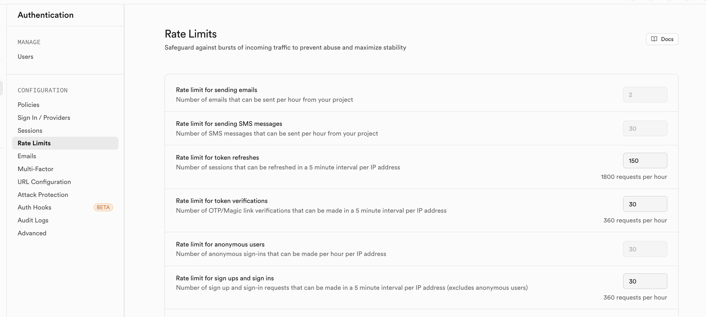

### Storage

Storage 是 Supabase 的存储系统，兼容 amazon cloud 的 s3 概念，可用于存储任意类型的文件（如图片、视频、文档、音频等），并提供访问权限管理（公开或私有）和下载链接获取（永久链接或临时链接），你能够很方便在应用中对用户涉及到的文件内容进行上传与下载管理，并与 Supabase 的认证系统无缝集成，实现精细化的访问控制。


我们将会在本节课的进阶 project 中讲解 storage 的具体用法。


如果你想使用 S3 的相关协议进行操作，可以直接使用对应的配置：

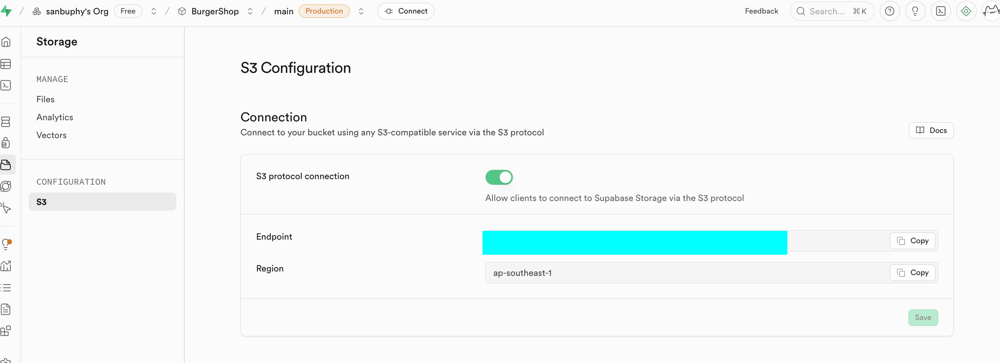

> Amazon Cloud（亚马逊云服务，简称 AWS）是亚马逊提供的云计算平台（就像一个大型的网络机房，你可以按需租用计算和存储资源）。S3（Simple Storage Service）是 AWS 里专门用来存储文件的服务（类似一个无限大的网盘，可以存图片、视频、备份等各种文件），它是目前最流行的对象存储服务，已经成为了事实上的行业标准。
>
> **为什么要做成 S3 兼容 \*\***API\*\* ** ?** ：S3 已经存在近 20 年，市面上有大量现成的工具、SDK 和文档，兼容 S3 意味着你可以直接用这些资源，不用从头开始制作各类相关工具，能够快速满足业务上线的需求。

### Edge Functions

如果你不想部署后端，但是想使用数据库和函数操作，你可以使用 Edge Functions 构建无需自建服务器的后端核心能力，它是 Supabase 提供的全球分布式服务端函数。简单来说，它让你无需购买和管理自己的后端服务器，就能直接编写并部署在云端的后端代码。这些函数部署在全球网络的边缘节点上，会自动在离你的用户最近的位置运行，从而大幅降低网络延迟，提供极致的响应速度。你可以在 Supabase 的仪表盘中直接创建、编辑和部署，整个开发流程非常便捷。

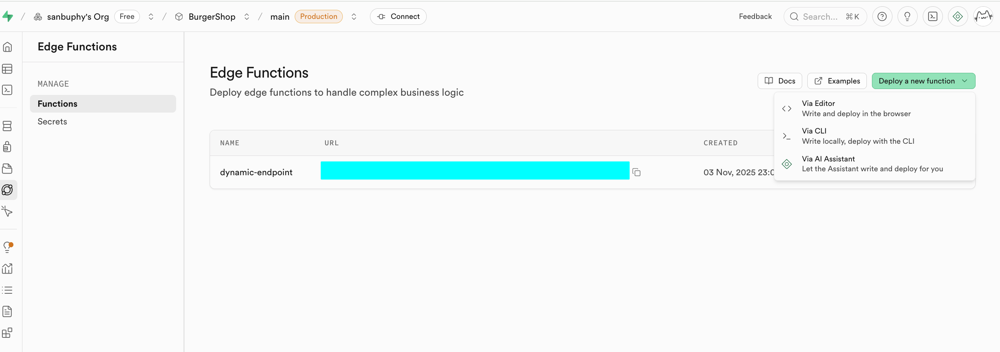

Edge Functions 的一个核心用途是充当安全的中间层，保护你的敏感信息和鉴权密钥。在前端代码中直接调用第三方服务（如 OpenAI、Stripe）会暴露你的 API Key，带来极大的安全风险。通过 Edge Functions，你的前端应用只与你的 supabase 函数通信，所有秘密只在 supabase 中保管。

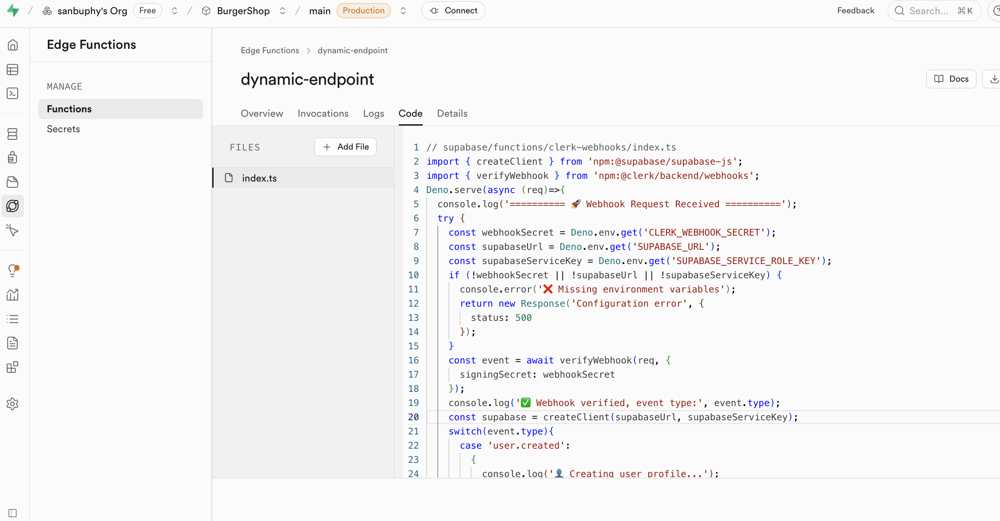

Edge Functions 的函数使用 secrets 中暴露的密钥作为环境变量，通过 `Deno.env.get` 加载，从而实现第三方服务的调用。这样一来，敏感密钥就永远不会暴露在客户端（你的浏览器），彻底杜绝了被盗用的风险。

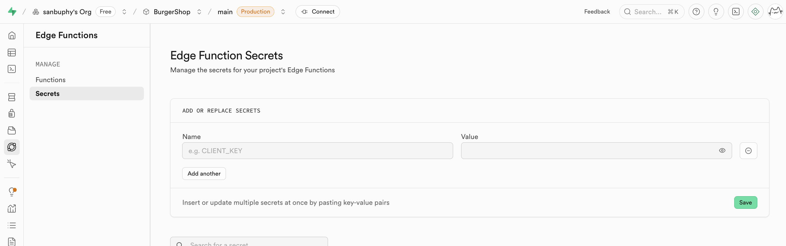

请求 Supabase Edge Function 时，需在请求头携带对应的 Supabase 密钥，下面是一个极简示例：

```JavaScript
// 核心配置（替换为你的实际信息）
const projectId = "你的 Supabase 项目ID";
const functionName = "目标 Edge Function 名称";
const supabaseKey = "Supabase anon_key";

// 调用函数
async function callEdgeFunction() {
  const url = `https://${projectId}.supabase.co/functions/v1/${functionName}`;

  try {
    const response = await fetch(url, {
      method: "POST",
      headers: {
        "Content-Type": "application/json",
        "Authorization": `Bearer ${supabaseKey}` // 关键：携带密钥完成认证
      },
      body: JSON.stringify({ order_id: "123", action: "refund" }) // 自定义请求数据
    });

    const result = await response.json();
    console.log("调用成功：", result);
  } catch (error) {
    console.error("调用失败：", error.message);
  }
}

// 执行调用
callEdgeFunction();
```

此外，Edge Functions 与 Supabase 的用户认证系统无缝集成。当已登录的用户调用一个函数时，其身份信息会传递给函数。这使得你可以在函数内部轻松识别当前用户，并根据其身份执行权限控制。更重要的是，函数在操作数据库时会自动遵循你设置好的行级安全策略（Row Level Security），确保用户只能访问和修改他们有权操作的数据，让构建安全的多用户应用变得简单。

Edge Functions 的应用场景非常广泛，能够处理各种后端任务。它们非常适合用来监听来自第三方服务的 Webhook 事件（例如支付成功、代码提交等），并自动执行相应的数据处理逻辑。你也可以用它来发送邮件通知、生成 PDF 报告、创建自定义的 API 接口来封装复杂的业务逻辑，或者执行任何你希望在服务端完成的计算任务，极大地扩展了你应用的能力。

具体到一个常见的例子：身份认证工具 Clerk 。Clerk 仅用于处理用户登录、注册、信息更新等认证相关操作，并不直接管理你的业务数据库。如果你想要将这些认证动态同步到业务数据库中，则需要通过触发 Webhook 事件请求 Edge Functions 实现。Edge Functions 能够监听 Clerk 发出的 Webhook 信号，自动执行数据同步逻辑，让 Supabase 数据库中的用户信息与 Clerk 登录状态实时对齐，全程无需你部署独立后端。

### Realtime

Realtime 是 Supabase 的实时数据同步引擎，它允许你的应用即时接收数据库的变化通知，而无需反复轮询 API。当数据库中的数据发生 `INSERT`、`UPDATE` 或 `DELETE` 操作时，Realtime 会通过 WebSocket 将这些变化实时推送给所有已连接的客户端。这对于构建需要实时交互的应用至关重要。

Realtime 主要包含三大核心功能，覆盖了绝大多数实时场景：

1. **Postgres Changes：** 直接监听数据库表的变化。你可以精确地订阅特定表、特定事件（增、删、改），甚至可以根据筛选条件来接收通知，并与行级安全策略（Row Level Security）完美集成，确保用户只能收到他们有权限查看的数据变更。
2. **Broadcast：** 允许客户端之间通过频道（Channel）发送低延迟的临时消息。这非常适合实现聊天室、实时光标追踪、在线游戏状态同步等功能。
3. **Presence：** 用于追踪和同步在线用户状态。你可以用它来轻松实现“谁在线上”、“当前有X人正在查看”等功能，非常适合协作类应用。

我们会在后续的项目制学习中详细介绍该部分的内容。

### Project Settings

Project Settings 是 Supabase 项目的高级配置部分，你可在此实现计算资源的深度调度，以及各类功能底层参数的精细化配置。

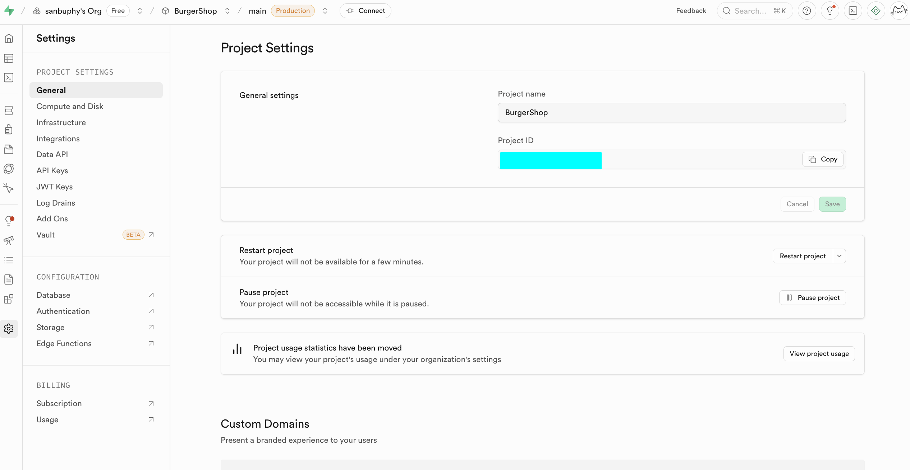

在入门阶段，我们只需聚焦以下两个核心板块，一个是 Data API，我们在此可获取关键的 “Supabase URL”， 它是形如 `https://xxx.supabase.co` 的 RESTful 端点，是所有数据查询、新增、修改、删除操作的 “入口地址”。前端或服务端需通过该 URL 初始化 Supabase 客户端，建立与数据库的连接。

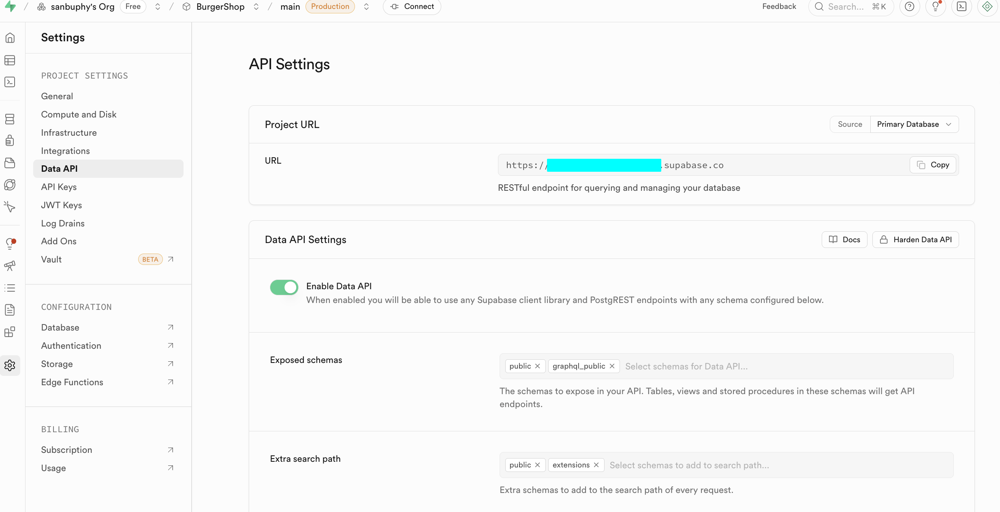

另一个重点是 API Keys，选择 “Legacy anon, service_role API keys” 标签页，其中的 anon public 密钥 是前端场景的重要身份凭证，它的权限被 RLS 严格限制，仅能访问用户被授权的数据。而 service_role 密钥属于 “服务端高权限密钥”，具备绕过行级安全的能力，可执行批量数据操作、系统级配置等敏感操作。绝对禁止公开分享，若泄露需立即生成新密钥并更新服务端配置。

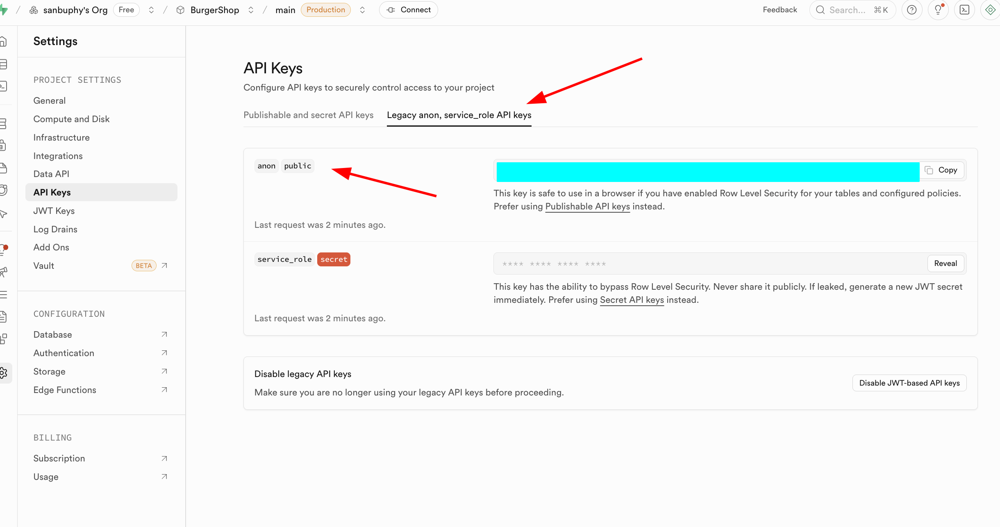

其余配置项在当前阶段无需深究，待后续有进阶使用需求时再逐一探索即可。

## 2.1 Create Your First SQL Table

以上是 Supabase 的界面介绍，接下来我们将深入 Supabase 的核心数据库的操作环节。

在 Supabase 中创建数据表，主要有以下两种常用方式，你可以根据需求选择：

1. （推荐）借助大语言模型生成适配 Supabase 的 SQL 语句，直接在 **SQL Editor（** 前文介绍的 SQL 语句执行器）中粘贴执行，高效快捷，我们会在下个部分环节重点说明这个操作过程。
2. 通过可视化操作创建：在左侧侧边栏找到 Database 模块，点击进入后选中侧边栏的 Tables，在右侧点击 New table 按钮，即可通过图形化界面创建数据表。

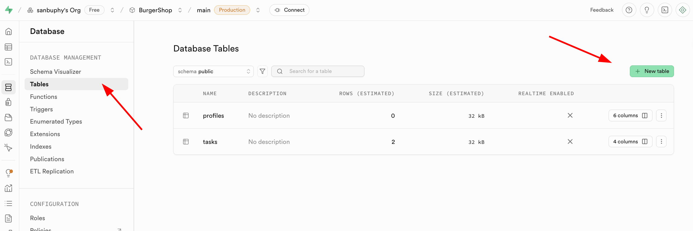

值得注意的是，对应数据表的名称以及存储的数据类型可在下方的 Columns 中指定。

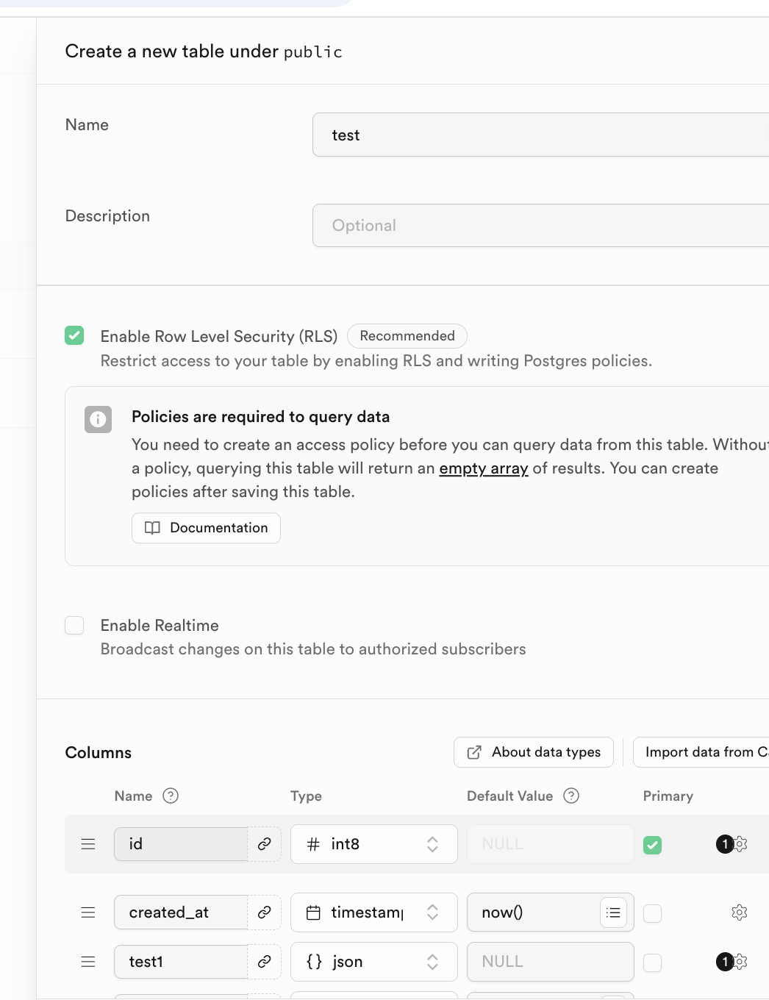

对于关系数据库，其中很重要的特点是表与表之间的关联，你可以在下方找到 `Foreign keys` ，点击创建相应的关联关系：

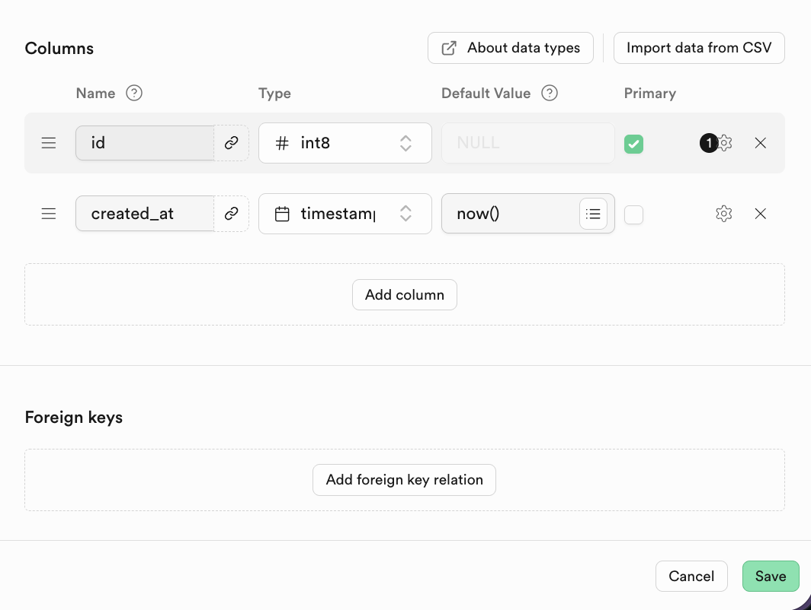

其中 `Foreign keys` 表达了表与表之间的关联关系：一个或一组字段，它在当前表（子表）中的值，会引用另一张表（父表）中主键的值。

例如，在创建 `学生表`的时候，我们可以这样定义外键：（`所属班级编号` 这一列是一个外键。这个外键引用了 `班级表` 里的 `班级编号` 这一列。）

```SQL
CREATE TABLE 学生表 (
    学生学号 INT PRIMARY KEY,
    学生姓名 VARCHAR(50),
    所属班级编号 INT,
    FOREIGN KEY (所属班级编号) REFERENCES 班级表(班级编号)
);
```

更具体举例而言，我们可以可视化观察对应的表的结构：

班级表：
这张表里记录了所有班级的信息，每个班级都有一个独一无二的班级编号。班级编号就是这张表的主键 (Primary Key)，是每个班级的唯一身份证。

| 班级编号 | 班级名称   |
| -------- | ---------- |
| 101      | 一年级一班 |
| 102      | 一年级二班 |

学生表：
这张表记录了所有学生的信息。每个学生都属于一个特定的班级，对吗？那么我们怎么知道哪个学生在哪个班级呢？

我们可以在学生表里增加一列，叫做 `所属班级编号`。

| 学生学号 | 学生姓名 | 所属班级编号 |
| -------- | -------- | ------------ |
| 2024001  | 张三     | 101          |
| 2024002  | 李四     | 102          |
| 2024003  | 王五     | 101          |

在该例子中，学生表中的 `所属班级编号` 列就是外键 (Foreign Key)。

在 Supabse 中，点击添加 Foreign Key 后，你可直接选择进行关联表对应列的选取

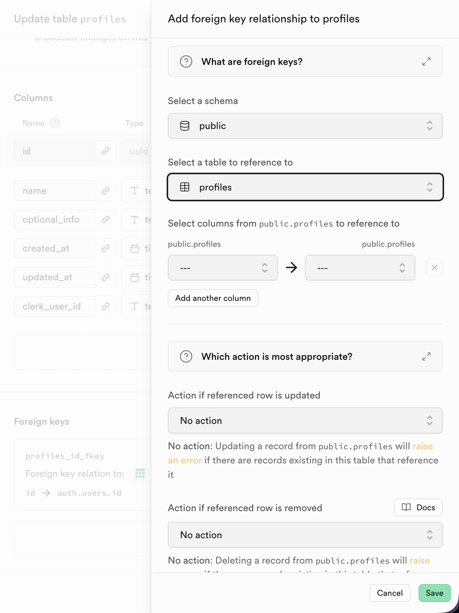

## 2.3 SQL Editor 简介与数据库基本操作

接下来我们将分步执行一系列 SQL 脚本，熟悉常见的 SQL 中的增删查改操作。你可以将每个步骤的代码复制到 SQL Editor 中，执行并观察结果。

你可以在该目录下获得所有的测试 SQL 文件：

https://github.com/THU-SIGS-AIID/Project5-Supabase-Demos/tree/main/apps/sql-examples

### **2.3.1 **`CREATE`** - 创建表结构**

`CREATE TABLE` 语句用于为新表定义模式（Schema），包括其列（Columns）、对应的数据类型（Data Types）以及任何约束（Constraints），简单理解是创建了一个数据表。

```SQL
-- Step 1: Create the 'orders' table
-- This file is fully independent and creates a sample table for later steps.
CREATE TABLE IF NOT EXISTS orders (
  id serial PRIMARY KEY,
  user_id int NOT NULL,            -- User ID
  status text NOT NULL,            -- Order status (e.g. paid, pending)
  amount numeric(10, 2) NOT NULL,  -- Order total amount
  details jsonb,                   -- Item and extra details as JSON
  placed_at timestamptz DEFAULT now(), -- Order creation time
  is_paid boolean DEFAULT false    -- Paid flag
);

-- Expected Output:
-- Orders table created if it did not exist.
-- No data inserted. (Querying returns zero rows for now.)
-- If table already exists, no error occurs.
```

成功执行后，系统将提示脚本已完成。你可以在 Table Editor 中看到对应的表被创建完成：

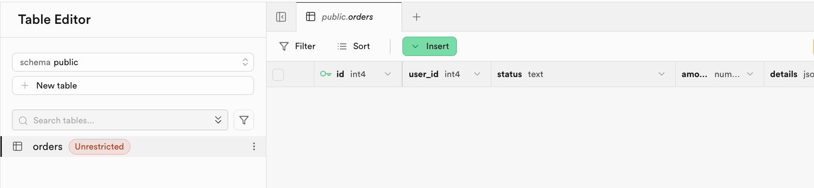

### **2.3.2 **`INSERT`** - 填充初始数据**

表结构创建完毕后，下一步是使用 `INSERT INTO` 语句向表中添加数据行。

```SQL
-- Step 2: Insert initial rows into the orders table
-- Provides realistic, varied data for demo/testing. All values are self-contained.
INSERT INTO orders (user_id, status, amount, details, placed_at, is_paid) VALUES
  (2001, 'pending', 23.50, '{"items":[{"sku":"BGR001","name":"Beef Burger","qty":1,"price":12.00}]}', now() - interval '2 days', false),
  (2002, 'paid', 50.00, '{"items":[{"sku":"BGR002","name":"Chicken Burger","qty":2,"price":10.00},{"sku":"DRK001","name":"Lemonade","qty":2,"price":5.00}]}', now() - interval '1 day', true),
  (2003, 'cancelled', 15.00, '{"items":[{"sku":"FRY001","name":"French Fries","qty":3,"price":5.00}], "reason":"Not available"}', now() - interval '45 days', false),
  (2004, 'paid', 22.98, '{"items":[{"sku":"BGR003","name":"Veggie Burger","qty":2,"price":9.99}], "promo":"SUMMER22"}', now() - interval '10 days', true),
  (2005, 'pending', 18.75, '{"items":[{"sku":"SAL001","name":"Salad","qty":1,"price":6.75},{"sku":"BGR001","name":"Beef Burger","qty":1,"price":12.00}]}', now() - interval '7 hours', false),
  (2006, 'paid', 8.00, '{"items":[{"sku":"DRK002","name":"Cola","qty":2,"price":4.00}]}', now() - interval '3 hours', true),
  (2007, 'refunded', 14.50, '{"items":[{"sku":"BGR003","name":"Veggie Burger","qty":1,"price":9.99},{"sku":"FRY001","name":"French Fries","qty":1,"price":4.51}], "refund_reason":"Late delivery"}', now() - interval '15 days', false),
  (2008, 'paid', 26.99, '{"items":[{"sku":"BGR002","name":"Chicken Burger","qty":2,"price":10.00},{"sku":"DRK001","name":"Lemonade","qty":1,"price":6.99}]}', now() - interval '12 days', true),
  (2009, 'pending', 9.99, '{"items":[{"sku":"BGR003","name":"Veggie Burger","qty":1,"price":9.99}]}', now() - interval '30 minutes', false),
  (2010, 'paid', 19.89, '{"items":[{"sku":"BGR001","name":"Beef Burger","qty":1,"price":12.00},{"sku":"DRK002","name":"Cola","qty":2,"price":3.95}]}', now() - interval '5 days', true),
  (2011, 'cancelled', 0.00, '{"items":[], "reason":"User cancelled"}', now() - interval '2 days', false);

-- Expected Output:
-- After running this script, SELECT * FROM orders will show about 11 rows with varied user_id, status, amount, details (JSON), placed_at, and is_paid fields.
-- For example:
-- | id | user_id | status    | amount | is_paid | placed_at           |
-- |----|---------|-----------|--------|---------|---------------------|
-- | 1  | 2001    | pending   | 23.50  | false   | 2025-10-28 13:40:00Z|
-- | 2  | 2002    | paid      | 50.00  | true    | ...                 |
-- |... | ...     | ...       | ...    | ...     | ...                 |
```

执行成功后，此时表中已经插入了原始数据，你可以进入到 Table Editor 界面刷新后看到结果，也可以直接在 SQL Editor 界面中新建窗口，执行查询语句 `SELECT * FROM orders;`查看结果：

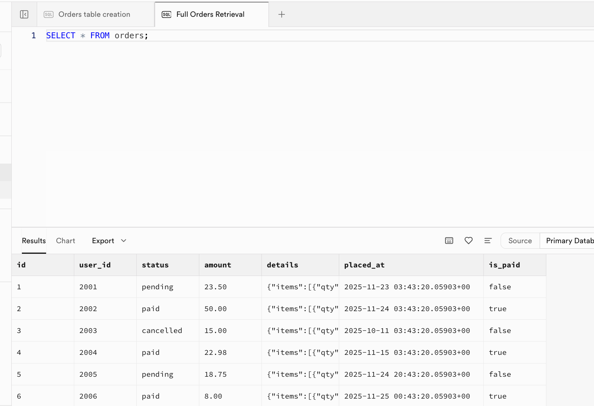

### **2.3.3 **`SELECT`** - 读取与查询数据**

`SELECT` 语句用于从表中检索数据。通过使用不同的子句，可以实现对数据的精确筛选、排序和格式化，我们可参考以下语句一步步执行查看结果：

```SQL
-- Step 3: SELECT query examples for the orders table

-- Example 1: Select all fields for all orders
SELECT * FROM orders;
-- Expected Output: Returns all rows and fields. Columns: id, user_id, status, amount, details, placed_at, is_paid.

-- Example 2: Select only pending orders
SELECT id, user_id, amount FROM orders WHERE status = 'pending';
-- Expected Output: All rows with status 'pending'; columns: id, user_id, amount.

-- Example 3: Select specific fields and filter by payment status
SELECT id, status, is_paid, amount FROM orders WHERE is_paid = true;
-- Expected Output: All rows where is_paid is true; columns: id, status, is_paid, amount.

-- Example 4: Extract all item names from the details (JSON) for each order
SELECT id, details -> 'items' AS item_list FROM orders;
-- Expected Output: Each row shows id and an array from JSON with item details.
```

- **示例 1:** 返回 `orders` 表中的所有行和列，与第二步的输出类似。
- **示例 2:** 仅返回状态为 'pending' 的订单，且只包含指定的列：

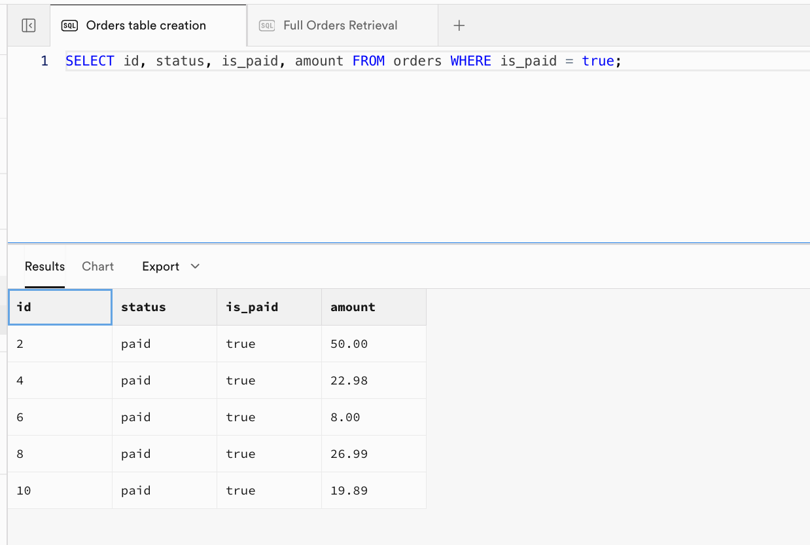

- **示例 3:** 仅返回已支付的订单，并显示指定的列：

| id  | status | is_paid | amount |
| --- | ------ | ------- | ------ |
| 2   | paid   | true    | 50.00  |
| 4   | paid   | true    | 22.98  |
| 6   | paid   | true    | 8.00   |
| 8   | paid   | true    | 26.99  |
| 10  | paid   | true    | 19.89  |

- **示例 4:** 返回每个订单的 `id` 和从 `details` 字段中提取的 `items` 数组：

| id  | item_list                                                                                                            |
| --- | -------------------------------------------------------------------------------------------------------------------- |
| 1   | `[{"qty":1,"sku":"BGR001","name":"Beef Burger","price":12}]`                                                         |
| 2   | `[{"qty":2,"sku":"BGR002","name":"Chicken Burger","price":10},{"qty":2,"sku":"DRK001","name":"Lemonade","price":5}]` |
| 3   | `[{"qty":3,"sku":"FRY001","name":"French Fries","price":5}]`                                                         |
| ... | ...                                                                                                                  |

### **2.3.4 **`INSERT`** - 插入单条记录**

在 2.3.2 中，我们演示的是开头时刻初始化批量插入数据，现在我们查看如何新增插入单条数据。

```SQL
-- Step 4: INSERT a new order (single row)
-- Example: Add a new paid order for user 2012 with one Chicken Burger
INSERT INTO orders (user_id, status, amount, details, is_paid)
VALUES (
  2012, 'paid', 9.99,
  '{"items":[{"sku":"BGR002","name":"AIID Burger","qty":100,"price":1000}]}',
  true
);
-- Expected Output:
-- Before (table fragment):
-- | id | user_id | status | amount | is_paid |
-- | ...|   ...   |  ...   |  ...   |  ...    |
--
-- After (last row):
-- | id | user_id | status | amount | is_paid |
-- | xx |  2012   |  paid  |  9.99  |  true   |
-- (where xx = next serial value)
```

此时再用 `SELECT * FROM orders;` 对数据进行查询，我们可以看到 orders 表成功从 11 个数据变成了 12 个数据。

### **2.3.5 **`UPDATE`** - 修改现有数据**

在实际工作中，我们需要对数据表进行频繁数据更新，我们能够用 `UPDATE` 语句修改表中已存在的记录。

```SQL
-- Step 5: UPDATE example
-- Example: Mark order with id=1 as paid and update its status
UPDATE orders SET status = 'paid', is_paid = true WHERE id = 1;
-- Expected Output:
-- Before (row with id=1):
-- | id | status  | is_paid |
-- | 1  | pending |  false  |
-- After (row with id=1):
-- | id | status | is_paid |
-- | 1  | paid   |  true   |
-- All other rows remain unchanged.
```

### **2.3.6 **`DELETE`** - 删除数据**

`DELETE` 语句可用于从表中移除记录，并结合条件对指定部分的数据进行修改。

```SQL
-- Step 6: DELETE example
-- Example: Delete orders older than 2 days to clean up old data
DELETE FROM orders WHERE placed_at < now() - interval '2 days';
-- Expected Output:
-- Before (filtered for affected rows):
-- | id | status    | placed_at           |
-- |  3 | shipped   | 2025-10-13 ...     |  <-- will be deleted
--
-- After:
-- No such rows remain. SELECT * FROM orders WHERE placed_at < now()-interval '2 days' yields zero rows.
-- Other rows in orders table are unaffected.
```

执行前，你可先执行 `SELECT id, status, placed_at FROM orders WHERE placed_at < now() - interval '2 days';` 进行数据表筛选结果的查看。当运行 `DELETE` 命令后，再次执行相同的 `SELECT` 查询 `SELECT id, status, placed_at FROM orders WHERE placed_at < now() - interval '2 days';`，将返回一个空的结果，表明这些行已被成功删除。

## 2.4 RLS (Row level security)

在学习了数据库的基本操作后，我们需要进一步深入一个保障数据安全的核心概念 ——RLS（行级安全，Row Level Security）。

不妨先思考一个实际场景中的关键问题：如何实现数据的 “隔离访问”？比如，只允许用户 A 查看自己的数据，而无法看到用户 B 的信息；再比如，即便某角色拥有数据库的访问权限，如何避免其误操作或泄露其他用户的敏感数据？

RLS 正是为解决这类数据安全与隔离需求而生。它允许开发者为数据库表定义精细化的安全策略，根据用户的身份信息（如用户 ID、角色权限等），精确控制哪些用户能访问、修改表中的哪些行数据。
举个典型示例：对于订单表（`orders`），我们可以定义这样一条 RLS 策略 ——“仅当 `orders` 表中某条记录的 `user_id` 列，与当前登录用户的 ID 完全一致时，该用户才能查询到这条订单数据”，从而实现 “用户只能看自己的订单” 的核心需求。

当你为某张表启用 RLS后，该表的所有数据操作请求（包括 `SELECT` 查询、`INSERT` 新增、`UPDATE` 修改、`DELETE` 删除）都会触发 RLS 校验：必须通过至少一条安全策略的检查，操作才能执行。若不存在允许该操作的策略，或请求未满足任何策略的条件，数据库会直接拒绝此次操作，从底层阻断非授权访问。

在 Supabase 中，RLS 与用户认证系统深度绑定，使用起来更为便捷。Supabase 提供了一个专用函数 `auth.uid()`，它能直接返回 “当前发起请求的已登录用户” 的唯一 ID（格式为 UUID）。借助这个函数，我们可以轻松编写策略，实现 “数据行与用户身份” 的精准关联（比如前文提到的 “订单 `user_id` 匹配当前用户 ID”）。

启用 RLS 策略的方式很灵活，你可以在 Supabase 数据库管理界面中的 “RLS” 按钮，直接配置并启用策略：

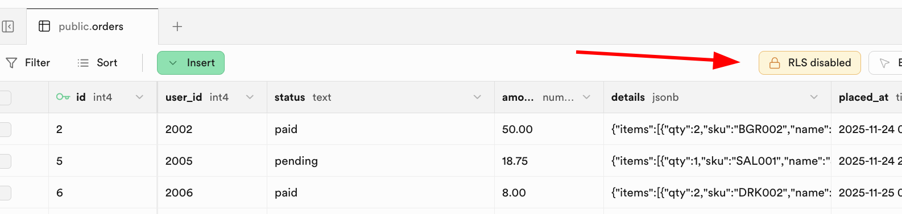

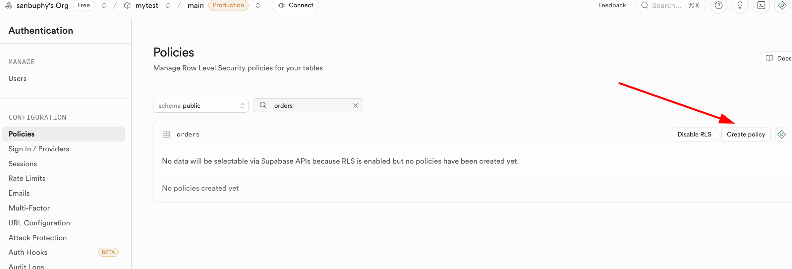

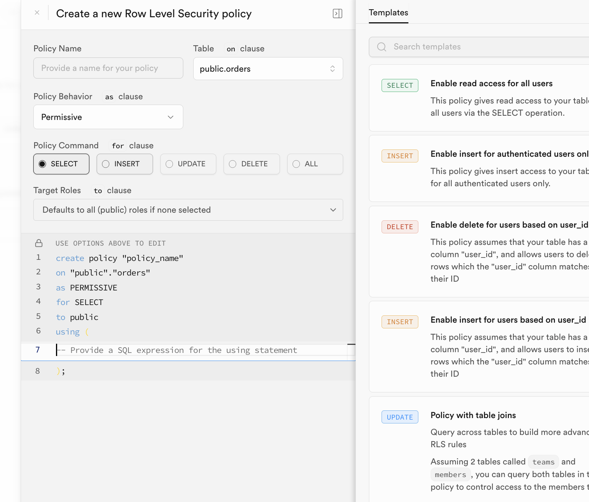

主动配置难免显得麻烦，通常，我们在数据表语句创建、初始化的时候就会自动考虑植入对应的 RLS 策略。我们只需在 SQL Editor 中执行类似如下语句，即可自动开启对应数据表的行级安全策略。

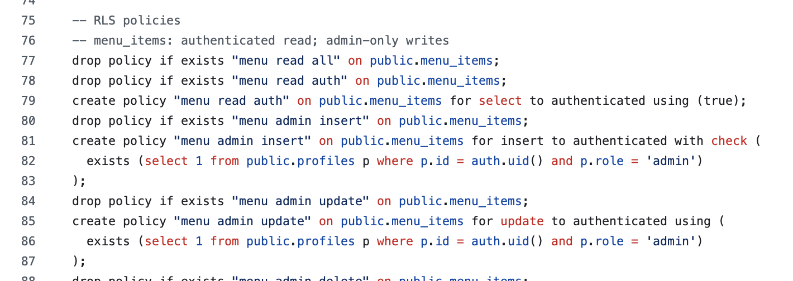

# 3. The First SQL Application

掌握了数据库基础操作与RLS核心逻辑，我们终于进入本次教程的实践环节。漫长的学习铺垫是为了让后续“从0到1搭建应用”的过程更清晰。接下来，我们将以“汉堡店订单管理”为场景，手把手演示Supabase的常见操作：从应用与Supabase的关联配置，到数据库与登录功能的集成，逐步学习不同操作逻辑。

## 3.1 Clone and Run Supabase Demos

要开展实操，首先需要获取配套的演示代码仓库。你可以让 Trae 或 ClaudeCode 协助 git clone 以下仓库：https://github.com/THU-SIGS-AIID/Project5-Supabase-Demos

若已配置 SSH 密钥，建议使用 SSH 地址进行 clone（git@github.com:THU-SIGS-AIID/Project5-Supabase-Demos.git）以提升安全性；若 SSH 或 HTTPS 连接遇到网络问题，可以直接点击仓库页面的 “Download ZIP”，获取压缩包后解压即可看到完整代码。

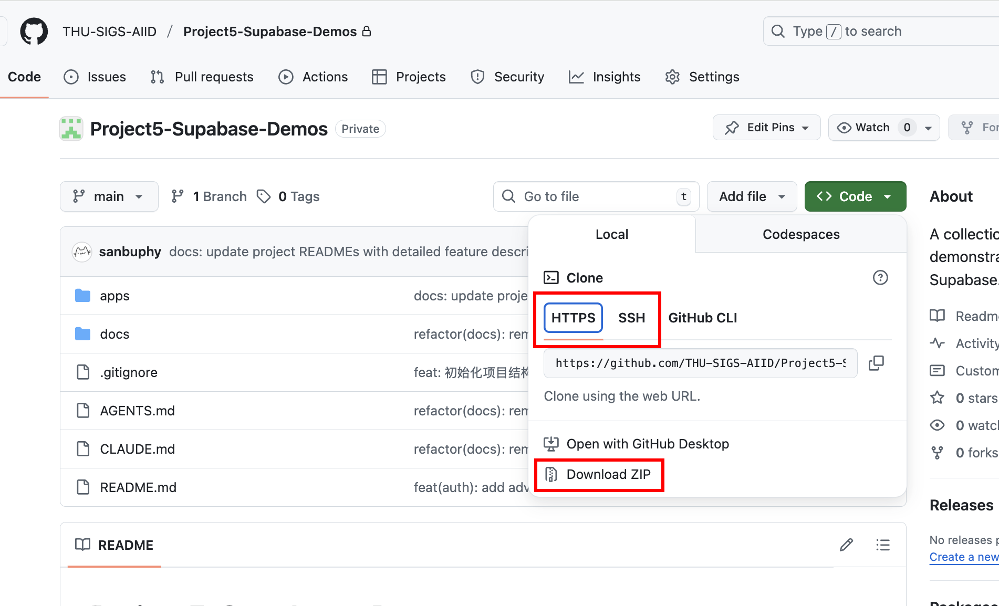

Clone 后，你同样可以让 Trae 或者是 ClaudeCode 帮你启动项目，例如直接在 Agent 界面中说明： `帮我直接启动这个项目里面的 project 1 `，或者复制对应想启动 project 的绝对路径，粘贴给大模型让大模型直接启动。

## 3.2 Project1 - burger-shop-menu-crud

接下来进入实操环节 —— 以 `project-burger-shop-menu-crud-1` 为例，我们将学习如何通过 SQL 脚本一键初始化 Supabase 数据库，并完成本地项目与 Supabase 数据库的关联配置，让前端能正常读写菜单数据。

### Create a Database Using Scripts

首先，我们需要在 Supabase 中创建需要的数据表的相关内容。进入 Project1 项目目录看到名为 `scripts`的文件夹，其中包含 1 个 `init.sql`数据库脚本文件，它能帮我们自动完成所有数据库相关资源的创建（包括表结构、初始数据等），之后我们会经常用到该文件进行数据库中表的初始化。

```SQL
......

-- ============================================================================
-- 2. Create Menu Items Table
-- ============================================================================

create table if not exists public.menu_items (
  id uuid primary key default gen_random_uuid(),
  name text not null,
  description text,
  category text check (category in ('burger','side','drink')) default 'burger',
  price_cents int not null check (price_cents > 0),
  available boolean default true,
  emoji text,
  created_at timestamptz not null default now(),
  updated_at timestamptz not null default now()
);

-- Comments for documentation
comment on table public.menu_items is 'Burger shop menu items for CRUD demo';
comment on column public.menu_items.id is 'Unique identifier for each menu item';
comment on column public.menu_items.name is 'Display name of the menu item';
comment on column public.menu_items.description is 'Detailed description of the menu item';
comment on column public.menu_items.category is 'Category: burger, side, or drink';
comment on column public.menu_items.price_cents is 'Price in cents (integer) to avoid floating point issues';
comment on column public.menu_items.available is 'Whether the item is currently available for order';
comment on column public.menu_items.emoji is 'Optional emoji representation of the menu item';
comment on column public.menu_items.created_at is 'Timestamp when the item was created';
comment on column public.menu_items.updated_at is 'Timestamp when the item was last updated';

......
```

在 SQL Editor 中执行初始化 sql 脚本后，即可在 Table Editor 中看见已创建的数据表。其中数据库初始化代码具体执行逻辑如下：

1. 创建 menu_items 表 :
2. 这个表用于存储汉堡店菜单中的所有项目。它包含了如 name (商品名), description (描述), price_cents (以美分为单位的价格，避免浮点数精度问题), category (分类) 和 available (是否可售) 等字段。这基本涵盖了一个菜单项所需的所有信息。
3. 创建 promo_codes 表 :
4. 此表用于管理促销活动，例如折扣码。它定义了 code (折扣码), discount_type (折扣类型，如百分比或固定金额), discount_value (折扣数值) 等字段。
5. 禁用行级安全 (Row Level Security - RLS) :
6. 为了方便开发和测试，脚本中明确地禁用了 RLS。但结合我们之前学习的 RLS 核心逻辑：RLS 是 Supabase 保障数据安全的关键功能，能通过精细化策略控制 “谁能访问 / 修改哪些数据”（比如只允许管理员编辑促销码，普通用户只能查看菜单）。因此在生产环境中，必须开启 RLS 并配置合理策略，从底层阻断非授权访问（如防止用户恶意修改他人创建的菜单，或泄露促销码规则）。
7. 插入种子数据 (Seed Data) :
8. 为了让前端项目启动后就能看到真实的菜单与促销数据（无需手动录入测试数据），`init.sql`脚本还会向 `menu_items`和 `promo_codes`表中插入 “种子数据”（即示例数据）。例如，你可以看到各种汉堡、小食、饮料以及多种多样的折扣码。

### Set up the connection with database

数据库准备完成，我们需要将这个前端项目与 Supabase 进行连接，从而正常读取数据库内的数据。我们需要将 Supabase 项目的 URL 和 anon key 写到指定配置中，本项目提供了两种灵活的配置方式：

1. 通过环境变量配置

在项目根目录创建一个 .env 文件，并填入你的 Supabase 凭证：

```Plain
NEXT_PUBLIC_SUPABASE_URL=https://your-project.supabase.co
NEXT_PUBLIC_SUPABASE_ANON_KEY=your-anon-key
```

2. 在项目页面中直接设置

为了方便快速演示和切换不同的 Supabase 项目，首页页面右上角提供了一个 设置 按钮。你可以点击它，在弹出的模态框中直接输入或粘贴 Supabase URL 和 anon key。

点击 “Save” 后，这些信息会用于动态创建 Supabase 客户端实例，类似下列代码所示：

```JavaScript
import { createClient, type SupabaseClient } from '@supabase/supabase-js';

// Optional client factory for demos: returns null when env is not set.
export function maybeCreateBrowserClient(): SupabaseClient | null {
  const url = process.env.NEXT_PUBLIC_SUPABASE_URL;
  const anon = process.env.NEXT_PUBLIC_SUPABASE_ANON_KEY;
  if (!url || !anon) return null;
  return createClient(url, anon);
}
```

创建完数据库，填写完对应的 Supabase Link 相关配置后，即可看到如下界面，你可以尝试对商品进行增删查改，并观察 Supabase 中对应部分数据表的变化。

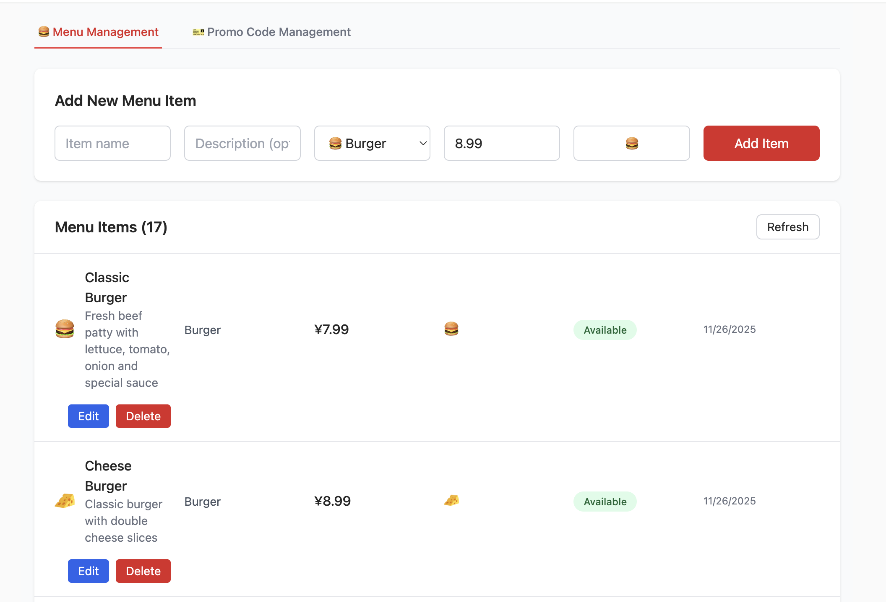

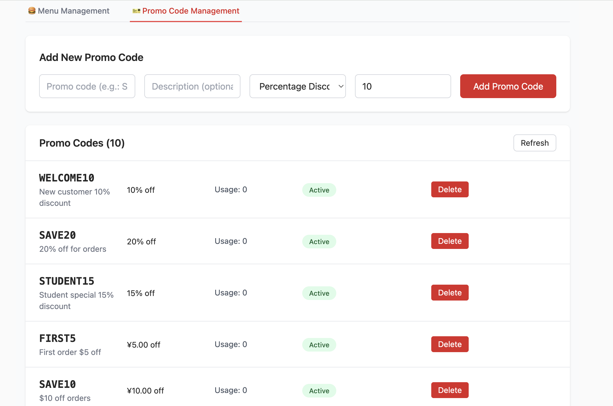

### 📚 Assignment

1. 尝试增加和删除已有项目，在 Table Editor 中查看修改操作对数据表内容变动的影响。

## 3.4 Project2 - burger-shop-auth-users

Project1 实现了 “菜单 CRUD + 数据库连接” ，Project2 将引入更贴近真实业务的核心能力，用户认证（Auth）与行级安全（RLS）权限管理。

Project2 包含独立的登录页，支持用户通过「邮箱 + 密码」的方式登录。其核心逻辑是调用 Supabase Auth 提供的原生方法，快速实现认证流程，无需手动开发复杂的登录校验逻辑：

```Plain
const { error: err } = await supabaseClient.auth.signUp({
  email,
  password,
  options: {
    data: {
      full_name: fullName || null,
      birthday: birthday || null,
      avatar_url: avatarUrl || null
    }
  }
});
```

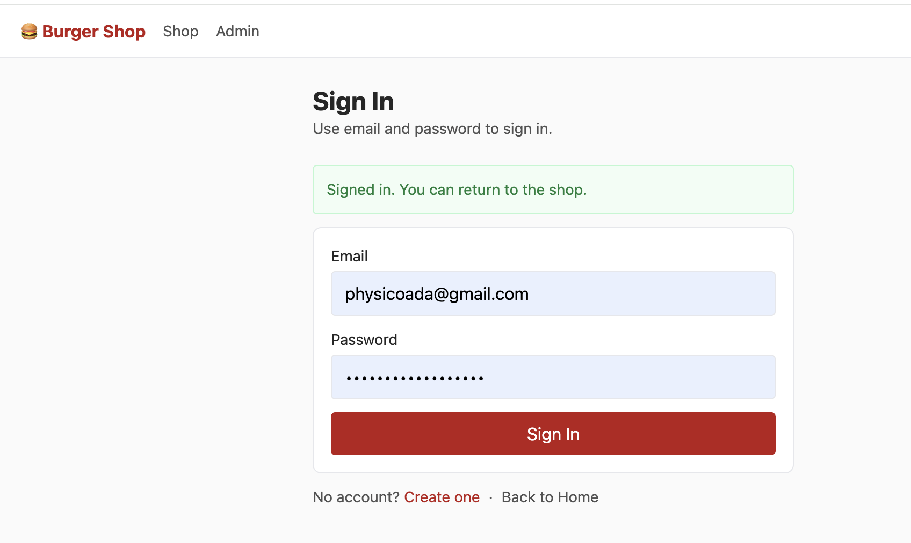

登录成功后，Supabase 会自动为用户创建一个会话（session），并在后续所有数据库请求中自动携带认证信息；通过 RLS 的作用，每个用户根据对应的认证信息只能看到自己的账户信息（已购买项目、钱包剩余额度），无法看到其他用户的账户信息，这就实现了不同用户登录后的数据隔离，每个人只能看到自己的内容。

和 Project 1 一样，你需要先使用 `init.sql` 进行数据表的初始化（注：如果发现初始化出错，请先在 Table Editor 中删除已经创建的数据表，或者是直接删除这个 Supabase Project， 重新新建一个 Project）

成功使用邮箱注册账户、在邮箱确认注册账户后，登录后进入 Shop 界面即可看到如下内容：

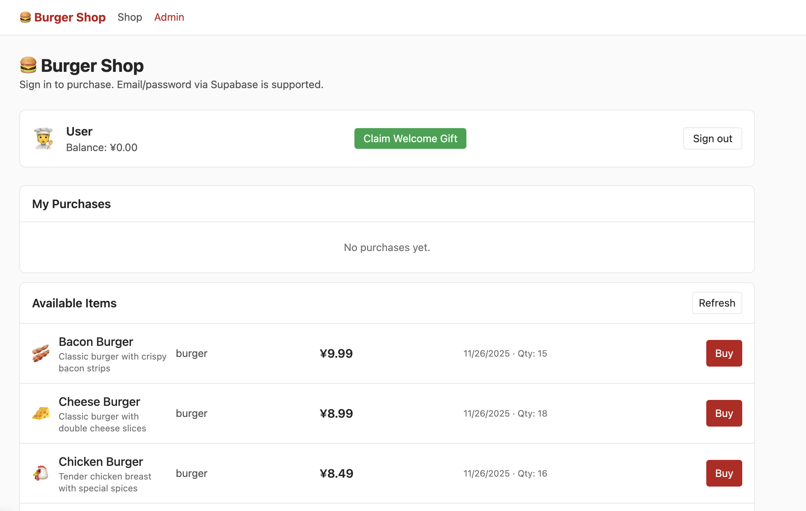

但此时点击 admin，你并不能看到如下界面，你需要尝试在数据表中找到控制用户权限的部分，将权限修改为 `admin`，从而能够在 Admin 界面正常看到如下内容：

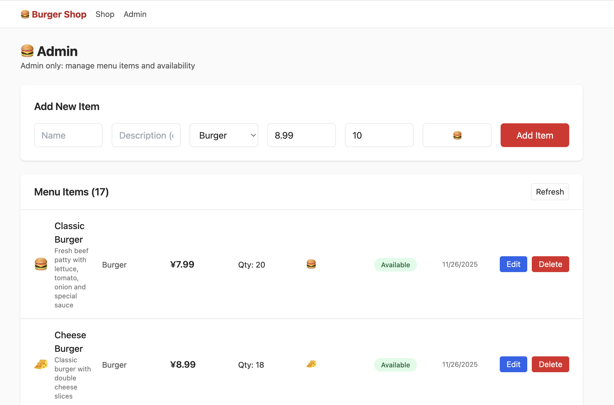

值得提示的是，目前每次注册新的邮箱，你都需要在邮箱中进行注册确认才可登录；但这一步并非是必须的，你可以在 Supabase 的 Authentication 栏目中找到 Sign In / Providers，点击Confirm email 取消邮箱的强制确认。

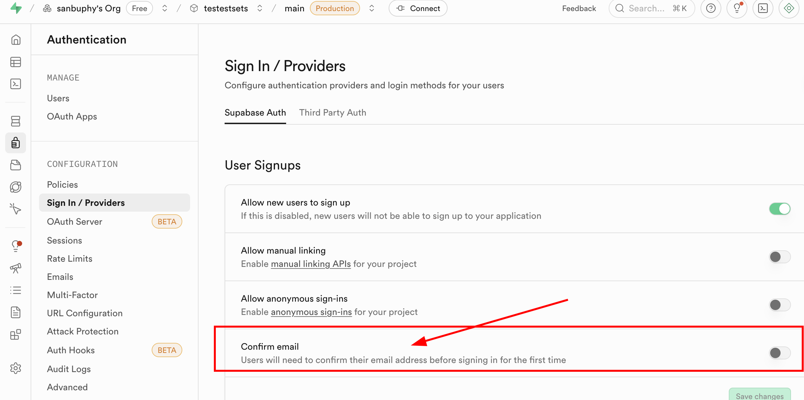

### 📚 Assignment

1. 请先领取新手礼包，完成商品购买操作。
2. 尝试找到用户权限的设定数据表位置，将权限修改为 `admin`，并成功在订单管理界面修改商品数量
3. 尝试在数据表内定位到钱包金额相关表，通过修改使剩余钱包金额增加。

# 4. Build Your First Supabase App

经过前面的系统学习，你已掌握 Supabase 的核心能力（数据库操作、用户认证、RLS 安全策略），现在是时候亲自动手，搭建属于你的第一个包含数据库、支持用户登录系统的应用了！

## 4.1 为任意应用接入 Supabase 数据库的标准化流程

我们可以使用标准化流程将任意应用接入 Supabase 数据库：

1. 首先进行需求梳理与信息同步，明确目标并告知AI
   1. 你需要向AI清晰描述当前应用的核心功能、待新增的数据库需求。示例：“我现有一个本地React Todo应用，数据仅存在浏览器本地存储，需新增‘数据云端同步’功能并接入Supabase数据库。请帮我梳理：这个应用涉及哪些数据操作（如新增待办、修改状态、删除待办）？需要创建哪些数据表来存储这些数据？”
   2. 补充关键约束条件（可选）：比如字段格式要求（时间戳用 `timestamptz`、金额用整数存分）、数据权限规则（仅自己可见待办），让AI的分析更贴合实际需求。
   3. 对 AI 返回的结果进行审核，若AI思路存在遗漏（如未考虑“待办截止时间”字段），补充提示修正：“你漏考虑截止时间了，帮我加上。”
2. 让AI基于你确认后的表结构，生成适配Supabase的 `init.sql`脚本：“基于上述所说思路和表的结构，返回给我在 Supabase 中可以进行初始化的 init.sql 脚本”，之后你需要在 SQL Editor 中执行脚本；若执行报错，将错误信息反馈给AI，让其修正脚本。
3. 在 Supabase 运行 init.sql 脚本后，让 AI 基于脚本重构当前代码，使得能够和 Supabase 进行正常的数据交互：“请你根据我的 sql 脚本以及上面讨论的设定，重构项目的代码让它支持能够和 Supabase 对应的数据库进行通信并处理数据”。
4. 重构完毕，此时只需要配置好 Supabase 地址和 key 的参数（正式项目通常只用环境变量配置），随后进行检查，若没问题则顺利实现将应用接入 Supabase 数据库。
   1. 运行项目，测试所有数据库交互功能，到Supabase Table Editor 实时查看数据是否同步；
   2. 若出现问题（如数据无法插入、仅能看到部分数据），将问题现象反馈给AI，让其定位原因并修正代码。

此外，若目标是开发用户登录页面，可直接让 AI 协助集成登录页面 ：“现在你需要帮我给这个应用加入 Supabase 的用户登录系统，使用邮箱可以注册和登录”。另外，你还需要向 AI 明确页面的跳转逻辑与路径（如登录成功后跳转至系统首页、跳转首页的地址是什么、登录失败时留在当前页并显示错误提示）。集成完成后，你需要尝试注册登录后能在 Supabase 的 Authentication 项目中看到新增的用户数据，并在登录后能正常进入到原先未登录无法进入的应用界面即可。

当然，你还可以直接让 AI 参考某个 project 的实现直接迁移对应的 Supabase 功能，比如某个 Project 用到了数据库以及 Edge fuction 的高级功能，你可以按照如下方式直接让 AI 迁移对应的相似功能：“请你参考该项目 {此处复制粘贴参考项目的绝对地址} 当中的 Supabase 相关功能实现逻辑，给当前项目加上类似的实现逻辑（如用户登录、数据库管理、函数请求等等）”。

## 4.2 Case Study : Build an Online Snake Game

根据上面所提到的 SOP ，让我们通过一个具体的实际案例 `Project5-Supabase-Demos/apps_snakegame`来实践：为一个已有的“贪吃蛇”游戏项目增加分数排行榜单，包含用户登录与数据库基础功能。


### 4.2.1 分析项目，识别数据需求

首先，和在之前提到的标准化流程类似，我们可以先把需求澄清给 AI ，让 AI 基于我们项目和需求给出对应的修改方案，之后我们会基于这个修改方案。

**你可以使用如下的提示词来指导 AI：**

> “我有一个贪吃蛇游戏，目录在 {此处粘贴贪吃蛇游戏的绝对路径}。现在我想结合 supabase 给它增加一个在线排行榜功能，并且支持用户登录系统，排行榜可以根据用户名和邮箱显示排名。
>
> 请帮我分析一下，为了实现这个功能，我需要建立哪些数据表？每个表应该包含哪些字段？”

此时你会得到类似如下返回：

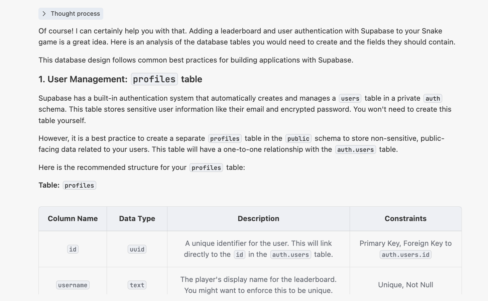

### 4.2.2 生成 `init.sql` 脚本

确定需要的部分，我们可以让 AI 生成需要在 Supabase 执行的数据库初始化脚本：“请你基于上面的分析，帮我在项目中生成 scripts/init.sql 脚本用于在 Supabase 中初始化所需数据库”。

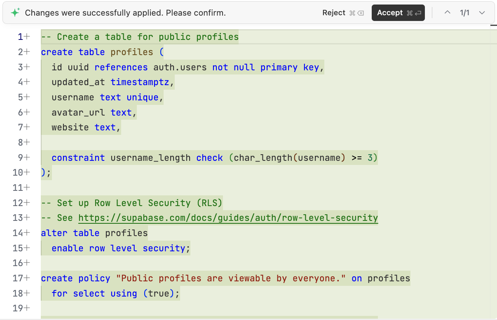

### 4.2.3 改造项目代码

接下来我们只需要让 AI 基于前面的内容重构当前的贪吃蛇代码：“接下来请你基于前面思考的内容以及 sql 表，使用 Supabase 帮我实现排行榜功能，排行榜是单独的一页，需要可以根据邮箱和用户名区分不同用户的总分，你还需要支持基于邮箱的用户登录系统，注册登录才能玩这个游戏。”

如果当前 AI 对话轮次太多，你想重开一个新的会话进行项目重构，你可以把上面提到的 `init.sql`作为上下文中的内容，让 AI 基于 sql 文件进行项目重构。

若是发现 AI 实现的用户登录系统不够正常，你可以直接将我们之前写好的 `Project5-Supabase-Demos/apps/project-burger-shop-auth-users-2` 的地址一同放入提示词，让 AI 基于项目直接实现用户登录系统。并检查是否已经正确设定了连接到 Supabase 的必要条件，防止因为 Supabase 配置错误而报错。

在代码修改过程中，若出现实际效果与预期不符的情况（如排行榜数据不显示、登录验证失效等），只需完整记录具体现象并反馈给 AI，即可逐步接近正确结果。改造成功的标准为：用户能顺利完成注册与登录操作，且登录后可正常查看对应的游戏排行榜单。

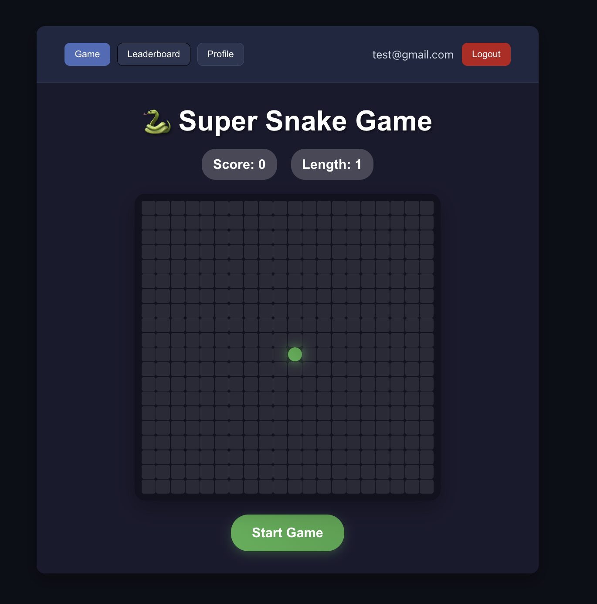

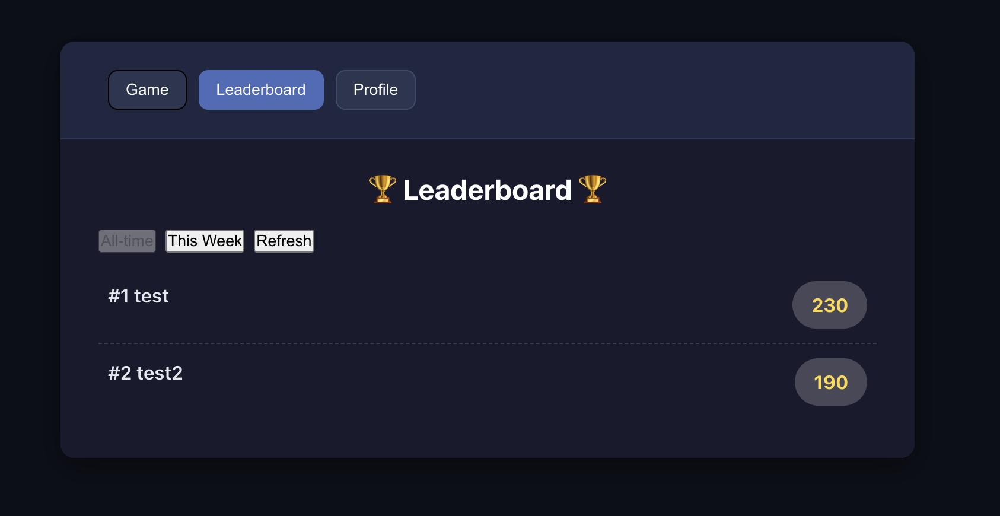

### 📚 课程作业

1. 将用户管理系统集成到贪吃蛇游戏演示版中
2. 将用户管理系统集成到你的应用程序中（如果之前已开发过一个应用程序）

# 3. Become Supabase Master

以上是 Supabase 的基本操作，接下来的旅程中我们将会接触 Supbase 的进阶原理和功能，你将理解为什么我们会选择 Supabase 作为教学案例，以及如何使用 Supbase 实现更高级的操作，协助你实现更复杂的交互功能，并且在学习这些功能后，即便面对 Supabase 之外的其他同类工具，你也能触类旁通，从更本质的层面理解后端服务的核心原理。当然，你并不需要在短时间内学会全部，也许只需要学会第三方登录支持已经足够，你可以先浏览下列内容，直到项目遇到对应的需求时再倒回来深入学习。

## 5.1 Why We choose Supabase

在开始进阶之前，我们再次思考这个问题：众多后端技术方案中，为何我们最终选择 Supabase 作为技术底座？

初创团队在技术选型时普遍面临一个矛盾：既想完全掌控后端系统，又必须快速上线产品——而自建后端通常意味着要投入数月时间搭建数据库与实时同步、用户认证、API服务、文件存储、定时任务、监控告警等核心组件，除非团队成员已在对应领域积累了丰富的实战经验。在资金不足、市场窗口短暂的双重压力下，一旦陷入基础设施泥潭，极易导致迭代滞后、错失早期增长空间。

Supabase 将这些后端能力打包为开箱即用的服务（PostgreSQL数据库、实时订阅、身份认证、对象存储、边缘函数、自动生成API等），让初创团队得以将稀缺资源聚焦于核心功能开发，避免因底层建设拖慢上线速度——这已成为当前创投环境下务实的生存策略。当然，我们也可以使用别的一栈式后端产品进行开发，例如 PocketBase（轻量极简）和 Appwrite（跨平台适配）等方案，但综合功能完整性、SQL 生态成熟度及 Github 社区关注度，Supabase 更适合支撑业务的长期稳定运行。

在同类产品中，Supabase 的开源策略更具优势。 以市场占有率较高的 Firebase 为例：其闭源特性易导致平台绑定，迁移成本极高。Supabase 采用完全开源模式，支持私有化部署，规避了供应商锁定风险，可根据需求切换至其其他竞品。

总而言之，技术选型需匹配业务规模与目标。 对于个人项目或极小范围测试，PocketBase 等超轻量方案已足够；若企业需对接复杂身份系统，或要满足上市公司合规审计要求，WorkOS 这类企业级全身份治理方案更为适用。但对于验证 MVP、承载早期用户的核心业务场景，Supabase 的完整功能完全够用，它不仅能独立支撑至少万级用户规模，更可灵活集成 Stripe（支付）、Resend（邮件）、Cloudflare（CDN）等第三方服务；即便未来业务扩展至企业级需求，Supabase 的开源架构也能与企业系统并行部署，不同功能选择最适配的平台进行使用。这种渐进式灵活性，使初创团队无需过早投入重型基础设施，又能保留 future-proof 的演进空间。

## 5.2 Google & Github Login Support

在前面的教程中，我们讲解了如何直接使用邮箱进行注册和登录，但在实际操作中我们通常想要简化注册流程，例如使用第三方登录 Google 和 GitHub 进行系统的快速注册与登录，我们将会在这节教程中展开每个细节；同时，一个完整的认证系统也必须提供安全可靠的密码重置功能，我们也会将密码重置功能集成在本节教程的项目中。

本项目 `Project5-Supabase-Demos/apps/project-burger-shop-auth-advanced-supabase-6`)完整地演示了如何实现这些高级功能。

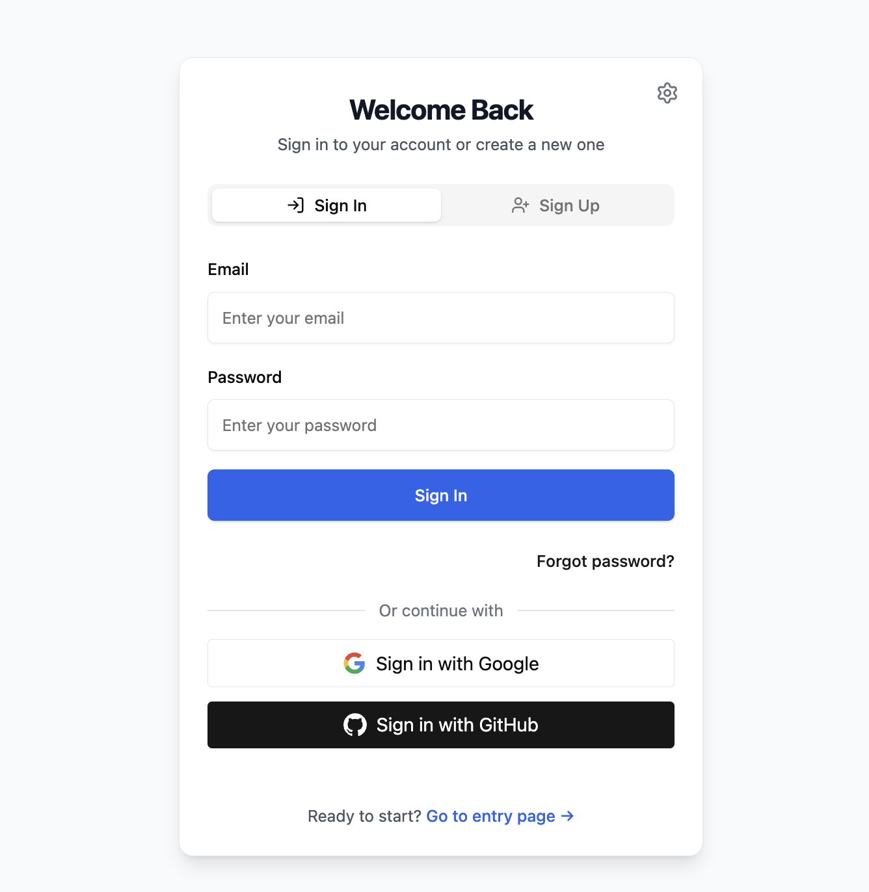

### 5.2.1 OAuth 流程：第三方登录是如何工作的？

第三方登录的核心是 OAuth 2.0 开放授权协议，它的本质是 “授权代理”：允许用户授权我们的应用（汉堡店项目）访问其在第三方平台（如 Google）的公开信息（如邮箱、头像），但无需将第三方平台的密码暴露给我们的应用，从根本上规避了密码泄露风险。

完整流程可拆解为 5 个关键步骤，以 Google 登录为例：

1. 用户发起授权请求：用户点击页面上的 “Sign in with Google” 按钮，我们的应用会自动将用户重定向到 Google 官方的授权页面（确保授权过程的安全性，避免钓鱼风险）。
2. 用户完成第三方授权：用户在 Google 页面登录自己的账户（验证用户身份），并同意我们的应用请求的权限（如 “获取邮箱地址”）。
3. Google 返回一次性授权码：授权通过后，Google 会将用户重定向回我们提前约定的 “回调 URL（Callback URL）”，并在 URL 参数中附带一个一次性、短期有效的授权码（而非直接返回用户信息，进一步提升安全性）。
4. Supabase 交换访问令牌（Access Token）：我们的后端（由 Supabase 托管，无需自建）会拿着这个授权码，向 Google 官方接口发起请求，换取可用于获取用户信息的 Access Token（授权码仅用于换 Token，避免 Token 直接在前端传输）。
5. 创建账户并建立会话：Supabase 使用 Access Token 从 Google 拉取用户的公开信息（如邮箱、头像），并在我们的项目中为该用户自动创建账户（若首次登录）或直接关联现有账户，最终生成一个有效的用户会话（Session），完成登录。

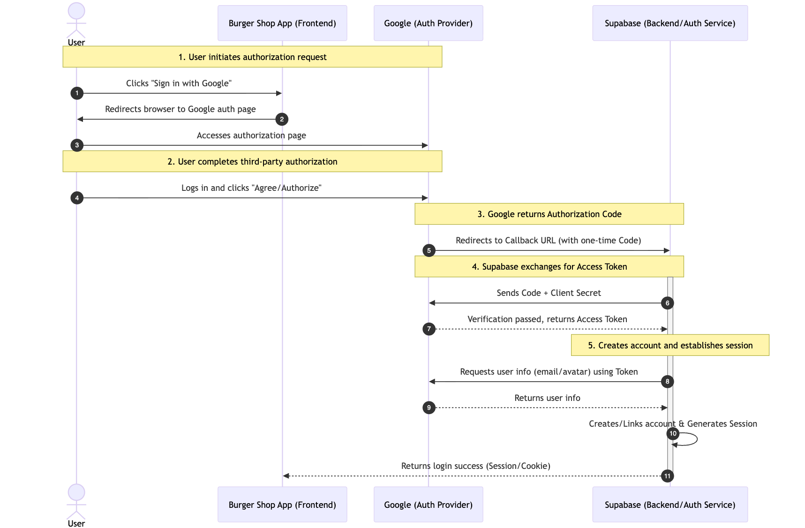

### 5.2.2 配置 Google Cloud 获取 Client ID 和 Secret

无论是何种第三方登录方式，我们通常都需要获取 Client ID 与 Secret 进行配置；对于 Google 的第三方登录，你首先需要在 Google Cloud Platform 中创建一个 OAuth 2.0 客户端 ID 进行对应参数的获取。

1. **进入 Google Cloud Console** :
2. 访问 [Google Cloud Console](https://console.cloud.google.com/)。
3. 创建一个新项目或选择一个现有项目。
4. **配置 OAuth 同意屏幕 (OAuth consent screen)** :
5. 在左侧导航栏中，找到 “APIs & Services” -> “OAuth consent screen”。
6. 选择 “External” 用户类型，然后点击 “Create”。
7. 填写应用名称、用户支持电子邮件等必填信息。
8. 在 “Authorized domains” 部分，添加你的 Supabase 项目域名，格式为 `*.supabase.co`。
9. 保存并继续。在 “Scopes” 和 “Test users” 步骤中，你可以暂时跳过，直接保存。
10. **创建凭据 (Create Credentials)** :
11. 进入 “APIs & Services” -> “Credentials”。
12. 点击 “+ CREATE CREDENTIALS”，选择 “OAuth client ID”。
13. 在 “Application type” 中选择 “Web application”。
14. 为它取一个名字，例如 “Supabase Auth”。
15. 在 “Authorized redirect URIs” 部分，点击 “ADD URI”，并填入你的 Supabase 项目的回调 URL。你可以在 Supabase Dashboard 的 “Authentication” -> “Providers” -> “Google” 中找到这个 URL，它的格式通常是 `https://<你的项目ID>.supabase.co/auth/v1/callback`。
    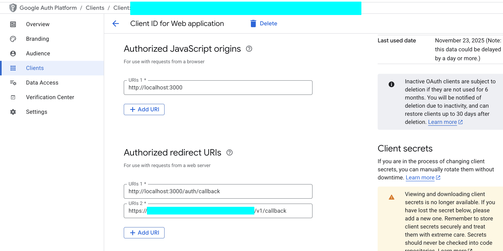
16. 点击 “CREATE”。
17. **获取 Client ID 和 Client Secret** :
18. 创建成功后，一个弹窗会显示你的 **Client ID** 和 **Client Secret** 。请务必**立即复制并妥善保存** 它们。

### 5.2.3 配置 GitHub 获取 Client ID 和 Secret

同样地，你也需要在 GitHub 上注册一个 OAuth 应用。

1. **进入 \*\***GitHub\*\* ** Developer Settings** :
   1. 登录你的 GitHub 账户。
   2. 点击右上角的头像，进入 “Settings”。
   3. 在左侧导航栏的底部，找到 “Developer settings”。

2. **注册新应用 (Register a new application)** :
3. 选择 “OAuth Apps”，然后点击 “New OAuth App”。
4. 填写应用名称，例如 “My Burger Shop”。
5. **Homepage URL** : 填写你应用的线上地址，或者本地开发地址 `http://localhost:3000`。
6. **Authorization \*\***callback\*\* ** URL** : 填入你的 Supabase 项目的回调 URL。同样，你可以在 Supabase Dashboard 的 “Authentication” -> “Providers” -> “GitHub” 中找到它，格式为 `https://<你的项目ID>.supabase.co/auth/v1/callback`。
7. 点击 “Register application”。
8. **获取 Client ID 和 Client Secret** :
9. 注册成功后，页面会显示你的 **Client ID** 。
   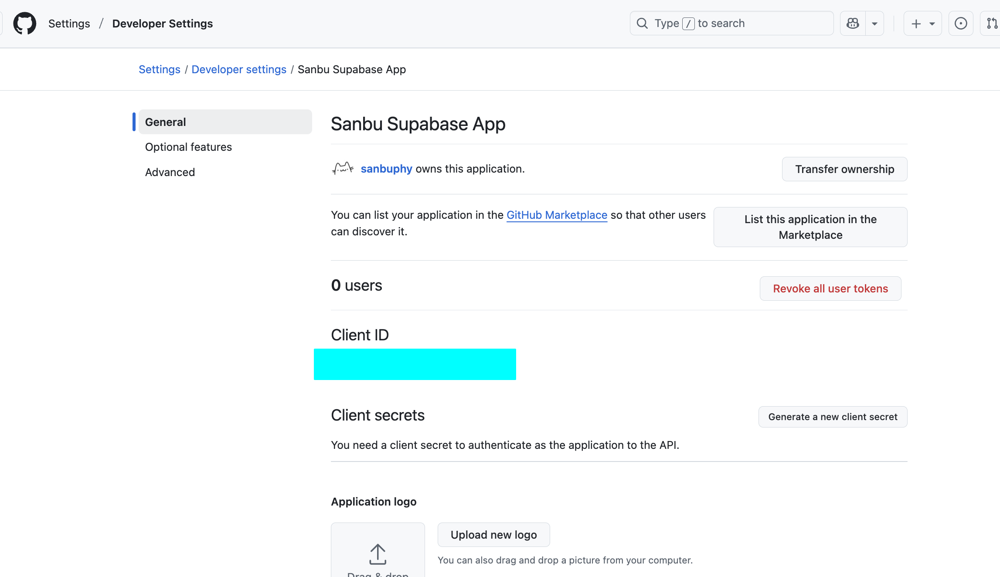
10. 点击 “Generate a new client secret” 来生成你的 **Client Secret** 。同样，请**立即复制并保存** 它。

### 5.2.4 在 Supabase 中配置 Provider

现在，将我们获取到的凭证配置到 Supabase 中。

1. **进入 Supabase Dashboard** :
2. 选择你的项目，进入 “Authentication” -> “Providers”。
3. **启用并配置 Google** :
4. 找到 “Google” 并启用它。
5. 将你从 Google Cloud 获取的 **Client ID** 和 **Client Secret** 粘贴到对应的输入框中。
6. 点击 “Save”。
7. **启用并配置 ** **GitHub** :
   1. 找到 “GitHub” 并启用它。
   2. 将你从 GitHub 获取的 **Client ID** 和 **Client Secret** 粘贴到对应的输入框中。
   3. 点击 “Save”。

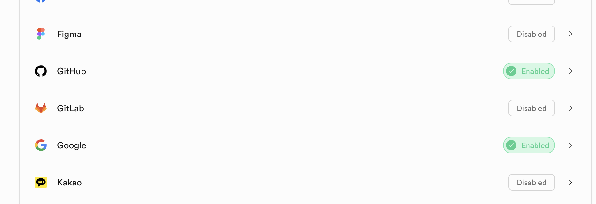

至此，你已经能够使用第三方账户在构建的网站中进行登录，你可以直接让 AI 基于 `Project5-Supabase-Demos/apps/project-burger-shop-auth-advanced-supabase-6`项目作为参考，在你的项目的基础上支持用户登录系统，以最小成本集成包含 github 与 google 鉴权的用户登录界面。

### 5.2.6 密码重置实现

作为一个成熟的用户登录组件，密码重置也是极其重要的一环，本项目 `project-burger-shop-auth-advanced-supabase-6`也包含了该功能的完整实现，你可以直接让 AI 基于本项目的密码重置功能复刻完整的密码重置组件。其主要分为以下几步：

1. 发起请求 ：用户在忘记密码页面输入邮箱，前端调用 `supabase.auth.resetPasswordForEmail()` 函数，并指定一个重定向 redirectTo URL（例如 /auth/reset ）。
2. 发送邮件 ：Supabase 会向该邮箱发送一封包含唯一重置链接的邮件。
3. 访问链接 ：用户点击邮件中的链接，被重定向到应用内指定的重置页面。
4. 更新密码 ：在重置页面，用户输入新密码。前端调用 `supabase.auth.updateUser()` ，将新密码提交给 Supabase。Supabase 会自动验证链接的有效性并完成密码更新。

最后，如果你觉得当前的密码重置邮件过于简陋，你可以 在 Supabase Dashboard 的 Authentication -> Email Templates 中自定义“Reset Password”邮件模板。

除了 Reset password 功能外，你还能看到许多其他与用户管理相关的高级功能设定（例如 Invite user 等），你可根据对应功能各自的开发文档，结合 Vibe coding 工具自行添加对应功能。


## 5.3 Realtime Function

Supabase 的实时功能是其最强大的特性之一，为构建协作文档、实时仪表盘、游戏大厅或客服系统提供了极大的便利。

本项目 `Project5-Supabase-Demos/apps/project-burger-shop-realtime-orders-3 `通过构建一个 多人实时聊天室、光标位置共享 功能，展示了 Supabase Realtime 涉及到的三大核心能力：数据库变更监听 (Postgres Changes)、广播 (Broadcast) 和 在线状态 (Presence)。

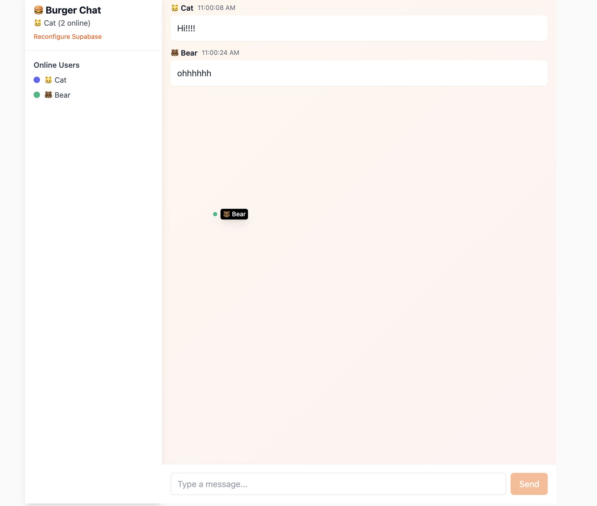

如果你觉得相关代码部分有一定难度，可以直接让 AI 参考该部分文档内容，对你的程序进行修改。

### 5.3.1 数据库实时变动 Postgres Changes

最常见的 Realtime 功能是对数据库的变更进行实时监听 Postgres Changes 。它允许客户端订阅数据库中特定表、特定行甚至特定列的 INSERT 、 UPDATE 或 DELETE 事件。一旦数据库发生变动（无论是通过 API 调用、Supabase Dashboard 操作，还是 SQL 脚本执行），Supabase 都会利用 PostgreSQL 的底层复制机制，立即通过 WebSocket 将变更的数据推送到所有订阅了该频道的前端客户端，而无需前端通过轮询（Polling）去反复查询。

一般而言，该功能可以在 Table Editor 中找到 Enable Realtime 点击后启动， 但更方便的是通过 SQL 脚本初始化执行，例如：

```SQL
-- Enable realtime replication
ALTER TABLE public.chat_messages REPLICA IDENTITY FULL;
DO $$
BEGIN
  IF NOT EXISTS (
    SELECT 1 FROM pg_publication_tables
    WHERE pubname = 'supabase_realtime'
      AND schemaname = 'public'
      AND tablename = 'chat_messages'
  ) THEN
    ALTER PUBLICATION supabase_realtime ADD TABLE public.chat_messages;
  END IF;
END $$;
```

该语句将 `chat_messages` 表添加到了 Supabase 预设的 `supabase_realtime` 中，而一旦一个表被加入到这个特殊的 `publication` 中，Supabase 的实时服务器就会开始监听它的所有数据变更。

基于上面的特殊数据表，我们能够使用监听代码对表内数据变动进行实时监听。我们需要实现的是当一个用户发送消息时，其他所有在线用户都能立刻在屏幕上看到这条消息。通过订阅 chat_messages 表的 INSERT 事件能够实现这一点。

```TypeScript
    const sub = supabase
      .channel('chat_messages_channel')
      .on('postgres_changes', {
        event: 'INSERT',
        schema: 'public',
        table: 'chat_messages'
      }, (payload: any) => {
        console.log('New message received:', payload.new);
        const newMessage = payload.new as Message;
        // ... //
      .subscribe((status: string) => {
        console.log('Chat subscription status:', status);
      });
```

- `.channel('chat_messages_channel')`: 创建一个隔离的通信频道。
- `.on('postgres_changes', ...)`: 这是核心的订阅方法。我们告诉 Supabase 我们只关心 `chat_messages` 表的 `INSERT` 事件。
- `payload.new`: 当有新消息被插入数据库时，Supabase 会将这条新数据的完整内容通过 `payload.new` 推送给所有订阅的客户端。
- `.subscribe()`: 启动订阅。

### 5.3.2 信息广播同步 Broadcast & Presence

对于那些不需要存入数据库的、更“即时”的交互，比如光标移动、在线状态等，Supabase 提供了 Broadcast 和 Presence 功能。

- Presence: 用于跟踪频道内所有客户端的 **共享状态** 。适合用来实现“谁在线”的功能。
- Broadcast: 用于向频道内的所有其他客户端发送**低延迟**的 **临时消息** 。

Presence 的核心思想是： 让每个客户端声明自己的在线状态，并由 Supabase 的服务器负责将这些状态可靠地同步给频道内的所有其他客户端。实现 Presence 分为以下几个关键步骤：

1. 创建一个支持 Presence 的频道

首先，我们创建了一个频道 `lobby_presence` 来专门处理这些交互，并在配置中指定一个唯一的 key 来标识当前用户。这个 key 通常是用户的 ID。

```Plain
const ch = supabase.channel
('lobby_presence', {
  config: {
    presence: { key: anonymousUser.id },
  }
});
```

2. 订阅频道宣告“我在线”的信息

一旦频道创建成功，我们需要订阅它。在订阅成功的回调（ status === 'SUBSCRIBED' ）中，我们调用 channel.track() 方法。这个方法会将当前用户的信息（例如用户ID、名称、头像颜色等）广播给频道内的所有其他客户端，宣告自己的“在线”状态。

```Plain
const me = {
  id: anonymousUser.id,
  name: anonymousUser.name,
  color: anonymousUser.color
};

ch.subscribe(async (status) => {
  if (status === 'SUBSCRIBED') {
    await ch.track(me);
  }
});
```

3. 同步完整的在线列表

当一个新用户加入频道时，他们需要获取当前所有已经在线的用户列表。这通过监听 presence 的 sync 事件来实现。 sync 事件会在你首次加入频道时触发，为你提供一个完整的“快照”。

channel.presenceState() 方法会返回一个对象，包含了当前频道内所有在线用户的状态信息。我们将其处理后更新到应用的 state 中，从而渲染出完整的在线用户列表。

```Plain
ch.on('presence', { event: 'sync' }, () 
=> {
  const state = ch.presenceState();
  const flat = {};
  Object.values(state).forEach((arr) => {
    arr.forEach((u) => { flat[u.id] = 
    { ...u }; });
  });
  setOnline(flat);
});
```

4. 监听单个用户的加入与离开

除了 sync 事件，我们还可以监听 join 和 leave 事件，以便在有新用户进入或离开时做出即时响应，例如显示一个 "User has joined" 的通知。

```Plain
ch.on('presence', { event: 'join' }, ({ 
key, newPresences }) => {
  console.log('User joined:', key, 
  newPresences);
});

ch.on('presence', { event: 'leave' }, ({ 
key, leftPresences }) => {
  console.log('User left:', key, 
  leftPresences);
});
```

通过以上步骤，我们便构建了一个功能完备的在线状态系统。Supabase 自动处理了用户意外断开连接（如关闭浏览器或断网）的情况，并在适当的时候触发 leave 事件，确保了在线列表的准确性。

当 Presence 让我们知道了“谁在场”之后， Broadcast 能够让他们之间能够进行“对话”，但对话的内容是短暂存储的。一个典型的例子就是实时光标追踪。如果每次鼠标移动都去读写数据库，会造成巨大的性能浪费和延迟。 Broadcast 完美地解决了这个问题，它允许消息在各个客户端之间直接通过 WebSocket 传递，完全绕过数据库。

Broadcast 的工作模式主要依赖两个核心方法： channel.send() 用于发送，channel.on() 用于接收。】

1. 发送端：广播我的光标位置

我们为 mousemove 事件添加了一个监听器。当鼠标移动时，我们构造一个包含用户 ID、坐标和颜色的 payload，然后通过 channel.send() 将其广播出去，并指定事件名称为 'cursor'。

```TypeScript
const handleMouseMove = (e) => {
  const payload = {
    id: anonymousUser.id,
    x: e.clientX,
    y: e.clientY,
    name: anonymousUser.name,
    color: anonymousUser.color
  };

  channelRef.current?.send({
    type: 'broadcast',
    event: 'cursor',
    payload
  });
};

document.addEventListener('mousemove', handleMouseMove);
```

2. 接收端：监听并渲染他人的光标

在同一个频道内，所有客户端都使用 channel.on() 来监听 broadcast 类型的、且 event 为 'cursor' 的消息。一旦收到匹配的消息，回调函数就会被触发。我们从 payload 中解析出发送方的数据，并用它来更新本地的 online 状态，从而在屏幕上实时渲染出其他用户光标的位置。

```TypeScript
ch.on('broadcast', { event: 'cursor' }, ({ payload }) => {
  setOnline((prev) => ({
    ...prev,
    [payload.id]: {
      ...(prev[payload.id] || {}),
      x: payload.x,
      y: payload.y
    }
  }));
});
```

通过这种方式， Presence 和 Broadcast 协同工作；Presence 维护在线用户列表，而 Broadcast 则负责在这些用户之间传递像光标位置这样的临时状态，最终以较低的成本实现了丰富的实时互动功能。

## 5.4 Storage

除了用户信息、订单这类可规整定义的结构化数据，一个完整的应用通常还需要处理大量非结构化文件 —— 例如用户头像、商品展示图、用户上传的订单文档等。这类文件的特点是体积差异大、数量可能极多（比如电商平台的商品图可能达数万甚至数十万张），若直接存储在应用自身的业务服务器中，会显著增加服务器的存储负载，还可能拖慢数据读写速度，影响应用整体性能。

实际开发中，这类非结构化文件会统一交由 “对象存储服务” 管理，OSS、Amazon S3 均属于这类服务，它们是专门为海量文件存储设计的 “专业存储工具”，能高效应对文件的存储、备份与快速读取需求。而我们在应用中获取这些文件时，并不会直接从对象存储服务的 “底层仓库” 调取，而是通过 URL 地址实现：每个存储在对象存储中的文件，都会被分配一个唯一的 URL（类似 “[https://xxx.oss.com/avatar/user123.jpg](https://xxx.oss.com/avatar/user123.jpg)” 的地址，可简单理解为这个“网站”只有一张图片），这个 URL 就像文件的 “专属访问地址”，前端页面只需通过该地址，就能直接下载或加载头像、商品图，无需依赖应用业务服务器中转，既提升了文件加载速度，也减轻了业务服务器的压力。

本项目 `project-burger-shop-storage-uploads-4` 便通过一个用户头像上传功能，深入演示了如何利用 Supabase Storage 构建现代化的文件上传系统，让开发者直观理解非结构化文件从上传到通过 URL 访问的完整流程。此外，本项目使用 `Uppy` 库来提供一个优秀的文件上传界面，并结合 `Tus` 插件实现了可续传上传，通过将 Uppy 的上传端点指向 Supabase 的标准 API (`<supabaseUrl>/storage/v1/upload/resumable`) 进行工作，你可以参考类似的方式实现上传功能组件。

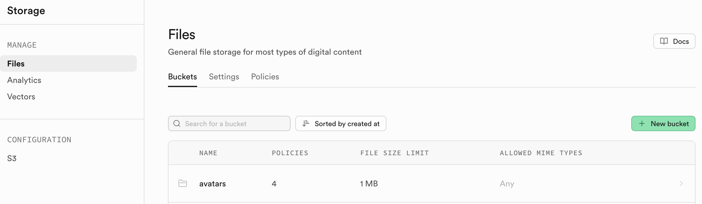

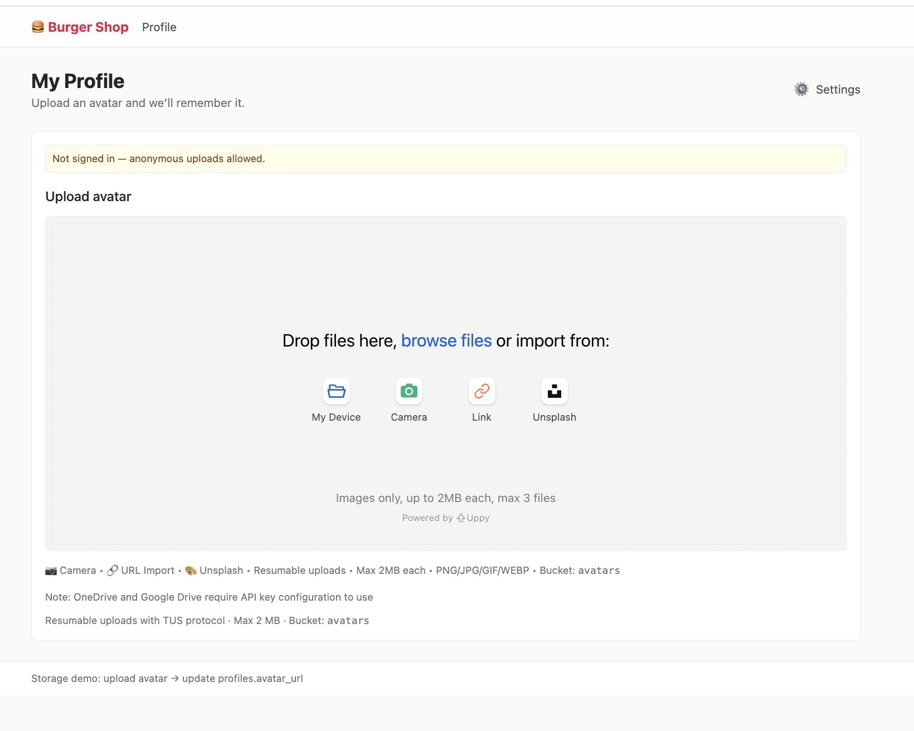

### 5.4.1. Bucket

Supabase Storage 的组成单元是存储桶 Bucket。你可以把它想象成电脑操作系统中的文件夹。每个 Bucket 都可以有自己独立的安全策略和配置。

Storage 内的所有文件都可以通过一个公开的 URL 直接访问，但并不意味着任何人都可以随意上传或修改，具体的访问权限将由更精细的策略来控制。和数据库一样，Storage 的访问权限也是通过行级安全策略来管理的。SQL 策略写在 storage.objects 和 storage.buckets 这两张特殊表上，可以精确定义谁能读取 (SELECT)、上传 (INSERT)、更新 (UPDATE) 或删除 (DELETE) 文件。

例如，我们可以创建一条策略，只允许用户上传到以自己 user_id 命名的文件夹下，并且只能上传图片类型的文件：

```Plain
CREATE POLICY "Allow authenticated 
uploads to avatars bucket"
ON storage.objects FOR INSERT
TO authenticated
WITH CHECK (
  bucket_id = 'avatars' AND
  auth.uid() = (storage.foldername(name))
  [1]::uuid AND
  (storage.extension(name) IN ('png', 
  'jpg', 'jpeg'))
);

CREATE POLICY "Allow public read access 
to avatars"
ON storage.objects FOR SELECT
USING ( bucket_id = 'avatars' );
```

### 5.4.2 获取可访问文件 URL

本项目需要你手动创建一个名为 avatars 的公共桶，所有文件将上传至该公共桶下进行存储。文件上传成功后，我们只得到了它在 Storage 中的存储路径 ，例如 public/avatar1.png 。这只是存储在数据库中的一个字符串，要让浏览器能够渲染这张图片，我们需要将其转换为一个可访问的 HTTP URL。

Supabase 提供了两种截然不同的策略来获取这个 URL，它们在安全性、持久性和成本控制上有着本质的区别。

#### 1. 公开 URL (Public URL) - 永久链接

这是最直接的方式。如果你的文件存放在一个**Public Bucket** 中，你可以获取一个固定、永久的公开链接。

```TypeScript
const { data } = supabase.storage
  .from('avatars')
  .getPublicUrl('public/avatar1.png');
const publicUrl = data.publicUrl;
```

这类链接具有两大核心特点：一是简单直接，其 URL 结构固定，在实际操作中易于拼接和管理，降低了技术使用门槛；二是利于缓存，作为永久链接，它能被 CDN（内容分发网络）和浏览器有效缓存，从而大幅提升资源的访问速度，优化用户体验。基于这些特点，它适用于真正意义上的公共资源场景，例如网站 Logo、产品目录图片、博客文章配图等，能很好地满足这类资源的访问和管理需求。

不过在生产环境中，这类链接存在明显的被盗刷流量（Hotlinking）风险。由于链接是永久公开的，外部人员可以轻易将你的图片链接嵌入到他们自己的高流量网站中，导致流量被非法占用。这一行为会让你的 Supabase 项目产生大量不必要的流量费用，而这些消耗的流量并未服务于你自身的应用，属于典型的成本浪费，是生产环境中需要高度警惕和防范的问题；因此，我们需要转向临时签名 URL 实现对外资源的暴露。

#### 2. 签名 URL (Signed URL) - 临时授权链接

为了解决公开 URL 的安全和成本问题，Supabase 提供了生成临时签名 URL 的方式。这是绝大多数线上应用推荐的最佳实践，比如文生图应用给用户生成限时查看的图片链接、电商平台仅让下单用户获取临时发票下载地址、付费内容平台为订阅用户提供短期有效的课程播放链接，既防文件盗用又能避免流量盗刷，适配性极强。

```TypeScript
const { data, error } = await supabase.storage
  .from('avatars')
  .createSignedUrl('private/user-invoice.pdf', 3600); // 链接有效期为 3600 秒 (1小时)
const signedUrl = data?.signedUrl;
```

临时签名 URL（Signed URL）有三大核心优势：安全可控是指链接带安全标记、有有效期，过期就用不了；权限绑定很简单 —— 只有能看这文件的人，才能生成这个链接，就算文件藏在私有存储里（Private Bucket），他用这个链接也能正常打开；杜绝盗刷是因为链接是临时的，复制到别处很快就失效，不会被恶意刷流量。靠这些优势，像用户头像、私人照片、付费内容、订单发票这些需要管权限的文件，都能用它。

从安全保障和成本控制的角度，建议养成优先使用临时签名 URL 的习惯。只有当某个资源明确需要永久公开、无限制访问（比如应用的公开 Logo、公共活动宣传图等）时，才考虑使用 Public URL。这样既能满足特定业务需求，又能最大程度规避不必要的风险和成本消耗。

## 5.5 Edge Function

Edge Function 是 Serverless（无服务器架构）生态中极具核心价值的形态之一，它为 “无自建后端” 场景提供了轻量、高效的函数运行支持。

什么是 Serverless？ Serverless（无服务器架构）并不意味着真的没有服务器，而是指开发者无需关心服务器的购买、运维、配置和扩容 。你只需要编写业务代码（函数），云服务商会在特定事件触发时自动为你分配资源运行代码，并按实际运行时间计费。

当你的应用需要执行一些不能或不应在客户端（浏览器）上完成的逻辑时——例如与需要私密密钥的第三方 API 交互、执行计算密集型任务、或强制执行复杂的业务规则——Edge Functions 就派上了用场。Supabase Edge Functions 基于 Deno 和 TypeScript，它们被部署在全球的边缘节点上，物理距离上靠近你的用户，从而提供极低的函数执行延迟。

目前主流云厂商都推出了各自的 Edge Function 服务，常见的包括：

- AWS Lambda@Edge：基于 AWS Lambda 延伸的边缘函数服务，可与 CloudFront CDN 联动，支持 Node.js、Python 等语言；
- Cloudflare Workers：Cloudflare 推出的边缘函数，部署在其全球 275+ 边缘节点，支持 JavaScript/TypeScript，以 “毫秒级延迟” 为核心优势；
- Vercel Edge Functions：适配 Vercel 前端项目的边缘函数，与 Next.js 深度集成，支持 TypeScript，主打 “前端与边缘逻辑无缝衔接”；

回到 Supabase ，当你的应用需要执行 “不能在客户端（浏览器）完成” 的逻辑时，比如用私密密钥调用第三方 API（如 LLM 接口）、处理计算密集型任务（如图片压缩）、或强制执行权限校验（如文件访问规则）时，Supabase Edge Functions 就能发挥作用。它基于 Deno runtime 和 TypeScript 构建，部署在全球边缘节点上，能以 “靠近用户的物理距离” 实现极低的执行延迟，是编写自定义、可信服务器端逻辑的核心工具。

本项目 `Project5-Supabase-Demos/apps/project-burger-shop-edge-function-5`通过一个与大语言模型（LLM）实时流式对话的功能，展示了 Edge Functions 的最简应用流程。

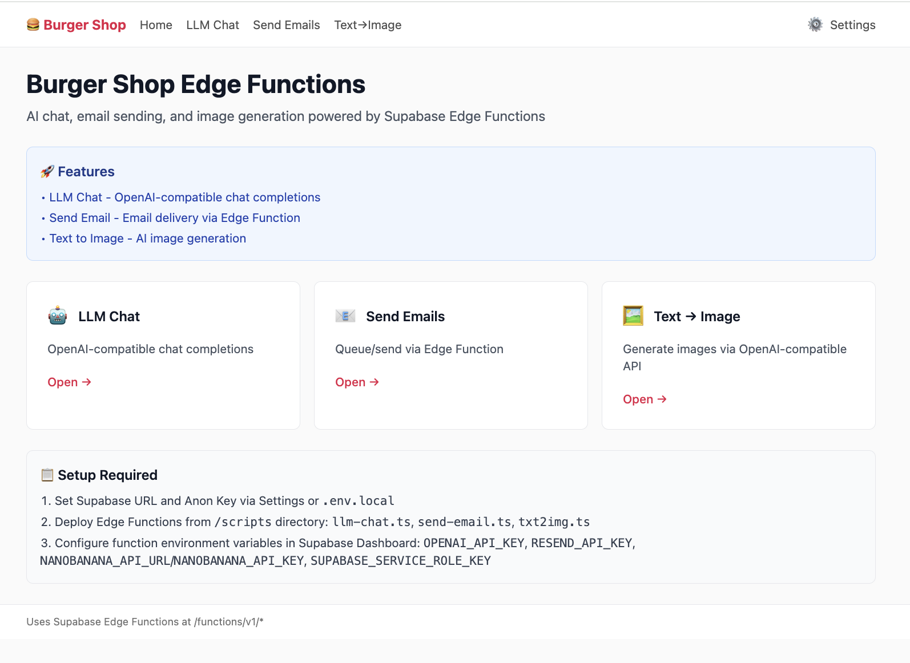

### 5.5.1 LLM Chat 案例解析

假设你想在应用中集成一个类似 ChatGPT 的聊天机器人。你需要在服务器端调用 OpenAI 的 API，但这需要一个私密的 API Key。 这个 Key 绝对不能暴露在前端代码中 ，否则任何人都可以通过查看网页源码盗用你的 Key，产生高昂的费用。这正是 Edge Function 的用武之地。我们将创建一个名为 llm-chat 的函数，它充当了前端和 OpenAI API 之间的一个 安全代理 。

参考 `project-burger-shop-edge-function-5/scripts/llm-chat.ts`的代码，我们来看看它是如何工作的：

```TypeScript
// scripts/llm-chat.ts
import "jsr:@supabase/functions-js/edge-runtime.d.ts";
import { OpenAI } from "npm:openai";

const OPENAI_API_KEY = Deno.env.get("OPENAI_API_KEY");

Deno.serve(async (req) => {
  try {
    const openai = new OpenAI({ apiKey: OPENAI_API_KEY });
    const { prompt } = await req.json();

    const stream = await openai.chat.completions.create({
      model: "gpt-3.5-turbo",
      messages: [{ role: "user", content: prompt }],
      stream: true,
    });

    return new Response(stream.toReadableStream(), {
      headers: { "Content-Type": "text/event-stream" },
    });
  } catch (err) {
  }
});
```

在该案例中，对于密钥安全，OPENAI_API_KEY 作为环境变量被安全存储于 Supabase 的服务器。本地前端代码完全无法接触到该密钥，从而有效保障了密钥的安全性。

### 5.5.2 创建并部署函数

Supabase 提供了非常友好的界面，让你无需接触命令行即可完成部署。

1. **进入 Edge Functions 面板** :
2. 登录你的 Supabase 项目 Dashboard。
3. 在左侧导航栏中，点击像代码一样的图标，进入 “Edge Functions”。
4. **创建新函数** :
5. 点击 “Create a new function” 按钮。
   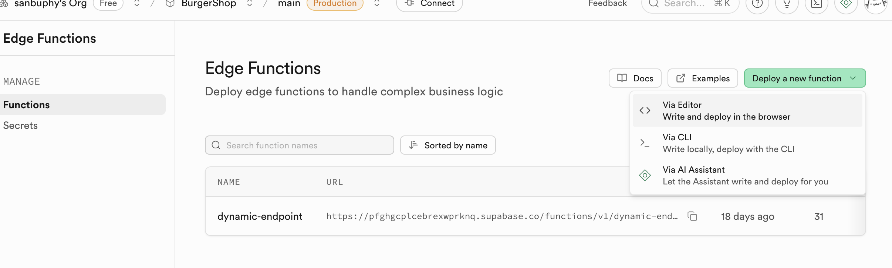
6. 为函数命名，例如 `llm-chat`。
7. **粘贴代码** :
   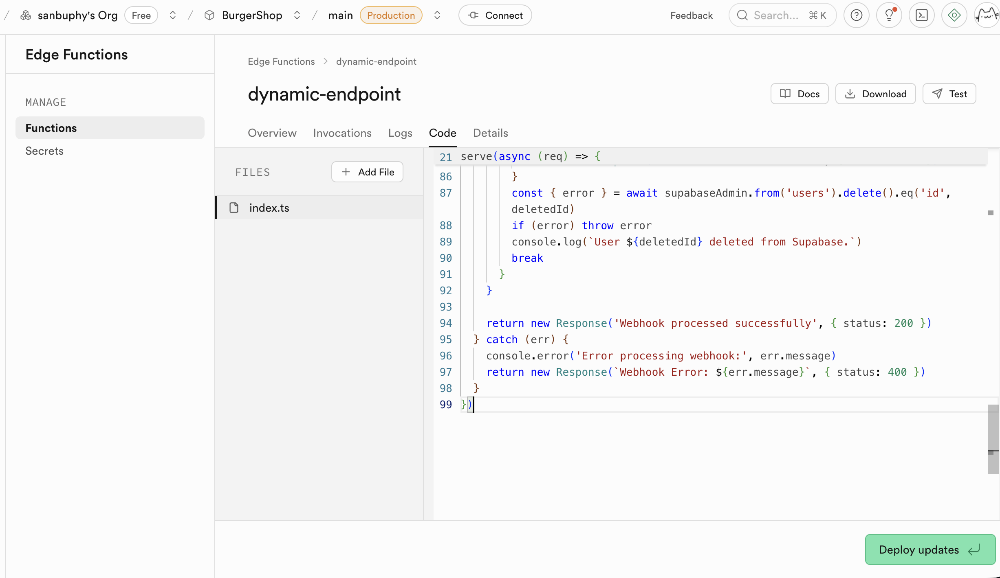
8. 在弹出的在线编辑器中， **删除所有默认的占位代码** 。
9. 打开你本地的 `llm-chat.ts` 文件， **复制其全部内容** 。
10. 将复制的代码**粘贴**到 Supabase 的在线编辑器中。
11. **配置\*\***环境变量\*\* ** (Secrets)** :
    1. 在侧边栏找到 Secrets。
       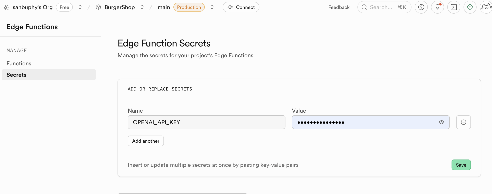
    2. Name: 输入 `OPENAI_API_KEY`。
    3. Value: 粘贴你自己的 OpenAI API Key。
    4. 点击 “Save”。在这里设置的 Secret 会被加密存储，并安全地注入到你的函数运行时环境中。

若有函数需要更新，记得在 Edge Function 部分执行 Deploy updates。Supabase 会在云端为你构建并部署这个函数。几分钟后，你的函数就可以在线访问。

除了作为语言模型的安全代理，Edge Functions 的应用场景远不止于此。实际上，任何需要服务器端逻辑处理的任务，无论是简单的 API 调用、数据验证，还是更复杂的计算，都可以通过 Edge Function 实现。它为你提供了一个轻量级、可扩展的后端，而无需管理任何服务器基础设施。

如果你想探索更多可能性，可以参考项目中的其他示例。例如：

- 图片生成 ( txt2img.ts ) : 这个函数展示了如何利用 Edge Function 调用第三方的文生图（Text-to-Image）API（如 Stability AI, Midjourney 等）来动态生成图片。这是一种典型的计算密集型或需要安全调用外部服务的场景。与 llm-chat 案例一样，API 密钥被安全地存储在 Supabase 后端，前端只负责发送文本描述，然后接收并展示生成的图片，整个过程安全、高效。
- 发送邮件 ( send-email.ts ) : 在应用中发送欢迎邮件、交易通知或密码重置邮件是常见需求。 send-email.ts 示例演示了如何通过 Edge Function 集成邮件服务（如 Resend, SendGrid）。你无需在客户端代码中暴露敏感的邮件服务 API Key，只需创建一个函数，让前端通过调用这个函数来触发邮件发送。

## 5.6 Clerk Login

Clerk 是一款专注于身份认证与用户管理的专业开发工具，核心能力覆盖用户注册、登录、账号安全MFA、权限控制、会话管理等全链路身份认证相关需求，能帮助开发者快速搭建安全、灵活且符合现代应用标准的用户体系，无需从零开发复杂的身份逻辑。

本部分将介绍如何从零开始配置 Clerk 服务，并将其与 Supabase 进行整合。你可以在项目 `project-burger-shop-auth-advanced-clerk-7` 中体验全流程。

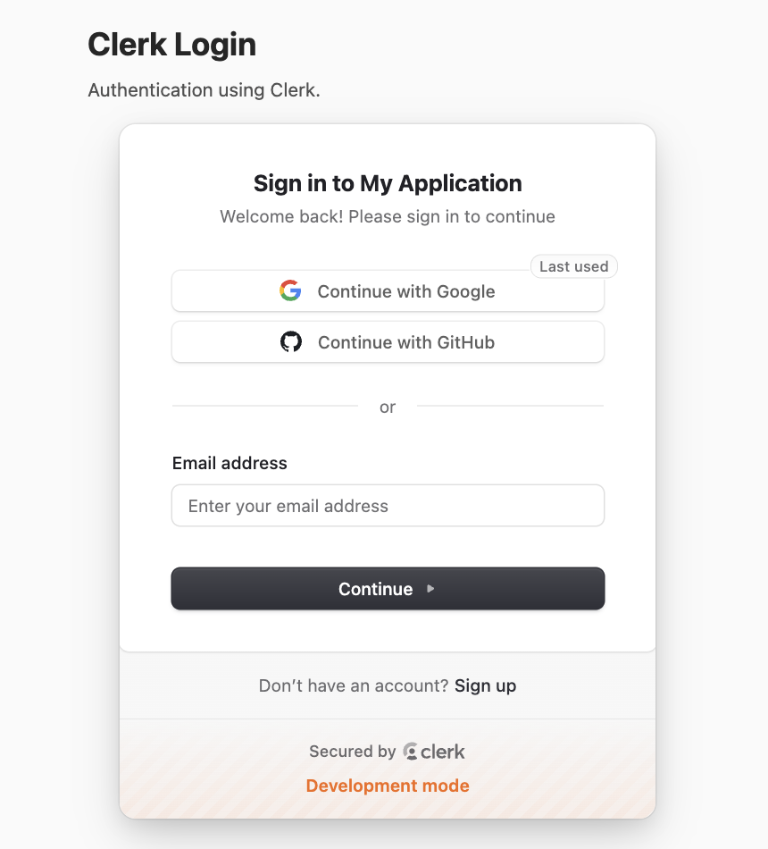

### 5.6.1 创建 Clerk 应用与获取密钥

在使用本项目之前，你需要拥有一个 Clerk 账号并创建一个应用。

1. 注册与创建:
   1. 访问 [dashboard.clerk.com](https://dashboard.clerk.com/) 并注册账号。
   2. 点击 "Create application" 。
      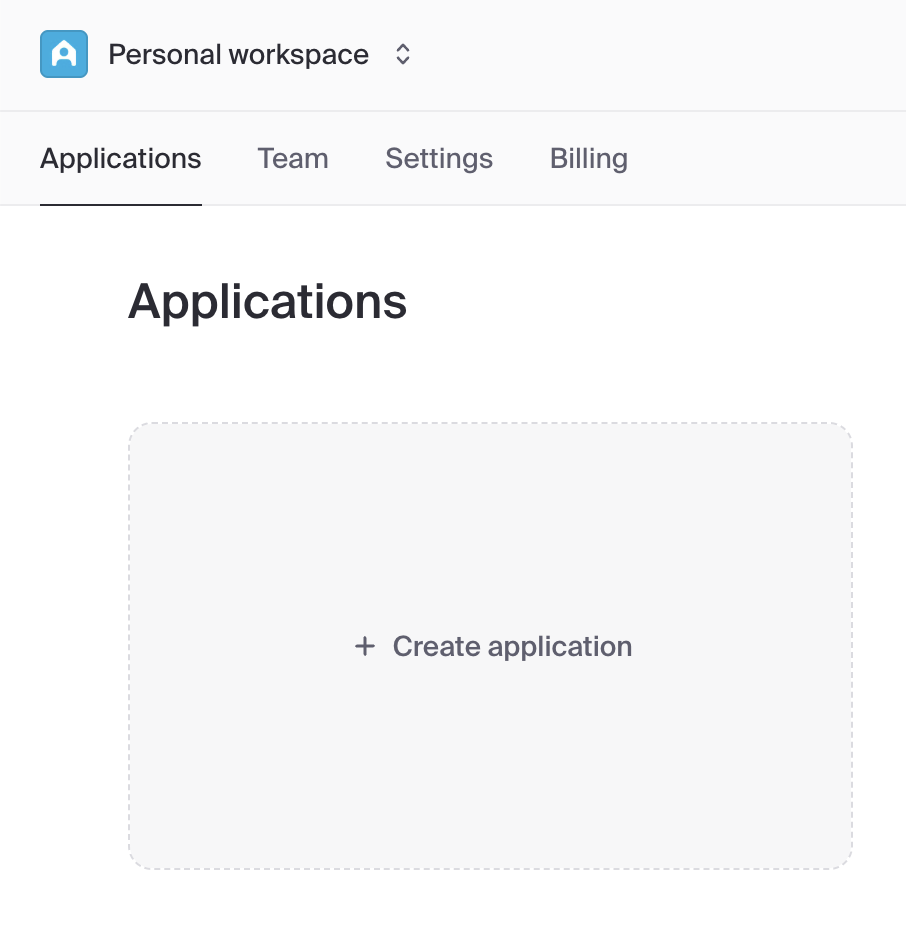
   3. 输入应用名称（例如 "Burger Shop"）。
   4. 在 "How will your users sign in?" 中，默认勾选 Email , Google , GitHub 。
   5. 点击 Create application 。
2. 获取 API Keys:
   1. 创建成功后，你会被引导至 API Keys 页面。
      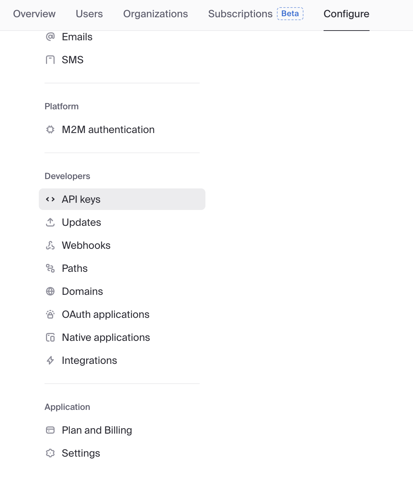
   2. 找到 Publishable key (以 `pk_` 开头) 和 Secret key (以 `sk_` 开头)。
      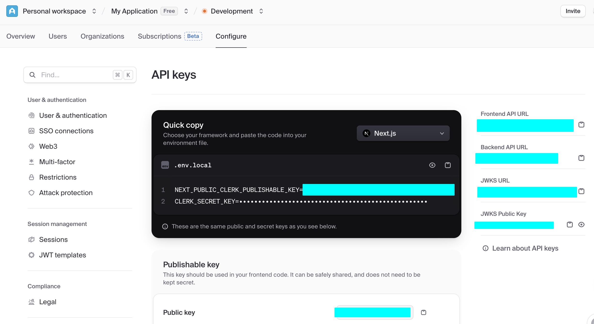
   3. 将它们复制到你的 `.env.local` 文件中（参考本项目 `.env.example`）：

      ```Bash
      NEXT_PUBLIC_CLERK_PUBLISHABLE_KEY=pk_test_...
      CLERK_SECRET_KEY=sk_test_...
      ```

### 5.6.2 配置 Supabase 和 Clerk 的原生集成

在进一步使用前，我们需要集成 Supabase 与 Clerk 的关联关系，方便之后登录的鉴权跳转以及控制对特定数据库的访问权限。Supabase 与 Clerk 提供官方原生集成能力，通过该集成可快速实现两者的身份认证打通，无需手动配置复杂的适配逻辑，大幅简化用户登录、权限校验等功能的开发流程：

1. 在 Clerk 中激活对 Supab ase 的官方集成
   1. 登录 [Clerk Dashboard](https://dashboard.clerk.com/)。
   2. 在左侧菜单导航至 Integrations (集成)。
   3. 在列表中找到并点击 Supabase。
   4. 开启 Enable Supabase 开关（或点击 Activate integration）。
   5. 关键步骤：激活成功后，页面会显示你的 Clerk Domain（格式通常为 `https://<your-id>.clerk.accounts.dev` 或你的自定义域名）。请复制这个 Domain 地址，下一步会用到。
2. 在 Supabase 中添加 Clerk 提供商
   1. 登录 [Supabase Dashboard](https://supabase.com/dashboard) 并进入你的项目。
   2. 在左侧菜单导航至 Authentication > Sign In / Up (或者直接点击 Providers)。
   3. 点击 Add provider 按钮，从下拉列表中选择 Clerk。
   4. 在弹出的 Clerk Domain 输入框中，粘贴你刚才从 Clerk 复制的 Domain 地址。
   5. 点击 Save 保存配置。

### 5.6.3 通过 Webhook 同步用户数据至 Supabase

仅仅是集成只满足了鉴定权限的需求，但这并不会将 Clerk 中已经注册的用户信息同步到 Supabase，为了方便管理，我们还需要在 Supabase 的 `public.users` 表中保留一份用户备份，以便进行关联查询或数据分析。我们可以通过 Clerk Webhooks 实现这一功能，完整过程如下：

1. **Clerk 发送通知** : 当用户在 Clerk 注册或更新资料时，Clerk 会向我们配置的 Webhook URL 发送一个 POST 请求。
2. **Supabase 接收并写入** : Edge Function 接收请求，验证签名（确保安全），然后将用户数据更新到 Supabase 的数据库表中。

在开始之前，我们需要配置同步信息所需的数据表：

```SQL
-- File: init.sql

-- 1. Create `users` table for synced Clerk users
-- This table will store user data pushed from Clerk Webhooks.
CREATE TABLE public.users (
  id TEXT NOT NULL PRIMARY KEY, -- Corresponds to Clerk User ID
  email TEXT,
  first_name TEXT,
  last_name TEXT,
  image_url TEXT,
  created_at TIMESTAMPTZ DEFAULT NOW(),
  updated_at TIMESTAMPTZ DEFAULT NOW()
);

-- 2. Enable Row Level Security (RLS) on the table
-- This is an important security measure to ensure users cannot access any data by default.
ALTER TABLE public.users ENABLE ROW LEVEL SECURITY;

-- 3. Create RLS policies
-- Policy 1: Allow authenticated users to read their own user info.
-- `auth.jwt()->>'sub'` extracts the user ID from the JWT provided by Clerk.
CREATE POLICY "Authenticated users can view their own user record"
ON public.users FOR SELECT
TO authenticated
USING ( (SELECT auth.jwt()->>'sub') = id );

-- Policy 2: Allow users to update their own info.
CREATE POLICY "Authenticated users can update their own user record"
ON public.users FOR UPDATE
TO authenticated
USING ( (SELECT auth.jwt()->>'sub') = id );
```

以及在 Supabase 中启用对应的 Edge function：

```JavaScript
// File path: supabase/functions/clerk-webhooks/index.ts

import { serve } from 'https://deno.land/std@0.177.0/http/server.ts'
import { Webhook } from 'npm:svix'
import { createClient } from 'https://esm.sh/@supabase/supabase-js@2'

// Get Clerk Webhook signing secret from environment variables
const CLERK_WEBHOOK_SECRET = Deno.env.get('CLERK_WEBHOOK_SECRET')

if (!CLERK_WEBHOOK_SECRET) {
  throw new Error('CLERK_WEBHOOK_SECRET is not set in environment variables')
}
const supabaseAdmin = createClient(
  Deno.env.get('SUPABASE_URL')!,
  Deno.env.get('SUPABASE_SERVICE_ROLE_KEY')!
)

serve(async (req) => {
  try {
    // 1. Get Svix signature info from request headers
    const headers = Object.fromEntries(req.headers)
    const svix_id = headers['svix-id']
    const svix_timestamp = headers['svix-timestamp']
    const svix_signature = headers['svix-signature']

    if (!svix_id || !svix_timestamp || !svix_signature) {
      return new Response('Missing Svix headers', { status: 400 })
    }

    const payload = await req.json()
    const body = JSON.stringify(payload)

    // 2. Verify Webhook signature validity using the secret
    const wh = new Webhook(CLERK_WEBHOOK_SECRET)
    const evt = wh.verify(body, {
      'svix-id': svix_id,
      'svix-timestamp': svix_timestamp,
      'svix-signature': svix_signature,
    })

    const { id } = evt.data
    const eventType = evt.type
    console.log(`Received webhook event: ${eventType} for user: ${id}`)

    // 3. Execute database operations based on event type
    switch (eventType) {
      case 'user.created': {
        const { id, first_name, last_name, image_url, email_addresses } = evt.data
        const { error } = await supabaseAdmin.from('users').insert({
          id,
          first_name,
          last_name,
          image_url,
          email: email_addresses[0]?.email_address,
        })
        if (error) throw error
        console.log(`User ${id} created in Supabase.`)
        break
      }

      case 'user.updated': {
        const { id, first_name, last_name, image_url, email_addresses } = evt.data
        const { error } = await supabaseAdmin
          .from('users')
          .update({
            first_name,
            last_name,
            image_url,
            email: email_addresses[0]?.email_address,
            updated_at: new Date().toISOString(), // Update timestamp
          })
          .eq('id', id)
        if (error) throw error
        console.log(`User ${id} updated in Supabase.`)
        break
      }

      case 'user.deleted': {
        // For delete events, ID might be at the top level
        const deletedId = id
        if (!deletedId) {
          return new Response('Deleted user ID not found', { status: 400 })
        }
        const { error } = await supabaseAdmin.from('users').delete().eq('id', deletedId)
        if (error) throw error
        console.log(`User ${deletedId} deleted from Supabase.`)
        break
      }
    }

    return new Response('Webhook processed successfully', { status: 200 })
  } catch (err) {
    console.error('Error processing webhook:', err.message)
    return new Response(`Webhook Error: ${err.message}`, { status: 400 })
  }
})
```

初始化 Supabase 数据表与函数结束后，你还需要在 Clerk 中启用 Webhooks 支持：

- 在 Clerk Dashboard -> **Webhooks** 中添加 Endpoint，填入Supabase Edge Function 的 URL。
- 勾选 `user.created`, `user.updated`, `user.deleted` 等事件。

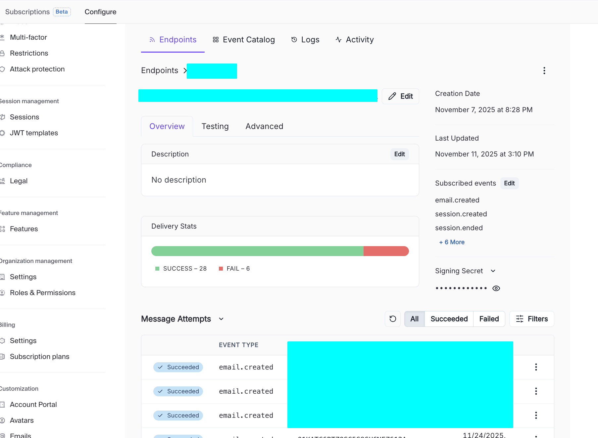

一旦设置成功，你能够在 Message Attempts 中看到不同请求信息，点击后可看到详细的请求返回参数结果；如果 webhook 在请求 Edge function 时出现问题，你可以快速在返回值中找到详细原因结果。推荐你同时对照 Clerk 和 Supabase 的请求日志信息，用于分析各个函数设定是否正确。

### 5.6.4 Clerk 中的第三方登录支持

在深入了解如何对 Clerk 支持第三方登录前，我们先明确两个核心概念：开发环境与生产环境，这是软件从 “开发测试” 到 “上线可用” 的两个关键阶段，二者的定位、用途和安全要求截然不同：

- 开发环境：开发者本地或测试服务器使用的环境，仅用于功能开发、调试和内部验证（如本地 localhost:3000 服务），不对外开放
- 生产环境：应用正式上线后，面向真实用户的公开环境（如部署在 Vercel、阿里云等平台的 https://my-app.com）

而 Clerk 对社交登录区分这两种环境，本质是平衡 “开发效率” 与 “生产安全”：开发阶段需减少冗余配置以快速验证功能，生产阶段需通过专属凭证保障数据安全，同时符合 Google、GitHub 等第三方 OAuth 平台的规则（线上应用必须绑定专属域名与凭证，不允许使用共享资源）。下面具体说明两种环境下 Clerk 社交登录的差异配置：

1. **开发环境快速验证**

开发环境中，Clerk 已预置共享 OAuth 凭证和默认重定向 URI，无需前往 GitHub/Google 申请专属凭证，操作步骤如下：

- 登录 Clerk Dashboard ，在左侧导航栏进入 SSO connections （SSO 连接）页面。
- 点击 Add connection （添加连接），选择 For all users （对所有用户生效）。
- 在 Choose provider （选择提供商）下拉菜单中，按需选择 GitHub 或 Google 。
- 直接点击 Add connection （添加连接），Clerk 会自动用共享凭证完成绑定。

  配置后，本地启动应用（如 `localhost:3000`）并点击“Sign in with GitHub/Google”，Clerk 会自动代理登录请求，快速验证功能是否正常。

2. **生产环境自定义凭证配置**

（注：如果发现有环节和预期不一致，建议阅读官方文档进行最新方式的尝试）

应用部署上线（如 Vercel、阿里云）并切换到 Clerk Production Instance 后，共享凭证失效，需为 GitHub/Google 配置自定义 OAuth 凭证（建议同时打开 Clerk Dashboard 和第三方平台页面，方便同步操作）：

- 前置通用操作（Clerk 控制台）：
  - 进入 Clerk SSO connections 页面，点击 Add connection → 选择 For all users 。
  - 选择目标平台（GitHub/Google），确保开启 Enable for sign-up and sign-in （允许注册登录）和 Use custom credentials （使用自定义凭证）。
  - 复制页面中的 Authorization Callback URL （GitHub）或 Authorized Redirect URI （Google），保存到安全位置，不要关闭当前页面/弹窗。
- 2.1 GitHub 平台配置：
  - 登录 GitHub，进入 Developer Settings （路径：头像 → Settings → Developer settings → OAuth Apps）。
  - 点击 New OAuth app ，填写信息：`Application name`（应用名称）、`Homepage URL`（生产域名，如 `https://my-app.com`）、`Authorization Callback URL`（粘贴从 Clerk 复制的地址）。
  - 点击 Register application ，再点击 Generate a new client secret ，保存生成的 Client ID 和 Client Secret （Secret 仅显示一次）。
  - 回到 Clerk 弹窗，粘贴 Client ID 和 Client Secret，点击 Add connection 完成配置（若关闭弹窗，可在 SSO connections 找到 GitHub 连接，在“Use custom credentials”模块补填）。
- 2.2 Google 平台配置：
  - 登录 Google Cloud Console ，选择已有项目或新建项目（如“My App Production”）。
  - 点击左上角菜单 → APIs & Services → Credentials ，点击 Create Credentials → OAuth client ID （首次配置需先完成 OAuth consent screen 设置，选择“External”并填写应用信息）。
  - 选择 Application type 为 Web application ，配置：
    1. `Authorized JavaScript origins`：添加生产域名（如 `https://my-app.com`、`https://www.my-app.com`），本地验证可补充 `http://localhost:端口号`。
    2. `Authorized Redirect URIs`：粘贴从 Clerk 复制的地址。
  - 点击 Create ，保存弹窗中的 Client ID 和 Client Secret ，回到 Clerk 弹窗粘贴并点击 Add connection 。
  - 关键注意事项：
    1. 禁止 WebView 登录：Google OAuth 不支持应用内浏览器登录，需参考 [Google 官方文档](https://support.google.com/cloud/answer/7657789) 调整。
    2. 切换发布状态：默认“Testing”状态仅支持 100 个测试用户，需在 OAuth consent screen 将“Publishing status”改为 In production （需通过 Google 审核）。
    3. 阻止子邮箱：Clerk 默认拦截含 `+`/`=`/`#` 的 Google 邮箱（如 `user+alias@example.com`），可在 Google 连接详情页开启/关闭 Block email subaddresses （建议开启提升安全性）。
    4. 支持 Google One Tap：配置完成后，可集成 Clerk `<GoogleOneTap />` 组件实现“一键登录”，参考 [Clerk 组件文档](https://clerk.com/docs/components/social-connections/google-one-tap)。

3. 测试第三方登录连接

配置完成后，通过 Clerk 内置 Account Portal 验证功能：

- 进入 Clerk Dashboard，左侧导航栏进入 Account Portal 页面。
- 在“Sign-in”模块右侧，点击“访问登录页面”按钮，跳转至对应环境登录页：
  - 开发环境：`https://你的域名.accounts.dev/sign-in`（如 `https://my-app.accounts.dev/sign-in`）。
  - 生产环境：`https://accounts.你的域名.com/sign-in`（如 `https://accounts.my-app.com/sign-in`）。
- 点击“Sign in with GitHub/Google”，用对应平台账号登录，若能成功跳转并返回应用，说明连接配置正常。

# 6. 从 Supabase 到更多后端开发组件（进阶）

在上文中，我们主要是站在 Supabase 的视角，去看“一个以 Postgres 为核心的一站式后端平台”能帮我们解决哪些问题：认证、数据库、文件存储、实时通信、边缘函数等，都被集成在同一个控制台里，开箱即用、体验统一，非常适合快速起步和中小型项目。

但从更长期、更工程化的角度来看， **Supabase 提供的每一块能力（Auth / Storage / Edge Functions / Realtime / Database），在业界几乎都有对应的专业替代方案** ——既包括同类 BaaS 平台，也包括更“单点突破”的云服务和开源组件。作为上进的个人开发者和初创团队来说，了解这些替代选项有几个好处：

- 判断当前项目是否“全用 Supabase 就够了”，还是某一块需要更专业/更便宜/更易合规的专用服务；
- 当项目规模变大或需求变复杂时，是否可以把某个模块从 Supabase 替换出去（例如改用专门的 Auth 平台或对象存储），而不是一开始就被平台彻底锁死；
- 拓宽技术选型视野，即使暂时不更换，也能大致知道“如果不用 Supabase 的 X 功能，我还有哪些常见选择”。

本节将分别介绍 Supabase 所覆盖的几大能力在市场上的主流替代方案，例如：认证（Auth）、文件存储（Storage）、边缘函数（Edge Functions）、实时通信（Realtime）、数据库托管等。简单对比它们在功能特性、免费额度/定价、易用性以及社区流行度等方面的差异， 让你对后端组件工具库有更全面的理解。

## 同类 Baas 平台

在开始之前，我们可以浏览同类的 Baas 平台，若觉得 Supabase 不够好用，你可以根据需求选择不同替代品进行尝试。

| 平台/服务                | 类型                                                                           | 免费额度/定价                                                              | 特点 / 适用场景                                                                                                                       |
| ------------------------ | ------------------------------------------------------------------------------ | -------------------------------------------------------------------------- | ------------------------------------------------------------------------------------------------------------------------------------- |
| Firebase（Google）       | 全托管 BaaS（Auth + Firestore + Storage + Functions + Hosting）                | Spark：免费轻量额度；Blaze：按量计费（Firestore/Storage/Functions 分别算） | 行业最成熟、文档好、上手快、实时能力强。适用于中小型产品、移动/前端主导团队。缺点：计费复杂、锁定性强、查询限制多（尤其 Firestore）。 |
| Supabase                 | 开源 BaaS（Postgres + Auth + Storage + Edge Functions + Realtime）             | 免费：500MB DB、1GB Storage、无服务器函数少量调用；Pro：按实例计费         | 最像 Firebase 的 SQL 版；界面优秀、体验现代、可自托管。适用于需要强 SQL、BI、事务能力的应用。缺点：高并发或复杂函数成本较高。         |
| Appwrite Cloud           | 开源一站式 BaaS（DB + Auth + Storage + Functions + Realtime）                  | 免费：包含基本 DB/Storage/FaaS；付费按资源级别计费                         | 体验现代化、API 统一、可自托管；适合开发者友好的应用快速迭代。缺点：生态还不如 Firebase/Supabase 成熟；性能在大型应用中需要测试。     |
| Nhost                    | Postgres + GraphQL + Auth + Storage + Functions                                | 免费：1GB DB、1GB Storage、少量函数调用                                    | 类似“Supabase + Hasura”；天然 GraphQL；适合前端团队与 React/Next.js 项目。缺点：生态小、成本随用量升高。                              |
| AWS Amplify              | AWS 一站式后端（Cognito + AppSync + DynamoDB + Storage + Functions + Hosting） | 免费：Hosting 额度 + Cognito 10k MAU + 部分函数额度                        | 大而全，适合已有 AWS 基础的团队；企业级可靠性。缺点：最难上手，服务碎片化；初创团队维护成本高。                                       |
| Xata（近两年快速增长）   | 多模型数据库 + Auth + Edge Functions                                           | 免费：250k 记录、15GB 带宽                                                 | 虽然更偏「DB + API」，但提供 Auth、文件、逻辑，可作为轻量全栈后端。UI/开发体验极佳。缺点：功能不如 Firebase/Supabase 全面。           |
| Convex（开发者体验极强） | 托管数据库 + Auth + Functions（前端优先）                                      | 免费开发版；付费按请求量计费                                               | 极简上手；无需 schema；前端写函数即可用后端。适合 MVP/快速验证。缺点：高度绑定平台，迁移成本高；不算完全传统 BaaS。                   |

## 认证 (Auth)

| 工具/平台               | 功能特点                                                                                                               | 免费额度/定价                        | 适用场景与优缺点                                                                                                                                   |
| ----------------------- | ---------------------------------------------------------------------------------------------------------------------- | ------------------------------------ | -------------------------------------------------------------------------------------------------------------------------------------------------- |
| Firebase Authentication | Google 提供的 BaaS 身份验证服务，支持邮箱/密码、手机、社交登录、匿名等常见方式。Spark 免费方案支持最高50k 月活跃用户。 | Spark（免费）50k MAU；Blaze 按量计费 | 集成 Google 生态，文档丰富，上手简单；功能全面（MFA、阻塞函数等），适合快速开发。但与 Firebase 平台绑定，扩展到其他服务需额外配置。                |
| Auth0 (Okta)            | 全托管身份认证平台，支持社交登录、企业 SSO、多因子认证、规则扩展等强大功能。                                           | 免费方案25k MAU，付费按 MAU 计费     | 企业级功能齐全（RBAC、审计日志等），适合中大型应用；界面友好。缺点是 MAU 上升时成本高，免费版功能有限（如不含 MFA/RBAC）。社区知名度高，用户众多。 |
| AWS Cognito             | 亚马逊云原生身份服务，支持社交及 SAML 联合登录。直接登录用户池提供每月10k MAU 免费，超过部分按 0.0055 美元/MAU 收费。  | 免费10k MAU/月，超出按量付费         | 与 AWS 生态深度集成（可无缝配合 API Gateway、Lambda 等），入门门槛略高，文档较复杂；免费额度有限，适合已有 AWS 使用习惯的团队。                    |
| Logto                   | 开源身份认证平台，自托管版免费，云服务计划免费50k MAU。支持多语言、多租户、OAuth/OIDC 等。                             | 社区版免费；Logto Cloud 免费50k MAU  | 近期流行的 Auth0 开源替代方案，GitHub 已有 10k+ Stars。易扩展，自托管降低成本；缺点是生态和文档相对较新，社区规模略逊于 Firebase/Auth0。           |
| Keycloak                | 知名开源 IAM/SSO 解决方案，支持用户名密码、LDAP、SAML、OAuth2 等。                                                     | 完全免费，需自托管                   | 功能强大、可扩展（支持细粒度权限控制），企业级功能丰富；但部署和维护复杂度高，对小团队而言学习曲线较陡。缺点是对容器化和集群运维要求较高。         |

## 文件存储 (Storage)

| 平台/服务                                | 类型                 | 免费额度/定价                                                      | 特点/适用场景                                                                                                                                         |
| ---------------------------------------- | -------------------- | ------------------------------------------------------------------ | ----------------------------------------------------------------------------------------------------------------------------------------------------- |
| Amazon S3                                | 云对象存储（AWS）    | AWS 免费套餐提供 5GB 存储、20k GET/PUT 请求/月，超出按使用量付费   | 行业标准的对象存储，可靠性高、全球多区域部署。功能全面，与 AWS 生态整合良好；定价较复杂，新用户需了解计费规则。                                       |
| Google Cloud Storage（Firebase Storage） | 云对象存储（Google） | Firebase Spark 方案提供免费额度（1GB 存储 + 流量限制），Blaze 付费 | 与 Firebase/Google Cloud 紧密集成，易于管理；支持 CDN 加速、细粒度安全规则。                                                                          |
| 腾讯云 COS / 阿里云 OSS                  | 云对象存储（国内）   | 按量付费（各有新用户赠送额度，如OSS有首年40GB免费等）              | 面向国内市场，高性能、大规模对象存储；与中国云生态整合，文档较完善。阿里OSS 功能全面、全球加速；七牛KODO 专注多媒体处理，成本较低，适合个人和小团队。 |
| MinIO                                    | 开源 S3 兼容存储     | 开源免费（自建）                                                   | 轻量级、高性能、与 S3 API 兼容，适合在私有云或本地搭建对象存储。文档和社区活跃；需自己维护基础设施。                                                  |
| Cloudinary / Imgix 等                    | 媒体存储+CDN         | 基本免费方案（如 Cloudinary 免费 25GB/月带宽）                     | 针对图片/视频优化的云存储+CDN 服务，提供实时转码、压缩等高级功能。适合媒体项目，但功能较专一，作为通用文件存储使用成本偏高。                          |

## 边缘函数 (Edge Functions)

| 平台/服务                              | 特点                                       | 免费额度/定价                                                          | 适用场景与优缺点                                                                                                                                                           |
| -------------------------------------- | ------------------------------------------ | ---------------------------------------------------------------------- | -------------------------------------------------------------------------------------------------------------------------------------------------------------------------- |
| Cloudflare Workers                     | 全球分布式 JavaScript/Wasmtime 环境        | 免费计划：每天 100k 请求；标准计划$5/月含1,000万请求                   | 运行在 Cloudflare 边缘节点，延迟极低；适合全局分发的逻辑、静态资源渲染等。免费配额较少（相当于每月约300万请求），上手简单。缺点是运行时（JS/Wasmtime）限制与调试工具有限。 |
| Vercel Edge Functions                  | 随 Next.js/前端框架无缝集成，支持 JS/TS/Go | Hobby 免费：每月 100万 函数调用，100万 边缘请求                        | 深度集成前端框架，自动部署；适合现代 Web 应用。免费额度充足，默认运行时 10s，可提升至 60s。缺点是免费版团队协作功能受限；依赖 Vercel 平台。                                |
| Netlify Edge / Functions               | Node.js 云函数＋边缘路由（NFT）            | 免费：300 代币/月（约相当于每月 1M 请求）；按信用点计费                | 支持 Node.js 函数、边缘处理路由等。免费额度用于构建、函数和带宽，适合前端全栈部署。优点是简便易用，集成 Git 部署；缺点是免费额度使用需算计（10k 请求 = 3 点）。            |
| AWS Lambda@Edge / CloudFront Functions | AWS 无服务器边缘计算                       | AWS Lambda（1M 免费请求/月+400k GB-s）+ CloudFront $0.085/每10万调用起 | 与 CloudFront 集成，可在边缘执行代码。适合需要 AWS 生态（如在节点层面做权限或 A/B 测试）。优点是灵活强大；缺点是配置复杂，延迟略高于 Cloudflare/Vercel。                   |

## 实时通信 (Realtime)

| 平台/服务                              | 功能特点                                         | 免费额度/定价                                         | 适用场景与优缺点                                                                                                     |
| -------------------------------------- | ------------------------------------------------ | ----------------------------------------------------- | -------------------------------------------------------------------------------------------------------------------- |
| Firebase Realtime Database / Firestore | Google BaaS 实时数据库；支持数据变更推送         | Spark 免费：实时数据库1GB 存储 & 限额；Blaze 按量付费 | 强集成 Firebase 生态，实时监听简单。优点是免费起步快；缺点是数据库类型（JSON/NoSQL），复杂查询能力弱。               |
| Ably                                   | 实时消息与 pub/sub 平台，支持 WebSocket、MQTT 等 | 免费包：每月 6,000,000 条消息                         | 功能全面的实时消息服务，高并发支持；免费额度可达600万消息/月。社区与文档较好，适合全球分布。                         |
| Pusher Channels                        | 事件推送服务，支持频道/事件机制                  | Sandbox 免费：每日 200k 消息，100 并发连接            | 易用的 WebSocket 服务，文档齐全，适合快速实现聊天和通知功能。免费版限制消息量和连接数；付费后扩展性好。              |
| 自建 WebSocket/Socket.IO               | 自己搭建服务器（Node.js、Elixir 或 Go 等）       | 自行托管成本（如服务器费用）                          | 灵活度最高，可根据需求定制协议和拓扑。适合对成本控制严格且技术成熟的团队。缺点是需自行处理可用性、扩展和跨域等问题。 |

## 数据库

| 平台/工具                    | 数据库类型                              | 免费额度/定价                                         | 主要特点                                                                                                                            |
| ---------------------------- | --------------------------------------- | ----------------------------------------------------- | ----------------------------------------------------------------------------------------------------------------------------------- |
| Neon (Serverless PostgreSQL) | 关系型（PostgreSQL）                    | 免费计划：0.5GB 存储，主分支永久在线，20h 分支计算/月 | 云原生无服务器 Postgres，支持自动伸缩和分支（fork 测试）。免费额度对小项目够用，适合现代开发流程。分支功能强大，但免费额度较小。    |
| Aiven PostgreSQL             | 关系型（PostgreSQL/MySQL）              | 免费计划：1GB 存储，1 vCPU，1GB 内存                  | 托管级数据库服务，支持跨云多区域迁移。提供有 MySQL、Redis 等可选。免费额度适合开发和小型项目；商业版支持高可用集群和监控。          |
| CockroachDB Cloud            | 分布式 SQL（兼容 PostgreSQL）           | 免费计划：10GB 存储                                   | 类似 Google Spanner 的分布式 SQL 数据库，自动分片扩展。免费10GB 空间较慷慨；适合需要横向扩展和高一致性的应用。商业版 SLA 高。       |
| TiDB Cloud                   | 分布式关系型（MySQL 兼容）              | 免费计划：每节点5GB，总计最多25GB                     | 开源 TiDB 的云版，兼容 MySQL 协议，分布式架构。免费额度充足，适合熟悉 MySQL 的团队，性能优秀；缺点是运维相对复杂（针对大型场景）。  |
| MongoDB Atlas                | 文档型（NoSQL MongoDB）                 | 免费 M0 集群：0.5GB 存储                              | 云端 MongoDB，灵活的文档模型，支持丰富查询和索引。免费 0.5GB 数据库适合测试和小型应用；可按需横向扩展。学习曲线略高于关系型数据库。 |
| SQLPub                       | 多数据库（MySQL、PostgreSQL、Redis 等） | 免费计划：36,000 请求/小时，30 并发连接，500MB 存储   | 一站式数据库平台，支持多种数据库类型。免费版适合学习和小项目；优点是支持多种 DB，缺点是存储额度较小。                               |

以上替代方案各有侧重：开源更灵活可控（Keycloak、MinIO、Socket.IO、Neon、CockroachDB 等），云托管服务更易上手（Firebase、Auth0、Cloudflare、Vercel、Netlify、AWS、Aiven、MongoDB Atlas 等）。选择时可根据项目需求、团队技术栈、预算和社区生态等权衡。个人项目可优先选用免费配额充足、易集成的服务（如 Firebase 系列、七牛存储、Cloudflare Workers、Neon、CockroachDB 等），而对企业级或特定安全需求，则可考虑功能更丰富但收费较高的方案（Auth0、Alibaba/Tencent 云、AWS、TiDB/Aiven 等）。你可以在实际应用中不断尝试，直到选择出最适合的后端开发工具组件。

# 总结

在今天的课程中，我们系统学习了数据库的基础概念、Supabase 的核心定义及其操作细节。后续在实践过程中，你可根据项目的实际应用场景与需求，随时回头翻阅这份文档作为参考。

请时刻记住一个重要原则： **先完成，再完美！** 无需追求一步到位，我们完全可以通过持续迭代优化，逐步靠近更优的成果。祝你在后续的项目实践中一切顺利！

# 📚 课后作业

1. 开发一个包含用户管理系统和数据库的应用程序。最好包含更多的Supabase 功能 (Realtime / cloud storage / Edge function).
