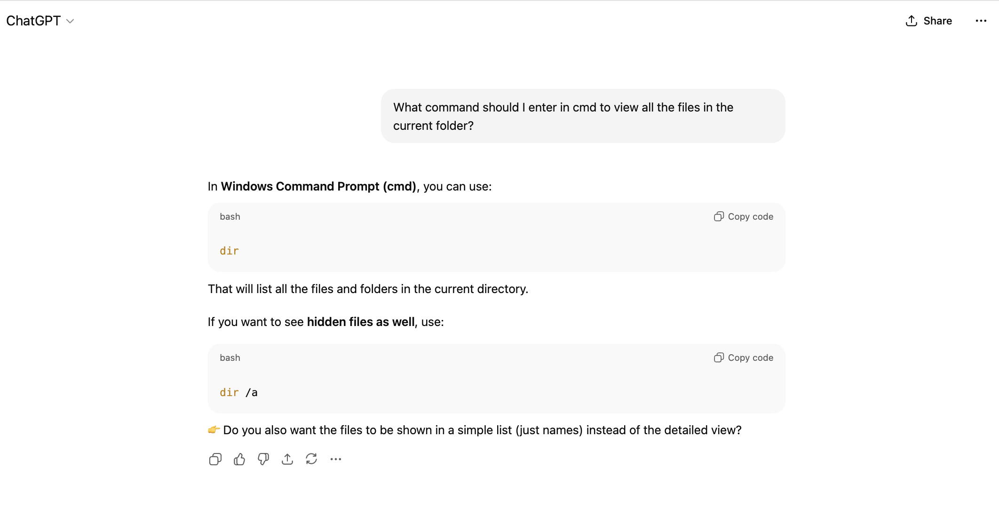
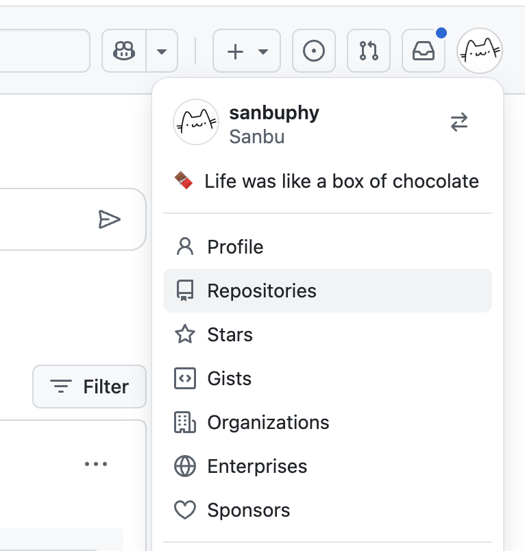
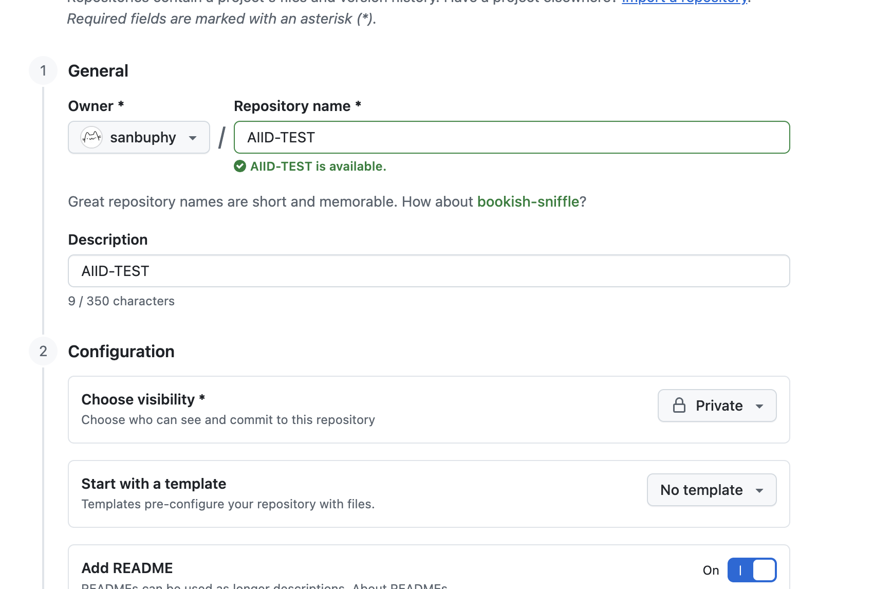
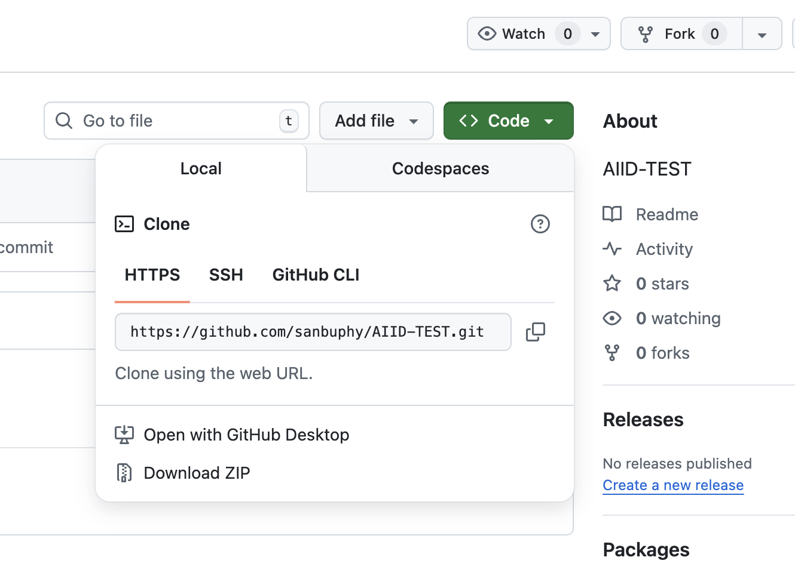
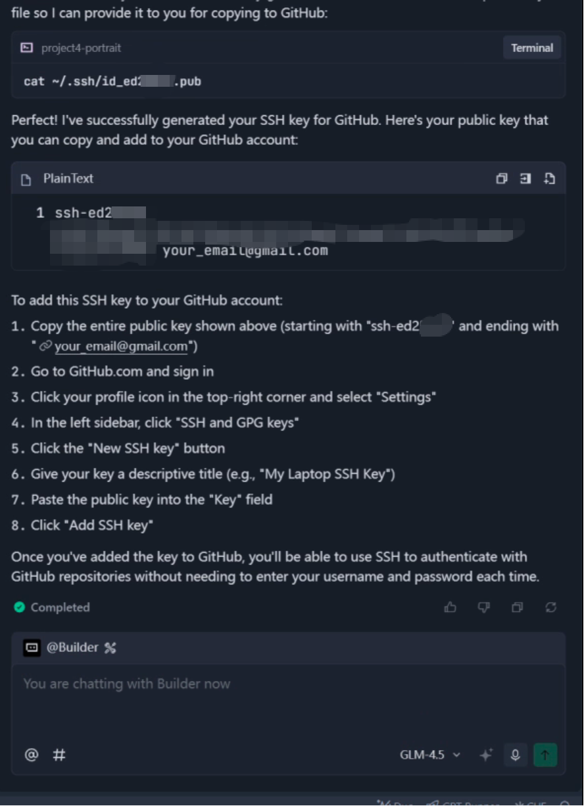
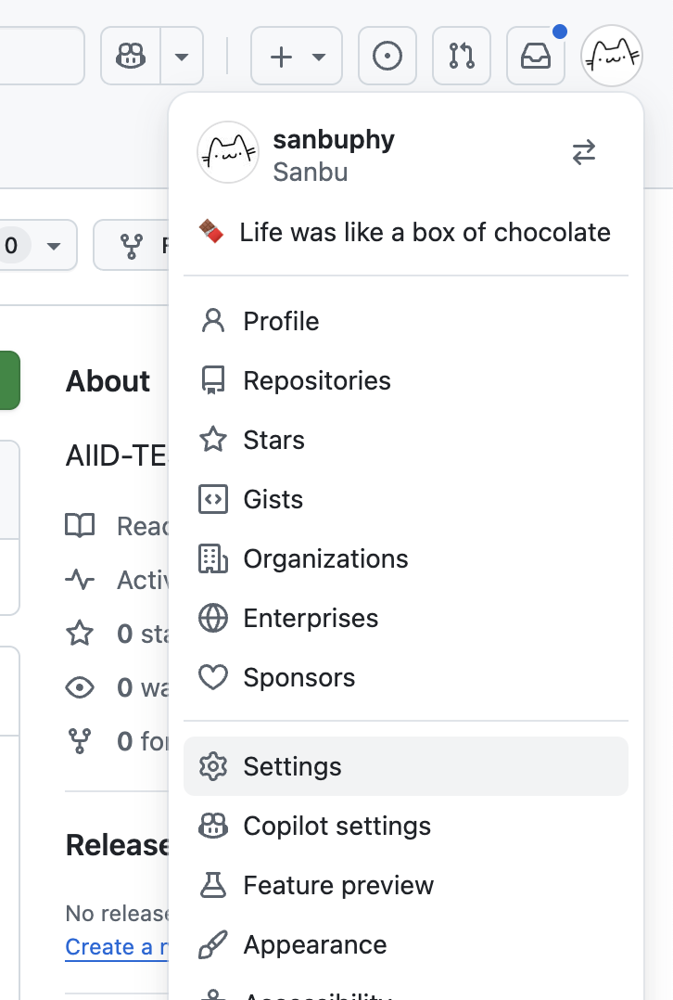
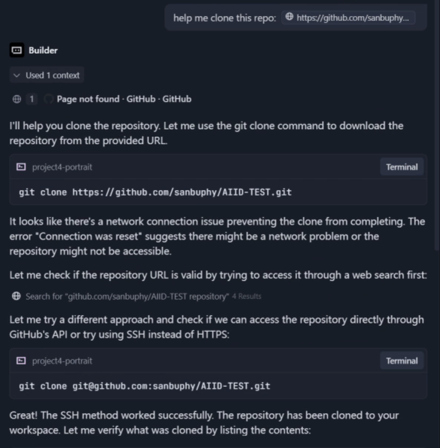

# 扩展知识 1 - 什么是 Git 和 GitHub

在之前的课程中，我们学习了如何使用基于 Web 的 vibe coding 工具编写代码。每次对话都会创建一个新版本的代码。但是，让我们思考一个问题：如果我们想恢复到之前的修改，有没有方便的方法？有没有一种工具可以记录我们在不同阶段的代码，使我们能够随时在不同版本之间切换和修改？

为了满足这一需求，版本控制软件应运而生。在这篇文章中，我们将介绍最著名的版本控制程序——Git——以及最好的代码托管平台——GitHub。我们将学习如何使用 Git 进行代码管理，如何从 GitHub 获取他人的代码，如何上传我们自己的代码，以及如何与他人合作进行大型项目。

无论是个人项目的版本跟踪，团队协作中的代码同步，还是为开源社区做贡献，Git 和 GitHub 都是现代开发者的必备工具。通过掌握它们，你将能够更高效地管理代码，根据需要创建检查点，在代码的不同阶段之间自由切换，并轻松处理从单个文件更改到开发大型项目的所有事务——使每一次代码迭代都可控且可追溯。

# 什么是 Git

Git 是由 Linux 内核开发者 Linus Torvalds 于 2005 年创建的分布式版本控制系统。其核心功能是跟踪文件的修改历史，允许开发者随时查看和回滚到以前的版本，并在与他人协作时高效地合并更改。


与早期的集中式版本控制系统相比，Git 的“分布式”特性允许每个开发者的本地设备存储代码仓库的完整历史记录。大多数操作（如提交、回滚和分支管理）都可以在不依赖中央服务器的情况下执行，这使得 Git 更灵活，更适合大规模协作和离线工作。

> 💡 在操作 Git 之前，让我们先了解一下什么是终端。
>
> ## 什么是终端？
>
> 终端本质上是一个基于文本的“计算机接入点”。在早期，图形界面（没有图标，没有鼠标点击）出现之前，用户只能通过键入文本命令与计算机交互。这种方法代代相传，成为了我们要介绍的今天的终端。
>
> 它不依赖花哨的界面，纯粹通过“命令 + 反馈”工作。这使其成为人机交互最基本和直接的方法之一。
>
> 不同系统的终端有所不同。在 Windows 上，常见的是“命令提示符 (cmd)”和“PowerShell”。你可以通过在计算机的运行/搜索框中输入“cmd”或“powershell”来启动这些命令行程序。
>
> 
>
> 
>
> 前者是一个较旧的工具，仅支持基本命令，如查看文件和复制，适合简单任务。后者是一个更高级的版本，可以处理复杂的操作，如进程管理和远程控制，并且还兼容 cmd 命令——使其在开发或系统管理场景中更常用。macOS 和 Linux 都默认带有“终端”，它们的命令逻辑相似，源自 Unix（贝尔实验室工程师在 20 世纪 60 年代末开发的经典计算机系统）。
>
> 终端在今天仍然至关重要，因为它的效率和广泛的兼容性。例如，一条命令可以批量重命名文件，比用鼠标重复点击快得多。此外，本地服务器、云服务器和专业开发环境通常没有图形界面，因此终端操作是必要的。许多任务，如安装各种程序（如 Git、Python、系统工具或开发依赖项）、运行代码、管理计算机进程和配置系统参数，也需要终端命令。
>
> 你可能会想，如果记不住所有那些终端命令该怎么办。事实上，随着大语言模型的快速发展，不再需要像以前那样死记硬背了。现在，你只需要在需要时询问模型（例如“如何用 Git 获取远程代码？”或“如何通过命令行删除文件夹或批量创建文件夹？”），然后从回复中复制有用的命令即可。
>
> 

## 如何安装 Git

我们将演示在不同计算机操作系统上安装 Git 的三种方法。请根据你的系统版本按照说明进行操作：

### Windows

1. 前往 [Git 官方下载页面](https://git-scm.com/download/win) 并下载适合你系统的安装程序：[安装包](https://github.com/git-for-windows/git/releases/download/v2.51.0.windows.1/Git-2.51.0-64-bit.exe)。默认情况下，推荐使用 x64 安装程序。
2. 双击安装程序并按照安装向导说明进行操作：
   
   1. 建议保持默认选项。如果你需要自定义，请注意以下几点：（在大多数情况下，你可以一直点击“Next”）
      - 选择 Git 使用的默认编辑器：选择你喜欢的编辑器（如 VS Code）。你可以默认选择第一个选项，即 Vim（一个文本编辑器），或选择“Visual Studio Code as Git's default editor”选项（需要预先安装 VS Code）。你可以保持默认选择并点击“Next”继续。
        
      - 选择如何使用 Git：这三个选项控制 Git 在系统中的可访问性。建议选择选项 2（“from command line and 3rd-party software”）——它将基本的 Git 工具添加到 PATH 中，让你可以在 Git Bash、命令提示符、PowerShell 和 IDE 中使用 Git，而不会使系统混乱。
        

3. 安装后，在桌面上右键单击。如果在菜单中看到“Git Bash Here”，则安装成功。


### MacOS

对于 macOS，你可以首先在终端中输入 `git --version` 来检查是否已经安装了 Git。如果没有，系统会提示你安装——只需按照说明完成安装即可。

1. 方法 1：通过 Homebrew 安装
   如果你安装了 [Homebrew](https://brew.sh/)（Mac 包管理器），请打开终端并输入
   ```Bash
   brew install git
   ```
2. 方法 2：（推荐）通过 Xcode 安装： https://developer.apple.com/xcode/ ，Xcode 内置了 Git。安装后，只需按照说明继续操作。

### Linux

大多数 Linux 发行版可以通过其包管理器安装 Git：

- Ubuntu/Debian:

```Bash
sudo apt update
sudo apt install git
```

- CentOS/RHEL:

```Bash
sudo yum install git
```

- 验证安装：在终端中输入 git --version。如果显示版本号，则安装成功。

## Git 初始化

安装 Git 后，你首先需要配置你的用户信息——这是使用 Git 进行版本控制的基本步骤。在终端中执行以下命令（将括号中的内容替换为你自己的信息）：

```Bash
# 设置全局用户名（将显示在提交记录中）
git config --global user.name "Your Name"

# 设置全局邮箱（建议使用在 GitHub/GitLab 等平台上注册的邮箱）
git config --global user.email "your.email@example.com"
```

Git 会将此信息嵌入到每个提交记录中，作为每次修改的“作者信息”。查看版本历史记录（例如，使用 git log）时，你可以清楚地看到谁修改了每一行代码，便于追溯责任和沟通。在协作项目中，统一的身份信息使团队成员能够快速识别谁做了哪些更改，从而提高协作效率（例如通过提交记录找到相关开发人员讨论问题）。

你可以通过在命令行中输入 `git config --list` 来查看当前的 Git 配置信息，以确认设置成功。

# 什么是 GitHub

GitHub 是一个基于 Git 的代码托管平台。它不仅为 Git 仓库提供远程存储，还包括协作工具（如 Issues、Pull Requests、Projects），使开发者更容易分享代码和协作。简而言之，Git 是一个本地版本控制工具，而 GitHub 是一个远程“代码仓库云盘 + 协作社区”。

GitHub 不仅是世界上最大的代码托管平台，也是全球最活跃、最具影响力的开源社区。这里“开源”的核心思想是任何人都可以下载并运行软件的源代码。这种模式允许世界各地的人们检查彼此的代码并进行修改，或基于此创建新项目。例如，你可以在 GitHub 上找到各种学习教程以及用于训练 GPT 模型的框架（如 PyTorch）的完整源代码。每天，无数人在全球范围内协作审查和改进代码。


许多大公司在 GitHub 上开源他们的程序或教程，以获得行业竞争优势——这也可以看作是一种广告形式。在 GitHub 社区中，项目获得的“星标 (stars)”数量是衡量其价值的主要指标；项目或组织拥有的星标越多，其可信度和影响力就越大。


在我们的课程中，支持资源和作业也将上传到专用的 GitHub 仓库。通过上传作业的过程，你将逐渐熟悉并掌握 GitHub 的使用，为未来应用程序开发中的版本控制打下坚实的基础。

## 注册 GitHub 账号

1. 访问 [GitHub 官网](https://github.com/) 并点击右上角的“Sign up”。
   
2. 输入你的电子邮件地址（建议使用常用邮箱，因为验证和通知将发送到那里），设置密码（必须包含字母、数字和特殊字符）。
3. 完成人工验证，按照提示验证邮箱，你的账号就创建好了。

## 在 GitHub 上创建你的第一个仓库

接下来，我们将创建第一个存储文件夹，也称为仓库或“repo”。




1. Repository name：向他人显示的仓库名称。
2. Description：仓库的详细描述。
3. Choose visibility：对于个人仓库，如果设置为 private，只有你和特别邀请的人可以看到。如果设置为 public，所有人都可以看到。
   对于组织内的仓库，如果是 Private，只有组织内的人可以看到。
   如果是 Public，组织外的人也可以看到。
4. README：通常的惯例是每个仓库都应该有一个 README 文件。你可以把它看作是仓库的完整介绍，包括使用说明、文件列表和操作方法。
5. Add .gitignore and license：
   1. .gitignore 文件告诉 Git 在上传到 GitHub 时忽略某些文件夹或文件，因此它们不会被跟踪或添加到暂存区。这对于临时测试文件、依赖包或大文件很有用。一旦指定，这些文件将不再被跟踪。
   2. license 指的是你选择的开源许可证类型。不同的许可证详细规定了他人是否可以将你的代码用于商业目的，并包含其他条款和条件。

建议勾选“Add README”，将仓库可见性设置为“Private”，并根据自己的喜好填写仓库名称和描述，然后点击“Create repository”完成创建第一个远程仓库。



之后，你将拥有一个没有任何额外文件的干净仓库。接下来你可以开始上传文件了。


获取仓库的命令是 `git clone`，但它需要仓库地址。你可以通过点击绿色的“Code”按钮找到仓库地址，你会看到 HTTPS 和 SSH 选项。通常，你可以使用这两种方法中的任何一种将仓库下载到本地机器（只有这样你才能修改和上传文件）。



一般来说，通过 HTTP 克隆的仓库适合临时下载和测试他人的仓库，但不建议用于自己的开发。为了更好的学习体验，你应该先设置 SSH 认证。

## 绑定本地 SSH

在 GitHub 中，“SSH 协议绑定”本质上意味着将你本地设备的 SSH 公钥与你的 GitHub 账号关联，允许 GitHub 通过 SSH 协议识别你的设备。这使你能够安全地操作远程仓库，而无需密码（如 clone、push 或 pull 代码）。

简单来说：这就像给你的设备一张“GitHub 专属门禁卡”。绑定后，当你的设备通过 SSH 协议访问 GitHub 仓库时，GitHub 会验证这张“门禁卡”（你的 SSH 公钥）。一旦确认为你的授权设备，你就可以直接操作——不需要每次都输入账号密码。

> 💡 什么是 SSH

### 为什么需要 SSH 协议绑定？

GitHub 支持两种主要的仓库操作协议：HTTPS 协议和 SSH 协议：

- HTTPS 协议：每次操作（如 push）都需要输入 GitHub 账号密码（或个人访问令牌 PAT）。验证过程繁琐，且存在密码泄露风险。
- SSH 协议：身份验证通过“密钥对”完成，因此不需要重复输入密码，且加密传输更加安全。

“SSH 协议绑定”是启用 GitHub SSH 认证的前提步骤——只有将本地 SSH 公钥“绑定”到 GitHub 账号后，GitHub 才能识别你的设备并允许对仓库进行 SSH 操作。

### “绑定”的核心逻辑：SSH 密钥对的作用

SSH 认证依赖于密钥对（公钥 + 私钥），它们是匹配的加密文件。生成后，你需要将“公钥”提供给 GitHub（“绑定”），而“私钥”留在本地设备上：

1. 私钥：存储在本地设备（如电脑）的指定目录中（通常是 ~/.ssh/），充当“你的专属钥匙”，绝不能与任何人分享。
2. 公钥：这是一把可以公开分享的“锁”——你需要将其复制到 GitHub 账号的“SSH keys list”中（“绑定”操作）。

当你通过 SSH 操作 GitHub 仓库时（例如 git push git@github.com:xxx/xxx.git）：

- 你的本地设备使用私钥加密“操作请求”并发送给 GitHub；
- 收到请求后，GitHub 尝试使用你之前绑定的公钥进行解密；
- 如果解密成功，你的设备被确认为已授权，操作被允许；否则，访问被拒绝。

### “绑定”的具体步骤（核心流程）

一旦你理解了原理，实际操作就很简单——核心是“生成密钥对 → 上传公钥到 GitHub”：

1. 本地生成 SSH 密钥对
   1. 使用 Trae 获取公钥（推荐）
      提示词：`Help me create the SSH key needed for GitHub login. My email is your_email@gmail.com , Please return the public key for me to copy`

   

   输入提示词后，你还需要在左侧终端按 Enter 键，否则命令会一直等待而不执行。由于 Trae 无法帮你执行任何条件判断，我们只需要一直按 Enter 即可。

   最后，你会看到右侧的 Trae 返回了它读取的公钥。你只需复制它并准备在下一步中粘贴。

    2. 手动获取公钥
   打开你的本地终端（在 Windows 上使用 Git Bash 或 PowerShell；在 macOS/Linux 上使用终端），输入以下命令（将 your_email@example.com 替换为你注册 GitHub 账号时使用的邮箱）：

   ```Bash
   ssh-keygen -t ed25519 -C "your_email@example.com"
   ```

   1. 按 Enter 接受默认值（默认文件路径，无密码，或根据需要设置密码）。这将在 ~/.ssh/ 目录中生成两个文件：
      - id_ed25519：私钥（本地保存，**绝不分享**）；
      - id_ed25519.pub：公钥（需要上传到 GitHub）。

2. 将公钥“绑定”到你的 GitHub 账号

这是核心绑定步骤——将本地公钥添加到 GitHub 账号的“SSH keys list”中：

1. 复制公钥内容：
   1. Trae：
   2. Windows：用记事本打开 C:\Users\<your>\.ssh\id_ed25519.pub 并复制其所有内容；
   3. macOS/Linux：在终端运行 cat ~/.ssh/id_ed25519.pub 并复制所有输出（从开头的 SSH-ed25519 到结尾的邮箱）。
2. 登录 GitHub 并进入“SSH Key Management”页面：
   1. 点击右上角头像 → Settings → 左侧菜单 SSH and GPG keys → 点击 New SSH key。
      
   2. 输入任何标题（例如，your local computer's SSH），然后将你刚刚获取的 SSH 公钥粘贴到这里。


3. 验证绑定是否成功

在终端中输入以下命令（**Trae 也可以做以下操作**）来测试 GitHub 是否能识别你的设备：

```Bash
ssh -T git@github.com
```

- 如果你看到类似 Hi [your GitHub username]! You've successfully authenticated... 的内容，说明你已成功绑定密钥；
- 如果遇到错误，通常是因为公钥复制不完整、私钥权限过高（你的本地 ~/.ssh/ 目录应仅由你读写）等。根据需要检查这些问题。

### 重要注意事项

如果你有多个设备（如笔记本电脑和台式机），你需要为每个设备生成单独的 SSH 密钥对，并将每个公钥绑定到同一个 GitHub 账号——每个设备都有自己的“门禁卡”。

切勿分享你的私钥（不要上传到 GitHub 或与他人分享），否则有人可能会冒充你操作你的仓库。如果私钥泄露，请立即从 GitHub 删除相应的公钥并生成新的密钥对。

绑定 SSH 后，使用 SSH 格式的仓库地址（例如 git@github.com:username/repository.git）进行操作，而不是 HTTPS 格式（例如 https://github.com/username/repository.git）。如果你之前用 HTTPS 克隆了仓库，可以用 git remote set-url origin `<new>` 切换协议。

# 使用 Trae 进行 GitHub 操作

我们已经解释了什么是 Git，什么是 GitHub，什么是 SSH，以及如何配置它。现在你可以自由使用 Trae 执行 Git 操作。首先，让我们学习如何将远程仓库克隆到本地机器。

## Git clone : 下载现有仓库

你可以直接告诉它你想克隆的仓库地址



## Git pull : 从远程仓库获取更新

每次更新仓库之前，由于它可能由多人维护，你需要先拉取最新的更改。之后，你可以修改并推送文件。

**记得包含文件夹名称及其相对或绝对路径，以避免推送到错误的仓库。**

prompt:`Help me pull this repository AIID-TEST in ./AIID-TEST.`

## Git commit & Git push : 暂存更新并推送到 GitHub

一切准备就绪后，你可以尝试修改本地文件，在文件夹中添加或删除项目。然后，让 Trae 检测更改并帮你推送到 GitHub。

prompt:`I finished. Commit and push to the repository AIID-TEST in ./AIID-TEST.`


推送成功。现在你可以在 GitHub 上看到更新的内容了。

# 参考资料

- Pro Git book https://git-scm.com/book/en/v2
- GitHub Docs https://docs.github.com/en
