# 扩展知识 6 - Zeabur 是什么，以及如何部署 Web 应用

在本教程中，我们将介绍 Zeabur——一个用于部署 Web 服务的平台。它可以帮助我们快速完成从“写好代码”到“让别人可以在互联网上访问你的网站”的完整流程。

# 什么是“部署”？

在开始之前，我们先弄清楚“部署（Deployment）”到底是什么意思。任何一个网站想要被外部用户访问，都必须有一个可以公开访问的网络地址（这个地址可以是 IP 地址，比如 123.45.67.89，也可以是域名，比如 [google.com](https://google.com/) 等）。但只有地址是不够的——你写好的网页代码（例如 HTML、CSS、JavaScript 文件，或者使用 React、Vue 等框架写的项目），以及相关的图片 / 视频资源，都必须“放”在一台 24 小时在线的服务器上，由它来响应网络请求，这样任何人的浏览器才能访问并下载这些资源。

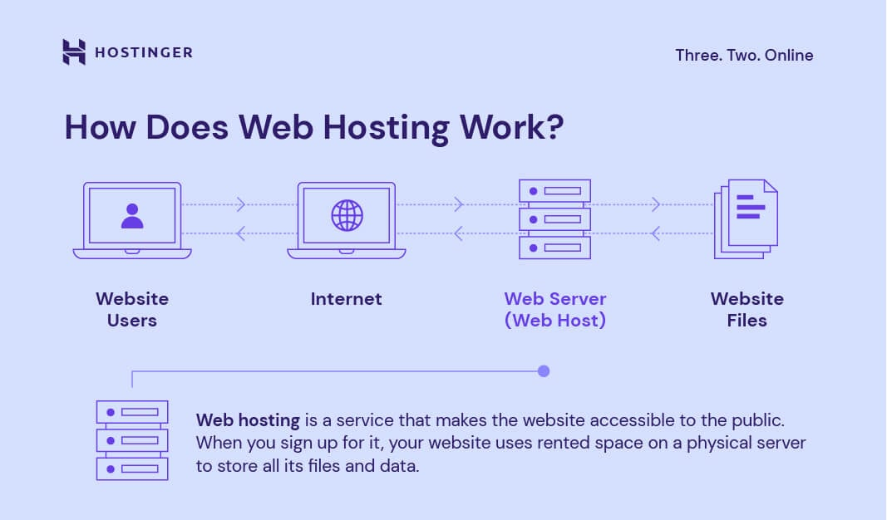

图片来源：https://www.hostinger.com/tutorials/what-is-cloud-hosting

把资源上传、配置好环境并让服务“跑起来”的整个过程，就被称为 **部署（Deployment）**。

简单来说：你在自己电脑上写好的网页，只要在本机启动程序，就只能通过本地地址在自己的浏览器里访问，因为这些代码只存在于你的硬盘上。“部署”就是把你的代码和资源转移到一台连接着公网的专业服务器上，并做好配置，让这台服务器知道“别人访问时我要怎么响应”——比如：当有人在浏览器中输入你的域名时，服务器会立刻找到对应的网页文件，把内容传回给对方的设备，从而让用户看到你的页面。

如果手动部署，一个项目往往需要好几个步骤，每一步都可能踩坑。常见关键步骤包括：

1. **服务器准备**：你需要先购买云服务器（比如阿里云、腾讯云、或 AWS EC2），选择服务器所在地区（如上海、新加坡）、配置（CPU、内存、磁盘大小等），还要学会如何远程连接服务器（例如通过 SSH 工具登录）。
   
2. **环境配置**：Web 应用需要在特定“环境”中才能运行——例如运行 Node.js 项目必须先安装 Node.js；运行 Python 项目必须安装 Python 以及对应的第三方库。如果环境版本不匹配，程序就可能报错、无法启动。
3. **上传资源**：你需要把本地的代码和资源上传到服务器上，常用的方法包括 FTP 或 Git。如果项目体积比较大（比如包含视频文件），中途一旦断线，有时需要重新上传。

4. **启动服务并测试**：上传完成后，你还需要在服务器上执行命令启动应用，并测试“分配的网络地址是否能访问”。如果访问不了，有可能是服务器防火墙没有放行对应端口（比如你的应用监听 3000 端口，但该端口被防火墙拦截），也可能是程序本身有 Bug，这时就需要查看服务器日志进行排查。
   > 💡 可以把端口理解为区分同一台设备上不同应用的“房间号”，而 IP 则是这台设备的“门牌号”。IP 和端口合在一起（IP:port），就可以精确定位到某一个网络服务。
5. **维护与更新**：后续每次你修改代码，都要重新上传并重启服务。如果服务器宕机（例如断电、网络故障），还需要手动重启应用，有时还要额外配置“进程守护工具”，让程序在异常退出后自动拉起。

像 Zeabur 这样的“低代码部署平台”，就是为了解决上述复杂问题而诞生的。它会帮你自动完成“买服务器、配环境、上传代码、启动服务、监控运行”等步骤。你只需要把自己的代码仓库（比如 GitHub 或 GitLab）连接到 Zeabur，它就会自动拉取代码、识别应用类型、配置对应的运行时环境，最后给你一个可以被任何人访问的公网地址。它甚至可以一键绑定你自己的域名（例如把 your-app.zeabur.app 改成 your-app.com）。

接下来，我们会一步步演示如何使用 Zeabur，从“代码仓库”走到“公开可访问的网页”，全程不需要手写任何服务器命令。当然，你也可以使用 Vercel（同样有免费额度）来做类似的简单 Web 部署。不过，[Vercel](https://vercel.com/) 在部分网络环境下访问不太稳定，有兴趣的同学可以课后自行学习（操作也很简单：就是把 GitHub 项目连上即可）。

# 使用 Zeabur 部署 Dify

在之前的课程中，我们已经简单接触过 Dify。现在，我们可以通过 [Zeabur](https://zeabur.com/projects) 非常轻松地启动自己的 Dify 服务。首先打开 [控制台页面](https://zeabur.com/projects)，我们先看一下上面的各个区域。

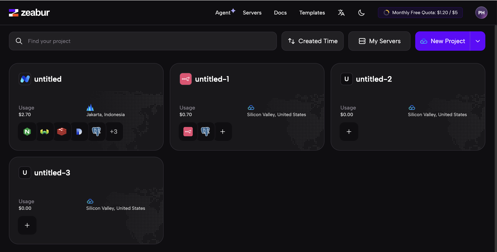

在这个页面上，你首先能看到许多方块，这些就是已经启动的服务。在顶部菜单中，你会看到 Agent、Servers、Docs、Templates 等几个选项，它们分别代表：

1. **Agent**：可以打开 Zeabur 内置的智能助手（Agent），向它提问如何操作，或者查询当前服务器的状态。
2. **Servers**：在这里可以添加你自己购买的云服务器，或者直接通过 Zeabur 购买服务器。
3. **Docs**：查看 Zeabur 的完整文档说明。
4. **Templates**：这里列出了所有内置的模板镜像。

> 这里提到的“镜像（Image）”，可以理解为“包含代码和运行环境的压缩包”。当某个服务在一台服务器上成功跑起来之后，我们可以选择把“这套运行环境 + 代码”打包成镜像。之后，在任何新服务器上，只要把这个压缩包解压并运行，就不需要重新配置环境和代码，服务就能直接跑起来。

在页面右上角，你还能看到自己的余额。默认情况下，每个月会有 5 美元左右的免费额度。关于细节计费规则暂时可以不用太在意，只需要知道：只要服务器在运行，就会消耗额度。

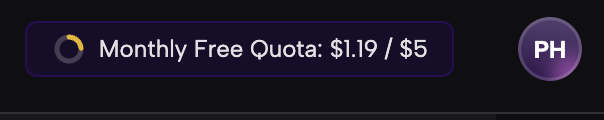

点击余额可以查看每日的消耗明细。

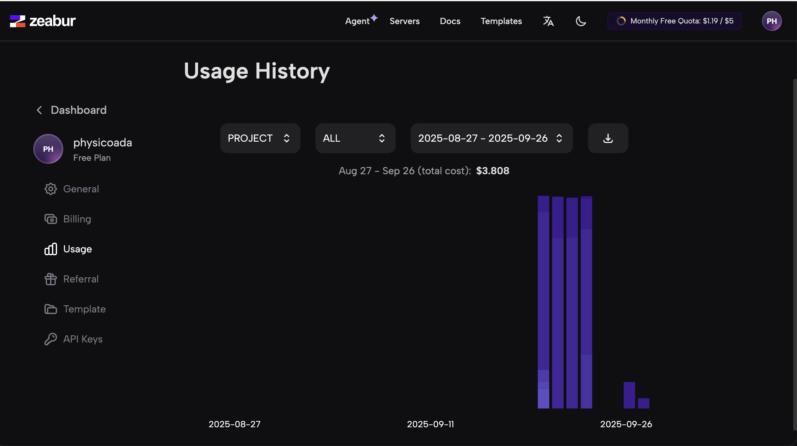

现在我们来创建自己的 Dify 服务。首先，在 [控制台首页](https://zeabur.com/projects) 点击 “New Project”。

接下来是各个创建方式的解释：

1. **GitHub**  
   可以连接到你的 GitHub 账号。绑定之后，就可以直接从 GitHub 仓库里选择项目部署（GitHub 是目前全球最大的代码托管平台）。
2. **Template（模板）**  
    可以基于模板来部署服务。Zeabur 内置了很多预设项目模板（例如 Dify、n8n 等），你可以基于这些模板快速创建并部署应用。
   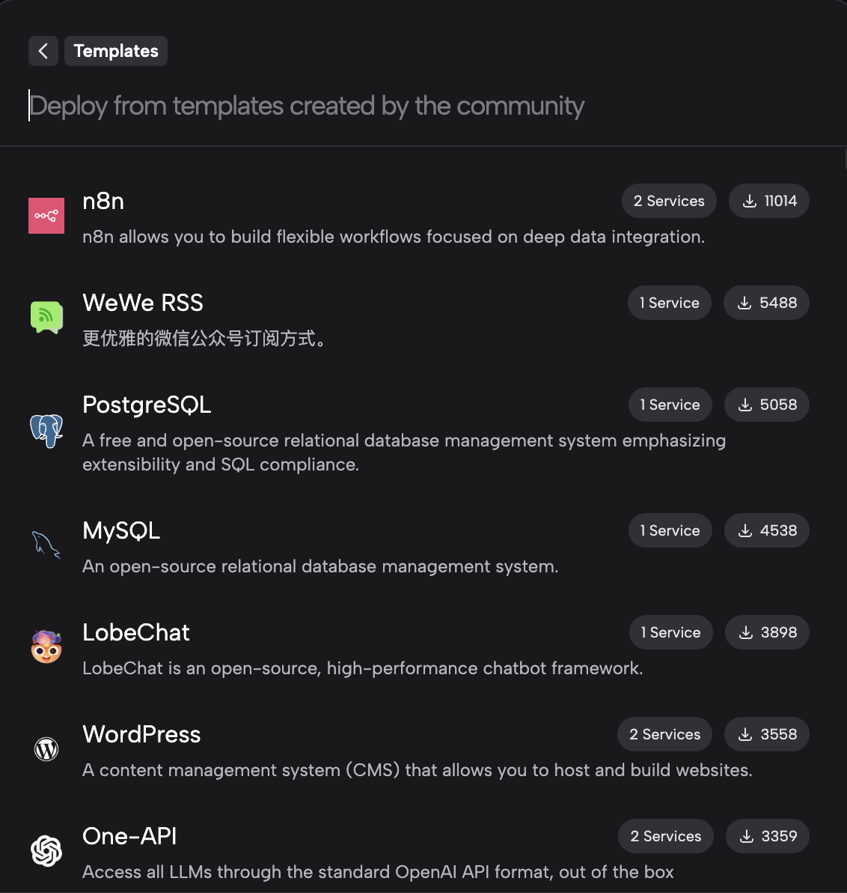
3. **Databases（数据库）**  
   用于部署数据库服务，比如 MySQL、MongoDB 等常见数据库。
   
4. **Functions（函数）**  
   可以部署函数服务，你可以编写 JavaScript 或 Python 代码，让它们以函数的形式被调用。
   

   

5. **Local Project（本地项目）**  
   上传一个本地文件夹，Zeabur 会自动识别其中的启动脚本。这适合将你已经在本地开发好的项目快速部署到 Zeabur 上。
   
6. **Docker Image**  
   部署已经打包好的 Docker 镜像。如果你的项目已经被打成了 Docker 镜像（例如存放在 Docker Hub 或其他镜像仓库中），可以在这里直接部署。
   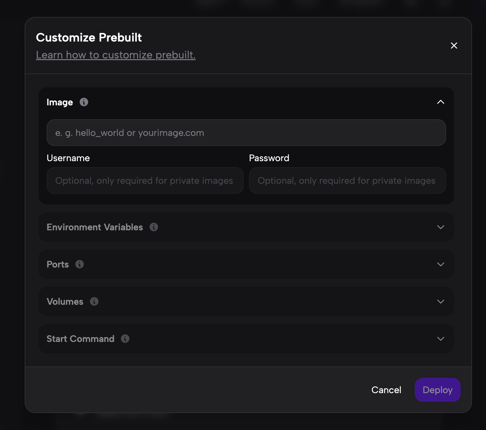
7. **Cursor**  
   如果你安装了 Cursor（例如 Cursor IDE），可以通过这个入口将 Cursor 中的项目直接部署到 Zeabur。

如果你想部署自己的 Dify 服务，推荐选择 **Template** 方式，然后在搜索框中输入 “dify”。可以看到很多由不同作者维护的版本，你可以任选其一（比如 v1.6.0 版本）。

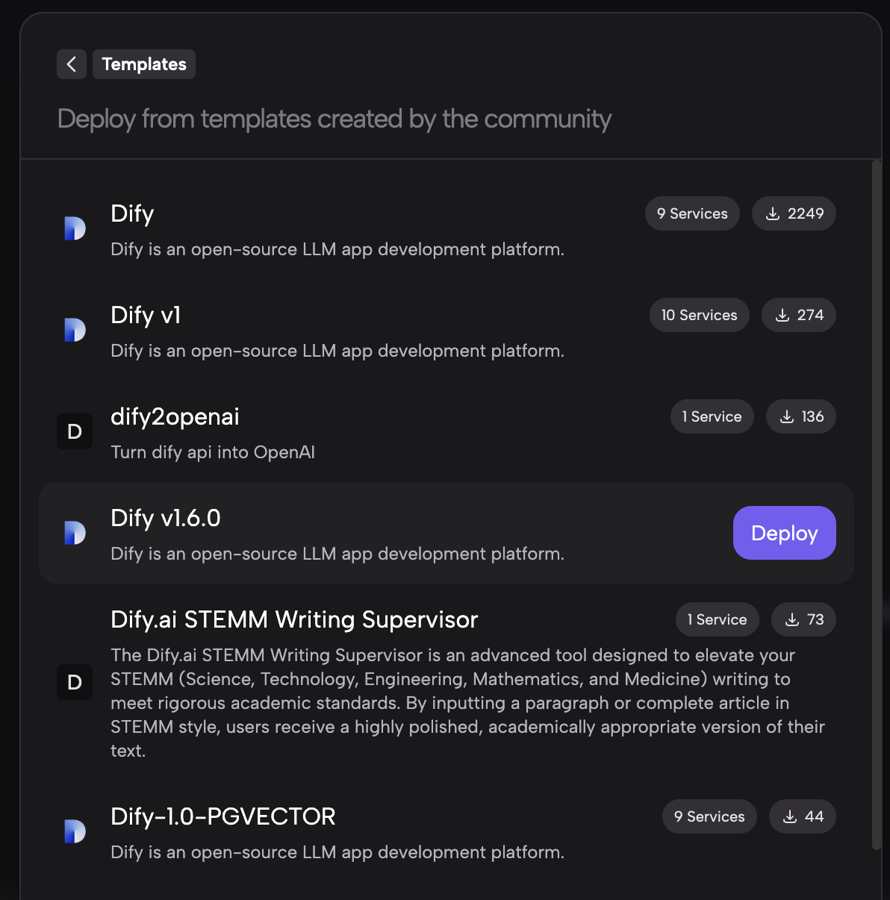

接着，输入任意一个名称，Zeabur 会基于这个名称生成一个临时的自定义域名。之后所有人都可以通过这个网址访问你的服务。

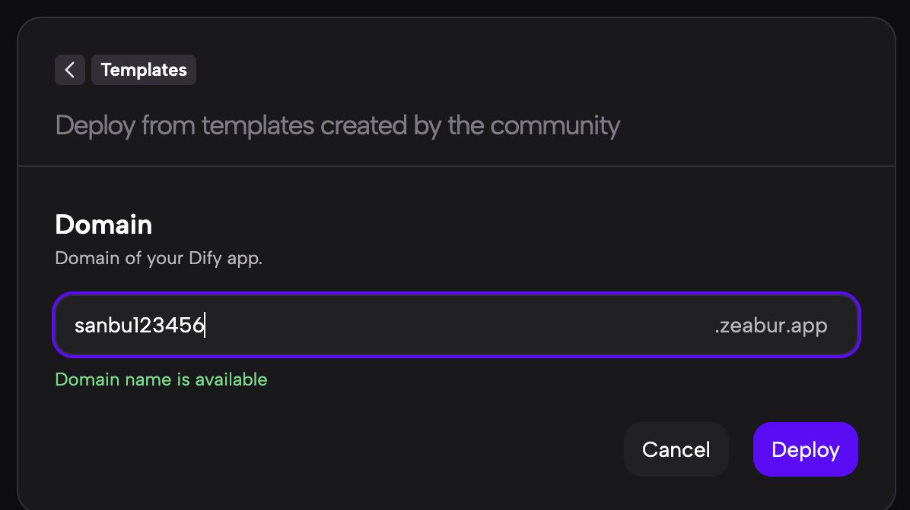

创建完成后，你会看到多个程序（服务）依次启动。需要耐心等待所有服务都进入“已启动”状态。（Dify 服务是由多个程序组成的，每个程序负责不同的功能，它们之间会相互协作。）

一般来说，你只需要点击左侧的 Dify 应用，就可以看到默认的访问入口地址。但在本例中，由于前面还套了一层 nginx，你需要点击 nginx 服务来获取最终访问地址。可以理解为：nginx 就是负责对外统一“收发请求”的主程序，它会把外部访问的地址分发给内部各个服务。点击左侧的 Nginx，在详情页中可以看到当前的服务地址，然后在浏览器里打开这个地址，等待服务完全启动。

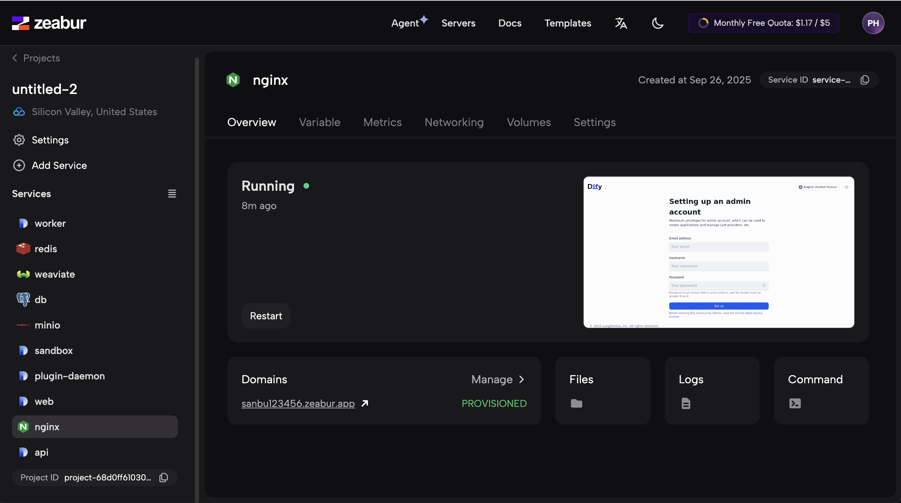

稍等片刻后，你就能看到 Dify 的登录界面了。输入邮箱地址和注册密码，就可以开始使用你自己的 Dify 服务了。

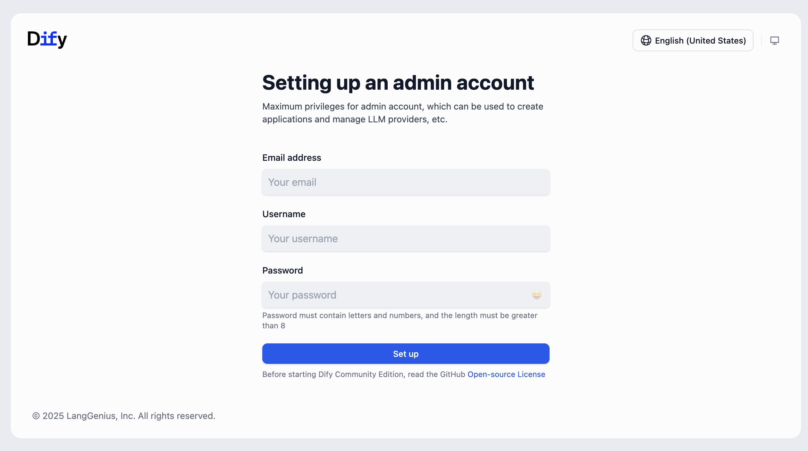

如果你有兴趣，还可以顺便启动一个 n8n 服务。n8n 也是海外非常流行的一款 AI 工作流平台。

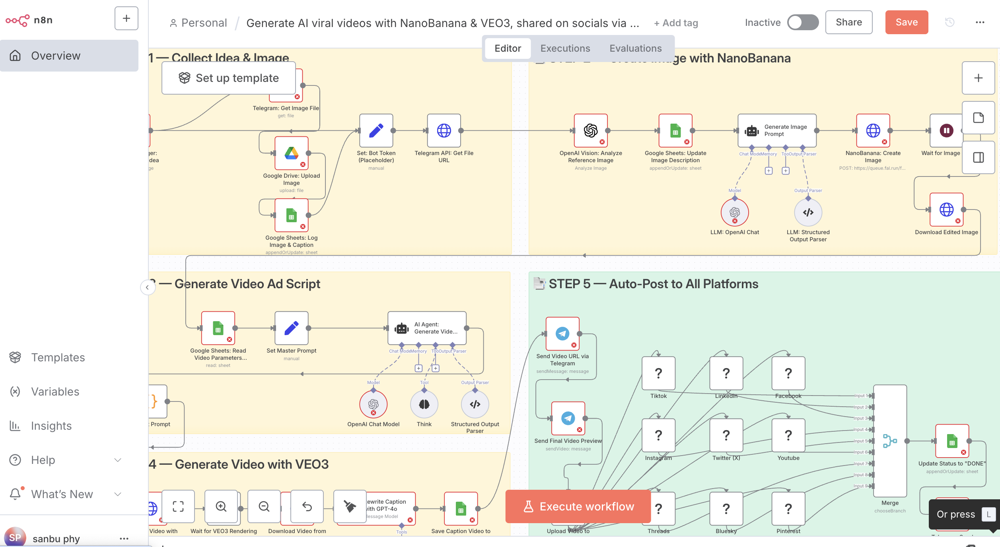

# ⚠️ 如何停止和删除项目

由于启用服务器相关资源都会产生费用，我们在使用时一定要养成“及时关闭不用服务”的习惯，避免把每个月的免费额度消耗完。

如果要找到项目的管理入口，首先点击项目中的 “Settings” 选项。

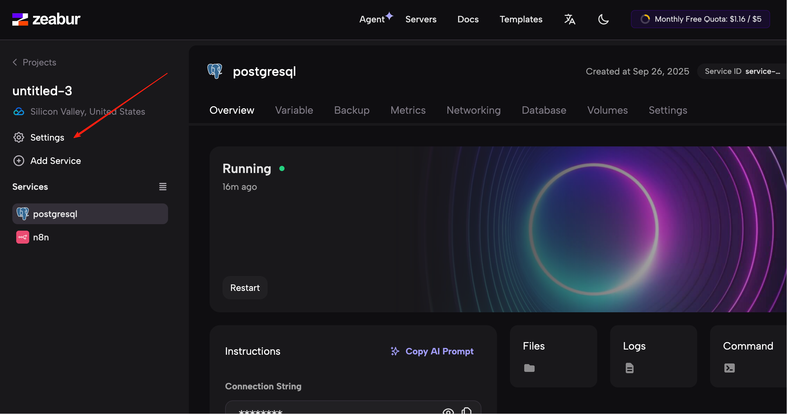

进入设置页面后，将页面拉到最下方，你会看到类似下面的界面：

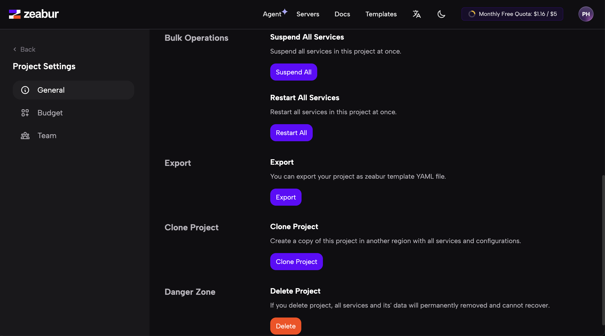

你可以点击 “Suspend All Services” 来暂停所有服务以降低费用；如果服务出现问题，可以点击 “Restart All Services” 对全部服务进行重启。如果你确定不再需要这个项目，可以点击 “Delete Project” 将整个项目彻底删除。

# 使用 Zeabur 与 Trae 部署贪吃蛇游戏

在本教程的下一个部分，我们会体验 Zeabur 的一些进阶用法。我们先用 Trae 生成一个贪吃蛇小游戏，再把它部署到 Zeabur 的服务器上，并配置一个可公开访问的链接，让任何人都可以打开你的游戏。

第一步，是在本地使用 Trae 创建一个贪吃蛇项目。

### 使用 HTML 框架实现

对于 Trae 来说，生成一个基于 HTML 的贪吃蛇网页游戏非常简单。游戏生成完成后，你只需要按照前面介绍的 Zeabur 本地部署方式，把包含所有文件的文件夹上传上去即可。

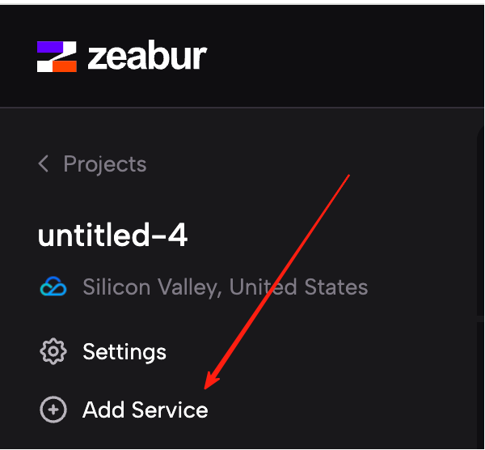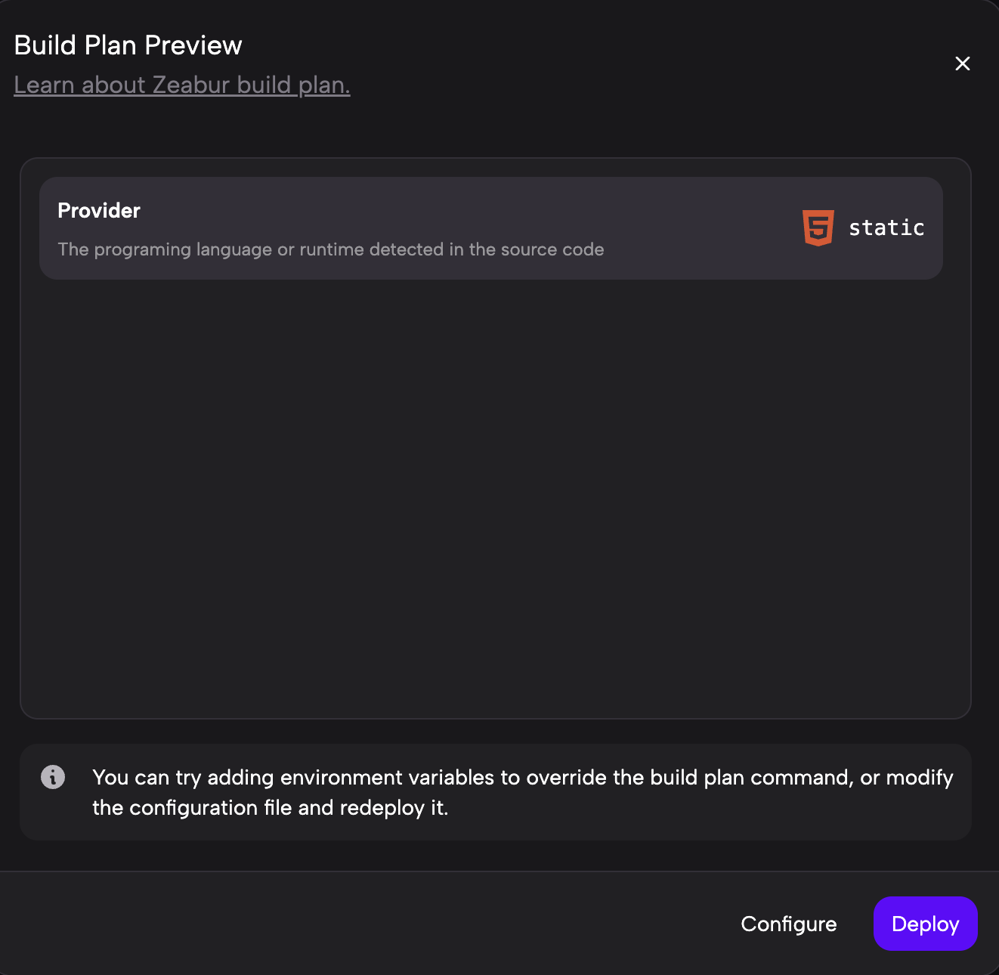

完成后，你就会进入该服务的详情界面：

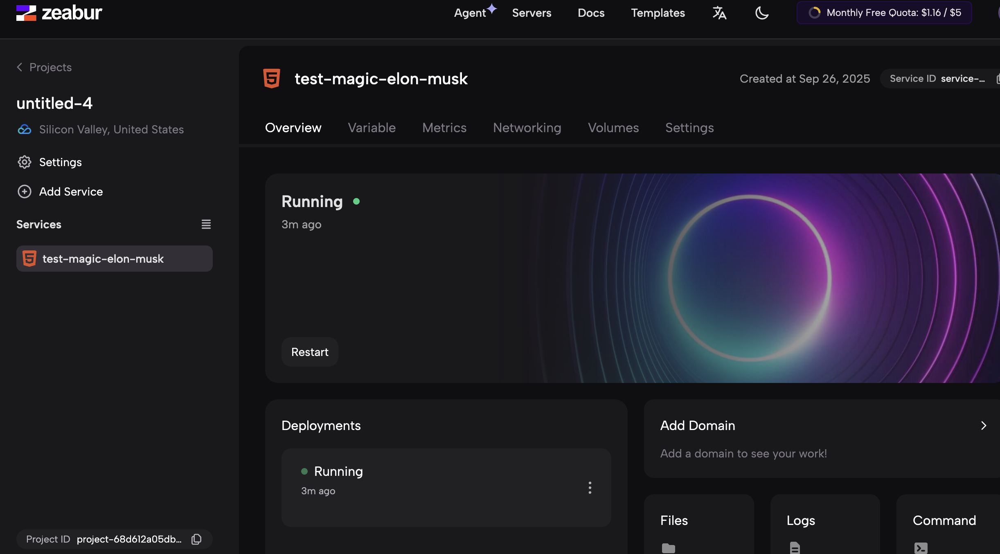

点击左侧的 “Network” 选项，在页面中找到 “Public Address” 区域。点击 “Generate Domain”，即可生成一个对外访问地址，你可以输入任意喜欢的名称。

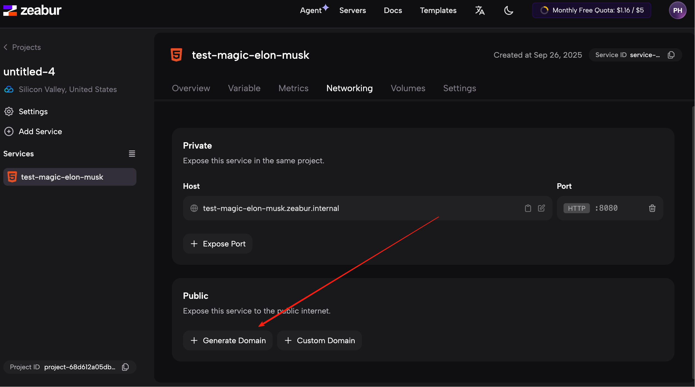

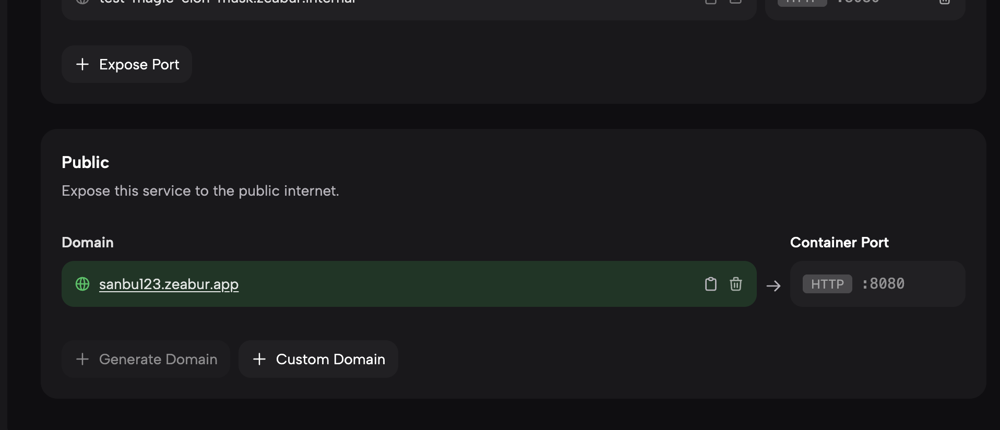

生成完成后，只要在浏览器中打开这个地址，就可以运行你自己的贪吃蛇游戏了。其它 HTML 类型的 Web 应用也可以用完全相同的方式来部署。

### 使用 React 框架实现

前面我们学习了如何部署基于 HTML 的 Web 应用。接下来，我们再尝试部署一个目前更常用的前端框架：React 应用。相比纯 HTML，React 被认为是一种更加成熟、现代的前端开发框架。它通过组件化的方式组织页面结构，能够显著加快复杂页面的开发，是企业级项目中非常主流的选择。

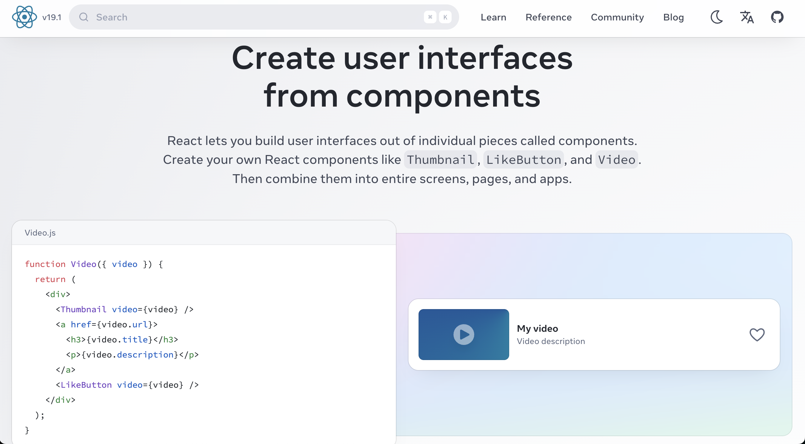

#### 重构为 React 架构

在 Trae 中，你只需要向 Agent 说明：“帮我把这份代码重构成 React 架构”，就可以比较轻松地把原本基于 HTML 的结构重构成 React 项目。

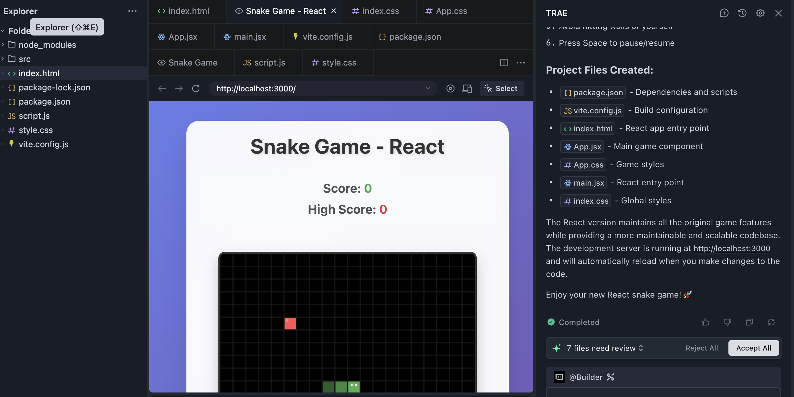

不过，相比简单的 HTML 文件，React 应用依赖更复杂的构建工具和项目结构，因此部署过程也会稍微麻烦一些。一个典型的问题体现在端口设置上：默认情况下，React 应用一般会监听 3000 端口（你也可以在配置文件或启动日志中看到这一点）。

然而，在 Zeabur 上这样部署会失败——因为 Zeabur 只支持监听 8080 端口的应用。也就是说，如果想让 React 应用在 Zeabur 上正常运行，我们必须先把默认监听端口从 3000 改成 8080。

要正确进行这一步配置，我们需要先弄清楚两个概念：什么是“端口（Port）”，以及“监听端口（Listening Port）”是什么意思。

#### 什么是端口？

> 在计算机网络中，端口可以理解为一个“逻辑通信端点”，用来区分同一台设备上运行的不同网络服务。简单类比的话，如果 IP 地址好比一个“门牌号”（例如 162.128.1.1），那端口号就像这栋楼里不同房间的“房间号”——每个房间对应一个服务（例如 Web 服务器、邮箱服务，或者你的 React 应用）。
>
> 端口号用 16 位整型表示，取值范围是 0 到 65535。

如果不想记这些细节，可以简单理解：端口是构成“网络访问地址”的一个必要部分。

我们平时访问网站或 IP 地址时，通常不会手动加端口号，是因为 Web 的默认端口是 80 或 443（HTTPS）。大多数浏览器会自动使用这些标准端口。而对于一些特殊端口，比如 React 默认的 3000、Zeabur 要求的 8080，我们就必须在地址后面加上 `:3000` 或 `:8080` 才能访问到对应的内容。

#### 什么是“监听端口号”？

> “监听端口号”指的是某个程序在一台设备上主动“打开并监控”的端口。当一个应用设置了监听端口时，其实就是在告诉操作系统：“我会一直在这个端口上等待网络请求——只要有请求进来，就请转发给我。”

再形象一点地理解：假设你的电脑是一栋写字楼，IP 地址是这栋楼的地址。楼里开了很多公司或部门，它们分别占用不同的房间，房间号就是端口号。

当默认的 React 开发服务器启动时，它会“打开”某个房间的门，并安排“前台”在门口值班，这个房间号就是它的监听端口——3000。

同时，React 程序还会告诉这栋楼的“物业管理”（操作系统）：“我在 3000 号房间，请把所有寄给 3000 的信件（网络请求）都转给我。”

这样，当你访问 React 网站时，请求首先会到达这栋楼；物业看到请求要送到 3000 号房间，就会立刻把请求交给 React 的“前台”，由它来处理并返回结果——这就是访问 React 应用的过程。

当你在本地执行 `npm start`（本地启动 React 开发服务器的默认命令，也可以在 Vibe Coding 的 Agent 侧边栏中执行）时，React 开发服务器就会自动把监听端口设置为 3000。  
而 Zeabur 的平台设计决定了它只会“识别”监听 8080 端口的应用。如果你的 React 应用仍然使用默认的 3000 端口，Zeabur 就无法将请求正确转发给你的应用，最终导致部署失败。

#### 修改默认监听端口

要把 React 默认监听端口（3000）改成 Zeabur 所要求的 8080，有很多做法。最简单的方式，就是直接在 Trae 里对 Agent 下指令：“请帮我把这个 React 项目的默认端口改为 8080。”Trae 就会帮你修改项目中对应的配置文件。修改完成后，你只需重新打包并按前面的方式上传到 Zeabur 即可。

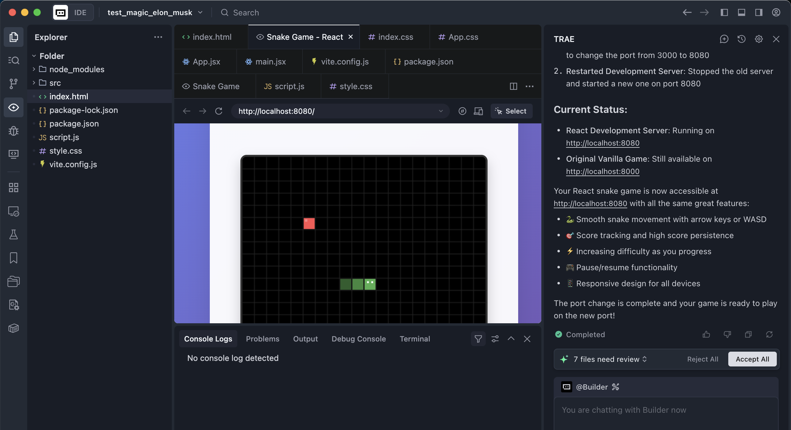

在网络设置中指定一个访问 URL，方式和部署 HTML 项目时基本相同，就可以启动 React 版本的服务。

对于其它需要修改端口号的程序，你也可以采用同样的思路：先改默认端口，再上传到 Zeabur 部署。至此，你已经掌握了将常见 Web 应用部署到服务器的基础技能。

你可以尝试让 Trae 帮你构建不同类型的应用，并把它们部署到 Zeabur 的默认服务器上。在后续课程中，我们还会学习如何把应用部署到你自己购买的云服务器上。
