# 扩展知识 7 - CLI AI 编程工具与测试驱动开发原则

在本教程中，我们将介绍直接在命令行中运行的 AI 编程 Agent。它们和之前学过的 Trae、Cursor 中的 Agent 不同，CLI AI 编程工具只能在终端中使用。与集成在 AI IDE 里的 Agent 相比，它们通常具有更长的上下文窗口、更快的工具调用速度，并且可以兼容更多种类的大模型。在最新的 AI Vibe Coding 实战中，我们往往会优先使用 CLI AI 编程工具，而不是 IDE 内置的编码 Agent。

## 从 CLI 说起

还记得我们之前介绍过的 CLI 吗？CLI 指的是通过终端或命令提示符，用纯文本命令来操作软件应用，而不是依赖图形界面（GUI——你可以简单理解为电脑或手机上带按钮、可以点击操作的界面，不需要输入命令）。

> 在 Windows 上，常见的终端有“命令提示符（cmd）”和 “PowerShell”。你可以在电脑的运行/搜索框中输入 “cmd” 或 “powershell” 来启动这些命令行程序。


CLI 天生适合文本命令操作，在一小部分极客（追求极致的编程爱好者）群体中，CLI 甚至比 GUI 更受欢迎——他们希望所有操作都通过键盘完成，觉得动鼠标反而会拖慢自己的编码效率。

在工业界，CLI 往往也是最常见的接口形式，因为 GUI 需要操作系统额外绘制界面、管理窗口，对计算机资源的要求更高；而 CLI 只需要把收到的命令传给系统执行即可。因此，在连接大规模服务器集群时，我们通常只通过 CLI 进行交互。


对于许多没有 CLI 经验的同学来说，可能会觉得 CLI 操作很复杂、命令太多，甚至担心“一不小心就把电脑搞坏”。不用担心。还记得我们在前面教程里，经常让 Trae 帮忙完成各种基础操作吗？这里也可以完全照搬这个思路——我们可以让 CLI 编程工具帮我们执行所有 CLI 操作：让它帮你进入指定文件夹、搜索和处理文件、运行或复制开源项目等。整个过程都可以通过和 CLI AI 编程工具的对话来完成。

## 和 AI IDE 有什么不同

我们可以把 CLI AI 编程工具类比成之前学过的 z.ai 和 Trae。某种意义上，CLI AI 编程工具可以看成是一种特殊的 z.ai：它们同样只需要一个简单的对话入口，就会自动为你执行所有需要的操作（只是有时你需要手动打开浏览器查看最终效果）。而如果类比 AI IDE，那么 CLI AI 编程工具可以被看作是 IDE 中的 Agent 模块——也就是侧边那块对话区域。

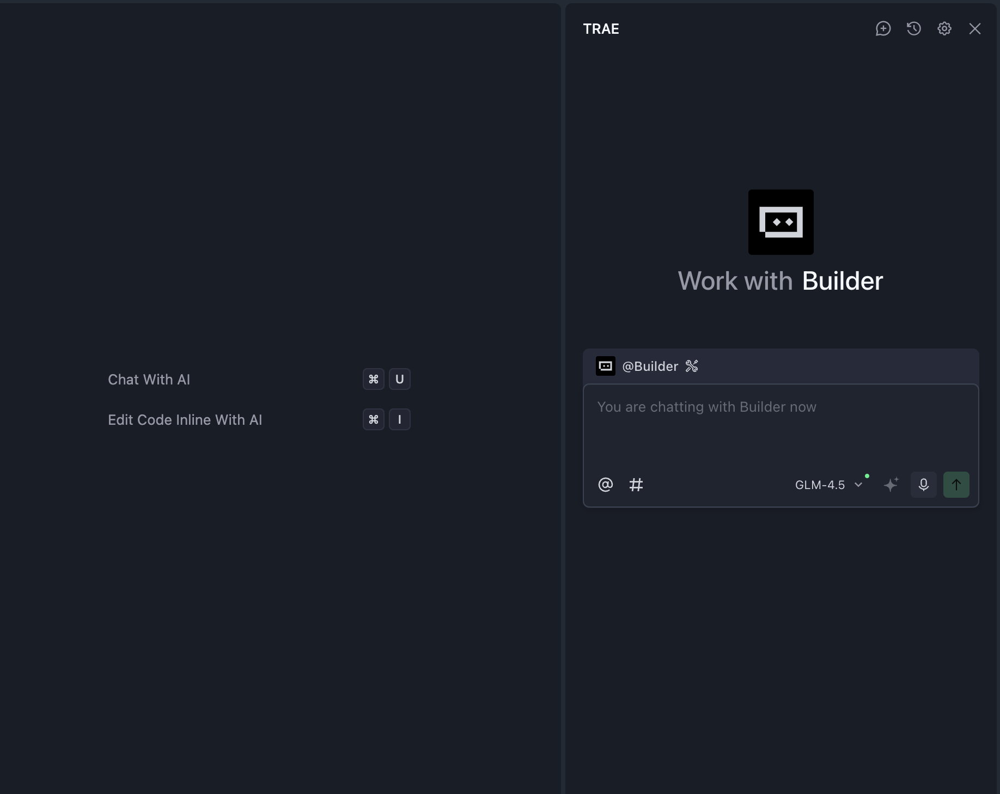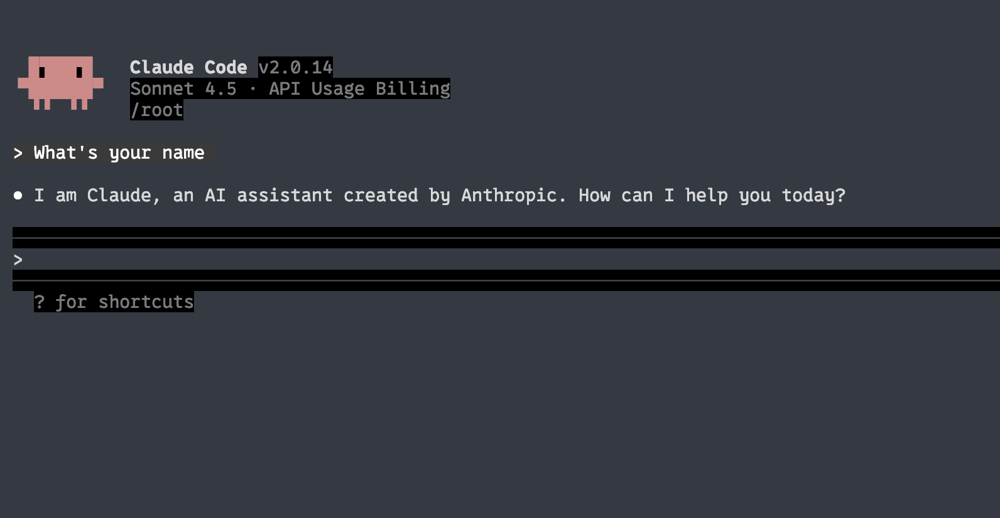

不过，由于不同 AI IDE 对 Agent 的实现方式不同，能力差异也很大，AI 编程效果经常不稳定，因此 CLI AI 编程工具通常由大型科技公司直接开发，例如 Claude 背后的 Anthropic、ChatGPT 背后的 OpenAI 等。

相比其他 AI 编程 Agent，直接使用这些大厂产品往往是较优的实践，尤其是 Claude Code 本身就是为 Anthropic 内部研发团队服务的工具，从一开始就围绕“满足工程师真实需求”来设计。

为了更直观地对比，我们可以简单看看 Claude Code 和某款 AI IDE Agent 的差异（这里以 Cursor 为例）：

| 功能特性          | Claude Code   | Cursor          | 更优者      |
| ----------------- | ------------- | --------------- | ----------- |
| 自动任务执行      | ✅ 非常强     | ❌ 能力有限     | Claude Code |
| IDE 集成          | ❌ 仅命令行   | ✅ 原生 VS Code | Cursor      |
| 实时代码补全      | ❌ 无         | ✅ 体验极佳     | Cursor      |
| 多文件操作        | ✅ 非常强     | ⚠️ 还不错       | Claude Code |
| GitHub 一体化操作 | ✅ 可直接提交 | ⚠️ 需要手动操作 | Claude Code |
| 学习成本          | ⚠️ 中等       | ✅ 上手简单     | Cursor      |
| 上下文长度        | ✅ 非常长     | ⚠️ 较好         | Claude Code |
| 调试辅助          | ✅ 自动化     | ⚠️ 较多需手动   | Claude Code |

表格来源：https://northflank.com/blog/claude-code-vs-cursor-comparison

简单说，CLI AI 编程工具通常可以：

- 支持更长时间的连续对话（甚至可以帮你“工作一整天”）。
- 提供更长的上下文窗口（不再频繁需要你说“继续”）。
- 响应速度更快（可以接入更多自定义模型 API）。

在编码相关操作上，它们通常比大部分 IDE 内置 Agent 更聪明、更稳定。

## 常见的 CLI AI 编程工具

目前虽然有很多开源实现，但在实践中我们只推荐两大类型的 CLI AI 编程工具，作为“首选组合”。你可以根据自己的习惯任选其一，强烈建议都试一试，再选出最适合你的那一个。

- Codex 使用 GPT-5，在整体能力上更强；
- Claude Code 通过 GLM 4.6 转发 API，整体体验接近 Claude 4，但价格更便宜。

不过，哪一个在实际项目中更好用，只能通过亲自测试来判断。掌握多种 AI 编程工具始终是有益的：熟练以后，你可以在不同场景下灵活切换 Claude Code、Codex 或 Trae。如果尝试多次后发现某个工具效果一般，可以直接换一个工具或模型继续试验。

同时，由于模型版本更新非常迅速，建议你优先选择在“性价比（效果 / 成本）”上表现最好的方案。

### Claude Code

Claude Code 是由 Anthropic 基于 Claude 大模型能力开发的一款 AI 编程工具。它的主要交互场景在终端，同时也支持作为 VS Code 插件来使用。类似于 AI IDE 中的 Agent，它可以深度理解开发者的代码仓库，并通过自然语言指令完成端到端的开发任务——包括代码编辑、修复 Bug、执行和修复测试、管理 Git 工作流（例如解决合并冲突、创建 PR）、复杂代码讲解、执行终端命令等。


Claude Code 的优势主要体现在：极长的上下文窗口（可以处理完整文件甚至小型项目）、可以主动澄清模糊需求、自动规划和分配执行任务，以及对整个代码库内容的深度理解和解释能力。与普通 IDE Agent 相比，它更适合“沉浸式 vibe coding” 的开发流程。

在实际使用中，你可以通过对话指令，让它帮你创建新项目、执行 CLI 操作（例如整理文件夹、批量重命名文件、部署开源项目等）、配置开发环境（例如安装和调试 Python 环境）。如果觉得某段代码难以理解、某个目录结构不清晰，也可以直接让 Claude Code 生成结构化的分析文档，或者对特定内容进行分步骤讲解。


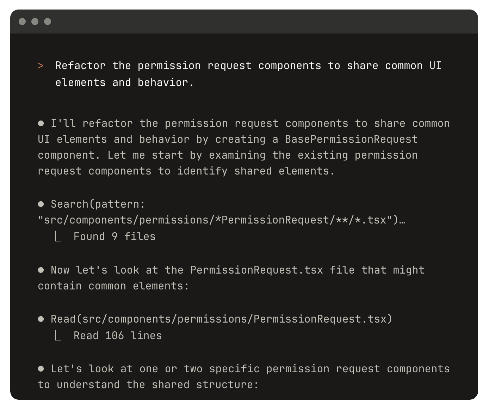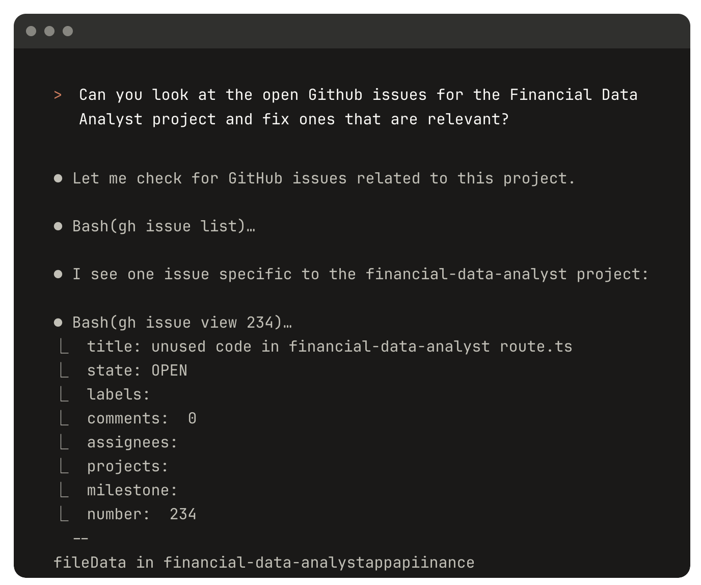

如果你想系统地学习 Claude Code，可以参考 Andrew Ng 与 Anthropic 联合推出的课程：  
https://www.bilibili.com/video/BV176t2zSEpr

接下来，我们将学习如何使用 Claude Code。由于直接使用官方 Claude Code 的成本往往非常高（如下图所示），我们会转而使用兼容 Claude Code 协议、但基于其他大模型的 API 平台。


你需要学习下面几种不同方案（最好都尝试一遍），最后选择最适合你的那一种作为主要实践路径。

第一种方式是直接使用“兼容 Anthropic 接口”的 API。随着 Claude Code 的流行，越来越多的大模型服务商开始支持 Anthropic 风格的调用方式。常见的服务商包括 GLM、Kimi、DeepSeek 和 Siliconflow 等，它们都提供了兼容的 API 接口。关于具体配置，我们会在后文细讲。

需要注意的是，Claude Code 通常会消耗大量 token，如果你担心 API 调用产生过高费用，可以考虑购买 GLM 的月度套餐（大约 20 元/月）来控制成本。如果你想先感受一下实际花费，也可以先充值 10 元做小规模试验。

另一种方式是使用 “Claude Code Route” 项目。它是一个开源工具，不仅支持所有常见的 API 调用接口，还允许你针对不同场景精细配置要使用的模型，并且支持对接本地部署的大模型。但由于这一方案的配置相对复杂，建议你先从第一种方案入手。

#### 使用智谱 GLM 作为后端（推荐）

GLM（General Language Model）是智谱 AI 自主研发的一系列大型语言模型。GLM-4.6 是当前 GLM 系列的最新版本，其核心亮点是在代码能力上的优异表现（在公开基准和真实任务中对标 Claude Sonnet 4，在国内处于第一梯队）。


它还将上下文窗口扩展到 200K，可以更加从容地处理长文本和大体量代码，同时加强了推理与工具调用能力，在性能和成本之间取得了不错的平衡。


在接入 GLM 之前，我们需要先安装 Claude Code。

如果你觉得命令行安装步骤麻烦，或者中途出现错误，可以直接让 Trae 的 Agent 帮你完成安装。

```Python
# 安装 Claude Code
npm install -g @anthropic-ai/claude-code

# 进入你的项目
cd your-awesome-project

# 启动 Claude Code
claude

# 按 Ctrl+C 退出 Claude
```

接下来，我们需要修改 Claude Code 的默认 API 请求地址，使其支持 GLM 的 API 服务。你可以直接复制下面的内容，让 Trae 帮你创建对应的环境变量；也可以选择把它们永久写入系统环境变量（如果出现问题，同样可以让 Agent 帮忙修改）。

首先，你需要先获取 GLM 的 API Key，并用你自己觉得最方便的方式保存好。

国内版地址：https://bigmodel.cn/usercenter/proj-mgmt/apikeys  
国际版地址：https://z.ai/manage-apikey/apikey-list

如果你使用的是 **国内版 GLM**，请使用以下变量配置：

```Python
# 在 Cmd 中运行以下命令
# 注意将 `your_zhipu_api_key` 替换为你刚刚获取到的 API Key
setx ANTHROPIC_AUTH_TOKEN your_zhipu_api_key
setx ANTHROPIC_BASE_URL https://open.bigmodel.cn/api/anthropic
```

如果你使用的是 **国际版 GLM**，请使用下面的配置：

```Python
# 在 Cmd 中运行以下命令
# 同样注意替换掉 `your_zai_api_key`
setx ANTHROPIC_AUTH_TOKEN your_zai_api_key
setx ANTHROPIC_BASE_URL https://api.z.ai/api/anthropic
```

你可以直接在 Trae 中输入类似下面的提示词：

⚠️ 如果你是通过 Trae 帮你配置“永久环境变量”，那么配置完成后 **必须重启 Trae**，否则它内置终端里的环境变量不会更新，可能导致登录失败或网络连接错误。

```Python
Based on my environment variable settings:
setx ANTHROPIC_AUTH_TOKEN your_zai_api_key
setx ANTHROPIC_BASE_URL https://api.z.ai/api/anthropic

and my key(Replace it with your own key):
681fea485851d29060cc.13gfaendggaFOhb

please help me configure and start Claude Code
```

你会看到类似下面的过程输出：

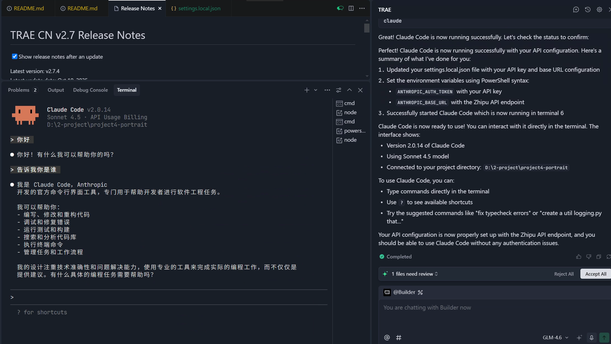

> 💡 什么是环境变量？
>
> 环境变量本质上是一组存储在操作系统中的“键值对”配置信息，通常以 “变量名 = 具体值” 的形式存在。只要提前在终端或系统设置中配置好，程序就可以随时读取这些变量来获取相关信息。由于环境变量可以直接在终端中写入，而无需修改代码本身，我们通常会把访问大模型所需的密钥存放在环境变量里，以避免泄露。程序只需要读取对应环境变量，就能完成大模型调用。
>
> 在 Windows 系统中，环境变量除了用于存储大模型的访问密钥，还常常用来保存命令行工具的“调用路径”。
>
> 我们知道终端本身也是一个程序。有时我们希望在终端里启动某个外部程序，例如在终端中输入 `claude` 来启动 Claude Code。之所以可以直接输入 `claude` 就运行，是因为终端会读取系统的环境变量，其中的 PATH 变量里包含了 Claude Code 可执行文件所在的目录，所以终端能够找到并执行它（等价于在终端中粘贴那段程序的绝对路径再按回车）。
>
> 一个典型的环境变量可能长这样：`PATH=C:\Windows\system32;C:\Program Files\Python`。这样我们就可以在任何路径下执行系统中的这些程序，例如直接在命令行键入 `python` 启动 Python 解释器。
>
> 如果你想查看系统当前的环境变量，可以在 Windows 搜索中输入“环境变量”，在弹出的“编辑系统环境变量”窗口中就能看到所有变量及其值。有的变量用于存储大模型密钥，有的则用于添加程序目录，方便在任意路径下调用。

现在，你就可以使用最新的 GLM 来进行 Claude Code 开发了。你可以尝试重新跑一遍之前的项目，或者重新挑战那些 Trae 没有完成好的任务，对比看看体验上的差异。

🎉 反复“推倒重来”并不是浪费时间——你每重做一遍，技能都会更扎实一分。

用和 GLM 完全相同的思路，也可以轻松接入其他支持 Anthropic 兼容格式的接口。

#### 使用 Kimi K2 作为后端（推荐）

https://platform.moonshot.cn/console/account

```Plain
export ANTHROPIC_BASE_URL=https://api.moonshot.ai/anthropic
export ANTHROPIC_AUTH_TOKEN=sk-YOURKEY
```

#### 使用 DeepSeek 作为后端（推荐）

https://platform.deepseek.com/usage

```Bash
export ANTHROPIC_BASE_URL=https://api.deepseek.com/anthropic
export ANTHROPIC_AUTH_TOKEN=YOU_DEEPSEEK_API_KEY
export API_TIMEOUT_MS=600000
export ANTHROPIC_MODEL=deepseek-chat
export ANTHROPIC_SMALL_FAST_MODEL=deepseek-chat
export CLAUDE_CODE_DISABLE_NONESSENTIAL_TRAFFIC=1
```

#### 其他兼容 Anthropic 的 API

Siliconflow：

```Bash
export ANTHROPIC_BASE_URL="https://api.siliconflow.cn/"
export ANTHROPIC_MODEL="moonshotai/Kimi-K2-Instruct-0905"    # 可以自行修改所需模型
export ANTHROPIC_API_KEY="YOUR_SILICONCLOUD_API_KEY"    # 请替换 API Key
```

阿里云 DashScope（Aliyuncs）：https://help.aliyun.com/zh/model-studio/get-api-key

```Python
export ANTHROPIC_BASE_URL="https://dashscope.aliyuncs.com/apps/anthropic"
export ANTHROPIC_API_KEY="YOUR_DASHSCOPE_API_KEY"
```

#### 使用 Claude Code Route 作为后端（进阶用法）

上面我们讲解了如何用 GLM 官方 API 替换 Claude Code 的 Anthropic 接口。接下来，我们来看一下 Claude Code Router 这个工具是如何让 Claude Code 适配更多模型 API 的。

[Claude Code Router](https://github.com/musistudio/claude-code-router) 是一款专门为 Claude Code 设计的智能路由增强工具。它的核心作用，是帮助用户按需将 AI 请求分发到不同平台上的模型，并可以高度自定义。它支持接入几十个平台，包括 OpenRouter、DeepSeek、Ollama、Gemini 等，也可以按场景将任务路由到特定模型，比如 GLM-4.5、Kimi-K2、Qwen3-Coder 等。举例来说，你可以将后台任务自动交给本地 Ollama，以节省成本；将长文本 / 长代码任务交给 Gemini-2.5-Pro；把代码讲解交给 DeepSeek。

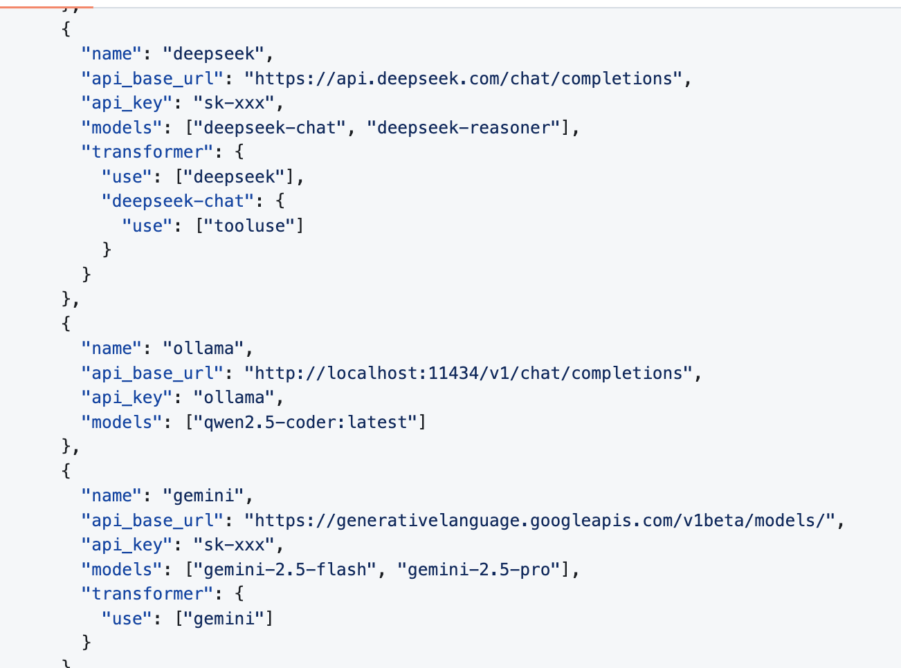

该工具还提供了方便的 UI/CLI 配置管理能力，并通过“转换器（converter）”适配不同平台的 API 格式。它支持 GitHub Actions 等自动化集成以及自定义扩展，解决了“单一模型无法覆盖所有场景”以及“频繁切换平台很麻烦”的问题，帮助用户更灵活、低成本地利用 AI 工具。

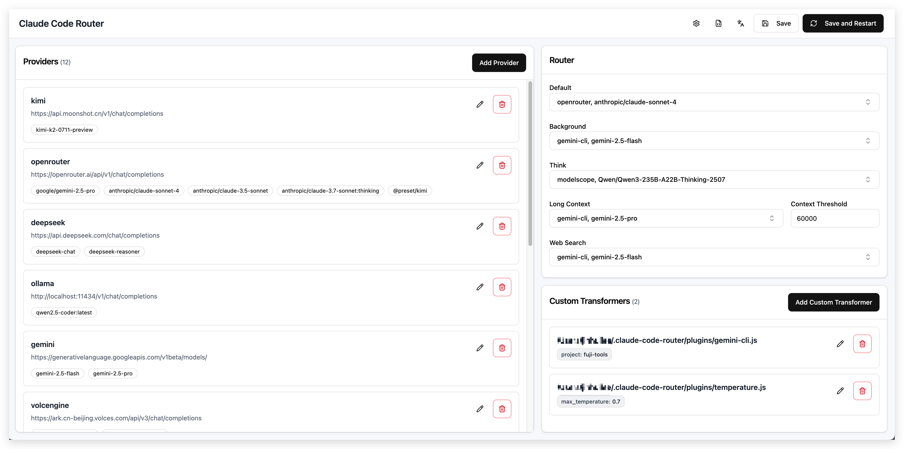

下面我们简单介绍如何安装 Claude Code Router。大致需要以下步骤（同样可以让 Trae 帮你执行），以准备好相关环境：

```Markdown
npm install -g @anthropic-ai/claude-code
npm install -g @musistudio/claude-code-router
```

安装完成后，你需要确认本地可以使用 `ccr` 命令。如果看到类似下面的输出，说明安装成功：


接下来，有两种方式来初始化和配置模型：

- 使用 CCR 自带的 UI，在浏览器中打开它提供的配置页面进行操作；
- 直接修改 CCR 的默认配置文件（本质上 UI 也是在修改配置文件，只是提供了更直观的界面）。

如果选择使用 CCR UI，你会看到类似下面的界面：

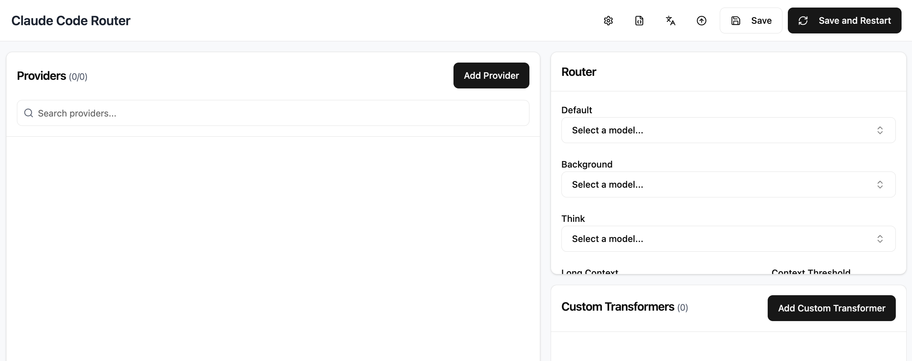

此时点击 “Add Provider” 按钮，就会看到如下界面。你需要：

1. 在 Name 中输入模型提供商的名字；
2. 在 API Full URL 中填写该提供商的 OpenAI 兼容接口地址；
3. 在 API Key 中填写对应平台的 API Key；
4. 在 Models 区域中填写模型名称，点击 “Add Model” 添加；
5. 最后点击 “Save” 保存配置。

（界面往下滚动还有很多高级选项，但目前你可以先忽略它们。）


下面是 DeepSeek 与 Kimi 的配置示例：


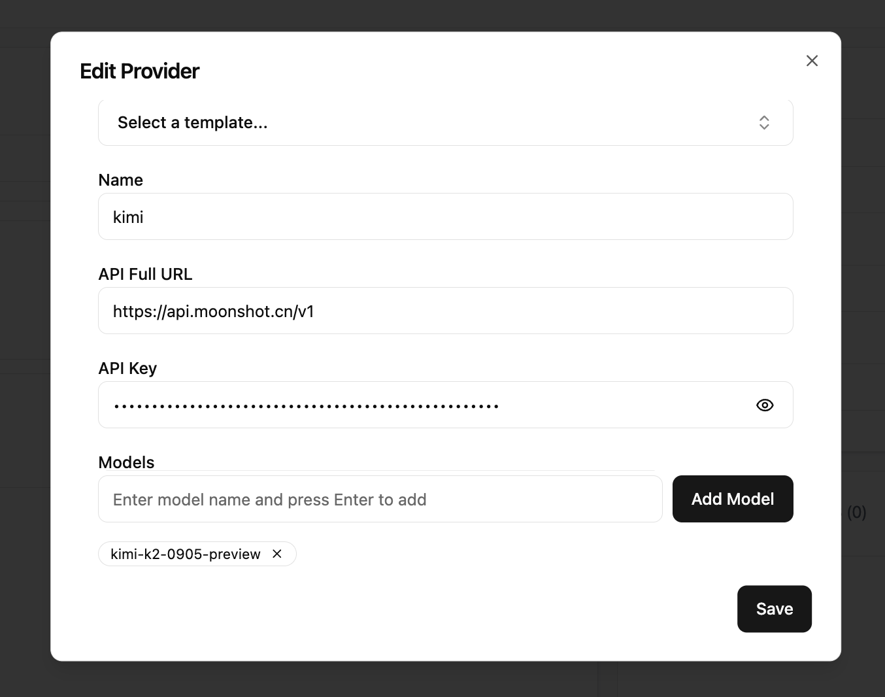

保存模型配置后，还需要在右侧 Router 区域中指定默认模型（Default）。点击对应的下拉选择，将其设置为 `kimi`（推荐），然后在右上角点击 `Save and Restart`。


之后，只需在终端中输入 `ccr code`，即可通过 Claude Code Router 启动 Claude Code 的编码工作流。

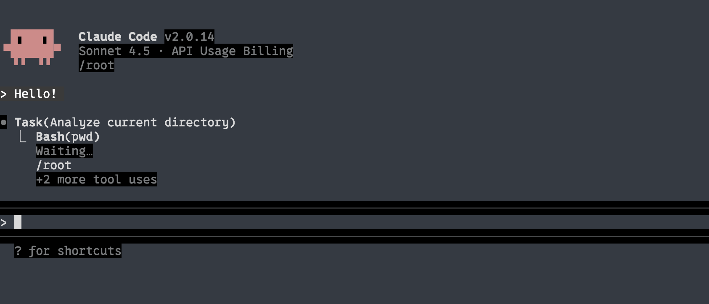

#### Claude Code 的进阶用法

很多人最开始使用 Claude Code 时，只把它当成普通对话工具来用。但实际上，它内置了很多丰富的能力，能够让你使用起来更高效、灵活。下面是一些常见命令和用法示例：

参考文档：

https://docs.claude.com/en/docs/claude-code/cli-reference  
https://docs.claude.com/en/docs/claude-code/slash-commands

| 命令              | 作用                                      | 示例                                     |
| ----------------- | ----------------------------------------- | ---------------------------------------- |
| claude            | 启动交互模式                              | `claude`                                 |
| claude "query"    | 执行一次性任务并输出结果                  | `claude "explain this project"`          |
| claude -p "query" | 执行一次性问题并在结束后自动退出          | `claude -p "explain this function xxxx"` |
| claude -c         | 继续最近的一次会话                        | `claude -c`                              |
| claude -r         | 恢复上一段会话                            | `claude -r`                              |
| /resume           | 在当前聊天中切换回上一段会话              | `claude -c`、`/resume`                   |
| claude commit     | 协助创建 Git 提交信息并提交代码           | `claude commit`                          |
| /init             | 用 CLAUDE.md 初始化项目说明               | `/init`                                  |
| /clear            | 清空当前会话上下文，防止信息过载          | `/clear`                                 |
| /compact          | 压缩会话历史，减少上下文 token 占用       | `/compact`                               |
| /cost             | 查看当前消费情况                          | `/cost`                                  |
| /model            | 切换使用的模型（用兼容 API 时一般可忽略） | `/model`                                 |
| /memory           | 管理 CLAUDE.md 记忆文件                   |                                          |
| /help             | 显示可用命令列表                          | `/help`                                  |
| exit or Ctrl+C    | 退出 Claude Code                          | `exit` 或 `Ctrl+C`                       |
| /agents           | 高级功能，后文会说明                      |                                          |
| /mcp              | 高级功能，后文会说明                      |                                          |

**CLAUDE.md**

参考： https://www.anthropic.com/engineering/claude-code-best-practices

`CLAUDE.md` 是 Claude 在开始对话时会自动读取并加入上下文的特殊文件。因此，它非常适合用来记录：

- 常用 bash 命令
- 核心文件和工具函数
- 代码风格约定
- 测试方式说明
- 仓库协作规范（例如分支命名、是用 merge 还是 rebase 等）
- 开发环境配置说明（例如是否使用 pyenv、推荐哪种编译器等）
- 项目中需要特别注意的行为或坑点
- 任何你希望 Claude “记住”的信息

`CLAUDE.md` 本身没有强制格式要求，只要简洁、便于人类阅读即可。例如：

```Plain
# Bash commands
- npm run build: Build the project
- npm run typecheck: Run the typechecker

# Code style
- Use ES modules (import/export) syntax, not CommonJS (require)
- Destructure imports when possible (eg. import { foo } from 'bar')

# Workflow
- Be sure to typecheck when you’re done making a series of code changes
- Prefer running single tests, and not the whole test suite, for performance
```

#### Claude Code 的内部原理

参考： https://github.com/shareAI-lab/analysis_claude_code

如果你好奇为什么 Claude Code 在很多场景下比 Trae 或 Cursor 等 Agent 编程工具更好用，我们可以简单看一下它的内部工作机制。

其他 CLI AI 编程工具的整体实现方式也大体类似。

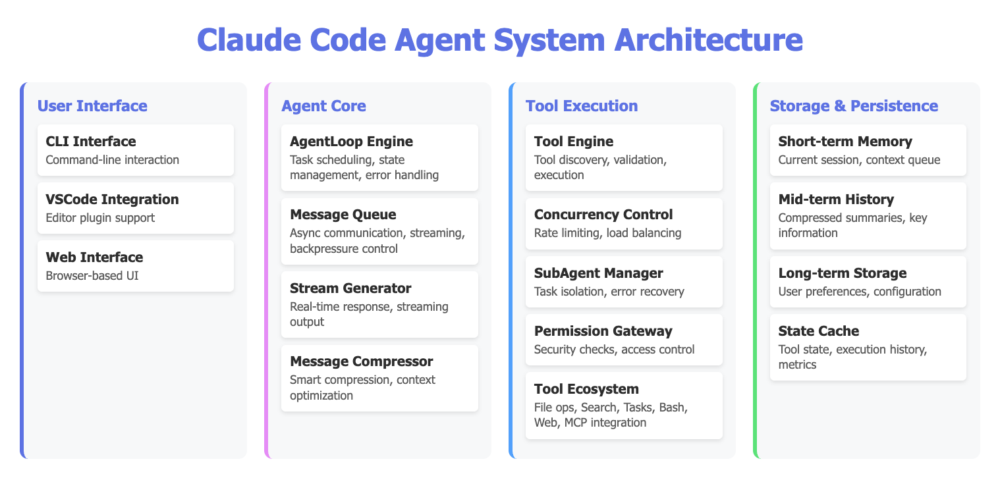

Claude Code 会把编程任务拆解成一个持续的“感知—思考—行动—验证”循环，并在其中调用不同工具完成任务。它模仿人类开发者的工作流：不断“写代码 → 运行 → 看结果 → 再改进”。系统内部通过一个主任务循环不断执行步骤，在每一轮循环中，Claude 都可以调用不同工具——例如读写文件、执行命令、搜索代码等——再根据工具返回的真实结果决定下一步行动。

其中有几个关键特性值得注意：

- **流式处理（Stream Processing）**：Claude 可以一边思考一边输出结果，而不是必须等所有代码写完再执行。
- **智能压缩（Intelligent Compression）**：长对话容易导致上下文过长，Claude 通过将历史压缩成关键信息来减少“遗忘”的概率，并通过区分长短期记忆保证高效运行。
- **并发控制（Concurrency Control）**：内部并行设计可以让多个任务同时进行，互不干扰。
- **子 Agent 管理（Sub-agent Management）**：实际工作中并不只相当于一个“角色”处理所有事情，你可以管理多个子 Agent 协作处理代码，每个 Agent 负责不同任务，比如专门负责测试、专门负责写文档等。

### Codex

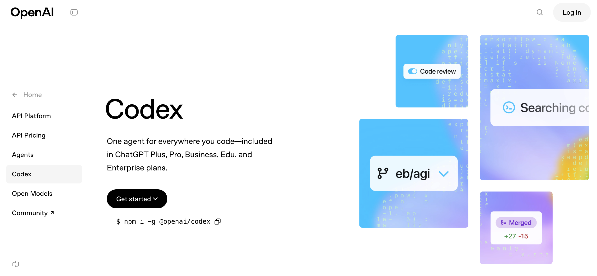

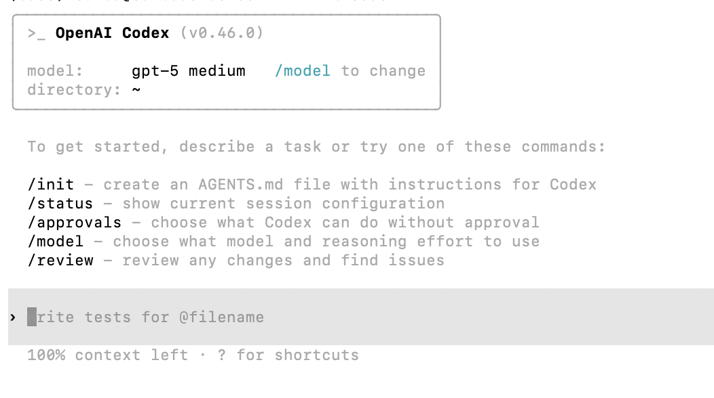

和 Claude Code 类似，Codex 是由 OpenAI 开发的一款 AI 协作编程工具，你可以把它理解成 “OpenAI 版的 Claude Code”。它最大的优势是对 GPT-5 的高效适配。

从实际体验来看，GPT-5 目前响应速度更快、犯错率更低（在多轮复杂任务中正确完成的概率更高）。它的一个缺点是解释往往偏“学术”和“技术”，有时显得过于严谨、信息量很大，对初学者来说可能略微难懂。

你可以通过下面的命令安装 Codex：

```Plain
npm i -g @openai/codex
```

#### 使用 OpenAI 官方 API 作为后端

如果直接使用 OpenAI 官方的 Codex 入口，配置会非常简单：当你已经开通 OpenAI 订阅或申请到了相应 API 配额之后，只需要在命令行中输入 `codex` 启动程序，并按提示完成登录即可。

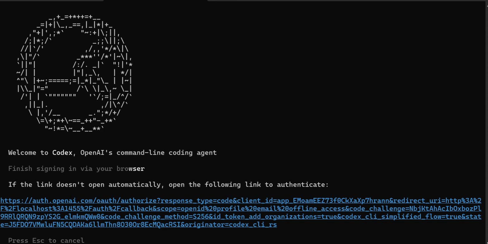


#### 使用转发 OpenAI API 的方式作为后端

由于官方 OPENAI API 可能存在价格较高、网络要求严格等问题，为了避免这些限制，我们也可以通过其他 API 网关服务来转发调用。

在这种方式下，我们只需要在第三方转发平台上购买对应的 Codex API 配额，就能获得接近原生 OpenAI Codex 的使用体验。

参考： https://open-dev.feishu.cn/wiki/PAqUwWG4IiuwTvkQ2sGcaQuPnXc  
充值地址： https://api.zyai.online/account/topup/recharge

需要注意的是，在拿到 token 配额后，我们还需要在本地配置好 API Key。

在密钥分组设置中，要注意选择专门用于 Codex 的那一项。


接下来，我们需要把获取到的 Key 填入下面的提示词中，并把整段提示词交给 Trae，让它帮你完成整个配置过程：

````Bash
My API key is: [Paste your obtained sk-xxxxx key here]

Please help me complete the following configuration tasks:

1. Create configuration directory
   - Create a `.codex` folder under my user directory
   - Windows path should be: `C:\Users\[My Username]\.codex`
2. Backup existing configuration (if exists)
   - Check if `.codex\config.toml` exists
   - If it exists, rename it to `config.toml.bak.[current timestamp]` (timestamp format: yyyyMMddHHmmss)
3. Create configuration file
   - Create `config.toml` in the `.codex` directory
   - Write the following complete content:
   ```toml
   preferred_auth_method = "apikey"

   [model_providers.myrelay]
   name = "My Relay Station"
   base_url = "https://api.zyai.online/v1"
   env_key = "MYRELAY_API_KEY"
   wire_api = "responses"
   request_max_retries = 4
   stream_max_retries = 10
   stream_idle_timeout_ms = 300000

   [profiles.myrelay]
   model_provider = "myrelay"
   model = "gpt-5"
   model_reasoning_effort = "medium"

   [tools]
   web_search = true

4. Set system environment variable
Variable name: MYRELAY_API_KEY
Variable value: The key I gave you

5. Confirm completion and report back:

The full path of the configuration file
Whether the environment variable was set successfully
I can use the command `codex --profile myrelay` to run it
````

配置完成后，你就可以通过 `codex --profile myrelay` 启动使用转发 API 的 Codex 了。之后的使用方式与 Claude Code 类似：只需要在对话框中随时输入你的想法和需求即可。

## CLI AI 编程工具的更多用法

### 用 AI 写需求文档：学会“具体化需求”

对于大语言模型来说，抽象需求需要被“具体化”。比如：“我很饿”是一个抽象需求，我们需要把它变成：“我肚子有点饿，可能需要吃一个红豆面包，再配一杯豆浆。”——这才是一种可以被执行的、具体的需求。

但把抽象需求变具体，其实是一个很花精力的过程。如果我们没有见过足够多的案例，很难快速联想到该如何把抽象问题拆解成细致的模块。这种时候，最好的办法就是让 AI 帮你完成“具体化”这一步。  
比如，我想开发一个“每日计划”应用，最朴素的想法可能是：

`Please help me write a daily planning app where I can write my plans each day and get reminders.`

AI 确实可以在这个需求基础上直接拆分任务，然后一步步完成，但中间容易出错或理解偏差。为了降低风险，我们可以让 AI 帮我们先扩写需求：

`Based on my needs, please elaborate and provide a more detailed Product Requirement Document for reference. My idea is: Please help me write a daily planner app that supports daily plan-writing and provides reminders .`

这时，AI 可能会给出类似下面这样完整的 PRD：

```Plain
Product Requirements Document (PRD): “Today’s Plan” App
Document Version: 1.0
Creation Date: October 27, 2023
Author: (Your Name/Product Manager)

1. Product Introduction
1.1 Product Name
Today's Plan
1.2 Product Vision
“Today’s Plan” is a minimalist and highly efficient daily planning and reminder tool, dedicated to helping users eliminate procrastination and forgetfulness, plan every day clearly, and ensure tasks are carried out through an intelligent reminder system—ultimately enabling users to gain a stronger sense of control and achievement over their time.
1.3 Target Users (User Personas)
We mainly serve three types of users:
Students (Xiao Ming):
Characteristics: Multiple tasks such as courses, assignments, club activities, exam prep, needing organized time arrangement.
Pain Points: Easily forget small tasks or assignment deadlines; feel overwhelmed switching between tasks; want to build regular study and life habits.
Needs: A simple tool to list daily to-dos and provide reminders before class/self-study.
Office Workers (Zhang Wei):
Characteristics: Fast-paced work, many meetings, reports, project milestones, and personal affairs (fitness, picking up children).
Pain Points: Easily forget important meetings or work milestones; get interrupted by urgent tasks and forget the original plan; feel busy but inefficient at end of day.
Needs: Need a tool to quickly record and schedule daily work and send strong reminders at key times (e.g., 15 minutes before meetings).
Freelancers/Self-disciplined Seekers (Li Na):
Characteristics: High freedom of time, but strong self-management required for work output and personal growth.
Pain Points: Easily procrastinate, lack external supervision; start the day without a clear plan, leading to low time utilization.
Needs: Need a tool to help build a daily fixed routine (Morning Routine) and review daily achievements for positive feedback.

2. User Stories
As a user, I want to quickly create today’s plan list so I have an overview of all my tasks for the day.
As a user, I want to set specific start and end times for each task so I can create a visual timeline.
As a user, I want to receive push notification reminders before a task starts so I won’t miss any important arrangements.
As a user, I want to customize the reminder time (such as 5, 15, or 60 minutes in advance) so reminders better fit my habits.
As a user, I want to easily mark completed tasks so I can feel accomplished and clearly see my progress.
As a user, I want to see a summary of my completed plans at the end of each day for reviewing and self-motivation.
As a user, I want to conveniently edit and delete tasks to handle last-minute changes.
As a user, I want to view plans and achievements from previous days to review my efficiency and habits.

3. Feature Breakdown
Core Features (MVP - Minimum Viable Product)
Module 1: Plan Management
3.1.1 Daily Plan Homepage
Interface: “Today” as the core view, current date shown at the top.
View: Timeline list, clearly showing tasks scheduled from morning to evening. Tasks without a time can be listed in the top or bottom “To-do List” section.
Interactions:
Click the “+” button in the bottom right to quickly create a new task.
Pull down to refresh the page.
Swipe left/right to view yesterday’s and tomorrow’s plans.
3.1.2 Create/Edit Task
Entry: Click “+” on the homepage or a time slot in the list.
Fields:
Task title (required): Briefly describe the task, e.g., “10 AM Weekly Product Meeting.”
Task time (optional):
Set “start time” and “end time.”
Provide “all-day” option for unspecified time tasks.
Default time picker should be quick and convenient.
Reminder setting (required, with default value): See Module 2.
Notes (optional): Add further descriptions, links, or location info.
Actions: Save, cancel, delete task.
3.1.3 Task Interaction
Mark as complete: Checkbox before each task; checking adds a strikethrough and gray background, indicating completion. Can unmark if needed.
Edit task: Click the task itself to enter edit page.
Delete task: Swipe left on a task to reveal “Delete” button.
Module 2: Smart Reminder System
3.2.1 Reminder Trigger
Mechanism: Based on task’s set “start time” and the user’s “reminder lead time,” send a push notification from device.
Offline Support: Locally scheduled reminders must trigger even if user is offline.
3.2.2 Reminder Content & Format
Notification title: App name “Today’s Plan.”
Body: “Reminder: [Task Title] will start at [Start Time].” E.g., “Reminder: Product Meeting will start at 10:00.”
Sound: Use system default or offer several simple, effective tones.
3.2.3 Reminder Settings
Global Settings (in Settings page):
User can set a default reminder time, e.g., “15 minutes before task starts.” New tasks adopt this by default.
Single Task Settings (in create/edit page):
Users can override global settings for important tasks, choosing specific reminder times like "on time," "5 minutes early," "30 minutes early," or "1 hour early."
Provide “no reminder” option.
Subsequent Features (V1.1, V2.0)
3.3 Daily Review & Statistics
Push a summary notification at a set time every night (e.g., 22:00): “How was your day? Take a look at your achievements!”
Generate a simple daily report card: shows total planned tasks, completed tasks, completion rate, plus an encouraging message.
3.4 History Review
Calendar view to click on any past day and check its plans and completion status. Days with high completion rates marked with a special color.
3.5 Templates
Allow users to save a successful daily plan as a template, e.g., “Efficient Workday,” “Relaxing Weekend.”
When creating tomorrow’s plan, one-click import a template, modify slightly to save time.
3.6 Themes & Personalization
Offer dark mode.
Allow changing several primary color themes.

4. Non-Functional Requirements
4.1 Performance
Response: App launch time under 2 seconds; adding/editing tasks must be smooth and lag-free.
Resource Use: Low battery and memory consumption in background; do not over-consume resources waiting for reminders.
4.2 Usability
Minimal & intuitive: UI must be minimal, primary functions accessible within 3 clicks. No tutorial needed for new users.
Error tolerance: Offer undo (e.g. brief undo after mistakenly deleting a task).
4.3 Reliability
Reliable reminders: Reminder function is the product’s lifeline; must guarantee 99.99% timely and accurate delivery.
Data loss-free: User plans must be reliably stored locally. Future versions can support cloud sync to prevent data loss on device change.
4.4 Compatibility
Platform: Support major iOS and Android versions (latest 3-4 releases).
Screen: Layout must fit various phone screen sizes.

5. Roadmap
V1.0 (MVP):
Goal: Validate core value—planning & reminders.
Features: Complete all “Core Features” described above (Plan management, smart reminders).
V1.1 (Quick Optimization):
Goal: Improve retention and achievement.
Features: Add “Daily Review & Statistics,” “History Review.”
V2.0 (Enhanced Experience):
Goal: Increase efficiency and personalization.
Features: Add “Templates,” “Themes & Personalization,” and start developing “Cloud Sync.”
```

对比我们最开始那句“帮我写一个每天可以记计划并提醒的应用”，现在这份文档已经详细得多了。你可以根据自己的真实需求，对其中的内容进行增删修改；对于某些你不确定的模块，也可以继续让 AI 提供更多备选方案，你再挑选、合并成最终版本。

通过这种方式，我们可以很轻松地把抽象想法变成具体描述。对 AI 开发来说，“具体”就是生产力：需求越具体，越容易得到结构稳定、质量较高的项目。你可以尝试用这种方式重做一下之前的某个小项目，对比一下效果差异。

如果你觉得这类“需求提示词”太长，非常自然的做法，是把它单独写进一个 markdown 文档中，作为你的“需求文档 / 开发文档 / PRD”。之后每次让 AI 写项目时，只需要让它“参考这份文档”，而不是每次都重打一遍长提示。你也可以在迭代中不断完善这份文档，让后续项目直接受益。

下面是一些其他常见的使用场景：

### 管理文件夹

我们可以尝试用 CLI AI 编程工具来管理当前文件夹中的各种文件。比如，你有一堆杂乱无章的文件，需要整理归类，就可以对 Claude Code 或 Codex 说：

`Please help me organize the contents of the current folder. I want to group files with the same content together & I want to group files from the same time period together. Please help me handle this.`

### 开发新项目

这和我们之前在 z.ai、Trae 中的用法几乎完全一样——我们也可以直接用 CLI AI 编程工具来从零开发新项目。当然，最好提前准备好一份需求文档。

需求文档越细致，最终效果越好。你可以根据不断变化的想法，对文档做多轮优化；文档越完善，代码实现就越稳定、越成熟。

### 部署开源项目（例如 Dify）

对于刚接触计算机的同学来说，从 GitHub 上部署一个开源项目往往很有难度。但我们完全可以把这件事交给 Claude Code，就像我们在 Dify 教程中做的那样：

https://github.com/langgenius/dify

如果我想在本地跑起自己的 Dify，只需要把这个链接扔给 Claude Code，然后输入：

`I want to deploy this GitHub project ``https://github.com/langgenius/dify`` . Please help me clone the project and run it.`

收到你的请求后，Claude Code 会自动完成一系列操作，包括从 GitHub 拉取代码、配置运行环境、启动项目等。如果中间某一步出错或项目启动状态不正常，你再根据提示进行少量人工处理即可。除了 Dify，你也可以用 Claude Code 帮你部署大部分常见的 GitHub 开源项目——你只需要一个对话框，再加上喝一杯咖啡的时间 ☕️。

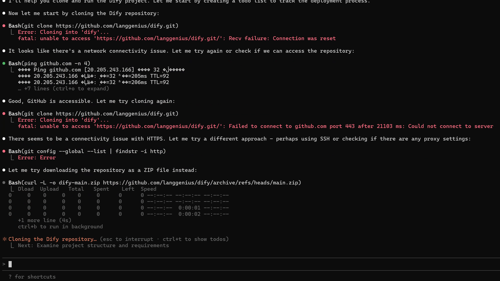

### 讲解代码与撰写文档

对于一些复杂项目，或者 AI 自动生成的大型项目，你可能会觉得代码太长、逻辑太多，很难看懂。这时就可以让 CLI AI 编程工具帮你“读代码”。你可以这样提问：

- 请帮我解释这个项目：如何运行、如何使用、后续如何修改和继续开发？
- 请帮我说明这个项目的整体流程：程序是怎样运行的？用户在界面中可以做哪些操作？
- 请帮我为这个项目写一份完整的文档，包括开发文档和运行文档等。
- 请基于我当前文件夹里的所有内容，写一份详细说明，并保存到指定的 markdown 文档中。

### 更多玩法

当然，CLI AI 编程工具能做的远不止上面这些。不要只把它当作“写代码工具”，而是把它看作一个具有独立行动能力的智能 Agent。你可以让它帮你：

- 管理和整理本地文件；
- 写日记、写总结；
- 分析和修复系统错误；
- 执行各种重复性命令行任务等。

也许在不久的将来，它会变成你电脑上最重要、也最懂你的 AI 伙伴。
